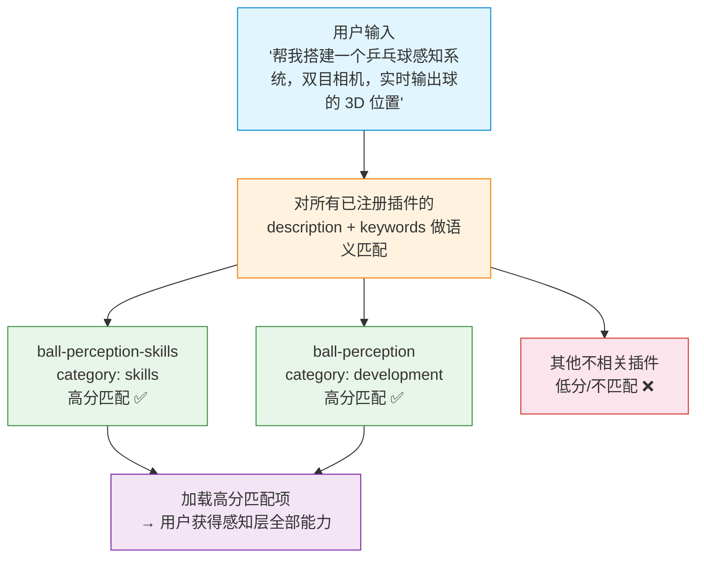

# marketplace.json 编写指南

## 1. 概述

### 1.1 文件定位

`marketplace.json` 是 SportsRobot 项目的**插件注册中心**，位于 `.claude-plugin/marketplace.json`。所有 Skill 模块和 Plugin 都必须在此文件中注册，以实现统一的技能发现、检索和加载。

SportsRobot 采用两级 marketplace 架构：

```
.claude-plugin/marketplace.json          # 根级注册表（项目入口）
plugins/<plugin-name>/.claude-plugin/
    └── marketplace.json                 # 插件级注册表（可选，独立分发用）
```

### 1.2 核心作用

| 能力 | 说明 |
|------|------|
| **技能发现** | 消费者通过 name、description、keywords 字段检索所需技能 |
| **依赖管理** | Plugin 通过 dependencies 声明对 Skill 包的依赖关系 |
| **分类导航** | 通过 category 实现按技术层级筛选 |
| **路径映射** | source + skills[] / agents[] 将逻辑名映射到实际文件系统中的 SKILL.md / AGENTS.md |

### 1.3 匹配加载原理

消费者（如 Trae / Claude Code）通过**语义匹配**决定加载哪些技能：



- **description** 字段是匹配的核心依据，应明确写出触发场景
- **keywords** 提供辅助过滤维度

---

## 2. 文件结构

### 2.1 顶层结构

```json
{
  "name": "sports-robot",
  "owner": {
    "name": "SportsRobot",
    "url": "https://github.com/sports-robot/sports-robot"
  },
  "plugins": [
  ]
}
```

| 字段 | 类型 | 必填 | 说明 |
|------|------|------|------|
| `name` | string | 是 | 项目名称，固定为 `"sports-robot"` |
| `owner.name` | string | 是 | 所有者名称，`"SportsRobot"` |
| `owner.url` | string | 是 | 仓库地址 |
| `plugins` | array | 是 | 所有插件注册条目 |

### 2.2 插件条目公共字段

每个 `plugins[]` 项包含以下**公共字段**：

| 字段 | 类型 | 必填 | 说明 |
|------|------|------|------|
| `name` | string | 是 | 插件唯一标识名，kebab-case 格式。Skill 包建议以 `-skills` 结尾 |
| `description` | string | 是 | 插件描述。**必须包含触发场景**，这是语义匹配的核心依据 |
| `version` | string | 是 | 语义化版本号，如 `"1.0.0"` |
| `author` | object | 否 | 作者信息，含 `name` 字段 |
| `keywords` | string[] | 是 | 技术关键词，用于辅助检索。建议包含：技术栈名、核心功能、运动类型 |
| `category` | string | 是 | 技术层级分类，取值见第 3.1 节 |

**description 编写规则：**

```
格式: [一句话概述]。[功能介绍]。[适用场景]

正确示例:
  "球类感知四模块 Skills（4 个）。单帧检测、短轨迹跟踪、Kalman 滤波、3D 几何重建，
   覆盖乒乓球/羽毛球/网球感知全流程。"

  "球类感知端到端开发 Team。含完整工作流（标定→检测→跟踪→滤波→重建）、
   3 个专业 Agent 和工程模板。适用于乒乓球、羽毛球、网球等球类运动的感知系统搭建。"

错误示例:
  "好用的感知技能"                                    ← 太模糊，无法匹配
  "这是一个用于球类感知的技能集合"                      ← 缺少具体功能描述
```

**keywords 编写规则：**

- 使用小写英文、短横线分隔
- 按优先级排序：运动类型 > 技术领域 > 功能模块 > 工具/框架名
- 同义词和常见缩写都应包含
- 最少 3 个，建议 5-7 个

---

## 3. 分类体系

### 3.1 Category（技术层级分类）

SportsRobot 采用两级分类，按**技术层级和插件粒度**划分：

| Category | 中文名 | 判定标准 | 典型文件特征 | 是否直接可执行 |
|----------|--------|----------|-------------|:---:|
| `skills` | 技能包 | 多个独立 Skill 模块的组合清单，纯知识层，无编排逻辑 | `source` + `skills[]` 数组，**无** AGENTS.md | ✅ |
| `development` | 开发团队 | 含 Agent 编排的开发 Team，有工作流、Subagent 和门禁机制 | `source` + `agents[]` 数组，有 AGENTS.md + workflows/ | ✅ |

**category 层级关系图：**

```
                            ┌──────────────┐
                            │ development  │  ← 高层：调度 Subagent、
                            │ （编排+仲裁）   │      多角色协作、门禁机制
                            └──────┬───────┘
                                   │ 依赖 (dependencies)
                            ┌──────▼───────┐
                            │   skills     │  ← 底层：独立 Skill 模块，
                            │ （知识+代码）  │      可单独对外呈现和修改
                            └──────────────┘
```

### 3.2 各 Category 详细说明

#### 3.2.1 skills（技能包）

**定义**：将多个独立 Skill 模块组合为一个注册条目，纯知识+代码聚合，不含编排逻辑。消费者加载 skills 包时获得其中所有 Skill 的能力。

**目录结构示例：**

```
skills/
├── ball-detector/            # 独立 Skill 模块
│   ├── SKILL.md              # 核心：name + description + 知识内容
│   ├── scripts/              # 可执行代码
│   │   └── detector.py
│   ├── tests/                # 测试用例
│   │   └── test_detector.py
│   ├── examples/             # 使用示例
│   │   └── yolo_detect.md
│   └── references/           # 支撑文档
│       └── papers.md
├── ball-tracker/
├── ball-filter/
└── ball-geometry/
```

**SKILL.md frontmatter 示例：**

```yaml
---
name: ball-detector
description: 单帧球体检测。支持 YOLO、HSV 颜色分割、ONNX 推理三种后端，
  输出 2D 球心坐标与置信度。适用于乒乓球、羽毛球、网球的球体定位。
---
```

**marketplace.json 格式：**

```json
{
  "name": "ball-perception-skills",
  "description": "球类感知四模块 Skills（4 个）。单帧检测、短轨迹跟踪、Kalman 滤波、3D 几何重建，覆盖乒乓球/羽毛球/网球感知全流程。",
  "source": "./skills",
  "strict": false,
  "version": "1.0.0",
  "author": { "name": "SportsRobot" },
  "keywords": ["ball", "perception", "detection", "tracking", "kalman-filter", "triangulation", "sports"],
  "category": "skills",
  "skills": [
    "./ball-detector",
    "./ball-tracker",
    "./ball-filter",
    "./ball-geometry"
  ]
}
```

| 特有字段 | 类型 | 必填 | 说明 |
|----------|------|------|------|
| `source` | string | 是 | Skill 文件所在的基础目录，相对于 marketplace.json |
| `strict` | boolean | 是 | 是否严格模式。`false` 表示 Skill 不存在时静默跳过 |
| `skills` | string[] | 是 | Skill 目录列表，相对于 `source` 路径 |

**何时创建新的 skills 包（而非加入已有包）：**
- 系列 Skill 有独立的业务场景（如感知层 vs 建模层 vs 控制层）
- 被独立的 development Plugin 依赖
- 来源不同，需要独立版本管理

#### 3.2.2 development（开发团队）

**定义**：最高层级编排插件。包含多个 Subagent 角色（Architect/Developer/Reviewer），有完整工作流和门禁机制，支持阶段管理。与 skills 的区别在于**多角色协作 + 流程编排**。

**目录结构示例：**

```
plugins/ball-perception/
├── .claude-plugin/
│   └── marketplace.json       # 插件级注册表（可选）
├── plugin.json                # 插件元数据
├── AGENTS.md                  # Team 总览（编排器入口）
├── quickstart.md              # 快速开始指南
├── init.sh                    # 环境初始化脚本
├── requirements.txt           # Python 依赖
├── agents/                    # 专业 Agent 定义
│   ├── perception-architect.md
│   ├── perception-developer.md
│   └── perception-reviewer.md
├── hooks/                     # 生命周期钩子
│   ├── hooks.json
│   └── run-hook.cmd
└── workflows/                 # 工作流定义
    ├── development-guide.md   # 开发规范（单一参考源）
    ├── task-prompts.md        # Agent 调用参数详情
    └── templates/             # 文档模板
        ├── design-template.md
        └── plan-template.md
```

**marketplace.json 格式：**

```json
{
  "name": "ball-perception",
  "description": "球类感知端到端开发 Team。含完整工作流（标定→检测→跟踪→滤波→重建）、3 个专业 Agent 和工程模板。适用于乒乓球、羽毛球、网球等球类运动的感知系统搭建。",
  "source": "./plugins/ball-perception",
  "version": "1.0.0",
  "author": { "name": "SportsRobot" },
  "keywords": ["ball", "perception", "pipeline", "detection", "tracking", "kalman", "triangulation", "sports-robot"],
  "category": "development",
  "dependencies": ["ball-perception-skills"],
  "agents": [
    "./agents/perception-architect.md",
    "./agents/perception-developer.md",
    "./agents/perception-reviewer.md"
  ]
}
```

| 特有字段 | 类型 | 必填 | 说明 |
|----------|------|------|------|
| `source` | string | 是 | 插件目录路径，指向 AGENTS.md 所在目录 |
| `dependencies` | string[] | 是 | 依赖的 skills 包 name |
| `agents` | string[] | 是 | 所有 Subagent 定义文件，相对于 `source` 路径 |

### 3.3 Category 判定决策树

```
开始
 │
 ├── 有 agents/ 目录 + 多个 Subagent + AGENTS.md？ → development
 │
 └── 有多个独立 Skill 模块，用 source + skills[] 聚合？ → skills
```

### 3.4 技术栈层级规划

SportsRobot 按技术栈分层，每层对应一对 `skills` + `development` 插件：

```
┌─────────────────────────────────────────────────────────┐
│                    球类机器人全技术栈                       │
├───────────┬───────────┬───────────┬───────────┬─────────┤
│  感知层    │  建模层    │  控制层    │  执行层    │  工程层  │
│  🟢 已落地  │  ⬜ 规划中  │  ⬜ 规划中  │  ⬜ 规划中  │  ⬜ 规划中 │
├───────────┼───────────┼───────────┼───────────┼─────────┤
│ skills:   │ skills:   │ skills:   │ skills:   │ skills:  │
│ ball-     │ ball-     │ ball-     │ ball-     │ ball-    │
│ perception│ modeling  │ control   │ actuation │ engineering│
│ -skills   │ -skills   │ -skills   │ -skills   │ -skills  │
│           │           │           │           │          │
│ dev:      │ dev:      │ dev:      │ dev:      │ dev:     │
│ ball-     │ ball-     │ ball-     │ ball-     │ ball-    │
│ perception│ modeling  │ control   │ actuation │ engineering│
└───────────┴───────────┴───────────┴───────────┴─────────┘
```

命名约定：
- Skills 包：`{layer}-skills`（如 `ball-perception-skills`）
- Development 插件：`{layer}`（如 `ball-perception`）

---

## 4. 完整模板

### 4.1 skills 模板

```json
{
  "name": "<layer>-skills",
  "description": "<系列概述>（<N> 个）。<功能列举>，覆盖<运动类型>全流程。",
  "source": "./skills",
  "strict": false,
  "version": "<语义化版本>",
  "author": { "name": "SportsRobot" },
  "keywords": ["<运动类型>", "<技术领域>", "<功能词1>", "<功能词2>", "sports"],
  "category": "skills",
  "skills": [
    "./<skill-1>",
    "./<skill-2>",
    "./<skill-N>"
  ]
}
```

**示例（感知层 Skills 包）：**

```json
{
  "name": "ball-perception-skills",
  "description": "球类感知四模块 Skills（4 个）。单帧检测、短轨迹跟踪、Kalman 滤波、3D 几何重建，覆盖乒乓球/羽毛球/网球感知全流程。",
  "source": "./skills",
  "strict": false,
  "version": "1.0.0",
  "author": { "name": "SportsRobot" },
  "keywords": ["ball", "perception", "detection", "tracking", "kalman-filter", "triangulation", "sports"],
  "category": "skills",
  "skills": [
    "./ball-detector",
    "./ball-tracker",
    "./ball-filter",
    "./ball-geometry"
  ]
}
```

### 4.2 development 模板

```json
{
  "name": "<layer>",
  "source": "./plugins/<layer>",
  "description": "<概述>。含完整工作流（<流程步骤>）、<N> 个专业 Agent 和工程模板。适用于<运动类型>的<技术领域>系统搭建。",
  "version": "<版本>",
  "author": { "name": "SportsRobot" },
  "keywords": ["<运动类型>", "<技术领域>", "<功能词1>", "<功能词2>", "sports-robot"],
  "category": "development",
  "dependencies": ["<layer>-skills"],
  "agents": [
    "./agents/<layer>-architect.md",
    "./agents/<layer>-developer.md",
    "./agents/<layer>-reviewer.md"
  ]
}
```

**示例（感知层开发 Team）：**

```json
{
  "name": "ball-perception",
  "source": "./plugins/ball-perception",
  "description": "球类感知端到端开发 Team。含完整工作流（标定→检测→跟踪→滤波→重建）、3 个专业 Agent 和工程模板。适用于乒乓球、羽毛球、网球等球类运动的感知系统搭建。",
  "version": "1.0.0",
  "author": { "name": "SportsRobot" },
  "keywords": ["ball", "perception", "pipeline", "detection", "tracking", "kalman", "triangulation", "sports-robot"],
  "category": "development",
  "dependencies": ["ball-perception-skills"],
  "agents": [
    "./agents/perception-architect.md",
    "./agents/perception-developer.md",
    "./agents/perception-reviewer.md"
  ]
}
```

---

## 5. 字段完整性对照表

```
                             skills      development
                             ──────      ───────────
name                         ✅ 必填      ✅ 必填
description                  ✅ 必填      ✅ 必填
version                      ✅ 必填      ✅ 必填
author                       可选         可选
keywords                     ✅ 必填      ✅ 必填
category                     ✅ 必填      ✅ 必填
source                       ✅ 必填      ✅ 必填
strict                       ✅ 必填      -
skills                       ✅ 必填      -
dependencies                 -           ✅ 必填
agents                       -           ✅ 必填
```

---

## 6. 编写流程

### 6.1 新增插件注册步骤

```
Step 1: 确认 category
    │    根据决策树（第 3.3 节）确定插件属于 skills 还是 development
    │
    ▼
Step 2: 确认技术栈层级
    │    确定属于感知层/建模层/控制层/执行层/工程层
    │
    ▼
Step 3: 编写 description
    │    格式: [概述]。[功能]。[适用场景]
    │    确保描述足够具体，能精准命中用户意图
    │
    ▼
Step 4: 收集 keywords
    │    运动类型 + 技术领域 + 功能关键词 + 工具名
    │    最少 3 个，建议 5-7 个
    │
    ▼
Step 5: 填写其余必填字段
    │    name, version, source, skills/dependencies/agents
    │
    ▼
Step 6: 插入 plugins[] 数组
    │    按 category 分组：skills 在前，development 在后
    │    同 category 内按技术栈层级排列
    │
    ▼
Step 7: 验证
    │    - JSON 语法正确
    │    - 所有必填字段完整
    │    - source 路径下的文件真实存在
    │    - dependencies 引用的 name 已注册
```

### 6.2 排列规则

在 `plugins[]` 数组中，按以下顺序排列：

1. 所有 `skills` 条目（按技术栈层级：感知→建模→控制→执行→工程）
2. 所有 `development` 条目（按技术栈层级：感知→建模→控制→执行→工程）

---

## 7. Skill 模块开发规范

### 7.1 Skill 目录结构

每个独立 Skill 模块的标准结构：

```
skills/<skill-name>/
├── SKILL.md                  # 核心：Skill 定义（name + description + 知识内容）
├── scripts/                  # 可执行代码
│   └── <module>.py
├── tests/                    # 测试用例
│   └── test_<module>.py
├── examples/                 # 使用示例
│   └── <example>.md
└── references/               # 支撑文档
    └── papers.md
```

### 7.2 SKILL.md 规范

每个 SKILL.md 必须包含以下 frontmatter：

```yaml
---
name: <skill-name>
description: <一句话概述>。<功能介绍>。<适用场景>。
---
```

正文遵循五段式结构：

1. **何时使用** — 触发条件与适用场景
2. **输入约束** — 输入数据格式、坐标系、单位
3. **执行步骤** — PEV 循环（Plan → Execute → Verify）
4. **输出格式** — 输出数据结构与字段说明
5. **失败处理** — 异常情况与回退策略

### 7.3 代码规范

| 规范 | 说明 |
|------|------|
| 类型注解 | 所有公开方法必须有完整类型注解 |
| 文档字符串 | 每个类和公开方法必须有 docstring |
| Lazy import | cv2, torch, ultralytics 等重依赖使用 lazy import |
| 参数化 | 所有参数通过 `__init__` 传入，禁止写死 |
| 无状态泄漏 | `reset()` 方法必须完全清除内部状态 |
| 测试覆盖 | 每个模块必须有回归测试，核心路径覆盖率 > 80% |

### 7.4 Plugin 开发规范

每个 development Plugin 的标准结构：

```
plugins/<plugin-name>/
├── .claude-plugin/
│   └── marketplace.json     # 插件级注册表（可选）
├── plugin.json              # 插件元数据
├── AGENTS.md                # Team 总览
├── quickstart.md            # 快速开始指南
├── init.sh / init.cmd       # 环境初始化脚本
├── requirements.txt         # Python 依赖
├── agents/                  # Agent 定义
│   ├── <layer>-architect.md
│   ├── <layer>-developer.md
│   └── <layer>-reviewer.md
├── hooks/                   # 生命周期钩子
│   ├── hooks.json
│   └── run-hook.cmd
└── workflows/               # 工作流定义
    ├── development-guide.md
    ├── task-prompts.md
    └── templates/
```

---

## 8. 常见问题

### Q1: 一个 Skill 可以同时出现在多个 skills 包中吗？

可以。如果某个 Skill 被多个技术栈层级共用（如通用的数学工具），可以在多个 skills 包的 `skills[]` 数组中各自引用。

### Q2: skills 和 development 的边界怎么定？

| 特征 | skills | development |
|------|--------|-------------|
| 角色数量 | 无 Agent | 多个（Architect/Developer/Reviewer） |
| 协作模式 | 直接调用 | 多 Subagent 协作 + 仲裁 |
| 状态管理 | 无 | 门禁机制 + 回退 + 修复循环 |
| 典型目录 | skills/ 下独立目录 | plugins/ 下含 agents/ + workflows/ |

简单判断：如果你发现自己需要定义 `agents/*.md` 文件来拆分角色职责，那就是 `development`。

### Q3: name 命名有什么规范？

- 使用 kebab-case（小写英文 + 短横线分隔）
- `skills` 包：以 `-skills` 结尾，如 `ball-perception-skills`
- `development` 插件：使用层级名，不以 `-skills` 结尾，如 `ball-perception`
- 前缀统一使用 `ball-`（球类机器人）

### Q4: 如何新增一个技术栈层级？

以新增"建模层"为例：

```
Step 1: 在 skills/ 下创建 Skill 模块
    skills/ball-physics/
    skills/ball-collision/
    skills/ball-trajectory-prediction/
    skills/ball-spin-modeling/

Step 2: 在 marketplace.json 注册 skills 包
    {
      "name": "ball-modeling-skills",
      "category": "skills",
      ...
    }

Step 3: 在 plugins/ 下创建 development Plugin
    plugins/ball-modeling/
    ├── agents/
    ├── workflows/
    ├── hooks/
    └── AGENTS.md

Step 4: 在 marketplace.json 注册 development 插件
    {
      "name": "ball-modeling",
      "category": "development",
      "dependencies": ["ball-modeling-skills"],
      ...
    }

Step 5: 更新 README.md 路线图
```

---

## 9. 版本历史

| 版本 | 日期 | 变更 |
|------|------|------|
| 1.0.0 | 2026-05-31 | 初始版本，定义 skills + development 两级分类体系，覆盖感知层规范 |
