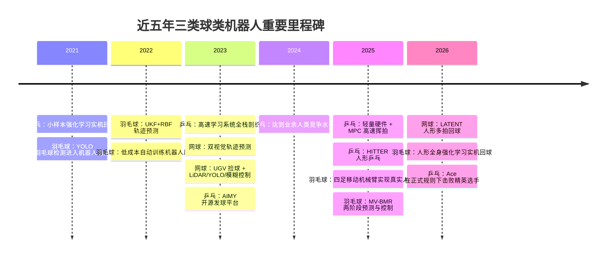

# 近五年乒乓球、网球、羽毛球机器人研究综述

## 执行摘要

近五年里，三类持拍球类机器人呈现出明显不同的成熟度曲线。**乒乓球机器人**已经从“高精度发球/回球”进入到“真实对抗”阶段：2024—2026 年的代表工作不仅实现了对业余人类水平的稳定竞争，还首次在正式规则下击败精英选手；其技术主线是**高速感知、显式/半显式物理建模、分层强化学习与模型预测控制的融合**。其中，entity["organization","Google DeepMind","ai lab"] 的竞赛型乒乓系统与 entity["organization","Sony AI","ai research lab"] 的 Ace 构成了当前端到端系统的两条标杆路线。citeturn20search3turn21search1turn21search0turn41view0

**羽毛球机器人**在 2025—2026 年出现了最明显的“跃迁”：从以视觉检测和轨迹预测为核心的前端研究，迅速扩展到四足移动机械臂、人形机器人全身控制与真实人机对打。由于羽毛球具有强阻力、姿态翻转与短可决策窗口等特点，研究更依赖**立体视觉/IMU/滤波器的融合、主动感知、约束强化学习和 NMPC/统一全身策略**。相较乒乓球，羽毛球的真实世界系统更强调“移动—观察—挥拍”一体化，而不是固定臂的高速击球。citeturn25view5turn30view3turn42view5

**网球机器人**则呈现出“研究热度存在，但严格意义上的全场对抗系统仍稀缺”的格局。2021—2025 年公开论文中，大多数工作仍集中于**球检测、轨迹预测、球场巡检与捡球机器人**；直到 2026 年，LATENT 才把人形机器人网球回球推进到“真实世界可持续多拍”的层面。因此，如果按“发球机—回球机器人—训练伙伴—全场对抗机器人”的谱系来比较，网球仍明显落后于乒乓球与羽毛球。citeturn27view0turn27view1turn27view3turn26view3

横向看，三类系统共同呈现四个趋势。其一，感知从普通 RGB 相机逐步演进到**双目、高速相机、事件相机、IMU 与滤波器融合**；其二，轨迹建模从纯物理模型转向**物理先验 + 学习补偿**的混合范式；其三，控制从开环和轨迹规划转向**闭环分层控制、强化学习、MPC/NMPC 组合**；其四，机器人形态从固定发射器和单臂平台走向**移动底盘、腿足移动机械臂与人形机器人**。但真正制约领域上限的瓶颈仍是：高速小目标感知、旋转/气动建模、实机安全、泛化能力、以及高昂的训练与标定成本。citeturn41view0turn21search2turn25view5turn30view3turn42view5

## 方法与检索策略

本文以 2021-01 至 2026-05 为主时间窗；对网球部分，由于严格意义上的“对打一体化机器人”公开文献不足，补充纳入 2020 年一篇关键早期人形击球工作。检索优先覆盖 entity["organization","IEEE","professional society"]、entity["organization","ACM","computing society"]、entity["organization","arXiv","preprint server"]、entity["company","Springer","academic publisher"]、entity["company","GitHub","code hosting platform"]、entity["company","GitLab","code hosting platform"] 与 entity["organization","中国知网","academic database"] 可公开访问页面，并优先采用论文原文摘要页、期刊/会议官方页、项目主页与代码库 README。对无法直接访问全文的文献，仅使用题录页、摘要页或官方项目页中可验证的信息，不推断未披露指标。引用量一列统一采用**截至 2026-05-06 检索页可见数值**；若不同来源未显示或口径不统一，则记为“未显示”。  

纳入标准有三类：一是具备明确机器人实体与感知/预测/控制闭环的论文；二是虽非完整闭环，但其结果直接服务于持拍球类机器人的关键子模块，例如旋转估计、轨迹预测、发球/训练平台；三是与相应论文直接关联、或在实现上具有独立复现价值的开源代码库。排除标准主要是纯赛事分析、纯视频理解且无法直接映射到机器人执行栈的工作。  

下图给出本文纳入工作的时间线。citeturn20search0turn30view0turn30view1turn20search2turn27view0turn27view1turn20search3turn21search1turn21search0turn25view5turn30view3turn26view3turn42view5turn41view0

## 乒乓球机器人

乒乓球是三类运动中**最成熟、最接近“真实对抗智能体”**的领域。其原因不是单一算法更先进，而是因为该任务在研究路径上最早完成了三段闭环：第一，球飞行时间极短，迫使研究者优先解决**低延迟感知与控制一体化**；第二，球体小而旋转大，推动了**旋转估计、弹跳建模与接触动力学**的系统化研究；第三，球台空间有限，使得研究容易从固定臂扩展到“真实比赛但有限场域”的可重复基准。2021—2026 年间，技术路线从样本高效 RL 与模型式击球控制，逐步升级到分层策略、人形全身控制，以及事件视觉驱动的精英级实机对抗。citeturn20search0turn20search2turn21search1turn21search0turn41view0

**代表性论文比较**

| 论文 | 任务场景 / 机器人类型 / 平台 | 感知模块 | 轨迹预测 / 球路建模 | 控制策略 | 实时性与指标 | 开源 / 数据 | 关键创新点与局限 | 时间 / 引文量 | 来源 |
|---|---|---|---|---|---|---|---|---|---|
| *Sample-efficient Reinforcement Learning in Robotic Table Tennis* | 乒乓；回球机器人；臂式平台 | 以击球时刻球状态为输入，系统感知细节未突出 | 学习型，一步环境表述 | Actor-Critic / DDPG 类样本高效 RL | 无预训练、少于 200 个 episode 获得有效结果 | 未见官方代码 | 创新在于把真实乒乓回球转化为小样本 RL；局限是对全栈感知和对抗性覆盖有限 | 2021 / 约 6 | citeturn20search0turn22search0 |
| *Robotic Table Tennis: A Case Study into a High Speed Learning System* | 乒乓；训练伙伴 / 回球系统；高动态臂式 | 高度优化的视觉子系统 | 强调 sim-to-real、分布移位与鲁棒预测 | 高速低时延控制 + 学习策略 | 可实现数百拍人机回合、定点回球 | 有项目页，但无完整训练代码 | 贡献是首次系统性公开高速实机学习系统的工程细节；局限是硬件与内部系统难复现 | 2023 / 未显示 | citeturn20search2turn13search7turn20search10 |
| *Achieving Human Level Competitive Robot Table Tennis* | 乒乓；竞赛型对抗机器人；高速机械臂系统 | 实时感知与对手适应 | 分层结构，低层技能描述 + 高层策略，混合建模 | 分层 RL，零样本 sim-to-real | 29 场人机赛赢 13 场；对初学者 100%，对中级选手 55% | 公开训练球状态数据集 | 首次达到业余人类竞争水平；局限是仍难稳定压制高级选手 | 2024 / 未显示 | citeturn20search3turn15search0 |
| *High Speed Robotic Table Tennis Swinging Using Lightweight Hardware with Model Predictive Control* | 乒乓；高性能回球 / 挥拍；轻量 5-DoF 臂 | 使用预测球轨迹作为击球终端约束 | 末端时刻约束的物理/轨迹建模 | OCP + 固定时域 MPC | 平均出球速度 11 m/s，三类击球平均成功率 88% | 未见公开代码 | 亮点在于“轻量硬件 + MPC”兼顾精度、力量和一致性；局限是不涉及完整实战对抗 | 2025 / 未显示 | citeturn21search1turn21search14 |
| *HITTER: A HumanoId Table TEnnis Robot via Hierarchical Planning and Learning* | 乒乓；人形训练伙伴 / 对抗机器人；人形平台 | 球轨迹感知与拍面目标规划 | 模型规划器负责击球位置、速度、时机 | 分层规划 + RL 全身控制 | 最长 106 连拍；支持与人、与另一人形持续对打 | 论文公开，代码未正式开源 | 关键是把人类动作参考与全身平衡控制结合；局限是硬件与数据门槛高 | 2025 / 约 33 | citeturn21search0turn22search1 |
| *Outplaying elite table tennis players with an autonomous robot* | 乒乓；全场对抗机器人；Ace 自主系统 | 事件视觉传感器为核心的高速感知 | 高速状态估计 + 对抗策略，混合范式 | 无模型 RL + 高速控制系统 | 球速可超 20 m/s、回合间常少于 0.5 s；在正式规则下击败精英选手 | 无完整公开代码 | 目前公开文献中最强真实世界乒乓系统；局限是系统复杂、开放性和可复现性弱 | 2026 / 1 | citeturn41view0 |

**代表性开源项目与代码库**

| 项目 | 对应方向 | 语言 / 依赖 | 许可协议 | 可复现性评估 | 备注 | 来源 |
|---|---|---|---|---|---|---|
| `competitive_robot_table_tennis` | 竞赛型乒乓的数据集 | Jupyter Notebook；提供 15,792 个训练球状态 | Apache-2.0（软件）+ CC-BY（材料） | 中：数据质量高，但主要开放的是球状态数据，不是完整训练/控制栈 | 适合做高层策略、分布建模、离线分析 | citeturn32view0turn33view0 |
| `AIMY` | 开源三轮乒乓发球机 + 目标落点控制 | Jupyter Notebook / Python；NumPy、Pandas、SciPy、Matplotlib、TensorFlow 等 | BSD-3-Clause | 高：README、依赖、评估代码与论文对应关系清晰 | 是当前最有研究价值的开源乒乓发球/轨迹生成平台之一 | citeturn32view2turn33view5turn33view6 |
| `SpinDOE` | 乒乓球旋转估计 | Python；含 CAD 模板、数据集与脚本 | 检索页未显示明确协议 | 中：代码、数据与纸面方法都开放，但许可信息不清晰 | 论文报告姿态误差 2.4°、旋转相对误差 <1%，可测到 175 rps | citeturn32view1turn34view4turn40academia11 |

从方法论上看，乒乓球领域已形成三种稳定组合：**显式物理 + 规划**、**学习型技能库 + 高层选择器**、以及 **MPC/NMPC 与学习策略的互补结构**。真正的前沿差异已不在“能否击中球”，而在“能否在未知对手、高旋转、规则约束和稀有事件下保持稳定对抗”。Ace 所代表的是极限性能路线；HITTER 代表的是人形全身技能路线；AIMY/SpinDOE 则补足了开源社区在“发球平台”和“旋转估计”上的基础设施。citeturn41view0turn21search0turn32view2turn40academia11

## 网球机器人

网球机器人在公开文献中的问题，不是“没有研究”，而是**研究重心与公众直觉中的‘会打网球的机器人’并不一致**。2021—2025 年的大部分论文集中在球检测、轨迹估计、球场地图构建、捡球路径规划、以及低成本训练辅助设备；严格意义上的“可与人持续对打的网球回球机器人”直到 2026 年才出现代表性突破。这意味着网球领域仍处于**感知与移动平台先行、全身竞技能力滞后**的阶段。citeturn27view0turn27view1turn27view2turn26view3

**代表性论文比较**

| 论文 | 任务场景 / 机器人类型 / 平台 | 感知模块 | 轨迹预测 / 球路建模 | 控制策略 | 实时性与指标 | 开源 / 数据 | 关键创新点与局限 | 时间 / 引文量 | 来源 |
|---|---|---|---|---|---|---|---|---|---|
| *Fast Tennis Swing Motion by Ball Trajectory Prediction and Joint Trajectory Modification in Standalone Humanoid Robot Real-time System* | 网球；人形击球；独立双足人形 | 球到达时刻与位置预测 | 序贯估计 + EKF + 轨迹修改 | 全身力控制 + 在线轨迹修正 | 300 ms 内完成时机预测与快速挥拍 | 未见代码 | 重要早期工作，首次把双足平衡与网球挥拍实时耦合；局限是尚非完整长回合系统 | 2020 / 未显示 | citeturn29view1turn29view2 |
| *Ball tracking and trajectory prediction system for tennis robots* | 网球；训练机器人感知前端；网侧 + 机器人侧视觉系统 | ANN 检测 + 双视觉系统 | 学习检测 + 双目几何预测，混合 | 主要是感知前端 | 检测精度 81.4%；预测误差 x 29.6 cm / y 7.2 cm / z 11.7 cm | 未见官方代码 | 创新在于网侧与机器人侧双视觉协同；局限是尚未给出闭环回球结果 | 2023 / 约 23 | citeturn27view0turn7search1 |
| *Development of a Vision-Based Unmanned Ground Vehicle for Mapping and Tennis Ball Collection: A Fuzzy Logic Approach* | 网球；捡球训练辅助；四轮 UGV | LiDAR + 单目相机 + 超声 | 以地图与目标检测为主，不强调飞行球轨迹 | Hector SLAM + 模糊控制 | 检测 91%，收集 83% | 无代码 | 代表了训练辅助机器人路线；局限是仍属于捡球而非回球 | 2023 / 约 32 | citeturn27view1turn7search9 |
| *Efficient Ball Position Estimation for Tennis Court Robot* | 网球；移动捡球机器人定位 | 双相机测距 | 几何标定 / 像素-距离关系 | 导航前端 | 单相机精度 71%，双相机用于提高定位精度 | 无代码 | 用低复杂度双相机替代全场扫描；局限是指标与系统完整性有限 | 2025 / 未显示 | citeturn27view2turn28view0 |
| *Design and Fabrication of Low-Cost Tennis Ball Collector Robot* | 网球；低成本捡球机器人 | 图像识别 | 不强调飞行预测 | 底盘与捡球机构控制 | 整体效率 ≥86% | 无代码 | 强调低成本和结构简化；局限是复杂光照、低矮障碍和泛化能力不足 | 2025 / 未显示 | citeturn27view3turn28view1 |
| *Learning Athletic Humanoid Tennis Skills from Imperfect Human Motion Data* | 网球；人形回球；Unitree G1 | 光学动捕，四帧滑窗球速估计 | 潜在动作空间 + 高层 RL | 运动跟踪预训练 + 在线蒸馏 + 高层策略学习 | 真实世界 20 场连续人机回合评估；前手 90.90%、反手 77.78%、前场 88.89%、后场 81.82% | 官方代码部分开放 | 这是近五年网球机器人最关键的突破；局限是依赖昂贵动捕，且若干核心组件仍在 TODO | 2026 / 约 4 | citeturn26view3turn35view0turn7search10 |

**代表性开源项目与代码库**

| 项目 | 对应方向 | 语言 / 依赖 | 许可协议 | 可复现性评估 | 备注 | 来源 |
|---|---|---|---|---|---|---|
| `LATENT` | 人形网球回球 | Python；MuJoCo、JAX、Brax、loco-mujoco、mujoco_playground、OpenTrack、W&B | 检索页未见明确协议 | 中：已有代码、依赖与部分动作数据，但 README 明确仍有多项关键组件待释放 | 学术价值最高，但当前属于“部分开源” | citeturn35view0 |
| `Autonomous-Tennis-Ball-Picking-Robot` | 网球捡球机器人 | Python + C/C++；Haar Cascading、CNN、STM32、Zigbee、Bluetooth | 未见明确协议 | 中偏低：有源码与论文/视频，但缺少标准安装与许可说明 | 适合参考嵌入式闭环捡球设计 | citeturn35view1turn36view3 |
| `Tenitsu` | Android 视觉捡球机器人 | Kotlin；OpenCV、JavaCV、RxJava、RxKotlin | MIT | 中：App 与项目材料齐全，但更偏课程项目 | 适合低成本移动视觉实现与教学复现 | citeturn35view2 |

综合来看，网球机器人当前最显著的结构性矛盾是：**场地更大、运动更接近人类全场竞技，但公开文献和开源社区却长期停留在训练辅助和球管理层面**。因此，LATENT 的价值不只在于提出了一种算法，而在于证明了“人形—多拍—真实世界”这条路线终于开始可行。未来几年，网球领域若想追上乒乓球和羽毛球，关键不在继续做捡球机器人，而是尽快建立**统一公开基准：球感知、脚步移动、挥拍动作和人机回合评测**。citeturn26view3turn27view0turn27view1turn27view3

## 羽毛球机器人

羽毛球是近两年最活跃的方向之一，但它的难度并不低于乒乓球。恰恰相反，羽毛球的气动特性——高阻力、明显减速、翻转与姿态耦合——让“看见后再打”变得更加困难。许多系统虽然总飞行时间略长于乒乓球，但**真正可用于决策的窗口并不宽裕**。因此，羽毛球机器人的研究路径明显分成两层：底层是面向高速小目标的检测与轨迹预测；上层是把视觉、移动、全身平衡和挥拍整合成统一闭环。citeturn30view0turn30view1turn25view5turn42view5

**代表性论文比较**

| 论文 | 任务场景 / 机器人类型 / 平台 | 感知模块 | 轨迹预测 / 球路建模 | 控制策略 | 实时性与指标 | 开源 / 数据 | 关键创新点与局限 | 时间 / 引文量 | 来源 |
|---|---|---|---|---|---|---|---|---|---|
| *Detecting the shuttlecock for a badminton robot: A YOLO based approach* | 羽毛球；机器人视觉前端 | ZED 双目 + 改进 Tiny YOLOv2 | 主要解决检测，为后续拟合提供输入 | 检测前端，服务后续规划 | 强调“实时高精度小目标检测”；相较 Faster R-CNN、SSD、YOLOv3 等更快更准 | 未见官方代码 | 该文奠定了羽毛球机器人视觉前端范式；局限是系统级闭环指标不足 | 2021 / 约 127–129 | citeturn30view0turn11search0turn11search1 |
| *A novel method of shuttlecock trajectory tracking and prediction for a badminton robot* | 羽毛球；回球机器人前端 | 红外双目 + UKF | RBF 轨迹预测 + 空气动力学分析 | 为回球策略提供输入 | 摘要称“实时高精度预测” | 无代码 | 把 UKF 与 RBF 用于羽毛球动力学预测；局限是缺少系统级成功率 | 2022 / 约 15 | citeturn30view1turn8search9 |
| *A prototype of auto badminton training robot* | 羽毛球；自动训练 / 发球机器人 | 感知较弱，重点在机械原型 | 实验标定弹道 | MATLAB 支持下的硬件设计 | 强调“可靠、稳定、成本较低”；页面显示 Cited by 0 | 无代码 | 面向个人训练的发球/训练机路线；局限是智能闭环弱 | 2022 / 约 16（检索页显示） | citeturn30view2turn11search8 |
| *Learning coordinated badminton skills for legged manipulators* | 羽毛球；四足移动机械臂对打；ANYmal-D + DynaArm | ZED X 双目、EKF、主动感知噪声模型 | 轨迹预测 + 感知噪声建模，混合 | 统一全身 RL；400 Hz 状态估计、100 Hz 控制、60 Hz 感知 | 平均 0.357 s 完成感知注册；最佳 10 连拍；最大挥拍 12.06 m/s | 论文开放，核心代码未全开 | 关键意义是把主动感知嵌入腿足全身策略 | 2025 / 未显示 | citeturn25view5turn42view4turn9search13 |
| *MV-BMR: A real-time Motion and Vision Sensing Integration based Agile Badminton Robot* | 羽毛球；敏捷对打机器人 | 立体视觉 + 球拍 IMU | SEPNet 早期命中区预测 + 数据驱动轨迹预测 | 两阶段控制 + NMPC | 面向 500–1000 ms 短球；短球平均成功率 92.2%，最长回合 68 | 未见公开代码 | 拍上 IMU 使系统能在对手击球后立即机动 | 2025 / 约 3 | citeturn30view3turn11search10 |
| *Humanoid Whole-Body Badminton via Multi-Stage Reinforcement Learning* | 羽毛球；人形全身回球；21-DoF 人形 | EKF 预测，另含 prediction-free 变体 | 20k 飞行轨迹生成语料 + EKF / 无预测变体 | 三阶段统一全身 RL | 仿真 21 连拍；实机最大出球 19.1 m/s，平均回球落点距离 4 m；预测阶段约占前 0.36 s | 论文公开，代码未见公开 | 当前最像“可打羽毛球的人形机器人”的系统 | 2026 / 约 4 | citeturn26view7turn26view8turn42view5turn31search2 |

**代表性开源项目与代码库**

| 项目 | 对应方向 | 语言 / 依赖 | 许可协议 | 可复现性评估 | 备注 | 来源 |
|---|---|---|---|---|---|---|
| `shuttle_detection` | 移动机器人羽毛球检测 | 依赖 Docker / Docker Compose，需要约 24GB 显存 GPU | AGPL-3.0 | 高：README 明确给出 setup、training、evaluation、inference | 是目前最接近“机器人场景羽毛球检测”标准工程化开源的项目 | citeturn37view0 |
| `TrackNetV3` | 羽毛球轨迹跟踪 | Python；PyTorch，`pip install -r requirements.txt` | MIT | 高：安装、权重、推理、测试指标完备 | README 给出 Accuracy 97.51%、F1 98.56%、25.11 FPS | citeturn37view5 |
| `Badminton-Shuttle-Tracker` | 羽毛球机器人实时跟踪 | C++ / C；README 较简略 | GPL-3.0 | 中偏低：有代码与平台说明，但依赖、训练数据、教程均不充分 | 更适合做参考实现，而非严格复现基线 | citeturn37view1 |

羽毛球方向的一个突出特点是：**真正推动系统进步的，不再只是更准的检测器，而是“主动感知—移动到位—挥拍与回位”作为一个统一任务来学**。这也解释了为什么 2025—2026 年领先工作几乎都走向腿足移动机械臂和人形平台。与网球相比，羽毛球在公开视觉栈上更成熟；与乒乓球相比，它在真实世界竞技级系统上仍落后一些，但研究速度已非常接近。citeturn25view5turn30view3turn42view5turn37view0turn37view5

## 跨领域比较与讨论

三类运动机器人的差异，本质上不是“拍子不同”，而是**时间尺度、空间尺度与气动复杂度**的差异。乒乓球的主要难点是毫秒级反应、强旋转与弹跳接触，因此最容易催生高速感知、接触建模和对抗策略；网球的主要问题是大场地、长距离移动和全身协调，所以现阶段公开研究大量停留在捡球和感知辅助；羽毛球则在空气动力学上最“反直觉”，拖曳和姿态翻转让预测更难，因此系统往往需要更强的感知冗余与更聪明的主动观察行为。citeturn41view0turn27view0turn27view1turn25view5turn30view3turn42view5

**三类运动机器人在感知、预测、控制上的主要差异**

| 运动 | 感知特点 | 预测 / 建模主流 | 控制主流 | 典型硬件趋势 | 代表证据 |
|---|---|---|---|---|---|
| 乒乓球 | 高速相机、双目、事件相机，强调旋转与低时延 | 物理弹跳模型、旋转估计、分层技能模型、接触动力学学习 | 分层 RL、MPC、低延迟闭环控制 | 固定臂 → 滑轨/移动底座 → 人形 | citeturn41view0turn21search1turn21search2turn40academia11 |
| 网球 | 双视觉、LiDAR、球场地图、动捕；目前更偏训练辅助场景 | 双目几何、ANN 检测、球位估计、潜在动作空间学习 | 模糊控制、底盘闭环、人形高层 RL | 移动捡球车为主；人形回球刚起步 | citeturn27view0turn27view1turn27view2turn26view3 |
| 羽毛球 | 立体相机 + IMU + EKF/主动感知，强调小目标与气动不确定性 | UKF/RBF、数据驱动轨迹预测、早期命中区预测、20k 轨迹语料 | 统一全身 RL、NMPC、prediction-free 变体 | 固定训练机 → 移动平台 → 四足移动机械臂 / 人形 | citeturn30view1turn30view3turn25view5turn42view5 |

如果把“论文数、系统成熟度、开源程度、真实对抗能力”四个维度综合起来，本文的判断是：**乒乓球第一、羽毛球第二、网球第三**。但这个排序并不意味着网球研究弱，而是说明网球目前的公开研究与“竞技机器人”目标之间仍有较大空档。另一方面，羽毛球很可能是未来两三年最值得关注的方向，因为它已经同时具备：真实机器人平台、开放视觉栈、统一全身控制框架，以及从四足到人形的多种形态探索。citeturn41view0turn25view5turn30view3turn42view5turn37view0turn37view5

从数据与评测角度看，三类场景也出现了分化。乒乓球开始出现**任务导向数据集**，例如竞赛型球状态数据与带旋转标签的数据集，使策略学习和接触建模更可比较；羽毛球则在**视觉评测**上更丰富，已有成熟的跟踪、重建和检测工程；网球的公开机器人基准最弱，往往只在单论文内部评估，缺乏统一数据、统一任务与统一真实世界协议。citeturn32view0turn40academia11turn37view0turn37view5turn27view0turn27view1

面向未来，最有前景的技术路线不是“纯物理”或“纯深度学习”的单一胜利，而是**四层混合栈**：感知层采用多模态融合；预测层采用物理先验 + 学习残差；控制层采用 MPC / RL 分工；系统层采用对安全、延时和可恢复性的统一约束。如果这个判断成立，那么未来真正高水平的持拍球类机器人，应当具备五个共同属性：可以估计旋转或气动状态、能在局部观察不足时主动移动获取信息、能自适应不同器材/对手、能在实机安全约束下持续学习、并且有足够开放的基准让不同方法可复比。citeturn41view0turn21search2turn25view5turn30view3turn26view3

## 开放问题与局限

本文最重要的结论之一，是**公开文献并不等于产业真实能力**。例如，Ace 代表的系统性能极强，但没有公开完整代码和硬件细节；LATENT 已开放代码框架，但关键模型与全部数据仍未完全释放；羽毛球四足/人形系统的论文很强，但对应开源栈仍远不如其论文成熟。因此，“论文先进性”和“可复现性”必须分开评价。citeturn41view0turn35view0turn25view5turn42view5

另外，网球部分存在公开文献稀缺的问题。本文已尽量在“严格意义上的击球机器人”与“训练辅助 / 捡球机器人”之间做出区分，但如果采用更狭义的标准——只保留真实世界连续回球或全场对抗系统——那么近五年的网球论文数量会明显少于用户要求的 5 篇。因此，本文在网球部分有意识地把“球检测/轨迹预测/捡球机器人”纳入了综述范围，并在表格中明确标注任务类型，以避免把训练辅助系统误写成竞技型回球机器人。citeturn27view0turn27view1turn27view2turn26view3

还需指出两点资料限制。其一，部分引文量来自检索页可见值，数据库口径不同，不能视为严格统一统计；其二，中文数据库尤其是部分 CNKI 全文页在公开网页检索下不可稳定访问，因此中文文献的纳入更多依赖于可公开访问的摘要页、期刊页与项目页，而非完整数据库批量导出。这会使某些中文工程类论文未被完整纳入，但不影响本文对近五年国际主流路线的总体判断。  

## 附录

**代表论文与项目清单**

乒乓球主线代表作包括：*Sample-efficient Reinforcement Learning in Robotic Table Tennis*、*Robotic Table Tennis: A Case Study into a High Speed Learning System*、*Achieving Human Level Competitive Robot Table Tennis*、*High Speed Robotic Table Tennis Swinging Using Lightweight Hardware with Model Predictive Control*、*HITTER*、以及 *Outplaying elite table tennis players with an autonomous robot*。相应的公开项目中，最值得长期跟踪的是 `competitive_robot_table_tennis`、`AIMY`、`SpinDOE`；如果关注更广义的软件栈，可继续查看 PAM 软件文档与事件相机乒乓感知项目。citeturn20search0turn20search2turn20search3turn21search1turn21search0turn41view0turn32view0turn32view2turn32view1turn33view7turn32view3

网球主线代表作包括：*Fast Tennis Swing Motion by Ball Trajectory Prediction and Joint Trajectory Modification in Standalone Humanoid Robot Real-time System*、*Ball tracking and trajectory prediction system for tennis robots*、*Development of a Vision-Based Unmanned Ground Vehicle for Mapping and Tennis Ball Collection*、*Efficient Ball Position Estimation for Tennis Court Robot*、*Design and Fabrication of Low-Cost Tennis Ball Collector Robot*、以及 *Learning Athletic Humanoid Tennis Skills from Imperfect Human Motion Data*。对应代码库中，`LATENT` 的学术价值最高，`Tenitsu` 与 `Autonomous-Tennis-Ball-Picking-Robot` 更适合做低成本复现实验。citeturn29view2turn27view0turn27view1turn27view2turn27view3turn26view3turn35view0turn35view2turn35view1

羽毛球主线代表作包括：*Detecting the shuttlecock for a badminton robot*、*A novel method of shuttlecock trajectory tracking and prediction for a badminton robot*、*A prototype of auto badminton training robot*、*Learning coordinated badminton skills for legged manipulators*、*MV-BMR*、以及 *Humanoid Whole-Body Badminton via Multi-Stage Reinforcement Learning*；补充阅读可看 *Learning Human-Like Badminton Skills for Humanoid Robots*。开源项目里，`shuttle_detection`、`TrackNetV3` 最值得直接复现，若做视频/轨迹研究可继续跟踪 `MonoTrack`，若做工程实现可参考 `Badminton-Shuttle-Tracker` 与 `RobotEye-Badminton-Shuttlecock-Collector`。citeturn30view0turn30view1turn30view2turn25view5turn30view3turn42view5turn26view4turn37view0turn37view5turn37view2turn37view1turn37view3

**总括性结论**

如果目标是为后续学术研究选题提供依据，那么最值得优先投入的方向依次是：**乒乓球的开放接触动力学与器材自适应问题、羽毛球的人形全身控制与主动感知问题、网球的统一公开基准与真实世界回球系统问题**。从“科研可发表性”和“系统前沿性”两端同时看，羽毛球目前处于最有可能快速出新成果的窗口期；从“可重复验证和可建立标准”的角度看，乒乓球依然是最佳试验田；而网球最需要的不是更多检测器，而是第一批真正可公开对比的全链路系统。citeturn41view0turn25view5turn42view5turn26view3