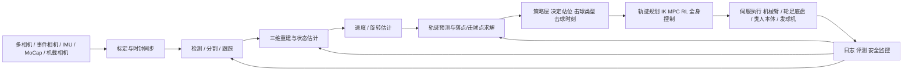
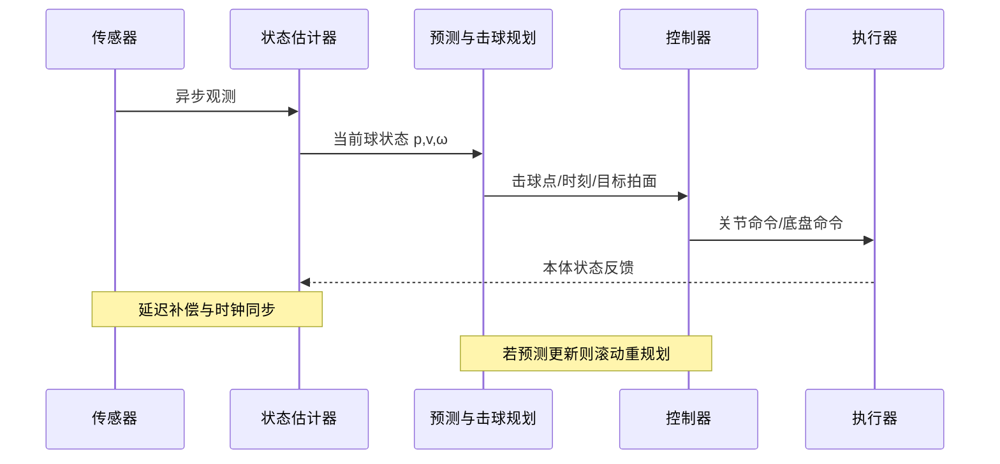

# 网球、乒乓球、羽毛球机器人落地技术栈与近五年论文项目详尽报告

## 执行摘要

2019 年以来，球类机器人已逐步形成一条清晰的共性路线：**高频多传感感知、物理与学习结合的球路建模、分层控制、高动态执行机构、低延迟系统集成**。其中，乒乓球机器人最成熟，已从“高质量回球”推进到与业余、精英乃至职业选手真实对抗；羽毛球机器人在腿足机械臂、类人机器人与感知数据集方面进展很快；网球机器人则长期偏训练/回收辅助，直到 2026 年才出现能与人持续多拍对拉的类人系统。工程上，真正决定能否落地的不是单一算法，而是**延迟预算、时序同步、击球窗口建模、执行器功率密度和软硬件协同**。

## 研究范围与方法

本报告聚焦 **2019 年至 2026 年** 公开可检索的原始论文、官方项目页、开源仓库与机构官网，按**乒乓球、网球、羽毛球**三类项目归纳它们在感知、轨迹预测、控制、执行层、系统集成与工程化方面的真实实现细节。对于“近五年”这一定义，本文保留少数 2020 年代表性网球/羽毛球工作，因为在这两个方向上，能公开提供完整方法与工程信息的系统本就少于乒乓球。

资料来源优先级如下：第一优先为论文摘要页、官方项目页与代码仓库；第二优先为机构新闻页与带作者/机构信息的会议 PDF；第三优先为能补足联系邮箱或项目元数据的页面。乒乓球方向，Google DeepMind、Sony AI、MIT、MPI-IS、伯克利等系统的信息最完整；网球方向，Myongji University 的双视觉系统、东京大学团队的类人挥拍系统，以及 2026 年 LATENT 项目最具代表性；羽毛球方向，ETH Zurich 的腿足机械臂系统与单帧检测数据集、UESTC 的轨迹预测工作，以及 MV-BMR、Humanoid Whole-Body Badminton 等系统构成了最新一波主线。

由于当前交付以正文形式完成，**未附单独 PDF 文件**；以下内容已经按标准 Markdown 书籍式结构编排，可直接保存为 `.md` 文档用于后续导出。

## 完整技术栈

球类机器人落地不是“检测模型 + 机械臂”这么简单，而是一条跨越 **高频感知、状态估计、球路建模、决策规划、关节控制、执行机构、系统总线、数据闭环** 的全链条工程。真实系统里，任何一环失配都会导致回击失败：感知晚 20 ms，击球点会错；执行器不够快，拍面姿态到不了；时钟不一致，滤波器与控制器的状态就会错位。DeepMind 的乒乓球系统专门把“延迟缓解、分布偏移、动作空间选择、自动重置”视为核心工程问题；Sony Ace 进一步把感知延迟压到 **10.2 ms**；ETH 的羽毛球腿足机械臂则把状态估计、控制与异步感知拆到 **400 Hz / 100 Hz / 60 Hz** 多频运行。



从系统视角看，完整技术栈至少包括以下层级：  
**感知层**：相机/事件相机/IMU/MoCap 选型，多传感器外参与内参标定，视觉检测与跟踪，球体分割，三维定位，速度与旋转估计，时空同步与延迟补偿。Ace 使用 9 个 APS 传感器与 3 个事件传感器进行三维定位和旋转估计；MIT 的轻量乒乓平台依赖外部高速视觉与在线球预测；ETH 的 BADMINTON 系统使用 ZED X 机载双目、Jetson AGX Orin 和基于真实相机数据拟合的感知噪声模型。

**建模层**：球体/羽球飞行物理模型、碰撞/弹跳模型、贝叶斯滤波、数据驱动轨迹回归、混合模型与残差学习。表面看三类球都是“飞行目标”，但空气动力学差异极大：乒乓球轻、旋转影响大；网球质量高、弹跳与旋转都重要；羽毛球阻力极大、姿态稳定但减速快，因此需要单独建模。UESTC 的羽毛球工作用红外双目采集轨迹、以 UKF 滤噪，再用 RBF 网络做实时预测；MV-BMR 用“两阶段预测”，先由球拍 IMU 驱动早期击球区估计，再用视觉轨迹连续收敛到击球点；LATENT 在实机中用光学动作捕捉获得球位置，并通过滑动窗口平滑速度观测。

**控制层**：从高层击球策略到底层电机控制，大致分为传统模型法、优化法、强化学习法和混合法。HITTER 把“模型式击球规划”与“强化学习全身控制”分开；DeepMind 采用分层技能库与高层技能选择；Sony Ace 使用基于深度强化学习的控制系统与策略库；MIT 用固定时域 MPC 快速重规划挥拍轨迹；ETH 的腿足机械臂则把全身运动、拍挥与主动感知并入统一 RL 策略。

**执行层**：机械臂、轮式底盘、腿足系统、类人平台、发球机、球拍末端与伺服驱动。AIMY 证明了开源发球机本身就是一个关键基础设施，它能生成 **15.4 m/s** 的球速和 **192 s⁻¹** 的旋转，配合开放通信接口，可显著降低真实世界数据采样成本；MIT 平台强调“轻量、低转子惯量、高扭矩”的 5 自由度专用手臂；ETH 则采用 ANYmal-D + DynaArm 的移动操作平台；LATENT 和 HITTER 均把标准球拍通过 3D 打印连接件整合到类人本体上。

**工程层**：实时通信、操作系统、仿真、数据管线、安全和评测。DeepMind 的 case study 明确指出，自动重置、低延迟控制、仿真分布与实机分布对齐，是能否持续在线训练与零样本迁移的关键；LATENT 公开了 MuJoCo 训练流水线；ETH 的 shuttle_detection 仓库已经把 Docker、自动标注、训练、评估与推理流程规范化；TrackNetV3 和 DeepMind 的 ball state 数据集则说明，开放数据是后续算法复现与迁移的核心基础设施。

## 感知与球路建模方法详解

### 多相机、多传感器、标定与时序同步

球类机器人首先要解决“**看见得足够早、足够准、而且时间戳一致**”。这意味着不仅需要内参/外参标定，还要明确每个观测的**采样时刻、传输延迟、处理延迟和控制应用时刻**。乒乓球方向最激进：Ace 用 9 个 200 Hz APS 相机做三维定位，再用 3 个事件相机估计高速旋转，实现平均 **3.0 mm** 三维定位误差和 **10.2 ms** 感知延迟；ETH 腿足羽毛球系统则把相机感知异步放在 60 Hz、状态估计放在 400 Hz、策略更新放在 100 Hz，本质上是在显式管理不同频率模块的时序一致性。

工程上，多传感器同步通常分四步：先做几何标定，再做时间戳对齐，再建立“观测落点时刻”到“控制执行时刻”的延迟补偿模型，最后在估计器中把不同模态当成异步测量更新。球类场景下，这种补偿尤其关键，因为击球窗口往往不到 1 秒。MV-BMR 指出，羽毛球平抽与低平球的飞行时间只有 **500–1000 ms**；ETH 系统记录到，感知模块平均要等 **0.357 s** 才能注册到可拦截轨迹，留给全身运动与挥拍的时间只有 **0.654 s** 左右。

### 目标检测、分割与跟踪

对于小目标高速飞行体，单帧检测、短时跟踪和轨迹修复要联合设计。羽毛球方向有三条很清晰的技术路线。其一是**改造 YOLO/Tiny YOLO** 做小目标检测：2021 年的 shuttlecock detection 工作针对 Tiny YOLOv2 改造了损失函数和网络结构，以兼顾实时性与小目标语义保留；其二是**TrackNet 系列**，把多帧时序信息隐式编码为轨迹热图，再用修复/补全网络对遮挡片段进行 inpainting；其三是 2026 年 ETH 的 **One-Shot Shuttle Detection**，直接针对机载相机的动态视角训练 YOLOv8，放弃对静止广播视角的依赖。

从性能看，TrackNetV3 在 Shuttlecock Trajectory Dataset 上达到 **97.51% Accuracy / 98.56% F1 / 25.11 FPS**，明显优于仓库中给出的 YOLOv7 和 TrackNetV2 基线；ETH 的 One-Shot 数据集包含 **20,510** 帧、**11** 个背景场景，针对“训练场景相似”测试集的 F1 达到 **0.86**，在完全未知环境仍有 **0.70**，这说明**面向移动机器人视角的单帧检测器**已足以承担“初始化/重定位/恢复”任务。

网球与乒乓球则更多采用**多相机三维定位 + 后续滤波**。Myongji University 的网球系统用“网侧视觉 + 机器人本体视觉”双视觉结构解决传统高位广播视角难以在实际球场部署的问题，并把神经网络检测与双目三角定位结合起来；MIT 的乒乓系统使用外部高反差视觉与在线预测；DeepMind 和 Sony 的乒乓系统则已经把视觉子系统本身设计成研究对象，而不再把它当作“预处理模块”。

### 球速与旋转估计

速度估计最基础的做法是对连续三维位置做有限差分，再用滑动窗平均或滤波器抑制噪声。LATENT 在仿真和实机里都使用四帧滑动窗口对球速度做平均，以减轻位置噪声放大到速度估计的问题；ETH 的 prediction-free 羽毛球策略则直接喂给控制器“当前帧 + 最近五帧 50 Hz 位置历史”，让策略自己隐式恢复运动趋势。

旋转估计的难点在于：目标小、速度快、纹理少。乒乓球方向已出现两条有效路径。第一条是**事件相机 + 帧相机混合感知**，Sony Ace 直接在系统级把高速三维定位与角速度估计分开，前者由 APS 负责，后者由事件相机负责。第二条是 **SpinDOE** 这类“有标记球 + 几何识别”方案：先用 CNN 在图像中定位球上的点，再用 geometric hashing 对这些点做身份匹配，最后通过相邻姿态回归自旋；该方法报告的姿态误差约 **2.4°**，相对旋转误差低于 **1%**。这类方法的工程意义很实际：即便比赛用球不允许做标记，研发阶段也非常适合用它做高质量监督。

### 轨迹预测与球路建模

球路建模通常分成**物理模型、数据驱动模型、混合模型**三类。统一的状态变量可写成  
$$
x=[p_x,p_y,p_z,v_x,v_y,v_z,\omega_x,\omega_y,\omega_z]^\top
$$  
并在离散时间上满足  
$$
x_{k+1}=f(x_k)+w_k,\qquad z_k=h(x_k)+v_k
$$  
其中 $f$ 编码重力、阻力、旋转/弹跳动力学，$z_k$ 是视觉或 IMU 观测。对网球和乒乓球，典型飞行模型可写成  
$$
m\dot v = mg - \tfrac12 \rho C_d A \|v\|v + F_{\text{spin}}
$$  
而羽毛球在大多数工作中更强调**强阻力减速**和可简化的姿态稳定特性。Myongji 的网球系统显式利用球动力学预测弹跳点；UESTC 羽毛球论文先用 UKF 滤除视觉噪声，再把轨迹送入 RBF 网络做实时预测；MV-BMR 则把“最早阶段可用信息”与“飞行后约 125 ms 的持续收敛预测”结合起来。

**物理模型法**的优点是可解释、对小样本友好、便于与优化控制耦合；缺点是参数敏感、对旋转和复杂弹跳需要精细辨识。MIT 的乒乓平台就是典型物理链路：外部视觉给出球状态，轨迹模块预测击球时刻与期望拍面状态，随后 MPC 反复重规划挥拍。ETH 腿足羽毛球系统在部署阶段使用 EKF 估计并外推拦截点，在 **0.6 s 前** 平均位置误差低于 **100 mm**，到 **0.3 s 前** 能收敛到 **10 mm** 量级。

**数据驱动法**更适合“难建模的早期信息、复杂空气动力学、或策略层隐变量”。例如 LATENT 不是手工求解完整击球动作，而是从**不完整人类动作片段**里先学习 latent action，再由高层策略去校正和组合这些动作；MV-BMR 的第一阶段 SEPNet 则本质上是在球拍 IMU 信号与早期视觉信号之间学习“击球区”先验。优点是表达力强，缺点是依赖数据、容易分布外失效。

**混合模型法**在当前是最实用的折中。HITTER 用模型式规划决定“打哪里、何时打、拍速度与姿态”，再让 RL 全身控制器负责“怎样以类人的方式实现”；Ace 让 actor 仅接收噪声观测，而 critic 使用更完整的真实球状态，相当于把“状态估计”和“控制学习”一体化；ETH 羽毛球系统则将真实相机数据拟合出的感知噪声直接放回训练回路，使策略学会主动感知行为。对工程落地而言，这类混合方案通常比纯端到端更稳健。

下面给出一个可直接落地的预测链伪代码：

```text
输入: 同步后的观测流 {camera, event, imu, mocap}
输出: 击球点 x_hit, 击球时刻 t_hit, 目标拍面状态 r_hit

1. 对所有观测做时间戳对齐与延迟补偿
2. 执行检测/分割，得到 2D 目标位置与置信度
3. 三角定位或 MoCap 解算得到 3D 位置 p_t
4. 用滑动窗 / EKF / UKF 估计速度 v_t 与旋转 ω_t
5. 用物理模型 rollout N 条候选轨迹
6. 若数据驱动先验可用，则用网络修正 {落点, 最高点, 拦截窗}
7. 在机器人可达域内求最优拦截点 x_hit 与时刻 t_hit
8. 输出给上层策略或 MPC / RL 控制器
```

### 软件工程与数据流水线

近五年一个明显变化是：优秀项目不再只给“视频”，而开始开放**数据、硬件、训练管线或至少部分代码**。DeepMind 已公开其 competitive robot table tennis 的**15,792 个初始球状态**数据集；AIMY 同时开放控制代码、评估代码、3D 模型与数据集；LATENT 公开了跟踪代码和一部分人类动作数据；ETH 的 shuttle_detection 仓库包含 Docker、自动标注、训练与评估脚本；TrackNetV3 则给出 checkpoint、训练脚本和误差分析工具。对落地团队而言，真正有价值的不是单篇论文，而是这些能形成**持续迭代闭环**的资产。

## 控制、执行与系统集成

### 分层控制架构是当前主流

对三类球类机器人来说，“感知—预测—击球规划—全身执行”做分层，已经是最稳妥的工程范式。DeepMind 2024/2025 的 competitive table tennis 明确使用**低层技能控制器 + 高层技能选择器**的分层模块化架构，并通过基于真实数据的任务分布迭代与自动课程实现零样本 sim-to-real；HITTER 也将**模型式规划**与**强化学习身体控制**解耦；MV-BMR 则把控制也分成“平台尽快移动到击球区”和“接近击球时用 NMPC 精确挥拍”两级。

这类分层结构的本质，是把问题拆成两个时间尺度：  
上层解决**哪一拍、在哪里打、打成什么样**；  
下层解决**怎样在有限时间内稳定且高精度地实现**。  
在球类机器人中，这种拆分尤其重要，因为上层依赖球路模型与战术目标，下层则受限于电机带宽、关节范围、底盘稳定性和碰撞约束。Ace 的系统描述就非常清楚：策略输出的并不是最终关节命令，而是一个**抽象动作空间**，随后再映射成凸优化问题中的硬约束轨迹段。

### 运动学、动力学、逆解与轨迹规划

如果执行主体是机械臂或类人上肢，轨迹规划的核心是让击球时刻满足一个**末端边界条件问题**：在 $t=t_h$ 的那一刻，使拍面中心位置、法向、线速度与必要时的角速度落在目标集合内。MIT 的乒乓平台把这个问题写成带终端位置/速度/姿态约束的最优控制问题，再以 CasADi + IPOPT 求解，形成固定时域 MPC。其结果显示，FHMPC 在真实球预测数据上解算时间约 **3.2 ms**，收敛率约 **99.5%**，比 shrinking horizon 更适合高速实时挥拍。

这类模型法的典型形式可以写成  
$$
\min_{q,\dot q,\ddot q}\sum_{k=0}^{N} \alpha\|\ddot q_k\|^2+\beta\|\dot q_k\|^2
$$  
满足关节限位、动力学、末端位置/速度/姿态和碰撞约束。  
如果是全身系统，还要增加质心、接触稳定与可达域约束。ETH 的腿足羽毛球系统与 HITTER/LATENT 这类类人平台都说明，在“击球”之外还必须考虑**站位恢复与连续多拍**，否则系统只能做到单次演示，而不能形成可持续对拉。

### 鲁棒控制、MPC、NMPC 与低层伺服

真正“能打”的系统几乎都离不开某种形式的鲁棒控制或模型预测控制。MIT 的平台用固定时域 MPC 对不断更新的球轨迹进行快速重解，并在低层用逆动力学前馈扭矩加 PD 跟踪；MV-BMR 用 PID 先把底盘推向击球区，再用 NMPC 完成高精度挥拍；HITTER 和 Ace 虽然上层以学习为主，但在执行上仍然依赖硬件约束与安全轨迹段生成。

低层实现里一个经常被忽略的问题是**从优化轨迹到可执行关节命令的过渡平滑**。MIT 指出，固定时域 MPC 虽然快，但连续两次最优解不一定接近当前状态，因此他们使用移动平均平滑终端更新，并在 **20 ms** 内用 S-curve 过渡到新解；这类“轨迹拼接 + 局部平滑”是落地中非常关键、但论文中常被轻描淡写的工程细节。

### 强化学习、模仿学习与动作先验

近五年最有代表性的趋势，是把 RL 从“补充模块”推到“系统核心”，但很少再是完全裸奔的 end-to-end。  
DeepMind 的 competitive system 使用技能库与高层策略；Ace 使用带 privileged critic 的异步 actor-critic 思路；HITTER 让 RL 专注于全身协调与稳定性，同时用模型规划提供高层击球目标；LATENT 则更进一步，用**不完整人类动作片段**构造可校正的 latent action space，以减少动作采集难度；ETH 的 humanoid badminton 采用**三阶段 curriculum**，先学步法、再学挥拍、再做任务导向微调，同时还给出 prediction-free 变体证明显式 EKF 并非唯一选择。

这背后的基本原理是：  
- 纯 RL 在高速物理任务中容易学到危险解、且数据代价高；  
- 纯模仿会受动作数据质量与平台差异限制；  
- 因此较优解通常是**模型或专家先验 + RL 鲁棒化**。  
LATENT 的真实世界结果很能说明这点：去掉球动力学随机化或观测噪声建模后，真实世界成功率会明显下降，而完整方法在前场/后场、正手/反手上分别达到 **90.90% / 77.78% / 88.89% / 81.82%** 的成功率。



### 执行层、硬件选型与安全

执行层设计要围绕“**击球窗口、覆盖范围、速度储备、抗冲击性**”四个指标选型。AIMY 说明，哪怕不是“机器人本体”，高质量发球机也能决定训练效率和数据质量；MIT 证明高加速度、低转子惯量的专用轻量臂非常适合乒乓高速挥拍；ETH 使用 ANYmal-D + DynaArm，说服力在于它把“移动、感知、挥拍”真正耦合起来；MV-BMR 选择平台移动 + 机械臂击球的组合路线；LATENT 与 HITTER则代表了类人全身控制路径。

安全方面，真实系统都倾向于降低不确定性来源：Ace 在官方规则下对战但拥有高度定制的感知和硬件平台；ETH 的实机羽毛球测试限制了拦截区域，以兼顾成功率与安全；LATENT 当前仍依赖 MoCap 场地，说明完全靠自带视觉做大场地类人网球还在早期。对产业落地而言，安全栈至少应包含：机器人工作空间限制、击球区域地理围栏、失配/丢球后安全停机、动作置信度门控、人工急停与日志回放。已有系统虽然在安全策略披露上深浅不一，但它们都通过**实验场景约束**体现了这一点。

## 近五年代表性论文与开源项目

### 乒乓球

| 工作 | 年份 | 机构/企业 | 关键技术 | 开源情况 | 代表指标 |
|---|---:|---|---|---|---|
| Achieving Human Level Competitive Robot Table Tennis | 2024/2025 | Google DeepMind | 分层技能策略、零样本 sim-to-real、对手自适应 | 开放初始球状态数据集 | 对 29 场人机赛总胜率 45%，初学者 100%，中级 55% |
| Robotic Table Tennis: A Case Study into a High Speed Learning System | 2023 | Google/DeepMind | 低延迟控制、自动重置、在线训练工程学 | 论文公开，系统细节详述 | 可与人持续数百拍、定点回球 |
| Outplaying Elite Table Tennis Players with an Autonomous Robot | 2026 | Sony AI | 12 传感器混合视觉、事件相机、深度 RL、抽象动作空间 | 开源补充视频仓库 | 首次击败职业选手；APS 三维定位误差 3.0 mm，感知延迟 10.2 ms |
| HITTER | 2025 | UC Berkeley 等 | 模型式击球规划 + RL 全身控制 + 人类动作参考 | 项目页公开，代码未见正式发布 | 人机最长 106 拍 |
| High Speed Robotic Table Tennis Swinging Using Lightweight Hardware with MPC | 2025 | MIT Biomimetic Robotics Lab | 轻量 5-DoF 手臂、OCP、FHMPC、逆动力学前馈 | 论文公开 | 三类击球平均成功率约 88%，平均出球速度 11 m/s |
| AIMY | 2022/2023 | Max Planck Institute for Intelligent Systems | 开源发球机、开放控制接口、自动发球评测 | 开源硬件+软件+数据集 | 球速 15.4 m/s，旋转 192 s⁻¹ |
| SpinDOE | 2023 | Max Planck / Tübingen | 点标记球、自旋估计、CNN + geometric hashing | 代码公开 | 姿态误差 2.4°，相对旋转误差 <1% |
| Sample-efficient Reinforcement Learning in Robotic Table Tennis | 2020/2021 | University of Tübingen | deterministic policy gradient、少样本 RL | 论文公开 | 少于 200 球即可从零学习有效回球 |

表中信息来自对应论文摘要页、官方项目页与代码仓库。值得注意的是，乒乓球方向已经把“物理建模、感知、控制、仿真、在线学习、开源数据”串成了完整研发闭环，因此它是三类球中最接近产业化训练伙伴、展演系统和 Physical AI 平台验证场景的一类。

### 网球

| 工作 | 年份 | 机构/企业 | 关键技术 | 开源情况 | 代表指标 |
|---|---:|---|---|---|---|
| Fast Tennis Swing Motion by Ball Trajectory Prediction and Joint Trajectory Modification in Standalone Humanoid Robot Real-time System | 2020 | University of Tokyo JSK Lab | 类人快速挥拍、球轨迹预测、在线关节轨迹修正 | 未见开源 | 代表早期类人网球挥拍路线 |
| Ball tracking and trajectory prediction system for tennis robots | 2023 | Myongji University | 网侧视觉 + 机器人视觉、双目/立体视觉、反弹点预测 | 未见代码 | 检测准确率 81.4%，轨迹预测误差 x/y/z≈29.6/7.2/11.7 cm |
| Development of a Vision-Based UGV for Mapping and Tennis Ball Collection | 2023 | UTAA + Oxford Brookes | LiDAR 2D mapping、单目 + YOLOv5、Hector SLAM、模糊控制 | 未见代码 | 检测 91%，收集 83% |
| Efficient Ball Position Estimation for Tennis Court Robot Assistants using Dual-Camera System | 2025 | Kyushu Institute of Technology 等 | 双相机位置估计、面向球场辅助机器人 | 未见代码 | 位置估计精度 97.76% |
| LATENT | 2026 | Tsinghua / Peking / Galbot / 上海团队 | 不完整人类动作先验、latent action、类人全身控制、sim-to-real | 官方代码部分公开 | 20 组实机人机对拉；正手/反手/前场/后场成功率 90.90/77.78/88.89/81.82% |
| Autonomous-Tennis-Ball-Picking-Robot 等开源收球项目 | 2019–今 | 社区项目 | OpenCV/传统视觉、CNN、闭环导航、STM32/树莓派 | 开源仓库 | 更偏教学/原型验证，而非高速竞技 |

网球方向的核心结论是：**“能打网球”与“能在球场上稳定部署”是两件不同的事。** 过去几年多数工作集中在视觉预测或收球辅助，真正走向“动态、连续、多拍、类人”的项目，代表性突破来自 2026 年 LATENT；而工程上更容易先落地的仍是视觉辅助、球位估计和收球运输系统。

### 羽毛球

| 工作 | 年份 | 机构/企业 | 关键技术 | 开源情况 | 代表指标 |
|---|---:|---|---|---|---|
| Detecting the shuttlecock for a badminton robot | 2021 | SMU / Shandong / I2R 等 | Tiny YOLOv2 变体、面向小高速目标检测 | 未见公开代码 | 兼顾实时性与准确性 |
| A novel method of shuttlecock trajectory tracking and prediction for a badminton robot | 2022 | UESTC | 红外双目、UKF、RBF 轨迹预测 | 未见代码 | 实时高精度轨迹预测 |
| A prototype of auto badminton training robot | 2022 | 越南高校团队 | 发球训练机、机构动力学、低成本化 | 未见代码 | 面向个人训练、低成本 |
| Learning coordinated badminton skills for legged manipulators | 2025 | ETH Zurich / RSL | 单目/双目机载感知、感知噪声建模、统一 RL、EKF、系统辨识 | 论文与数据 DOI 公开 | 挥拍峰值 12.06 m/s；人机最长 10 拍；感知后平均仅余 0.654 s |
| MV-BMR | 2025 | 机构信息在摘要页未完整披露 | SEPNet 早期击球区预测、IMU+双目、两级控制、NMPC | 未见开源 | 短球成功率 92.2%/92.9%，最长 68 回合 |
| Humanoid Whole-Body Badminton via Multi-Stage RL | 2025 | 类人项目团队 | 三阶段课程学习、EKF 与 prediction-free 变体 | 项目页已公开，代码待放出 | 仿真双机 21 连击；实机峰值回球 19.1 m/s |
| One-Shot Badminton Shuttle Detection for Mobile Robots | 2026 | ETH Zurich / RSL | 面向移动机器人视角的 YOLOv8 单帧检测、自动标注与开放数据 | 代码与数据公开 | 20,510 帧，F1=0.86/0.70 |
| TrackNetV3 | 2024 | NYCU 团队 | 轨迹预测 + 轨迹修复、数据增强、补全 | 代码公开 | Accuracy 97.51%，F1 98.56%，25.11 FPS |

羽毛球方向的难点比乒乓和网球更“工程化”：目标更小、减速极快、拍面窗口窄、对全身协调要求极高。因此它特别受益于**主动感知、移动平台、prediction-free 策略、自动标注数据集**这些面向系统可用性的技术。ETH 与 MV-BMR 分别代表了“腿足机械臂”与“传统机器人 + 早期预测 + NMPC”的两条路线；前者更通用，后者更容易打磨成专用产品。

## 发布机构、联系方式与招聘核查

下表只列出本轮已获得**高置信公开联系方式**或确定项目主页的机构/企业；“招聘核查”一列采取保守口径——若已检官方页面只出现 careers 入口，则记为“有官方招聘入口”；若项目页/论文页未展示岗位页，则记为“需官网实时复核”。

| 机构或企业 | 国家/地区 | 代表项目 | 公开联系方式 | 开源 | 招聘核查 |
|---|---|---|---|---|---|
| Google DeepMind | 英国/美国 | Competitive Robot Table Tennis | 官方研究发布页与 GitHub 数据集项目页 | 是 | **有官方 Careers 入口**；是否有球类机器人专项岗位，需官网实时复核 |
| Sony AI | 日本/瑞士 | Ace | Ace 项目页、`SonyResearch/ace_public` 仓库 | 部分公开 | 本轮已检项目页未直接看到岗位页，需官网实时复核 |
| UC Berkeley | 美国 | HITTER | Ember Lab 人员页公开邮件：`nimsi@berkeley.edu`、`bikezhang@berkeley.edu` | 项目页公开 | 本轮未在已检项目页直接获得岗位页证据 |
| Myongji University | 韩国 | Tennis trajectory system | 通讯作者邮箱：`dongilc@mju.ac.kr` | 否 | 本轮未获得岗位页证据 |
| Kyushu Institute of Technology | 日本 | Tennis dual-camera estimation | 论文公开邮箱：`alraee.abdullah-abdul648@mail.kyutech.jp`、`ishii@brain.kyutech.ac.jp` 等 | 否 | 本轮未获得岗位页证据 |
| University of Electronic Science and Technology of China | 中国 | Shuttlecock tracking and prediction | 通讯作者邮箱：`junming818@qq.com` | 否 | 本轮未获得岗位页证据 |
| ETH Zurich RSL | 瑞士 | Legged badminton；One-Shot shuttle detection | 论文页公开作者邮箱：`wtalbot@ethz.ch` 等 | 是 | 本轮未从论文/项目页直接获得岗位页证据 |
| Max Planck Institute for Intelligent Systems | 德国 | AIMY；SpinDOE | AIMY 项目页与作者主页入口 | 是 | 本轮未获得岗位页证据 |
| Galbot / LATENT 团队 | 中国 | LATENT | LATENT 项目页与 GitHub 仓库 | 部分公开 | 本轮未从项目页直接获得岗位页证据 |
| DeepCode Robotics 相关团队 | 中国 | VaRSM / MV-BMR 前序路线 | VaRSM 论文中公开邮箱：`fanyang@deepcode.cc`、`shizw@deepcode.cc` | 论文层面 | MV-BMR 摘要页未完整披露机构与岗位页，需进一步官方核验 |

表中联系方式与项目归属来自对应项目页、论文摘要页、作者/实验室页面和会议 PDF。Google DeepMind 的发布页明确展示了 Careers 入口；伯克利 Ember Lab 页面直接列出了 HITTER 相关作者邮箱；Myongji、Kyutech、UESTC、ETH 等则可通过论文页直接联系到通讯作者或作者团队。Sony AI、Galbot、MPI-IS 等本轮拿到的是项目主页与仓库入口而非岗位页，因此不应据此断言“无招聘”。

对“最近是否有在招聘”的结论，当前能高置信确认的只有：**Google DeepMind 的相关官方发布页存在 Career/招聘入口**。其余多数项目页面更像学术展示页，不直接展示岗位明细，因此推荐的实操做法不是盲目搜索项目名，而是到各机构的官方 careers / jobs / lab openings 页面，用“robotics / embodied AI / real-time control / computer vision / sim2real / humanoid / sports robotics”等关键词复核。就技术画像而言，这些团队近一年的潜在招聘方向大概率会落在：机器人控制、强化学习、实时视觉、嵌入式/系统软件、机械设计与机电一体化。这个判断是基于项目技术栈推断，而非岗位页逐条核验。

## 工程落地路线、预算分层与开放问题

在“预算、目标场景、硬件约束未指定”的前提下，三类球类机器人建议按**训练辅助、娱乐互动、竞技研究**三档设计。  
如果目标是**训练辅助或娱乐**，最优先落地的是：开源发球/喂球装置、固定双目或多相机、基于物理外推的落点预测、简化机械臂或移动收球车。这一路线复现最容易，数据闭环快，安全风险低，AIMY、网球收球车和双相机球位估计项目都说明了它的现实价值。

如果目标是**可与人稳定对打**，就必须进入“系统工程”阶段：  
先做严格的时钟同步和延迟建模；  
再做多频率状态估计；  
然后把击球规划与稳定控制分层；  
最后用仿真—实机—自动评测形成迭代闭环。  
DeepMind、Ace、HITTER、ETH、LATENT 这些项目都不是靠“更大模型”单点击穿，而是靠**系统级延迟治理、训练分布设计、动作先验和硬件能力边界管理**逐步推上去的。

从预算构成上看，最大头通常不是“算法训练”而是**高速相机/事件相机、专用执行器或类人本体、工业算力、安全围挡与场地改造**。因此，对大多数团队，更务实的技术路线是：  
先做固定场地、单一球种、限定球速、限定来球区域的**窄场景闭环**；  
等到打通“检测—预测—拦截—评测”的最小闭环，再逐步提高球速、扩大覆盖范围、增加旋转与对手随机性。  
这也是 DeepMind case study 强调自动重置和在线评测、AIMY 强调高保真可控发球、ETH 强调感知噪声回灌训练的根本原因。

一个实操性很强的落地步骤可写成：

```text
第一阶段
固定相机 + 开源/商用发球机 + 物理预测
目标: 建立离线数据集与离线评测脚本

第二阶段
接入机械臂或移动底盘
目标: 稳定命中单一区域、记录命中率/时延/末端误差

第三阶段
引入多传感器同步、EKF/UKF、滚动预测
目标: 扩大球速范围、覆盖范围和球种变化

第四阶段
引入分层策略、MPC 或 RL
目标: 连续多拍、自动恢复站位、策略多样化

第五阶段
做仿真到实机闭环、CI/CD、远程监控、安全栈
目标: 可复现实验、可维护部署、可产线化测试
```

### 开放问题与局限

当前最成熟的是乒乓球，因为空间小、规则清晰、感知覆盖相对容易；网球和羽毛球则更快暴露出“场地大、飞行时间短、全身位移与挥拍强耦合”的本质难题。网球真正的多拍类人与实机对抗还很新；羽毛球虽然已出现腿足机械臂和类人两条路线，但对数据集、旋转/翻转建模、对手建模与安全地理围栏的公开资料仍然不如乒乓完整。

本报告的一个现实限制，是**招聘信息无法像论文与项目页那样稳定归档**。在本轮已检到的官方页面里，仅 Google DeepMind 发布页明确展示 Careers 入口；其他大多数页面是项目说明页或论文页，不直接显示岗位明细。因此，“是否近一年有招聘”这一条，本文只能给出保守判断与复核建议，不能替代对各机构官网职位页的实时核查。

### 参考文献

本报告主要依据以下近五年代表性原始来源整理：DeepMind《Achieving Human Level Competitive Robot Table Tennis》与《Robotic Table Tennis: A Case Study into a High Speed Learning System》；Sony AI《Outplaying elite table tennis players with an autonomous robot》与 Ace 项目页；MIT《High Speed Robotic Table Tennis Swinging Using Lightweight Hardware with Model Predictive Control》；HITTER 项目与 arXiv 论文；AIMY 和 SpinDOE 项目页；Myongji University《Ball tracking and trajectory prediction system for tennis robots》；LATENT 项目与代码仓库；ETH Zurich《Learning coordinated badminton skills for legged manipulators》《One-Shot Badminton Shuttle Detection for Mobile Robots》；UESTC《A novel method of shuttlecock trajectory tracking and prediction for a badminton robot》；MV-BMR 论文摘要页；TrackNetV3 开源仓库；以及相关网球/羽毛球辅助机器人论文与开源项目。