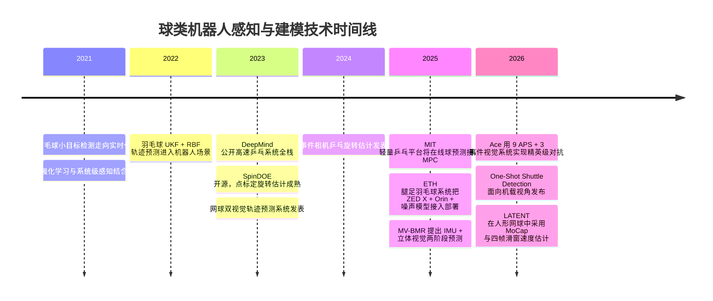
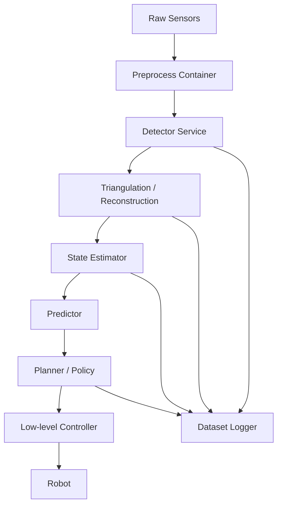

# 网球、乒乓球、羽毛球机器人感知与建模技术栈研究

## 执行摘要

本报告聚焦**网球、乒乓球、羽毛球机器人落地系统**中的核心技术栈，重点回答四个问题：第一，真正可部署的球类机器人在**感知、建模/轨迹预测、控制、系统集成**上到底包含哪些模块；第二，这些模块在近五年代表性论文与官方项目中分别采用了什么方法；第三，这些方法的基本原理、优缺点、实时性代价与工程难点是什么；第四，若要从实验室原型走向“能打、能复现、能维护”的系统，工程上还必须补齐哪些环节。本文以 2021–2026 年、检索截止 **2026-05-06** 的论文、顶会/期刊文章、官方项目主页与开源仓库为主，优先采用原始来源。([nature.com](https://www.nature.com/articles/s41586-026-10338-5))

核心结论可以概括为三条。其一，**乒乓球系统最成熟，羽毛球系统在移动平台上进展最快，网球系统在人形/全场落地上刚出现突破**。乒乓球方向已经形成了以高速多相机/事件相机、DLT/滤波、物理补偿、低时延控制和强化学习为主的成熟栈；羽毛球方向则最强调“移动平台视角”“主动感知”“轨迹预测与机体运动协同”；网球方向在真实世界人形回球方面以 LATENT 为代表开始进入可持续多拍阶段，但感知依赖仍明显更重，例如光学动捕与外部几何参考。([arxiv.org](https://arxiv.org/abs/2309.03315))

其二，真正起决定作用的并不是单个算法名词，而是**时间预算管理**。在高动态球类机器人里，视觉检测是否“准”固然重要，但更关键的是：相机触发时间是否一致，图像传输是否可预测，状态估计是否显式建模延迟，控制器是否知道当前观测落后了多少毫秒。Ace 用九个 APS 相机做 200 Hz 三维定位，再用三套事件视觉 gaze-control system 估计角速度，把空间分辨率、角速度估计和低时延拆成不同子系统；DeepMind 的系统把 perception latency 明确纳入仿真；ETH 的腿足羽毛球系统则直接在系统级把 60 Hz 感知、400 Hz 状态估计和 100 Hz 控制拼合成异步流水线。([nature.com](https://www.nature.com/articles/s41586-026-10338-5))

其三，面向落地实现，完整技术栈至少应包括：**传感器与标定、检测与跟踪、三维重建、速度/旋转估计、状态滤波、物理与学习混合预测、规划与控制、软件中间件、日志与回放、仿真与系统辨识、安全机制、自动化运维**。如果只做“一个检测器”或“一个轨迹网络”，在高动态真实机器人中通常无法独立成立。近五年的领先成果几乎都在强调：必须把感知、预测、控制、硬件、仿真和部署看成一个系统工程。([science.org](https://arxiv.org/html/2505.22974v2))

## 方法与检索策略

本报告优先检索并使用如下来源：entity["organization","arXiv","preprint repository"] 论文页与 HTML 版、entity["organization","Nature","scientific journal"] 文章页、entity["organization","Oxford Academic","publisher platform"] 期刊页、entity["organization","Cambridge University Press","academic publisher"] 期刊页、entity["company","GitHub","software platform"] 官方仓库、以及项目方官方博客或项目主页。方法上，我优先选取那些同时满足以下至少两项的工作：一是具备真实硬件部署；二是公开描述了感知或预测流水线；三是给出了系统级性能指标；四是有代码、数据或项目页可供交叉核验。([github.com](https://github.com/leggedrobotics/shuttle_detection))

可信度标准分成三档。**高可信度**指“论文/期刊原文 + 官方项目页/官方仓库”双重可核验，例如 Ace、DeepMind table tennis、ETH badminton、LATENT、TrackNetV3。**中可信度**指只有论文摘要页或仓库 README 能获取核心信息，但系统细节没有完全展开，例如部分网球捡球/双视觉系统。**低可信度**则指只能依赖第三方转述或二手摘要；本报告尽量不采用低可信度来源。由于用户要求的是“技术栈与方法”，所以文中凡是涉及精度、延迟、频率、平台构型等硬指标，均优先使用原论文或官方仓库中的直接描述。([github.com](https://github.com/qaz812345/TrackNetV3))

在表述方式上，本文把“技术栈”拆成四个互相耦合的大模块：**感知层、建模与球路预测层、控制与实时执行层、系统集成与工程落地层**。每个模块都给出：基本原理、主流方法族、典型论文/项目实例、适用场景、优缺点，以及工程实现要点。数学表达采用尽可能通用的写法，复杂度讨论以在线推理/系统部署为目标，而不是仅从训练视角讨论。  

## 技术全景与时间线

从近五年发展脉络看，球类机器人感知与建模技术不是线性演进，而是沿着三条路线同时推进：一条是**固定外部视觉 + 工业机器人**，典型如 DeepMind 和 MIT 乒乓平台；一条是**多相机/事件相机混合的高性能感知系统**，典型如 Ace 与 Tübingen 的旋转估计工作；另一条是**移动机器人/腿足/人形上的“在机感知 + 主动运动”**，典型如 ETH 的 BADMINTON 系统和 LATENT。羽毛球方向还额外发展出了面向机载视角的小目标检测技术，明显不同于广播视频分析路线。([arxiv.org](https://arxiv.org/abs/2505.22974))

下图整理了 2021–2026 之间、与感知—建模—部署直接相关的代表性节点。([academic.oup.com](https://academic.oup.com/jcde/article/10/3/1176/7197436))



如果把整个系统抽象成可部署流水线，其骨架大致如下。真正成熟的系统差异，通常不在于是否包含这些模块，而在于这些模块之间的**时间戳、一致性、容错与降级策略**是否做完整。([arxiv.org](https://arxiv.org/html/2309.03315v2))

```mermaid
flowchart LR
    A[相机 / 事件相机 / IMU / MoCap] --> B[时空同步与标定]
    B --> C[二维检测与分割]
    C --> D[多目三角化 / 单目重建 / 几何约束]
    D --> E[速度与旋转估计]
    E --> F[EKF UKF Particle / 学习融合]
    F --> G[物理模型或混合预测器]
    G --> H[击球点与时机规划]
    H --> I[MPC / RL / 分层控制]
    I --> J[机械臂 / 轮式底盘 / 四足 / 人形]
    J --> K[日志回放 / 误差分析 / 安全回退]
```



## 感知层

### 传感器选型与总体原则

球类机器人感知层的首要目标不是“看清楚球”，而是在**足够早、足够准、时间戳可用**的前提下输出可供控制使用的球状态。不同运动项目的优先级并不一样。乒乓球更强调极短时间窗口与旋转，因此更容易采用高速全局快门相机、事件相机、固定外部多目系统；羽毛球由于飞行距离更长但空气动力学更复杂，且移动平台视角变化更大，所以更强调双目相机、异步状态估计和机载算力；网球则场地更大，真实世界系统常用外部 MoCap、双视觉或“网侧视觉 + 本体视觉”混合方案。([nature.com](https://www.nature.com/articles/s41586-026-10338-5))

#### 各类相机的特点与区别

**全局快门相机（Global Shutter Camera）** 与滚动快门（Rolling Shutter）相对。滚动快门逐行曝光，每行像素的曝光起始时刻不同，高速运动物体会产生"果冻效应"——球被拉伸或倾斜变形，导致 2D 检测位置偏移、三角化误差放大。全局快门则所有像素在同一时刻曝光，图像几何保真度高，是高速球类感知的默认选择。代价是全局快门传感器通常读出噪声略高、成本更贵。DeepMind 的乒乓系统使用 Ximea 全局快门相机，曝光时间控制在 4 ms，并直接输出 raw Bayer 图像以省去去马赛克延迟；Ace 的九个 APS 相机同样是全局快门，以 200 Hz 同步触发。

**事件相机（Event Camera / EVS）** 与传统帧相机的工作原理完全不同。帧相机按固定频率输出整幅图像，而事件相机每个像素独立、异步地报告亮度变化——当某个像素的亮度对数变化超过阈值时，立即输出一个"事件"，包含 $(x, y, t, p)$（坐标、微秒级时间戳、极性）。这带来三个关键优势：一是时间分辨率极高（微秒级），等效帧率可达数千 Hz，远超传统相机的 100–200 Hz；二是只输出变化区域，数据量极小，天然压缩了冗余背景；三是高动态范围（通常 >120 dB），在球场灯光不均匀时不易过曝或欠曝。局限在于：事件相机不输出绝对亮度，无法直接用于传统 CNN 检测器；静止物体不产生事件，需要配合帧相机做初始化。Ace 用三套事件相机 gaze-control system 追踪球上 logo 的角速度，Tübingen 则用事件相机 + ordinal time surfaces + optical flow 做旋转估计，正是利用了事件相机在高速旋转场景下不受运动模糊影响的优势。

**双目相机（Stereo Camera）** 通过两个水平排列的相机模拟人眼视差，利用三角测量原理直接恢复深度。相比单目，双目不需要额外的尺度先验或结构假设，深度估计更几何化、更可解释。ETH 的腿足羽毛球系统使用 ZED X 双目相机，安装在机器人本体上，在 Jetson AGX Orin 上以 60 Hz 运行，将 2D 检测点通过视差转为 3D 坐标后变换到 map frame 中做 EKF 滤波。双目的局限在于：基线（两相机间距）限制了有效测距范围——基线越短，远距离深度误差越大；基线越长，近距离盲区越大。此外，双目对无纹理或重复纹理物体（如纯色球）的立体匹配容易失败，ETH 因此先用 HSV 颜色范围做 2D 粗过滤来辅助匹配。

**多目系统（Multi-camera System）** 是双目思路的扩展，用三台或更多相机从不同视角覆盖更大空间。多目的核心优势是：冗余观测可以抵抗遮挡——即使某个视角的球被球拍或身体遮挡，其他视角仍能提供有效检测；同时多视角三角化的几何精度通常优于双目。代价是系统复杂度、标定工作量和硬件成本成倍增加。Ace 的九个 APS 相机是这一思路的极致：通过 CMA-ES 优化每台相机的镜头、安装高度与朝向，使球在图像中的最小投影半径始终保持在可检测范围内，再以 200 Hz 硬触发同步做广域 3D 三角化。DeepMind 则使用双相机 + DLT 做双目三角化，并通过误差分析优化相机放置位置以最小化 triangulation bias。

**光学动作捕捉（MoCap / Motion Capture）** 使用多个红外相机追踪贴在被测物体上的反光标记点，以亚毫米精度输出 3D 位置和姿态。在球类机器人中，MoCap 通常不用于实时比赛感知，而是作为研发阶段的"真值系统"：为检测器提供高精度标注、为滤波器提供 ground truth 对比、为 sim-to-real 提供误差分析基准。LATENT 在人形网球系统中使用 MoCap 获取球和机器人的精确状态，并用四帧滑窗平均速度作为策略输入。MoCap 的局限很明显：需要贴标记点、需要专用红外相机阵列、场地部署复杂、成本高，无法用于正式比赛。

**APS 相机（Active Pixel Sensor）** 是 CMOS 图像传感器的一种，每个像素内置放大器，相比传统 CCD 具有更低的功耗、更高的读出速度和更好的片上集成能力。在球类机器人语境下，APS 相机通常指高速全局快门 CMOS 相机，Ace 将其用于 200 Hz 广域 3D 定位，并将 2D 检测前置到 FPGA 以加速处理。

下表总结了各类传感器在球类机器人场景中的核心差异：

| 传感器类型 | 时间分辨率 | 空间分辨率 | 深度信息 | 运动模糊 | 数据带宽 | 典型部署 | 代表系统 |
|---|---|---|---|---|---|---|---|
| 全局快门 APS | 100–200 Hz | 高（MP 级） | 需多目 | 低（曝光短） | 高 | 固定外部 | DeepMind、Ace |
| 事件相机 | μs 级等效 | 低–中（QVGA–HD） | 需多目 | 极低 | 极低 | 固定外部 | Ace、Tübingen |
| 双目相机 | 30–60 Hz | 中–高 | 直接视差 | 中（滚动快门常见） | 中 | 机载 | ETH Badminton |
| 多目系统 | 100–200 Hz | 高 | 三角化 | 低 | 极高 | 固定外部 | Ace（9 相机） |
| MoCap | 100–360 Hz | — | 亚毫米 | 极低 | 中 | 固定外部 | LATENT |

选择传感器时，至少要同时评估五个维度：**角分辨率、时间分辨率、感兴趣区域覆盖、链路延迟、与控制回路的耦合方式**。Ace 的解决思路很典型：把“广域 3D 定位”与“高分辨率旋转估计”拆开，前者用九个 APS 相机做 200 Hz 三维定位，后者用三套事件相机 gaze-control system 做角速度估计，再把两者在控制层融合；这说明在极端高速场景下，单一传感器通常难以同时最优地完成所有任务。([nature.com](https://www.nature.com/articles/s41586-026-10338-5))

MIT 的轻量乒乓平台则代表了另一类思想：不追求“复杂多模态”，而追求“**外部视觉稳定 + 在线预测接 MPC**”。该系统依赖外部视觉和在线球预测，把感知前端抽象成末端击球约束，从而把精力集中在轻量高速机械臂与 MPC 上。ETH 的腿足羽毛球系统则采取“在机双目 + 异步感知 + 噪声建模”的思路：机体上装 ZED X 双目相机，感知在 Jetson AGX Orin 上 60 Hz 异步运行，同时在仿真中引入与真实相机一致的噪声模型，使控制策略提前适应真实观测误差。([arxiv.org](https://arxiv.org/html/2505.01617v1))

### 标定、时序同步与延迟补偿

落地系统的第一原则是：**几何标定与时间标定同等重要**。在球类机器人里，常见链路延迟包括：曝光结束时间、相机驱动缓存、USB/以太网传输、GPU 前处理、检测网络推理、三角化/滤波、控制消息下发以及执行器实际起动延迟。DeepMind 的系统之所以有高系统一致性，关键之一就是把 latency 明确拆分建模，并在仿真中对观测历史做插值，生成带延迟的观测用于策略训练；ETH 的腿足羽毛球系统则明确定义了 60 Hz 感知、400 Hz 状态估计与 100 Hz 控制的异步频率结构。([arxiv.org](https://arxiv.org/html/2309.03315v2))

#### 链路延迟逐段拆解

从光子打到相机传感器，到机器人关节真正开始运动，中间经过的每一段都有延迟。按时间顺序：

```
光子到达传感器
    │
    ▼  t_exposure（曝光时间）
曝光结束，电荷读出开始
    │
    ▼  t_readout（传感器读出）
像素数据进入相机内部缓存
    │
    ▼  t_driver（驱动层缓存 + 打包）
数据通过 USB / 以太网开始传输
    │
    ▼  t_transfer（总线传输）
数据到达主机内存（DMA）
    │
    ▼  t_preprocess（GPU 前处理：Bayer→RGB、缩放、归一化）
数据送入检测网络
    │
    ▼  t_inference（神经网络推理）
2D 检测结果输出
    │
    ▼  t_triangulate（三角化 / 滤波）
3D 球状态估计完成
    │
    ▼  t_plan（规划 / 策略推理）
控制命令生成
    │
    ▼  t_command（通信下发：EtherCAT / CAN / USB）
命令到达电机驱动器
    │
    ▼  t_actuate（电机电流环响应 + 机械传动）
关节真正开始转动
```

**各段详解：**

- **曝光时间（t_exposure）**：相机传感器收集光子的时间窗口。曝光越长图像越亮但运动模糊越严重，曝光越短球体边缘越清晰但图像越暗。DeepMind 将曝光控制在 4 ms——乒乓球在 4 ms 内位移约 8 cm（以 20 m/s 计），在图像上产生的运动模糊约 2–3 像素，仍在可接受范围内。
- **传感器读出（t_readout）**：曝光结束后传感器逐行将模拟电荷转为数字信号。全局快门所有行同时曝光但读出仍是逐行的，读出时间取决于传感器分辨率和时钟频率。对于 200 Hz 相机帧周期是 5 ms，读出必须在此时间内完成。高速相机通常用较小的 ROI 来加速读出。
- **驱动层缓存（t_driver）**：相机驱动在操作系统内核或用户态维护环形缓冲区，数据从传感器到驱动缓存再到用户态可访问内存，中间可能经过多次拷贝。DeepMind 省掉 Bayer→RGB 转换就是为了在这一段省掉约 1 ms。
- **总线传输（t_transfer）**：USB 3.0 理论带宽 5 Gbps，一帧 1280×1024 raw Bayer 约 1.3 MB，传输约 1–3 ms。10GigE 可压到 0.5 ms 以下。Ace 用 FPGA 在相机端做 2D 检测预处理，只传输压缩的 detection mask 而非整帧图像，大幅削减此段延迟和带宽。
- **GPU 前处理（t_preprocess）**：图像从 CPU 内存拷贝到 GPU 显存（PCIe 传输），再做缩放、归一化、格式转换，通常 0.5–2 ms。若检测网络能直接消费 raw Bayer（如 DeepMind），前处理几乎为零。
- **神经网络推理（t_inference）**：最大的单段延迟来源。YOLO 类检测器在桌面 GPU 上约 3–10 ms，在 Jetson Orin 等边缘设备上约 10–20 ms。Ace 把 2D 检测前置到 FPGA 用专用硬件加速，压到亚毫秒级。
- **三角化 / 滤波（t_triangulate）**：多目三角化本身很快（0.1–0.5 ms），Kalman Filter 更新步约 0.1 ms。真正的延迟不在这段计算，而在于"等所有相机的检测结果到齐"——如果某个相机检测慢了 5 ms，三角化就得等 5 ms。
- **规划 / 策略推理（t_plan）**：MPC 求解优化问题通常 2–10 ms（MIT 的 FHMPC 为 3.2 ms），RL 策略前向推理通常 1–5 ms。这是第二大单段延迟。
- **通信下发（t_command）**：EtherCAT 总线周期通常 0.5–1 ms，CAN 总线 1–5 ms，USB 串口 1–10 ms。工业机器人用 EtherCAT 是标配。
- **执行器响应（t_actuate）**：电机电流环通常 0.05–0.1 ms，但机械传动（减速器、连杆）的间隙和弹性会产生额外延迟。高扭矩密度电机 + 直驱或低减速比可最小化此段。

**端到端总延迟参考：**

| 系统 | 端到端延迟 | 说明 |
|---|---|---|
| Sony Ace | 10.2 ms | 行业标杆，FPGA 前置 + 硬触发同步 |
| DeepMind | 约 15–25 ms（估计） | 双相机 + raw Bayer + KF |
| ETH Badminton | 60–160 ms（仅感知段） | 机载双目 + Jetson Orin，含检测推理 |
| MIT 乒乓 | 未公开 | FHMPC 3.2 ms，感知延迟另计 |

#### DeepMind 系统延迟建模详解

DeepMind 的乒乓机器人系统是"仿真—现实一致"思想的典范，核心做法拆为四层：

**感知层：双相机 + raw Bayer + DLT + KF。** 两台 Ximea 全局快门高速相机通过硬件同步线缆保证曝光时刻一致，帧率 125 FPS。刻意跳过 Bayer→RGB 转换，直接把 raw Bayer 图像喂给检测网络，省掉约 1 ms 的去马赛克延迟并减少数据传输量（raw Bayer 是 RGB 的 1/3）。在 raw Bayer 图像上直接做球检测输出 2D 球心坐标，再用 DLT 做双目三角化转为 3D 位置，最后用递归 Kalman Filter 平滑 3D 位置并估计速度。相机放置位置通过误差分析优化以最小化 triangulation bias。

**延迟建模：仿真中显式注入延迟。** 这是 DeepMind 系统最关键的工程决策——不在仿真里假设"观测是即时的"。先测量真实系统的端到端延迟（从相机曝光到控制命令生效逐段测量），然后在仿真中复现：仿真器维护一个观测历史缓冲区，当策略请求当前观测时，返回的不是最新状态，而是 $t - \Delta t_{\text{delay}}$ 时刻的状态（通过历史插值得到）。策略在训练中就适应了延迟——因为训练时观测就是"过时的"，策略学会了在信息滞后的条件下做决策，隐式地学会了预测。

```
仿真中的观测生成：

真实球状态时间线:  ... x(t-3)  x(t-2)  x(t-1)  x(t)  x(t+1) ...
                                ↑                    ↑
                          观测历史缓冲区          "真实"当前状态
                                │
                          插值得到 x(t - Δt_delay)
                                │
                          这就是策略"看到"的观测
```

**仿真—现实一致：统一的 Gym 环境接口。** 仿真和真实世界共用完全相同的环境接口（observation space、action space、reward function）。仿真中的物理参数（球台弹性、球拍摩擦、空气阻力）通过**系统辨识**校准到与真实一致——系统辨识是指通过做实验采集真实球的飞行轨迹数据，反推出物理系统的真实参数（如阻力系数 $C_d$、恢复系数 $e_n$、摩擦系数 $\mu$），而非从理论公式直接假设。做法是：用高速相机拍下真实球的飞行轨迹，在仿真里跑同样的初始条件，调整参数让仿真轨迹和真实轨迹尽可能重合，再换一组初始条件验证泛化。策略在仿真中训练，部署到真实机器人时代码零改动——只切换底层从仿真器到真实硬件的 I/O。

**控制层：高频闭环策略。** 策略直接以 125 Hz 接收球状态 + 机器人关节状态，输出关节位置/速度指令。不做显式的轨迹预测 + 规划分离，而是端到端学习"看到球 → 打回去"的映射。训练用 PPO，仿真中大规模并行 rollout。

> DeepMind 的核心思想：**在仿真中精确复现真实世界的延迟和噪声，让策略在训练时就"习惯"了信息滞后，从而在部署时不需要额外的在线补偿。**

#### ETH 腿足羽毛球系统详解

ETH Zurich 的腿足羽毛球系统是"移动平台 + 在机感知 + 全身协调"的代表，核心挑战比固定基座机器人多一个维度：**机器人自己在移动，相机也在晃动**。

**硬件架构：** ZED X 双目相机安装在机器人头部提供机载立体视觉，Jetson AGX Orin 负责所有感知和控制（无外部服务器），执行器为四足机器人（ANYmal 类平台）+ 6-DoF 机械臂 + 羽毛球拍。

**感知流水线：HSV 过滤 → 双目深度 → 坐标变换 → EKF。** 先用 HSV 颜色空间做粗过滤（羽毛球是白色的），缩小搜索区域——这一步很关键，因为双目立体匹配在无纹理区域容易失败，先用颜色把球从背景中分离出来再做视差计算。ZED X 通过左右目视差计算球的 3D 坐标（在相机坐标系下）。然后将相机坐标系下的 3D 点变换到 map frame（世界坐标系）。

**坐标变换详解——机器人如何确定自己在世界坐标系中的位置：** ETH 系统用多种传感器融合来估计机器人的位姿。IMU 以 400 Hz 输出角速度和线加速度，但纯积分会漂移（几秒钟后位置误差可达米级）。腿足里程计利用关节编码器知道足端相对于身体的位置，当足端接触地面时可推算身体相对于地面的移动，漂移比纯 IMU 慢得多。视觉里程计利用 ZED X 双目跟踪环境中的特征点（球场边线、网柱、地面纹理），通过特征点在图像间的移动反推相机（即机器人）的运动。球场几何修正利用已知的球场边线和网柱位置做绝对位置修正——"我看到网柱在我的左前方 3 米，所以我在球场中线的右侧约 2 米处"。这些信息在 EKF 或因子图优化中融合，输出机器人本体在世界坐标系中的 6-DoF 位姿 $T_{\text{world}\leftarrow\text{body}}$。

球的 3D 坐标变换链为：

$$
\mathbf{p}_{\text{world}} = \mathbf{R}_{\text{world}\leftarrow\text{body}} \cdot (\mathbf{R}_{\text{body}\leftarrow\text{cam}} \cdot \mathbf{p}_{\text{cam}} + \mathbf{t}_{\text{body}\leftarrow\text{cam}}) + \mathbf{t}_{\text{world}\leftarrow\text{body}}
$$

其中 $\mathbf{p}_{\text{cam}}$ 是 ZED X 双目直接输出的球在相机坐标系下的 3D 坐标，$T_{\text{body}\leftarrow\text{cam}}$ 是相机到机器人本体的固定变换（安装时标定好，不变），$T_{\text{world}\leftarrow\text{body}}$ 是机器人本体到世界坐标系的变换（**实时变化**，由 SLAM + 传感器融合每时每刻更新）。变换到世界坐标系后，球的轨迹是绝对的——不受机器人自身运动的影响，EKF 在世界系中对球做状态估计，控制器再根据"球在世界系中的未来位置"和"我在世界系中的当前位置"来规划拦截动作。

**EKF 状态估计与 IMU 预测：** 状态估计是指从带噪声的、不完整的观测中推断出系统"真正的状态"。在 ETH 系统中，状态是球的位置和速度 $\mathbf{x} = [p_x, p_y, p_z, v_x, v_y, v_z]^\top$。相机只给位置且有噪声，但控制需要速度来预测球未来会飞到哪。EKF 的职责是从连续多帧的带噪声位置观测中，利用物理模型（球在重力 + 空气阻力下的运动方程）同时估计出平滑的位置和速度——当新观测到达时，比较"模型预测的位置"和"相机观测的位置"，取加权平均，同时修正位置和速度的估计。IMU 预测不是预测球的运动，而是预测机器人本体的运动——在两次视觉观测之间（~16.7 ms），EKF 做了约 6–7 次纯预测步，IMU 在这 2.5 ms 的预测步中提供机器人本体的运动信息（角速度 + 加速度），让 EKF 能正确区分"球在飞"和"我在动"。

**异步频率结构的设计逻辑：** 60/400/100 Hz 是 ETH 团队的工程设计选择，由硬件能力、算法计算量、物理响应速度三者折中决定。感知 60 Hz 受限于 ZED X 双目深度计算 + HSV 过滤 + 检测推理在 Jetson AGX Orin 上的算力上限（换更强的机载计算机可推到 100–200 Hz，但功耗和重量不允许）。状态估计 400 Hz 是因为 ETH 使用的 IMU 以 400 Hz 原生输出数据，EKF 在每个 IMU 采样点做一次预测步是最自然的做法——IMU 来一个数据就推一次状态，不需要降采样或插值。控制 100 Hz 是计算与机械响应的平衡点——比感知快（不等视觉），比状态估计慢（RL 策略推理需要时间，100 Hz = 10 ms 一帧刚好够），同时四足机器人的关节伺服通常为 1 kHz，100 Hz 的策略输出可以平滑插值到 1 kHz 的关节指令。

**仿真中的噪声建模：** ETH 的做法和 DeepMind 异曲同工但更侧重观测噪声。先测量真实 ZED X 相机的 3D 定位误差分布（均值、方差、与距离的关系），在仿真中注入匹配的噪声——仿真器输出的球位置加上与真实相机统计特性一致的噪声再喂给策略。同时做 dynamics randomization（随机化球拍质量、关节摩擦、地面摩擦等物理参数），让策略在训练中就"见过"真实噪声，部署时不会因观测质量下降而崩溃。

**全身协调：** 策略必须同时学会移动到拦截点（locomotion）、保持平衡（stability）、挥拍击球（manipulation）——三者互相耦合，不能分开训练。观测空间包含球状态（EKF 输出）+ 机器人全身关节状态 + 本体线速度/角速度（IMU）+ 足底接触力，动作空间为全身关节位置目标（四足 12 个 + 机械臂 6 个 = 18+ DoF），用 Isaac Gym 大规模并行仿真 + PPO 训练。

**时间预算：** ETH 实测羽毛球平抽总飞行时间 500–1000 ms，感知模块注册到可拦截轨迹平均需要 357 ms（已经过去了 35%–70%），留给全身运动 + 挥拍约 654 ms。在这 654 ms 内四足机器人需要完成锁定拦截点 → 移动底盘到位（可能 1–2 米）→ 抬起手臂 → 挥拍击球，这就是为什么必须把状态估计推到 400 Hz、控制推到 100 Hz——每一毫秒都在和时间赛跑。

> ETH 的核心思想：**机载双目 + 异步三层频率架构 + 仿真噪声注入 + 全身统一 RL，让移动腿足机器人在真实羽毛球场景中实现感知—移动—击球的闭环。**

几何上，多相机体系一般需要完成四类标定：**相机内参、相机-相机外参、相机到世界/球台/球场外参、传感器到机器人本体外参**。DeepMind 在双相机乒乓系统中使用 DLT 进行双目三角化，并明确提到需要考虑 triangulation bias，因此连相机放置位置都通过误差分析来优化。Ace 则不仅在几何上预标定九个相机，还通过 CMA-ES 优化镜头、安装高度与朝向，使得球在图像中的最小投影半径保持在可检测范围内。ETH 羽毛球系统则进一步把双目位置估计变换到由 SLAM 与传感器融合维护的 map frame 中，再在该世界系内进行 EKF 滤波与截击点计算。([arxiv.org](https://arxiv.org/html/2309.03315v2))

时间同步方面，工程上常见的策略有三种。第一种是**硬触发同步**，例如 DeepMind 的 Ximea 双相机使用硬件同步线缆；Ace 则用 200 Hz trigger signal 同步九台相机与机器人执行器。第二种是**固件时间戳 + 后端时钟校正**，ETH 依赖 ZED X 同步图像时间戳，并在世界系转换时显式使用时间信息。第三种是**软件对齐 + 状态插值/外推**，即使没有硬触发，也要在滤波器中把不同模态视为异步测量。这个问题在羽毛球里特别尖锐，因为 MV-BMR 指出平抽与低平球的飞行时间经常只有 500–1000 ms，而 ETH 实测从对手击球到生成可拦截轨迹的平均时间就已经达到 0.357 s。([nature.com](https://www.nature.com/articles/s41586-026-10338-5))

### 二维检测、分割与跟踪

对于球类机器人，单帧检测器很少孤立使用。更可行的做法是把**单帧检测、短时跟踪、轨迹修复、重初始化**组合成一套流水线。DeepMind 的乒乓感知系统用两个全局快门高速相机直接输入 raw Bayer 图像，并刻意省掉 Bayer→RGB 转换，以减少约 1 ms 的延迟和更多的数据传输开销；每路图像先给出 2D 检测，再用 DLT 三角化和 Kalman filter 形成 3D 轨迹状态。Ace 则把每个 APS 相机上的 2D 检测前置到 FPGA，加速输出压缩的 detection mask，再交给中央服务器做 3D 三角化。([arxiv.org](https://arxiv.org/html/2309.03315v2))

#### DeepMind 感知流水线详解

DeepMind 论文将感知系统拆为三个组件：**2D 球检测（双相机独立运行）、DLT 三角化恢复 3D 位置、递归 Kalman Filter 精化球状态**。以下逐一展开。

**相机硬件与同步：** 系统使用两台 Ximea MQ013CG-ON 相机，通过硬件同步线缆保证曝光时刻一致，USB3 有源光缆连接主机。相机以 125 FPS 运行，分辨率 1280×1024，传感器延迟仅 838 μs。采用全局快门 + 4 ms 短曝光时间，只输出 raw Bayer 图像（不做去马赛克）。镜头为 Fujinon FE185C086HA-1 鱼眼镜头，安装在球台两侧上方约 2 m 处，以覆盖整个比赛区域。

**相机布局优化——三角化偏差分析：** 论文专门对比了两种双目配置：两台相机安装在球台同侧 vs 安装在球台对侧。通过仿真量化三角化偏差（triangulation bias），发现**对侧安装**使偏差降低一个数量级——因为对侧视角更接近正交，几何约束更强。此外，对侧配置的基线更长，也有利于降低估计方差。这一分析说明相机位置不是随便放的，而是通过误差建模来优化的。

**2D 球检测——时序卷积架构：** 检测网络是一个紧凑的 CNN，仅 27k 参数，包含五层空间卷积和两层时序卷积。输出结构借鉴 CenterNet，每个像素位置预测三个量：球心置信度（ball score）、亚像素偏移（2D local offset）、球速估计（2D velocity in pixels）。时序卷积用于捕捉运动线索——球在飞，静止背景中的运动物体就是球——这比纯空间特征更鲁棒。

**直接处理 Bayer 图像：** 检测网络直接消费 raw Bayer 格式，跳过 Bayer→RGB 转换。论文指出这省掉了每路相机约 1 ms 的转换延迟（占帧间间隔 8 ms 的 15%），同时数据传输量减少 2/3（raw Bayer 只有一个通道，RGB 有三个）。与其他使用 Bayer 图像的工作不同，DeepMind 没有发现性能损失，原因在于他们对 $2 \times 2$ Bayer 模式的卷积步长做了特殊设计，避免了颜色混叠。

**缓冲时序卷积——推理时只需单帧：** 通常时序卷积需要在每个时间步输入一个帧窗口，但 DeepMind 的实现通过内部缓冲区存储上一时间步的特征图，推理时只需输入当前单帧。这大幅减少了主机到加速器（GPU）的数据传输量——这是吞吐量的关键瓶颈。缓冲区在每次卷积后更新，下一时间步自动使用。

**训练策略——局部 Patch 训练：** 检测器不是在全图上训练的，而是从视频流中裁剪出 230 万个 $64 \times 64 \times n$ 帧的小 patch（$n$ 为帧数，匹配网络感受野）。正样本 patch 包含球，负样本从背景随机采样。这种局部 patch 训练有三个好处：训练时间减少 50 倍（因为 patch 比全图小得多）、天然解决类别不平衡（正负样本比例可控）、网络只学习局部特征而不依赖全局背景。每个 patch 的三个输出各有对应损失：球心置信度用二值交叉熵，亚像素偏移用 MSE（目标为像素坐标到球心的相对位置），速度预测同样用 MSE（目标为下一帧球心相对于当前帧的位置）。

**3D 跟踪——DLT + Kalman Filter：** 当两路图像的球心置信度都超过学习到的阈值时，利用检测器输出的当前位置（2D 坐标 + 亚像素偏移）和下一帧预测位置（2D 坐标 + 速度预测），通过 DLT 分别三角化出 3D 位置和 3D 速度。这两个 3D 观测送入递归 Kalman Filter，精化后的球状态（3D 位置）最终发给机器人策略。Kalman Filter 在这里的作用是平滑和去噪——单帧三角化结果有噪声，多帧滤波后更稳定。

**真实部署中的观测生成：** 仿真中所有物体的状态已知且可按固定间隔查询，但真实环境中不同传感器以不同频率产生观测（球感知、ABB 机器人、Festo 直线电机），可能不准确或到达时间不规则。DeepMind 的做法是将所有传感器观测连同时间戳一起缓冲，对环境步长时间戳做插值或外推，再经过带通滤波器去噪后转换为策略观测格式。论文实测了各组件的延迟分布（均值 ± 标准差）：球观测 40 ± 8.2 ms、ABB 观测 29 ± 8.2 ms、Festo 观测 33 ± 9.0 ms、ABB 动作 71 ± 5.7 ms、Festo 动作 64.5 ± 11.5 ms。这些延迟值被显式建模为高斯分布，在仿真中每 episode 采样一次，使策略在训练中就适应了真实延迟。

#### 工程组合法：四模块感知流水线
羽毛球方向的技术谱系更丰富，主要有三条线。

**第一条：YOLO/改进 YOLO 路线**，用于移动机器人场景的快速检测与重置初始化。One-Shot Shuttle Detection 明确针对"非静态机器人视角"的痛点，建立了 20,510 帧、11 个背景场景的数据集，并以 YOLOv8 为基础达到 F1 0.86（与训练环境相似）和 0.70（完全未见环境）的检测表现。快速入口：[项目主页](https://sites.google.com/leggedrobotics.com/shuttlecockfinder) | [GitHub 仓库](https://github.com/leggedrobotics/shuttle_detection)（含自动标注、训练、评测、推理的完整 Docker 流程） | [论文 arXiv:2603.06691](https://arxiv.org/abs/2603.06691)。

**第二条：TrackNet/TrackNetV3 路线**，把连续帧信息编码为热图或轨迹预测，再用修复网络补全遮挡。TrackNetV3 给出 Accuracy 97.51%、F1 98.56%、25.11 FPS，并明确由"trajectory prediction + trajectory rectification"两阶段组成。快速入口：[TrackNetV1 官方 GitLab](https://gitlab.nol.cs.nycu.edu.tw/open-source/TrackNet) | [TrackNetV1 GitHub 镜像](https://github.com/yastrebksv/TrackNet) | [TrackNetV3 TensorFlow2 实现](https://github.com/Chang-Chia-Chi/TrackNet-Badminton-Tracking-tensorflow2) | [TrackNetV3 论文 (MMAsia 2023)](https://dl.acm.org/doi/10.1145/3595916.3626384) | Shuttlecock Trajectory Dataset（Google Drive，见各仓库 README）。

**第三条：MonoTrack 路线**，它不再局限于单点检测，而是把广播视频中的 2D/3D 轨迹重建做成端到端系统，更适合离线分析和弱监督几何重建。快速入口：[论文 arXiv:2204.01899](https://arxiv.org/abs/2204.01899)（CVSports@CVPR 2022） | 作者 Paul Liu (Stanford) / Jui-Hsien Wang (Adobe Research)。注意：MonoTrack 目前未见公开代码仓库，但论文详细描述了完整 pipeline（场地识别→2D 轨迹估计→击球识别→3D 重建），可参考其方法自行实现。([arxiv.org](https://arxiv.org/abs/2603.06691))

如果把这些方法放进机器人系统语境里比较，YOLO/YOLOv8 的优势是**重初始化、视角迁移与在机实时性**；TrackNet 的优势是**连续轨迹与遮挡鲁棒性**；MonoTrack 的优势是**单目场景下恢复 3D 结构的能力**。

工程上，比较常见的组合法是将感知任务拆为四个独立但协作的模块，形成一条从原始图像到 3D 球状态的完整流水线：

```
原始图像 → [单帧 Detector] → 2D 球心坐标 → [短轨迹网络] → 平滑 2D 轨迹 → [滤波器] → 时域平滑状态 → [几何模块] → 3D 位置/速度
```

**模块一：单帧 Detector（发现与重定位）**

这是流水线的入口，负责在每一帧独立地输出球的 2D 位置。它的核心职责是"发现"——当球首次进入视野、从遮挡中重新出现、或跟踪丢失后恢复时，单帧 detector 是唯一能重新锁定目标的模块。因为它不依赖历史信息，所以天然适合初始化和重定位。

典型实现是 YOLOv8 等轻量检测器。One-Shot Shuttle Detection 论文中，YOLOv8 被约束为每帧最多输出一个检测框（NMS max_det=1），因为比赛场景中只有一颗羽毛球。输入分辨率 1024 像素，在保持宽高比的前提下平衡精度与速度。训练时混入 1000 张 COCO 背景图（无球场景），迫使模型学会区分"球不存在"和"球没检测到"。

**模块二：短轨迹网络（连续跟踪）**

单帧 detector 的输出是离散的、有噪声的坐标序列。短轨迹网络的作用是在连续几帧之间建立时序关联，输出平滑的 2D 轨迹。它利用运动连续性来抵抗单帧误检和短暂遮挡。

典型实现是 TrackNet 系列。TrackNet 输入连续 3 帧（9 通道），输出一张高斯热图，热图峰值即球的 2D 位置。因为网络同时看到前后帧，即使中间帧球被遮挡，也能根据运动趋势推断位置。TrackNetV3 进一步将流程拆为两阶段：trajectory prediction（预测完整轨迹热图）→ trajectory rectification（用 inpainting 修复遮挡缺口），使遮挡鲁棒性大幅提升。

**模块三：滤波器（时域平滑）**

短轨迹网络输出的 2D 轨迹仍然包含高频抖动。滤波器的作用是用物理运动模型对轨迹做时域平滑，同时估计无法直接观测的状态量（如速度、加速度）。

典型实现是 Kalman Filter 及其变体。在球类场景中，滤波器通常采用恒速或恒加速运动模型做预测步，用 detector 输出的 2D 坐标做更新步。滤波后的状态向量 $[\mathbf{p}, \mathbf{v}]$ 比原始检测结果更平滑、更稳定，且直接给出了速度估计——这对后续的 3D 重建和击球时机预测至关重要。

**模块四：几何模块（3D 重建）**

当系统有多个相机时，几何模块将各相机的 2D 滤波结果通过三角化（DLT 或中点法）映射到 3D 世界坐标系。单目场景下则需要借助场地几何约束（如已知球场尺寸、球网高度）或物理模型（如抛物线假设）来恢复深度。

典型实现：DeepMind 用 DLT 对双目 2D 检测结果做三角化，得到 3D 位置和 3D 速度后再送入 Kalman Filter 精化；ETH 则先用 HSV 颜色筛选得到 2D 点，再通过 ZED X 双目深度图直接读取 3D 坐标，最后在 map frame 中用 EKF 融合。

**四模块的协作关系：** 这四个模块不是简单的串行管道，而是有反馈回路的。当短轨迹网络的置信度下降（如连续多帧检测不到球），系统会触发重初始化，回退到单帧 detector 重新搜索。滤波器则持续运行，即使 detector 短暂丢失目标，也能靠预测步维持状态估计。几何模块的输出又可以反投影到图像平面，作为 detector 下一帧的搜索先验，缩小检测范围、降低误检率。

#### ETH shuttle_detection 仓库组织与实现

ETH 的 [shuttle_detection](https://github.com/leggedrobotics/shuttle_detection) 仓库完整实现了上述流水线中"单帧 detector"模块的全生命周期，从数据生产到模型部署形成闭环。仓库采用 Docker 容器化方案，所有依赖（Ultralytics YOLOv8、OpenCV、PyTorch 等）封装在 Docker 镜像中，用户无需手动配置 Python 环境。

**目录结构与模块划分：**

```
shuttle_detection/
├── docker-compose.yml          # 容器编排，定义 shuttletrack 服务
├── Dockerfile                  # 基于 PyTorch 官方镜像，安装 ultralytics 等依赖
├── pyproject.toml              # Python 包配置，入口点注册 CLI 命令
├── src/shuttletrack/
│   ├── __init__.py             # 包初始化
│   ├── config.py               # 全局配置（模型参数、路径、超参）
│   ├── autogen_labels.py       # 自动标注流水线
│   ├── convert_labels.py       # CVAT 标注 → YOLO 格式转换
│   ├── combine_datasets.py     # 多数据集合并
│   ├── select_coco.py          # COCO 背景图采样
│   ├── train.py                # YOLOv8 训练入口
│   ├── eval.py                 # 评测入口（背景/地点交叉验证）
│   ├── predict.py              # 推理入口（单帧检测）
│   └── utils.py                # 通用工具函数
└── runs/                       # 训练输出（权重、日志、预测结果）
```

**完整工作流（五阶段）：**

**阶段一：自动标注（autogen_labels.py）**

这是仓库最具特色的模块。传统标注需要人工逐帧画框，而该仓库实现了论文中描述的自动标注流水线，将人工工作量降低约 85%：

1. **GMM 背景减除**：利用 OpenCV 的 `cv2.createBackgroundSubtractorMOG2()` 对静止相机视频做前景分割，提取运动区域（红色 mask）
2. **对手移除**：用 YOLOv8-seg 分割对手球员区域（蓝色 mask），从前景中排除——因为球员也在运动，但我们要找的是球
3. **行人过滤**：排除图像下半部分的小型连通分量（行人腿部误检）
4. **候选排序**：剩余候选按时间一致性（与前一帧检测位置的距离）和 blob 面积排序，选出最可能是球的区域
5. **输出 CVAT 归档**：生成 `.zip` 文件，可直接导入 CVAT 进行人工校验和修正

论文报告该流水线正确标注了 85.7% 的帧，8.3% 仅需微调边界框，5.9% 需手动修正（主要在对手回球瞬间）。

**阶段二：标注转换（convert_labels.py）**

CVAT 导出 YOLO 格式的标注后，该脚本将其转换为 Ultralytics YOLO 标准数据集结构，并按 difficulty 分为 easy/medium/hard 三个子集。所有数据放入 `./train` 子目录，训练/验证/测试的划分在代码中动态控制，便于交叉验证。

**阶段三：训练（train.py）**

基于 Ultralytics YOLOv8 的 `model.train()` API，关键配置包括：
- 模型：`yolov8n.pt`（nano 版本，最小最快）
- 输入分辨率：1024 像素（在 config.py 中可调，论文做了 640–1408 的 sweep）
- 数据增强：mosaic、平移、缩放、HSV 色彩抖动、mixup、翻转（论文指出 mixup 对 recall 提升最大，从 0.68 到 0.78）
- NMS 约束：`max_det=1`（每帧最多一个检测）
- 训练数据：仅使用 easy + medium 难度样本（占 95.9%），排除 hard 样本以减少噪声标签干扰
- 背景负样本：从 COCO 数据集随机采样 1000 张无球图像混入训练集
- 日志：集成 W&B (Weights & Biases) 进行实验追踪

**阶段四：评测（eval.py）**

实现了论文中的两种交叉验证策略：
- **Background-based CV**：11 折，每次留一个背景做测试，其余训练——评估对相似环境的泛化
- **Location-based CV**：5 折，每次留一个地点的所有背景做测试——评估对完全未知环境的泛化

评测指标使用论文提出的距离精度（Distance Precision Rate）：预测框中心与真值框中心的欧氏距离 ≤ 25 像素即为 True Positive，而非传统的 IoU 阈值。这是因为下游任务（轨迹估计）更关心球心位置而非框的重叠度。

**阶段五：推理（predict.py）**

加载训练好的模型权重，对任意图像文件夹做批量推理，输出 CSV 文件（包含每张图的检测框坐标和置信度）。推理时同样约束 `max_det=1`。

**设计亮点总结：**

| 设计决策 | 具体做法 | 动机 |
|---|---|---|
| Docker 化 | 所有依赖封装在容器中 | 消除环境配置差异，一键复现 |
| CLI 入口 | 每个阶段独立命令（`shuttletrack.train` 等） | 模块解耦，可单独运行任一阶段 |
| 自动标注 | GMM + YOLOv8-seg + 时序过滤 | 将标注成本从数周降至数小时 |
| CVAT 集成 | 自动标注输出直接导入 CVAT | 利用成熟工具做人工校验，而非自建标注界面 |
| 难度分级 | easy/medium/hard 三级 | 训练时排除 hard 噪声，评测时分析难度相关性能 |
| 交叉验证 | 背景级 + 地点级两种 CV | 系统评估泛化能力，而非单一 train/test split |
| COCO 负样本 | 混入 1000 张无球背景图 | 降低误检（False Positive），让模型学会"球不存在" |
| W&B 集成 | 训练日志自动上传 | 实验可追溯、可对比 |

### 三维定位、速度估计与旋转估计

三维球状态最基础的输出是 $\mathbf{x}_t=[\mathbf{p}_t,\mathbf{v}_t]$，进一步可扩展到 $[\mathbf{p}_t,\mathbf{v}_t,\boldsymbol{\omega}_t]$。多目场景中，常见做法是通过相机投影方程逆求 3D 点，最简单可写为

$$
\mathbf{p}_t = \operatorname{Triangulate}\big(\pi_1^{-1}(u_1,v_1),\pi_2^{-1}(u_2,v_2)\big),
$$

其中 $\pi_i$ 是第 $i$ 台相机模型。DeepMind 明确使用 DLT 做双目三角化，然后用递归 Kalman filter 平滑 3D 位置和速度。Ace 则采用广域多相机的 3D 三角化，再把角速度估计交给独立的事件视觉系统。ETH 则先用 HSV 颜色范围做 2D 过滤，再利用 ZED X 双目将 2D 点转入 map frame，随后交给 EKF。([nature.com](https://www.nature.com/articles/s41586-026-10338-5))

速度估计的最朴素方法是有限差分：

$$
\mathbf{v}_t \approx \frac{\mathbf{p}_t-\mathbf{p}_{t-1}}{\Delta t}.
$$
但高动态球类里，位置噪声会被差分显著放大，因此实际系统通常采用**滑窗平均或滤波器内隐估计**。LATENT 明确指出，位置噪声会显著恶化速度估计，因此在仿真与实机中都维持了 4 帧滑动窗口，用平均速度作为策略输入。ETH 的 prediction-free 思路虽然不显式输出速度，但本质上也是把最近若干帧的位置历史交给策略，让网络隐式恢复速度与趋势。([arxiv.org](https://arxiv.org/html/2603.12686v1))

旋转估计是乒乓球方向最难也最有代表性的感知模块。当前主流路线可分为三类。第一类是**事件相机旋转估计**。University of Tübingen 的 2024 CVPRW 工作给出了“事件相机 + ordinal time surfaces + optical flow”的链路，动机是事件流不会像帧相机那样严重受运动模糊和带宽瓶颈影响。Ace 则把这条路线系统化：事件相机 gaze-control system 通过可转镜面、可调焦镜头和事件传感器追踪球上 logo，再用低延迟 CNN 与高精度 CMax 两种异步算法输出角速度及不确定度。第二类是**带标记球的几何姿态估计**。SpinDOE 通过球面点模式、点身份匹配和相邻姿态回归估计球自旋，并同时开放了 CAD stencil 和轨迹数据集，非常适合作为研发阶段的高质量监督源。第三类是**轨迹倒推旋转**，即从 Magnus 效应和弹跳偏移反推角速度，这种方法适合看不到 logo 的比赛用球，但精度更受位置误差影响。([arxiv.org](https://arxiv.org/html/2404.09870v1))

### 感知层方法比较

| 子模块 | 主流方法 | 基本原理 | 代表论文/项目 | 关键参数/指标 | 优点 | 局限 | 来源 |
|---|---|---|---|---|---|---|---|
| 高速 3D 定位 | 双目/多目 + DLT + KF | 2D 检测后做几何三角化，再用递归滤波平滑 | DeepMind Table Tennis | 125 Hz 感知；125 FPS 相机；DLT+KF；raw Bayer 节省约 1 ms | 几何清晰、实时性高、可解释 | 需要严格安装与标定；遮挡敏感 | citeturn10view1turn10view4turn10view5turn10view6 |
| 广域多相机 + 事件旋转估计 | APS 三角化 + EVS 角速度 | APS 管 3D，事件相机管 logo 角速度，最后融合 | Ace | 9 APS；3 GCS；200 Hz；3.0 mm；10.2 ms；角速度约 400–700 Hz | 兼顾广域覆盖与旋转估计 | 系统复杂，硬件成本高 | citeturn11view0turn11view1turn11view2turn11view4 |
| 机载双目 + EKF | HSV 颜色筛选 + 双目深度 + EKF | 机载双目得到 3D 点，统一到 map frame 中滤波 | ETH Badminton | ZED X；Jetson AGX Orin；60 Hz 感知；400 Hz 状态估计；100 Hz 控制；60–160 ms 感知延迟 | 适合移动平台，部署闭环完整 | 颜色过滤在复杂背景下需谨慎 | citeturn8view3turn8view6turn8view7 |
| 单帧小目标检测 | YOLOv8/改进 YOLO | 把羽毛球看成极小目标，强调实时性与重定位 | One-Shot Shuttle Detection | 20,510 帧；11 背景；F1=0.86/0.70 | 适合动态视角和初始化 | 单帧不直接给平滑轨迹 | citeturn2search2turn5view5turn12view1 |
| 轨迹热图 + 修复 | TrackNetV3 | 预测轨迹热图，再用 inpainting 修复遮挡缺口 | TrackNetV3 | Acc 97.51%；F1 98.56%；25.11 FPS；MIT License | 轨迹连续性强，遮挡鲁棒 | 更适合离线/半实时分析 | citeturn12view0turn12view2 |
| 单目标 3D 重建 | MonoTrack | 利用球场几何与单目视频，重建 2D/3D 轨迹 | MonoTrack | 端到端 2D/3D 轨迹重建 | 适合广播视频与离线建模 | 实时部署难度更高 | citeturn5view7 |
| 球速稳健估计 | 有限差分 + 滑窗平均 | 抑制位置噪声放大到速度的影响 | LATENT | 4 帧滑窗；50 Hz planner/control | 简单有效，适合实机 | 仍依赖上游位置质量 | citeturn9view0turn9view6 |
| 旋转估计 | 事件光流 / logo 跟踪 | 跟踪弹球 logo 或事件流，恢复角速度 | Tübingen event-camera spin; SpinDOE | 事件法实时；SpinDOE 提供 CAD 模板与数据集 | 适合研发与高质量监督 | 比赛用球往往无标记或 logo 不稳定 | citeturn7view2turn14search1turn3search0 |

### 感知层实现要点

工程上最容易被忽视的细节有六个。第一，**曝光与快门**。高速球体场景中，全局快门优先于滚动快门；DeepMind 直接把曝光控制到 4 ms。第二，**图像格式与带宽**。如果后端检测器允许，raw Bayer 可以显著节省转换与传输延迟。第三，**视场选择**。ETH 明确放弃宽角镜头而改用更窄 FOV，以换取更高角分辨率。第四，**触发与时间戳**。没有统一时间基准的多模态系统几乎不可能在高速场景下稳定工作。第五，**遮挡与重初始化**。TrackNet/One-Shot 的价值都在于把丢失之后的恢复纳入系统设计，而不是默认检测永远不断。第六，**开发期监督**。像 SpinDOE 这种带标记球的方案，对研发阶段建立高质量旋转标签极其有价值，即使正式比赛中不能使用，也可用于教师信号、误差分析与系统辨识。([arxiv.org](https://arxiv.org/html/2309.03315v2))

## 建模与球路预测

### 物理模型的骨架

高动态球类的轨迹预测通常从刚体平动开始：

$$
m\dot{\mathbf{v}} = m\mathbf{g} + \mathbf{F}_d + \mathbf{F}_m + \mathbf{F}_{\text{other}},
\qquad
\dot{\mathbf{p}}=\mathbf{v}.
$$

其中 $\mathbf{F}_d$ 是空气阻力，$\mathbf{F}_m$ 是 Magnus 力。对于乒乓球和网球，常见近似是二次阻力

$$
\mathbf{F}_d = -\frac{1}{2}\rho C_d A \|\mathbf{v}\|\mathbf{v},
$$

而 Magnus 力可写成

$$
\mathbf{F}_m = \frac{1}{2}\rho C_l A (\boldsymbol{\omega}\times \mathbf{v}),
$$
或使用与自旋比相关的经验升力系数。对羽毛球而言，羽毛裙导致其空气动力学明显不同于球体，通常要使用速度相关更强的阻力函数，且需要考虑其定向稳定特性，因此纯球体 Magnus 模型往往不足。Robotica 2022 的工作正是先对羽毛球进行 aerodynamic analysis，再接 UKF + RBF 预测器。([cambridge.org](https://www.cambridge.org/core/journals/robotica/article/novel-method-of-shuttlecock-trajectory-tracking-and-prediction-for-a-badminton-robot/913721D5E5CDB96A0D7E0679230ED6DA))

### 碰撞、弹跳与拍面接触

如果系统目标是"打回去"而不是"只测球"，则轨迹模型必须包括接触。最常见的接触写法是把法向速度以恢复系数 $e_n$ 翻转衰减，把切向速度乘以切向系数或摩擦模型近似：

$$
v_n^+ = -e_n v_n^-,
\qquad
\mathbf{v}_t^+ = \mathbf{R}(\mu,\omega,\text{surface})\mathbf{v}_t^-.
$$

球台、地面、拍面、球拍胶皮/拍弦材料都会影响 $\mathbf{R}$。Ace 之所以专门做角速度估计，就是因为顶部旋转、侧旋和拍面接触强烈改变后续弹道；MIT 的平台则在控制中直接把拍面末端状态作为 OCP 终端约束，使球路设计与接触时刻强绑定。([nature.com](https://www.nature.com/articles/s41586-026-10338-5))

### 状态估计与贝叶斯滤波

球路预测最经典的工程路线依旧是"**几何重建 → 滤波 → 外推**"。假设系统状态为

$$
\mathbf{x}_t=[\mathbf{p}_t,\mathbf{v}_t,\boldsymbol{\omega}_t]^\top,
$$

则滤波器可写为

$$
\mathbf{x}_{t+1}=f(\mathbf{x}_t)+\mathbf{w}_t,\qquad
\mathbf{z}_t=h(\mathbf{x}_t)+\mathbf{n}_t.
$$
线性高斯近似下用 Kalman filter；轻微非线性可用 EKF；强非线性、解析 Jacobian 难写时常用 UKF；多峰或强遮挡可考虑 particle filter。DeepMind 系统在 3D 点之后使用 recursive Kalman filter；ETH 系统在 map frame 里使用 EKF；Robotica 2022 则显式使用 UKF 过滤视觉误差，再接 RBF 预测。其共同点是：滤波器并不只是“去噪”，而是把不同模态、不同时间戳、不同不确定度的观测统一成可控制的状态。([arxiv.org](https://arxiv.org/html/2309.03315v2))

从复杂度上看，Kalman/EKF/UKF 在球类机器人常见的小状态维数下，每步复杂度通常可视作常数级到小规模 $O(n^3)$；真正的瓶颈不是矩阵求逆，而是观测预处理和迟到数据重播。Particle filter 更灵活，但复杂度随粒子数 $N_p$ 线性增长，在线系统需要谨慎控制粒子数量。因此在实时部署中，除非遮挡和多假设问题特别严重，否则 KF/EKF/UKF 往往仍是首选。([cambridge.org](https://www.cambridge.org/core/journals/robotica/article/novel-method-of-shuttlecock-trajectory-tracking-and-prediction-for-a-badminton-robot/913721D5E5CDB96A0D7E0679230ED6DA))

### 数据驱动回归与时序模型

纯数据驱动方法的优势在于能吃掉未建模的空气动力学、接触误差、相机系统偏差与场地条件。常见结构包括 MLP、LSTM、Seq2Seq、Transformer、Gaussian Process，以及“历史轨迹 + 几何上下文”的多模态网络。TrackNetV3 虽然主要是检测/轨迹修复系统，但其本质已经利用了时序和背景先验；LATENT 则把球状态估计简化为位置 + 4 帧滑窗速度平均，把“未来球该怎么打”交给高层策略学习；MV-BMR 明确提出两阶段架构：先用 SEPNet 在球员击球瞬间基于拍上 IMU 早期预测 hit zone，再用全部检测到的轨迹点做连续更新和 NMPC 控制。([sciencedirect.com](https://www.sciencedirect.com/science/article/abs/pii/S1566253525004105))

复杂度方面，MLP 单步在线推理代价最低；LSTM/GRU 常见复杂度约为 $O(Td^2)$；Transformer 若做全注意力，复杂度通常是 $O(T^2d)$。因此，真正上机器人时，LSTM/小型 MLP/两阶段网络更容易跑实时，Transformer 更常用于离线分析或蒸馏教师模型。若与滤波器结合，可以把预测器做成残差模型：

$$
\hat{\mathbf{x}}_{t+1}=f_{\text{phys}}(\mathbf{x}_t)+g_\theta(\mathbf{x}_{t-k:t}),
$$

其中 $f_{\text{phys}}$ 提供可解释主干，$g_\theta$ 学习系统偏差。这类“物理主干 + 学习残差”的思路，在球类机器人中比“纯黑盒轨迹网络”更稳健。([academic.oup.com](https://academic.oup.com/jcde/article/10/3/1176/7197436))

### 混合模型、两阶段预测与在线自适应

目前最值得落地的预测范式是“**混合模型**”。DeepMind 在仿真中显式建模不同部件延迟；Ace 在 3D 定位和角速度估计中分别建模 latency/noise/dropout；ETH 在仿真中引入与真实相机一致的噪声模型；LATENT 引入球与机器人观测噪声和 dynamics randomization 才能完成 sim-to-real。它们本质上都在做同一件事：让预测模型知道“真实观测其实不可靠”，而不是假设输入总是理想状态。([nature.com](https://www.nature.com/articles/s41586-026-10338-5))

两阶段架构尤其适合羽毛球和网球这类“早知道大概落区，比晚知道精确轨迹更有价值”的任务。MV-BMR 的 Stage 1 不追求完整精确轨迹，而是尽快估计 hit zone，驱动底盘或平台先动起来；Stage 2 再利用逐步到来的观测修正击球点并进入 NMPC。这种思路与经典导弹制导中的“coarse-to-fine interception”非常接近，也适合机器人视角因机体运动持续变化的场景。([sciencedirect.com](https://www.sciencedirect.com/science/article/abs/pii/S1566253525004105))

### 建模与预测方法比较

| 方法族 | 数学/算法核心 | 在线复杂度 | 代表工作 | 适用场景 | 优点 | 局限 | 来源 |
|---|---|---|---|---|---|---|---|
| 物理外推 | 牛顿-欧拉 + 阻力 + Magnus/经验气动 | 低 | DeepMind、MIT、网球双视觉系统 | 低延迟闭环、可解释预测 | 计算快、可仿真、可调参 | 对参数误差和接触误差敏感 | citeturn5view4turn13view0turn10view5 |
| KF/EKF/UKF | 状态空间 + 贝叶斯递推 | 低到中 | DeepMind KF；ETH EKF；Robotica 2022 UKF | 多传感器融合、异步观测 | 强工程实用性，可建模延迟与噪声 | 需合理先验与噪声模型 | citeturn10view6turn8view6turn15search1 |
| RBF/传统回归 | 用核函数逼近未来轨迹 | 中 | UESTC/Robotica 2022 | 羽毛球强非线性但样本有限 | 易训练、可解释性较强 | 泛化有限，需手工设计输入 | citeturn15search1 |
| 两阶段预测 | 早期粗预测 + 后期精修 | 中 | MV-BMR | 飞行时间短、需要先动平台 | 早反应，适合移动平台 | 系统实现复杂，两阶段切换敏感 | citeturn12view3 |
| 历史序列平均/轻量学习 | 滑窗速度、简单时序网络 | 低 | LATENT | 人形/实时系统输入稳定化 | 简洁稳健，部署友好 | 表达能力有限 | citeturn9view0turn9view6 |
| 物理 + 学习残差 | $f_{\text{phys}}+g_\theta$ | 中 | Ace / ETH / 多数 sim-to-real 系统的隐含结构 | 噪声大、参数不准、要上实机 | 兼顾泛化与稳定 | 训练与标定成本较高 | citeturn11view1turn8view6turn7view1 |

## 控制、实时系统与工程落地

### 控制栈的标准形态

高动态球类机器人最常见的控制栈是三层。**高层**决定“何时、何处、以什么姿态击球”；**中层**把目标击球条件转成末端轨迹或全身目标；**低层**实现关节级跟踪、阻抗、QP 或 whole-body control。MIT 的乒乓平台是“预测球轨迹 → OCP 决定击球终端状态 → fixed-horizon MPC 生成挥拍”的代表；DeepMind/Ace 更偏“策略直接看球状态和机器人状态输出控制命令”，但系统内部依旧包含延迟建模、动作空间设计和底层执行器闭环；LATENT 和 ETH 则属于“高层策略 + 低层执行/跟踪”的 modern humanoid/legged 结构。([arxiv.org](https://arxiv.org/abs/2505.01617))

在数学上，MPC/NMPC 通常解如下优化问题：

$$
\begin{aligned}
\min_{\mathbf{u}_{0:H-1}} &\sum_{t=0}^{H-1} \ell(\mathbf{x}_t,\mathbf{u}_t) + \ell_f(\mathbf{x}_H) \\
\text{s.t.}\quad &\mathbf{x}_{t+1}=f(\mathbf{x}_t,\mathbf{u}_t), \\
&\mathbf{x}_t\in\mathcal{X},\ \mathbf{u}_t\in\mathcal{U}, \\
&\mathbf{x}_{t_c}\in\mathcal{C}_{\text{contact}}
\end{aligned}
$$

其中 $\mathcal{C}_{\text{contact}}$ 就是"在击球时刻满足拍面位置、法向方向、末端速度"等约束。MIT 的系统几乎是这一范式的教科书实现：终端位置由预测球轨迹给出，终端姿态和速度由预定的击球风格给定，再靠 fixed-horizon MPC 对估计误差和球路变化做在线修正。([arxiv.org](https://arxiv.org/html/2505.01617v1))

### 强化学习、分层控制与 whole-body control

强化学习在球类机器人中的价值，不是替代所有显式模型，而是解决“**接触—协调—对抗**”中难手写的部分。DeepMind 代表的是工业机器人上的高频闭环策略学习；Ace 代表的是在 sim-to-real 语境下，把 perception uncertainty 和 contact dynamics 一起折到策略里；ETH 代表的是把 perception noise model 和全身 locomotion-manipulation 协调进统一 RL 策略；LATENT 则把潜变量动作空间、motion tracker 和 PPO 结合，解决人形多自由度的采样效率问题。([arxiv.org](https://arxiv.org/html/2603.12686v1))

对于四足和人形平台，末端击球只是问题的一部分，真正困难的是**在机体移动、摆臂和重心变化同时发生时保持平衡与可达性**。因此这类系统通常需要 whole-body control、QP 约束、逆动力学或 latent action space。ETH 的系统直接让策略在全身观测上输出动作，并让 perception noise 在训练中一致出现；LATENT 则通过“motion tracker 预训练 -> latent action space 蒸馏 -> high-level PPO 策略”三阶段，把高度复杂的动作搜索压缩到可学空间里。([science.org](https://arxiv.org/html/2505.22974v2))

### 软件架构、实时中间件与仿真

从工程视角看，球类机器人可落地的最小软件栈通常包括：**感知节点、状态估计节点、预测节点、策略/规划节点、低层控制节点、日志与回放节点、可视化节点、仿真接口层**。DeepMind 强调 common interface，使 simulation 和 real world 共用接近一致的 Gym 环境；ETH 在实际部署中通过 Jetson Orin 跑感知、主机跑控制和状态估计；LATENT 用 MuJoCo JAX 在 8 GPU 上并行训练，并把高层与低层控制都固定在 50 Hz。([arxiv.org](https://arxiv.org/html/2309.03315v2))

仿真工具上，近五年路线非常鲜明：**MuJoCo / MuJoCo JAX** 适合高频接触与策略训练；**Isaac Gym** 适合大规模并行训练与硬件参数化；**Gazebo** 仍常用于感知与移动平台原型；**PyBullet** 更适合快速验证与教育型 pipeline。MIT 和 LATENT 明确采用 MuJoCo 系列；ETH 在 sim-to-real practicalities 中提到使用 IsaacGym 和 CMA-ES 进行硬件参数优化；网球双视觉系统则在 Gazebo 中给出了轨迹预测误差评估。([academic.oup.com](https://academic.oup.com/jcde/article/10/3/1176/7197436))

### 工程实践清单

实际落地时，下面这些环节往往比算法本身更决定成败：

| 环节 | 关键动作 | 常见失效模式 | 推荐做法 | 代表来源 |
|---|---|---|---|---|
| 传感器 bring-up | 固定曝光、统一时钟、测试带宽 | 帧丢失、滚动快门拖影、触发错位 | 先做硬触发，再测整链路延迟 | citeturn10view4turn11view2 |
| 标定 | 相机内外参、台面/球场系、机器人基座系 | 三角化偏差、世界系漂移 | 把 bias 写进误差预算，而非只做一次标定 | citeturn10view5turn8view6 |
| 数据记录 | 保存原始帧、时间戳、滤波后状态、控制命令 | 事后无法定位延迟来源 | 日志最少要能重放 perception→control 全链路 | citeturn10view0turn10view1 |
| Sim-to-real | 观测噪声、延迟、动力学随机化 | 策略上机即崩、观测分布漂移 | 先匹配观测，再匹配动力学，再做接触调参 | citeturn7view1turn11view1turn8view6 |
| 安全 | 限速、限幅、虚拟围栏、失效回退 | 误识别后高速击空或挥拍越界 | 规定安全区、观测失效时冻结或回中 | citeturn5view1turn11view1 |
| 自动化与复现 | Docker、requirements、checkpoints、脚本 | 重训环境不一致、依赖冲突 | 优先复现官方仓库，再做本地优化 | citeturn12view0turn12view1turn14search1 |

### 开源实现与软硬件栈

| 仓库 / 项目 | 主要模块 | 语言 / 依赖 | 许可 | 复现难度 | 适合用途 | 来源 |
|---|---|---|---|---|---|---|
| TrackNetV3 | 羽毛球检测/轨迹修复 | Python, PyTorch, requirements.txt | MIT | 低到中 | 轨迹热图 + 修复基线 | citeturn12view0 |
| TrackNetV3 TensorRT fork | 部署优化 | Python + TensorRT | MIT | 中 | Jetson / 边缘部署优化参考 | citeturn12view2 |
| MonoTrack | 单目 2D/3D 轨迹重建 | Python，多模块工程 | 仓库含 License | 中 | 广播视频几何重建与离线分析 | citeturn5view7 |
| shuttle_detection | 机载羽毛球检测 | Python + Docker/Compose + CVAT/W&B | AGPL-3.0 | 中 | 移动机器人視角检测与自动标注 | citeturn12view1 |
| SpinDOE | 乒乓旋转估计 | Python + CAD stencil + dataset | 仓库未在摘要中显式写出许可证名 | 中 | 研发阶段高精度自旋监督 | citeturn14search1 |
| LATENT | 人形网球 sim-to-real | 项目页 + 代码发布说明 | 官方项目页/仓库 | 高 | 人形动作—策略联合训练参考 | citeturn1search3turn7view1 |

如果要把这些仓库组织成可维护的工程，推荐按“**数据层 / 感知层 / 状态层 / 策略层 / 执行层**”进行模块化拆分，并强制每层存储统一时间戳。一个最小可复现环境，通常至少需要：CUDA 基础镜像、PyTorch/JAX、OpenCV、ROS2 或自定义 IPC、日志系统、评测脚本、以及模型导出工具链。  



## 书籍式章节草稿

如果把本报告扩写为一本真正可读、可实施的“标准书籍式”技术书，我建议目录采用下面的结构。这样既保持理论主线，又不失落地顺序。

### 绪论章草稿

本章介绍三类球类机器人的问题差异：乒乓球的极短反应窗口、羽毛球的强空气动力学与移动平台视角、网球的大空间与多拍人机互动。并给出系统评价指标：感知延迟、三维误差、速度/旋转误差、回球成功率、连续回合长度、故障恢复时间。章节中可系统对比 Ace、DeepMind、MIT、ETH、LATENT 五条路线，把“系统复杂度—可部署性—竞技水平”三者关系讲清楚。([nature.com](https://www.nature.com/articles/s41586-026-10338-5))

### 感知系统章草稿

本章细讲相机、事件相机、双目、MoCap、IMU 的选型逻辑，重点包括：标定、硬同步、图像链路优化、ball detector、TrackNet/YOLO/MonoTrack 的角色分工、3D triangulation、EKF/UKF 融合、logo-based spin estimation、事件相机 optical flow、自适应曝光、窄 FOV 与大焦距的取舍。Ace、DeepMind、ETH、LATENT、SpinDOE 可作为五个贯穿案例。([nature.com](https://www.nature.com/articles/s41586-026-10338-5))

### 建模与预测章草稿

本章建议以“从解析物理到学习残差”为主线。先讲牛顿-欧拉、阻力、Magnus、羽毛球经验气动，再讲弹跳模型与接触，随后讲 KF/EKF/UKF/Particle Filter，再过渡到 RBF、LSTM、Transformer、两阶段预测、残差学习与不确定性估计。最后用 Robotica 2022、MV-BMR、LATENT、DeepMind、Ace 的建模方式做横向比对。([cambridge.org](https://www.cambridge.org/core/journals/robotica/article/novel-method-of-shuttlecock-trajectory-tracking-and-prediction-for-a-badminton-robot/913721D5E5CDB96A0D7E0679230ED6DA))

### 控制与全身执行章草稿

本章应从击球约束开始，讲 OCP、MPC/NMPC、阻抗控制、whole-body control、分层 RL、latent action space、safety envelope、执行器限幅、力量/速度约束。MIT 平台适合作为经典 MPC 案例；ETH 适合作为全身 RL 与移动感知协同案例；LATENT 适合作为人形 latent-space control 案例；Ace 适合作为 end-to-end RL + system engineering 案例。([arxiv.org](https://arxiv.org/html/2505.01617v1))

### 系统工程章草稿

本章专门讲那些常被论文压缩到“Implementation details”的内容：多线程或多进程架构、时间戳规范、IPC、ROS2/自定义中间件、日志与回放、可视化、在线调参、HIL 测试、故障注入、A/B 测试、依赖管理、容器化、GPU/Jetson 部署、自动球收集与自动 reset。DeepMind 的 case study 和 ETH 的 deployment practicalities 最适合作为主案例。([arxiv.org](https://arxiv.org/html/2309.03315v2))

### 部署与排障章草稿

本章则以“问题清单”组织：看不见球、误跟踪、时间戳漂移、几何漂移、检测器过拟合背景、策略对延迟敏感、末端击球点不稳定、底盘提前启动导致姿态偏差、球拍材料改变后球路漂移等。每个问题分别从“诊断信号—复现实验—修复顺序”展开，这是最贴近工程实践、也最容易帮助读者真正落地的一章。  

## 附录

### 代表性原始来源清单

本文最核心的原始来源包括：DeepMind 的 `Robotic Table Tennis: A Case Study into a High Speed Learning System` 论文页与 HTML 页；Ace 的 Nature 正文与 Sony AI 官方项目/博客页；MIT 的 `High Speed Robotic Table Tennis Swinging Using Lightweight Hardware with Model Predictive Control` 论文页；ETH 的 `Learning coordinated badminton skills for legged manipulators` 论文页与 `shuttle_detection` 仓库；`One-Shot Badminton Shuttle Detection for Mobile Robots` 论文页；`TrackNetV3` 官方仓库；`MonoTrack` 官方仓库；网球双视觉轨迹预测系统 OUP 论文页；`LATENT` 论文页；SpinDOE 的 IROS/arXiv 与官方仓库；以及 MV-BMR 的 Information Fusion 论文摘要页。([arxiv.org](https://arxiv.org/abs/2309.03315))

如果后续继续扩写成完整书稿，最自然的下一步不是再堆更多论文，而是围绕本报告已经确立的四条主线——**感知、预测、控制、工程落地**——分别展开独立章节，并把每一节中的“理论—案例—工程细节—复现步骤”写实化。就当前技术状态而言，真正决定系统上限的，已经不是有没有检测器或有没有策略网络，而是：**你是否拥有一个能被时序、几何、噪声、接触和安全共同约束的完整系统栈**。([nature.com](https://www.nature.com/articles/s41586-026-10338-5))