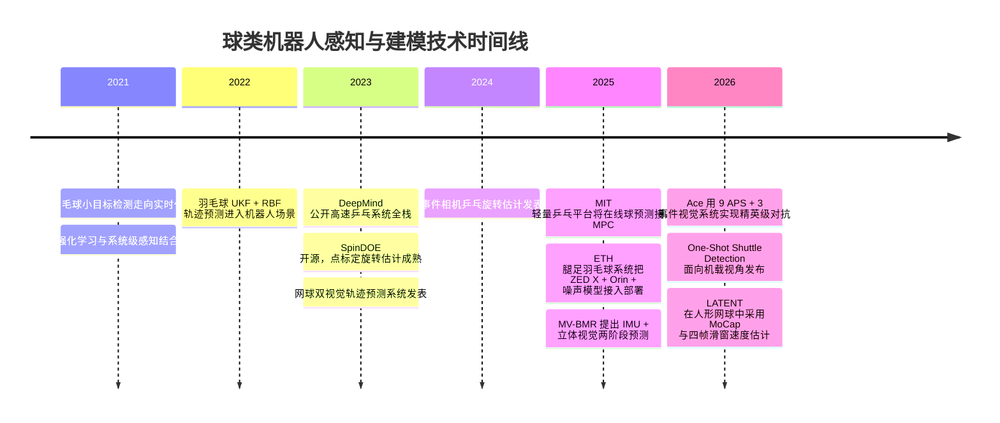

# 网球、乒乓球、羽毛球机器人感知技术栈研究

## 执行摘要

本报告聚焦**网球、乒乓球、羽毛球机器人落地系统**中的核心技术栈，重点回答四个问题：第一，真正可部署的球类机器人在**感知、建模/轨迹预测、控制、系统集成**上到底包含哪些模块；第二，这些模块在近五年代表性论文与官方项目中分别采用了什么方法；第三，这些方法的基本原理、优缺点、实时性代价与工程难点是什么；第四，若要从实验室原型走向“能打、能复现、能维护”的系统，工程上还必须补齐哪些环节。本文以 2021–2026 年、检索截止 **2026-05-06** 的论文、顶会/期刊文章、官方项目主页与开源仓库为主，优先采用原始来源。([nature.com](https://www.nature.com/articles/s41586-026-10338-5))

核心结论可以概括为三条。其一，**乒乓球系统最成熟，羽毛球系统在移动平台上进展最快，网球系统在人形/全场落地上刚出现突破**。乒乓球方向已经形成了以高速多相机/事件相机、DLT/滤波、物理补偿、低时延控制和强化学习为主的成熟栈；羽毛球方向则最强调“移动平台视角”“主动感知”“轨迹预测与机体运动协同”；网球方向在真实世界人形回球方面以 LATENT 为代表开始进入可持续多拍阶段，但感知依赖仍明显更重，例如光学动捕与外部几何参考。([arxiv.org](https://arxiv.org/abs/2309.03315))

其二，真正起决定作用的并不是单个算法名词，而是**时间预算管理**。在高动态球类机器人里，视觉检测是否“准”固然重要，但更关键的是：相机触发时间是否一致，图像传输是否可预测，状态估计是否显式建模延迟，控制器是否知道当前观测落后了多少毫秒。Ace 用九个 APS 相机做 200 Hz 三维定位，再用三套事件视觉 gaze-control system 估计角速度，把空间分辨率、角速度估计和低时延拆成不同子系统；DeepMind 的系统把 perception latency 明确纳入仿真；ETH 的腿足羽毛球系统则直接在系统级把 60 Hz 感知、400 Hz 状态估计和 100 Hz 控制拼合成异步流水线。([nature.com](https://www.nature.com/articles/s41586-026-10338-5))

其三，面向落地实现，完整技术栈至少应包括：**传感器与标定、检测与跟踪、三维重建、速度/旋转估计、状态滤波、物理与学习混合预测、规划与控制、软件中间件、日志与回放、仿真与系统辨识、安全机制、自动化运维**。如果只做“一个检测器”或“一个轨迹网络”，在高动态真实机器人中通常无法独立成立。近五年的领先成果几乎都在强调：必须把感知、预测、控制、硬件、仿真和部署看成一个系统工程。([science.org](https://arxiv.org/html/2505.22974v2))

## 方法与检索策略

本报告优先检索并使用如下来源：arXiv 论文页与 HTML 版、Nature 文章页、Oxford Academic 期刊页、Cambridge University Press 期刊页、GitHub 官方仓库、以及项目方官方博客或项目主页。方法上，我优先选取那些同时满足以下至少两项的工作：一是具备真实硬件部署；二是公开描述了感知或预测流水线；三是给出了系统级性能指标；四是有代码、数据或项目页可供交叉核验。

可信度标准分成三档。**高可信度**指“论文/期刊原文 + 官方项目页/官方仓库”双重可核验，例如 Ace、DeepMind table tennis、ETH badminton、LATENT、TrackNetV3。**中可信度**指只有论文摘要页或仓库 README 能获取核心信息，但系统细节没有完全展开，例如部分网球捡球/双视觉系统。**低可信度**则指只能依赖第三方转述或二手摘要；本报告尽量不采用低可信度来源。由于用户要求的是“技术栈与方法”，所以文中凡是涉及精度、延迟、频率、平台构型等硬指标，均优先使用原论文或官方仓库中的直接描述。([github.com](https://github.com/qaz812345/TrackNetV3))

在表述方式上，本文把“技术栈”拆成四个互相耦合的大模块：**感知层、建模与球路预测层、控制与实时执行层、系统集成与工程落地层**。每个模块都给出：基本原理、主流方法族、典型论文/项目实例、适用场景、优缺点，以及工程实现要点。数学表达采用尽可能通用的写法，复杂度讨论以在线推理/系统部署为目标，而不是仅从训练视角讨论。  

## 技术全景与时间线

从近五年发展脉络看，球类机器人感知与建模技术不是线性演进，而是沿着三条路线同时推进：一条是**固定外部视觉 + 工业机器人**，典型如 DeepMind 和 MIT 乒乓平台；一条是**多相机/事件相机混合的高性能感知系统**，典型如 Ace 与 Tübingen 的旋转估计工作；另一条是**移动机器人/腿足/人形上的“在机感知 + 主动运动”**，典型如 ETH 的 BADMINTON 系统和 LATENT。羽毛球方向还额外发展出了面向机载视角的小目标检测技术，明显不同于广播视频分析路线。([arxiv.org](https://arxiv.org/abs/2505.22974))

下图整理了 2021–2026 之间、与感知—建模—部署直接相关的代表性节点。([academic.oup.com](https://academic.oup.com/jcde/article/10/3/1176/7197436))



如果把整个系统抽象成可部署流水线，其骨架大致如下。真正成熟的系统差异，通常不在于是否包含这些模块，而在于这些模块之间的**时间戳、一致性、容错与降级策略**是否做完整。([arxiv.org](https://arxiv.org/html/2309.03315v2))

```mermaid
flowchart LR
    A[相机 / 事件相机 / IMU / MoCap] --> B[时空同步与标定]
    B --> C[二维检测与分割]
    C --> D[多目三角化 / 单目重建 / 几何约束]
    D --> E[速度与旋转估计]
    E --> F[EKF UKF Particle / 学习融合]
    F --> G[物理模型或混合预测器]
    G --> H[击球点与时机规划]
    H --> I[MPC / RL / 分层控制]
    I --> J[机械臂 / 轮式底盘 / 四足 / 人形]
    J --> K[日志回放 / 误差分析 / 安全回退]
```



## 感知层

### 传感器选型与总体原则

球类机器人感知层的首要目标不是“看清楚球”，而是在**足够早、足够准、时间戳可用**的前提下输出可供控制使用的球状态。不同运动项目的优先级并不一样。乒乓球更强调极短时间窗口与旋转，因此更容易采用高速全局快门相机、事件相机、固定外部多目系统；羽毛球由于飞行距离更长但空气动力学更复杂，且移动平台视角变化更大，所以更强调双目相机、异步状态估计和机载算力；网球则场地更大，真实世界系统常用外部 MoCap、双视觉或“网侧视觉 + 本体视觉”混合方案。([nature.com](https://www.nature.com/articles/s41586-026-10338-5))

#### 各类相机的特点与区别

**全局快门相机（Global Shutter Camera）** 与滚动快门（Rolling Shutter）相对。滚动快门逐行曝光，每行像素的曝光起始时刻不同，高速运动物体会产生"果冻效应"——球被拉伸或倾斜变形，导致 2D 检测位置偏移、三角化误差放大。全局快门则所有像素在同一时刻曝光，图像几何保真度高，是高速球类感知的默认选择。代价是全局快门传感器通常读出噪声略高、成本更贵。DeepMind 的乒乓系统使用 Ximea 全局快门相机，曝光时间控制在 4 ms，并直接输出 raw Bayer 图像以省去去马赛克延迟；Ace 的九个 APS 相机同样是全局快门，以 200 Hz 同步触发。

**事件相机（Event Camera / EVS）** 与传统帧相机的工作原理完全不同。帧相机按固定频率输出整幅图像，而事件相机每个像素独立、异步地报告亮度变化——当某个像素的亮度对数变化超过阈值时，立即输出一个"事件"，包含 $(x, y, t, p)$（坐标、微秒级时间戳、极性）。这带来三个关键优势：一是时间分辨率极高（微秒级），等效帧率可达数千 Hz，远超传统相机的 100–200 Hz；二是只输出变化区域，数据量极小，天然压缩了冗余背景；三是高动态范围（通常 >120 dB），在球场灯光不均匀时不易过曝或欠曝。局限在于：事件相机不输出绝对亮度，无法直接用于传统 CNN 检测器；静止物体不产生事件，需要配合帧相机做初始化。Ace 用三套事件相机 gaze-control system 追踪球上 logo 的角速度，Tübingen 则用事件相机 + ordinal time surfaces + optical flow 做旋转估计，正是利用了事件相机在高速旋转场景下不受运动模糊影响的优势。

**双目相机（Stereo Camera）** 通过两个水平排列的相机模拟人眼视差，利用三角测量原理直接恢复深度。相比单目，双目不需要额外的尺度先验或结构假设，深度估计更几何化、更可解释。ETH 的腿足羽毛球系统使用 ZED X 双目相机，安装在机器人本体上，在 Jetson AGX Orin 上以 60 Hz 运行，将 2D 检测点通过视差转为 3D 坐标后变换到 map frame 中做 EKF 滤波。双目的局限在于：基线（两相机间距）限制了有效测距范围——基线越短，远距离深度误差越大；基线越长，近距离盲区越大。此外，双目对无纹理或重复纹理物体（如纯色球）的立体匹配容易失败，ETH 因此先用 HSV 颜色范围做 2D 粗过滤来辅助匹配。

**多目系统（Multi-camera System）** 是双目思路的扩展，用三台或更多相机从不同视角覆盖更大空间。多目的核心优势是：冗余观测可以抵抗遮挡——即使某个视角的球被球拍或身体遮挡，其他视角仍能提供有效检测；同时多视角三角化的几何精度通常优于双目。代价是系统复杂度、标定工作量和硬件成本成倍增加。Ace 的九个 APS 相机是这一思路的极致：通过 CMA-ES 优化每台相机的镜头、安装高度与朝向，使球在图像中的最小投影半径始终保持在可检测范围内，再以 200 Hz 硬触发同步做广域 3D 三角化。DeepMind 则使用双相机 + DLT 做双目三角化，并通过误差分析优化相机放置位置以最小化 triangulation bias。

**光学动作捕捉（MoCap / Motion Capture）** 使用多个红外相机追踪贴在被测物体上的反光标记点，以亚毫米精度输出 3D 位置和姿态。在球类机器人中，MoCap 通常不用于实时比赛感知，而是作为研发阶段的"真值系统"：为检测器提供高精度标注、为滤波器提供 ground truth 对比、为 sim-to-real 提供误差分析基准。LATENT 在人形网球系统中使用 MoCap 获取球和机器人的精确状态，并用四帧滑窗平均速度作为策略输入。MoCap 的局限很明显：需要贴标记点、需要专用红外相机阵列、场地部署复杂、成本高，无法用于正式比赛。

**APS 相机（Active Pixel Sensor）** 是 CMOS 图像传感器的一种，每个像素内置放大器，相比传统 CCD 具有更低的功耗、更高的读出速度和更好的片上集成能力。在球类机器人语境下，APS 相机通常指高速全局快门 CMOS 相机，Ace 将其用于 200 Hz 广域 3D 定位，并将 2D 检测前置到 FPGA 以加速处理。

下表总结了各类传感器在球类机器人场景中的核心差异：

| 传感器类型 | 时间分辨率 | 空间分辨率 | 深度信息 | 运动模糊 | 数据带宽 | 典型部署 | 代表系统 |
|---|---|---|---|---|---|---|---|
| 全局快门 APS | 100–200 Hz | 高（MP 级） | 需多目 | 低（曝光短） | 高 | 固定外部 | DeepMind、Ace |
| 事件相机 | μs 级等效 | 低–中（QVGA–HD） | 需多目 | 极低 | 极低 | 固定外部 | Ace、Tübingen |
| 双目相机 | 30–60 Hz | 中–高 | 直接视差 | 中（滚动快门常见） | 中 | 机载 | ETH Badminton |
| 多目系统 | 100–200 Hz | 高 | 三角化 | 低 | 极高 | 固定外部 | Ace（9 相机） |
| MoCap | 100–360 Hz | — | 亚毫米 | 极低 | 中 | 固定外部 | LATENT |

选择传感器时，至少要同时评估五个维度：**角分辨率、时间分辨率、感兴趣区域覆盖、链路延迟、与控制回路的耦合方式**。Ace 的解决思路很典型：把“广域 3D 定位”与“高分辨率旋转估计”拆开，前者用九个 APS 相机做 200 Hz 三维定位，后者用三套事件相机 gaze-control system 做角速度估计，再把两者在控制层融合；这说明在极端高速场景下，单一传感器通常难以同时最优地完成所有任务。([nature.com](https://www.nature.com/articles/s41586-026-10338-5))

MIT 的轻量乒乓平台则代表了另一类思想：不追求“复杂多模态”，而追求“**外部视觉稳定 + 在线预测接 MPC**”。该系统依赖外部视觉和在线球预测，把感知前端抽象成末端击球约束，从而把精力集中在轻量高速机械臂与 MPC 上。ETH 的腿足羽毛球系统则采取“在机双目 + 异步感知 + 噪声建模”的思路：机体上装 ZED X 双目相机，感知在 Jetson AGX Orin 上 60 Hz 异步运行，同时在仿真中引入与真实相机一致的噪声模型，使控制策略提前适应真实观测误差。([arxiv.org](https://arxiv.org/html/2505.01617v1))

### 标定、时序同步与延迟补偿

落地系统的第一原则是：**几何标定与时间标定同等重要**。在球类机器人里，常见链路延迟包括：曝光结束时间、相机驱动缓存、USB/以太网传输、GPU 前处理、检测网络推理、三角化/滤波、控制消息下发以及执行器实际起动延迟。DeepMind 的系统之所以有高系统一致性，关键之一就是把 latency 明确拆分建模，并在仿真中对观测历史做插值，生成带延迟的观测用于策略训练；ETH 的腿足羽毛球系统则明确定义了 60 Hz 感知、400 Hz 状态估计与 100 Hz 控制的异步频率结构。([arxiv.org](https://arxiv.org/html/2309.03315v2))

#### 链路延迟逐段拆解

从光子打到相机传感器，到机器人关节真正开始运动，中间经过的每一段都有延迟。按时间顺序：

```
光子到达传感器
    │
    ▼  t_exposure（曝光时间）
曝光结束，电荷读出开始
    │
    ▼  t_readout（传感器读出）
像素数据进入相机内部缓存
    │
    ▼  t_driver（驱动层缓存 + 打包）
数据通过 USB / 以太网开始传输
    │
    ▼  t_transfer（总线传输）
数据到达主机内存（DMA）
    │
    ▼  t_preprocess（GPU 前处理：Bayer→RGB、缩放、归一化）
数据送入检测网络
    │
    ▼  t_inference（神经网络推理）
2D 检测结果输出
    │
    ▼  t_triangulate（三角化 / 滤波）
3D 球状态估计完成
    │
    ▼  t_plan（规划 / 策略推理）
控制命令生成
    │
    ▼  t_command（通信下发：EtherCAT / CAN / USB）
命令到达电机驱动器
    │
    ▼  t_actuate（电机电流环响应 + 机械传动）
关节真正开始转动
```

**各段详解：**

- **曝光时间（t_exposure）**：相机传感器收集光子的时间窗口。曝光越长图像越亮但运动模糊越严重，曝光越短球体边缘越清晰但图像越暗。DeepMind 将曝光控制在 4 ms——乒乓球在 4 ms 内位移约 8 cm（以 20 m/s 计），在图像上产生的运动模糊约 2–3 像素，仍在可接受范围内。
- **传感器读出（t_readout）**：曝光结束后传感器逐行将模拟电荷转为数字信号。全局快门所有行同时曝光但读出仍是逐行的，读出时间取决于传感器分辨率和时钟频率。对于 200 Hz 相机帧周期是 5 ms，读出必须在此时间内完成。高速相机通常用较小的 ROI 来加速读出。
- **驱动层缓存（t_driver）**：相机驱动在操作系统内核或用户态维护环形缓冲区，数据从传感器到驱动缓存再到用户态可访问内存，中间可能经过多次拷贝。DeepMind 省掉 Bayer→RGB 转换就是为了在这一段省掉约 1 ms。
- **总线传输（t_transfer）**：USB 3.0 理论带宽 5 Gbps，一帧 1280×1024 raw Bayer 约 1.3 MB，传输约 1–3 ms。10GigE 可压到 0.5 ms 以下。Ace 用 FPGA 在相机端做 2D 检测预处理，只传输压缩的 detection mask 而非整帧图像，大幅削减此段延迟和带宽。
- **GPU 前处理（t_preprocess）**：图像从 CPU 内存拷贝到 GPU 显存（PCIe 传输），再做缩放、归一化、格式转换，通常 0.5–2 ms。若检测网络能直接消费 raw Bayer（如 DeepMind），前处理几乎为零。
- **神经网络推理（t_inference）**：最大的单段延迟来源。YOLO 类检测器在桌面 GPU 上约 3–10 ms，在 Jetson Orin 等边缘设备上约 10–20 ms。Ace 把 2D 检测前置到 FPGA 用专用硬件加速，压到亚毫秒级。
- **三角化 / 滤波（t_triangulate）**：多目三角化本身很快（0.1–0.5 ms），Kalman Filter 更新步约 0.1 ms。真正的延迟不在这段计算，而在于"等所有相机的检测结果到齐"——如果某个相机检测慢了 5 ms，三角化就得等 5 ms。
- **规划 / 策略推理（t_plan）**：MPC 求解优化问题通常 2–10 ms（MIT 的 FHMPC 为 3.2 ms），RL 策略前向推理通常 1–5 ms。这是第二大单段延迟。
- **通信下发（t_command）**：EtherCAT 总线周期通常 0.5–1 ms，CAN 总线 1–5 ms，USB 串口 1–10 ms。工业机器人用 EtherCAT 是标配。
- **执行器响应（t_actuate）**：电机电流环通常 0.05–0.1 ms，但机械传动（减速器、连杆）的间隙和弹性会产生额外延迟。高扭矩密度电机 + 直驱或低减速比可最小化此段。

**端到端总延迟参考：**

| 系统 | 端到端延迟 | 说明 |
|---|---|---|
| Sony Ace | 10.2 ms | 行业标杆，FPGA 前置 + 硬触发同步 |
| DeepMind | 约 15–25 ms（估计） | 双相机 + raw Bayer + KF |
| ETH Badminton | 60–160 ms（仅感知段） | 机载双目 + Jetson Orin，含检测推理 |
| MIT 乒乓 | 未公开 | FHMPC 3.2 ms，感知延迟另计 |

#### DeepMind 系统延迟建模详解

DeepMind 的乒乓机器人系统是"仿真—现实一致"思想的典范，核心做法拆为四层：

**感知层：双相机 + raw Bayer + DLT + KF。** 两台 Ximea 全局快门高速相机通过硬件同步线缆保证曝光时刻一致，帧率 125 FPS。刻意跳过 Bayer→RGB 转换，直接把 raw Bayer 图像喂给检测网络，省掉约 1 ms 的去马赛克延迟并减少数据传输量（raw Bayer 是 RGB 的 1/3）。在 raw Bayer 图像上直接做球检测输出 2D 球心坐标，再用 DLT 做双目三角化转为 3D 位置，最后用递归 Kalman Filter 平滑 3D 位置并估计速度。相机放置位置通过误差分析优化以最小化 triangulation bias。

**延迟建模：仿真中显式注入延迟。** 这是 DeepMind 系统最关键的工程决策——不在仿真里假设"观测是即时的"。先测量真实系统的端到端延迟（从相机曝光到控制命令生效逐段测量），然后在仿真中复现：仿真器维护一个观测历史缓冲区，当策略请求当前观测时，返回的不是最新状态，而是 $t - \Delta t_{\text{delay}}$ 时刻的状态（通过历史插值得到）。策略在训练中就适应了延迟——因为训练时观测就是"过时的"，策略学会了在信息滞后的条件下做决策，隐式地学会了预测。

```
仿真中的观测生成：

真实球状态时间线:  ... x(t-3)  x(t-2)  x(t-1)  x(t)  x(t+1) ...
                                ↑                    ↑
                          观测历史缓冲区          "真实"当前状态
                                │
                          插值得到 x(t - Δt_delay)
                                │
                          这就是策略"看到"的观测
```

**仿真—现实一致：统一的 Gym 环境接口。** 仿真和真实世界共用完全相同的环境接口（observation space、action space、reward function）。仿真中的物理参数（球台弹性、球拍摩擦、空气阻力）通过**系统辨识**校准到与真实一致——系统辨识是指通过做实验采集真实球的飞行轨迹数据，反推出物理系统的真实参数（如阻力系数 $C_d$、恢复系数 $e_n$、摩擦系数 $\mu$），而非从理论公式直接假设。做法是：用高速相机拍下真实球的飞行轨迹，在仿真里跑同样的初始条件，调整参数让仿真轨迹和真实轨迹尽可能重合，再换一组初始条件验证泛化。策略在仿真中训练，部署到真实机器人时代码零改动——只切换底层从仿真器到真实硬件的 I/O。

**控制层：高频闭环策略。** 策略直接以 125 Hz 接收球状态 + 机器人关节状态，输出关节位置/速度指令。不做显式的轨迹预测 + 规划分离，而是端到端学习"看到球 → 打回去"的映射。训练用 PPO，仿真中大规模并行 rollout。

> DeepMind 的核心思想：**在仿真中精确复现真实世界的延迟和噪声，让策略在训练时就"习惯"了信息滞后，从而在部署时不需要额外的在线补偿。**

#### ETH 腿足羽毛球系统详解

ETH Zurich 的腿足羽毛球系统是"移动平台 + 在机感知 + 全身协调"的代表，核心挑战比固定基座机器人多一个维度：**机器人自己在移动，相机也在晃动**。

**硬件架构：** ZED X 双目相机安装在机器人头部提供机载立体视觉，Jetson AGX Orin 负责所有感知和控制（无外部服务器），执行器为四足机器人（ANYmal 类平台）+ 6-DoF 机械臂 + 羽毛球拍。

**感知流水线：HSV 过滤 → 双目深度 → 坐标变换 → EKF。** 先用 HSV 颜色空间做粗过滤（羽毛球是白色的），缩小搜索区域——这一步很关键，因为双目立体匹配在无纹理区域容易失败，先用颜色把球从背景中分离出来再做视差计算。ZED X 通过左右目视差计算球的 3D 坐标（在相机坐标系下）。然后将相机坐标系下的 3D 点变换到 map frame（世界坐标系）。

**坐标变换详解——机器人如何确定自己在世界坐标系中的位置：** ETH 系统用多种传感器融合来估计机器人的位姿。IMU 以 400 Hz 输出角速度和线加速度，但纯积分会漂移（几秒钟后位置误差可达米级）。腿足里程计利用关节编码器知道足端相对于身体的位置，当足端接触地面时可推算身体相对于地面的移动，漂移比纯 IMU 慢得多。视觉里程计利用 ZED X 双目跟踪环境中的特征点（球场边线、网柱、地面纹理），通过特征点在图像间的移动反推相机（即机器人）的运动。球场几何修正利用已知的球场边线和网柱位置做绝对位置修正——"我看到网柱在我的左前方 3 米，所以我在球场中线的右侧约 2 米处"。这些信息在 EKF 或因子图优化中融合，输出机器人本体在世界坐标系中的 6-DoF 位姿 $T_{\text{world}\leftarrow\text{body}}$。

球的 3D 坐标变换链为：

$$
\mathbf{p}_{\text{world}} = \mathbf{R}_{\text{world}\leftarrow\text{body}} \cdot (\mathbf{R}_{\text{body}\leftarrow\text{cam}} \cdot \mathbf{p}_{\text{cam}} + \mathbf{t}_{\text{body}\leftarrow\text{cam}}) + \mathbf{t}_{\text{world}\leftarrow\text{body}}
$$

其中 $\mathbf{p}_{\text{cam}}$ 是 ZED X 双目直接输出的球在相机坐标系下的 3D 坐标，$T_{\text{body}\leftarrow\text{cam}}$ 是相机到机器人本体的固定变换（安装时标定好，不变），$T_{\text{world}\leftarrow\text{body}}$ 是机器人本体到世界坐标系的变换（**实时变化**，由 SLAM + 传感器融合每时每刻更新）。变换到世界坐标系后，球的轨迹是绝对的——不受机器人自身运动的影响，EKF 在世界系中对球做状态估计，控制器再根据"球在世界系中的未来位置"和"我在世界系中的当前位置"来规划拦截动作。

**EKF 状态估计与 IMU 预测：** 状态估计是指从带噪声的、不完整的观测中推断出系统"真正的状态"。在 ETH 系统中，状态是球的位置和速度 $\mathbf{x} = [p_x, p_y, p_z, v_x, v_y, v_z]^\top$。相机只给位置且有噪声，但控制需要速度来预测球未来会飞到哪。EKF 的职责是从连续多帧的带噪声位置观测中，利用物理模型（球在重力 + 空气阻力下的运动方程）同时估计出平滑的位置和速度——当新观测到达时，比较"模型预测的位置"和"相机观测的位置"，取加权平均，同时修正位置和速度的估计。IMU 预测不是预测球的运动，而是预测机器人本体的运动——在两次视觉观测之间（~16.7 ms），EKF 做了约 6–7 次纯预测步，IMU 在这 2.5 ms 的预测步中提供机器人本体的运动信息（角速度 + 加速度），让 EKF 能正确区分"球在飞"和"我在动"。

**异步频率结构的设计逻辑：** 60/400/100 Hz 是 ETH 团队的工程设计选择，由硬件能力、算法计算量、物理响应速度三者折中决定。感知 60 Hz 受限于 ZED X 双目深度计算 + HSV 过滤 + 检测推理在 Jetson AGX Orin 上的算力上限（换更强的机载计算机可推到 100–200 Hz，但功耗和重量不允许）。状态估计 400 Hz 是因为 ETH 使用的 IMU 以 400 Hz 原生输出数据，EKF 在每个 IMU 采样点做一次预测步是最自然的做法——IMU 来一个数据就推一次状态，不需要降采样或插值。控制 100 Hz 是计算与机械响应的平衡点——比感知快（不等视觉），比状态估计慢（RL 策略推理需要时间，100 Hz = 10 ms 一帧刚好够），同时四足机器人的关节伺服通常为 1 kHz，100 Hz 的策略输出可以平滑插值到 1 kHz 的关节指令。

**仿真中的噪声建模：** ETH 的做法和 DeepMind 异曲同工但更侧重观测噪声。先测量真实 ZED X 相机的 3D 定位误差分布（均值、方差、与距离的关系），在仿真中注入匹配的噪声——仿真器输出的球位置加上与真实相机统计特性一致的噪声再喂给策略。同时做 dynamics randomization（随机化球拍质量、关节摩擦、地面摩擦等物理参数），让策略在训练中就"见过"真实噪声，部署时不会因观测质量下降而崩溃。

**全身协调：** 策略必须同时学会移动到拦截点（locomotion）、保持平衡（stability）、挥拍击球（manipulation）——三者互相耦合，不能分开训练。观测空间包含球状态（EKF 输出）+ 机器人全身关节状态 + 本体线速度/角速度（IMU）+ 足底接触力，动作空间为全身关节位置目标（四足 12 个 + 机械臂 6 个 = 18+ DoF），用 Isaac Gym 大规模并行仿真 + PPO 训练。

**时间预算：** ETH 实测羽毛球平抽总飞行时间 500–1000 ms，感知模块注册到可拦截轨迹平均需要 357 ms（已经过去了 35%–70%），留给全身运动 + 挥拍约 654 ms。在这 654 ms 内四足机器人需要完成锁定拦截点 → 移动底盘到位（可能 1–2 米）→ 抬起手臂 → 挥拍击球，这就是为什么必须把状态估计推到 400 Hz、控制推到 100 Hz——每一毫秒都在和时间赛跑。

> ETH 的核心思想：**机载双目 + 异步三层频率架构 + 仿真噪声注入 + 全身统一 RL，让移动腿足机器人在真实羽毛球场景中实现感知—移动—击球的闭环。**

几何上，多相机体系一般需要完成四类标定：**相机内参、相机-相机外参、相机到世界/球台/球场外参、传感器到机器人本体外参**。DeepMind 在双相机乒乓系统中使用 DLT 进行双目三角化，并明确提到需要考虑 triangulation bias，因此连相机放置位置都通过误差分析来优化。Ace 则不仅在几何上预标定九个相机，还通过 CMA-ES 优化镜头、安装高度与朝向，使得球在图像中的最小投影半径保持在可检测范围内。ETH 羽毛球系统则进一步把双目位置估计变换到由 SLAM 与传感器融合维护的 map frame 中，再在该世界系内进行 EKF 滤波与截击点计算。([arxiv.org](https://arxiv.org/html/2309.03315v2))

时间同步方面，工程上常见的策略有三种。第一种是**硬触发同步**，例如 DeepMind 的 Ximea 双相机使用硬件同步线缆；Ace 则用 200 Hz trigger signal 同步九台相机与机器人执行器。第二种是**固件时间戳 + 后端时钟校正**，ETH 依赖 ZED X 同步图像时间戳，并在世界系转换时显式使用时间信息。第三种是**软件对齐 + 状态插值/外推**，即使没有硬触发，也要在滤波器中把不同模态视为异步测量。这个问题在羽毛球里特别尖锐，因为 MV-BMR 指出平抽与低平球的飞行时间经常只有 500–1000 ms，而 ETH 实测从对手击球到生成可拦截轨迹的平均时间就已经达到 0.357 s。([nature.com](https://www.nature.com/articles/s41586-026-10338-5))

### 二维检测、分割与跟踪

对于球类机器人，单帧检测器很少孤立使用。更可行的做法是把**单帧检测、短时跟踪、轨迹修复、重初始化**组合成一套流水线。DeepMind 的乒乓感知系统用两个全局快门高速相机直接输入 raw Bayer 图像，并刻意省掉 Bayer→RGB 转换，以减少约 1 ms 的延迟和更多的数据传输开销；每路图像先给出 2D 检测，再用 DLT 三角化和 Kalman filter 形成 3D 轨迹状态。Ace 则把每个 APS 相机上的 2D 检测前置到 FPGA，加速输出压缩的 detection mask，再交给中央服务器做 3D 三角化。([arxiv.org](https://arxiv.org/html/2309.03315v2))

#### DeepMind 感知流水线详解

DeepMind 论文将感知系统拆为三个组件：**2D 球检测（双相机独立运行）、DLT 三角化恢复 3D 位置、递归 Kalman Filter 精化球状态**。以下逐一展开。

**相机硬件与同步：** 系统使用两台 Ximea MQ013CG-ON 相机，通过硬件同步线缆保证曝光时刻一致，USB3 有源光缆连接主机。相机以 125 FPS 运行，分辨率 1280×1024，传感器延迟仅 838 μs。采用全局快门 + 4 ms 短曝光时间，只输出 raw Bayer 图像（不做去马赛克）。镜头为 Fujinon FE185C086HA-1 鱼眼镜头，安装在球台两侧上方约 2 m 处，以覆盖整个比赛区域。

**相机布局优化——三角化偏差分析：** 论文专门对比了两种双目配置：两台相机安装在球台同侧 vs 安装在球台对侧。通过仿真量化三角化偏差（triangulation bias），发现**对侧安装**使偏差降低一个数量级——因为对侧视角更接近正交，几何约束更强。此外，对侧配置的基线更长，也有利于降低估计方差。这一分析说明相机位置不是随便放的，而是通过误差建模来优化的。

**2D 球检测——时序卷积架构：** 检测网络是一个紧凑的 CNN，仅 27k 参数，包含五层空间卷积和两层时序卷积。输出结构借鉴 CenterNet，每个像素位置预测三个量：球心置信度（ball score）、亚像素偏移（2D local offset）、球速估计（2D velocity in pixels）。时序卷积用于捕捉运动线索——球在飞，静止背景中的运动物体就是球——这比纯空间特征更鲁棒。

**直接处理 Bayer 图像：** 检测网络直接消费 raw Bayer 格式，跳过 Bayer→RGB 转换。论文指出这省掉了每路相机约 1 ms 的转换延迟（占帧间间隔 8 ms 的 15%），同时数据传输量减少 2/3（raw Bayer 只有一个通道，RGB 有三个）。与其他使用 Bayer 图像的工作不同，DeepMind 没有发现性能损失，原因在于他们对 $2 \times 2$ Bayer 模式的卷积步长做了特殊设计，避免了颜色混叠。

**缓冲时序卷积——推理时只需单帧：** 通常时序卷积需要在每个时间步输入一个帧窗口，但 DeepMind 的实现通过内部缓冲区存储上一时间步的特征图，推理时只需输入当前单帧。这大幅减少了主机到加速器（GPU）的数据传输量——这是吞吐量的关键瓶颈。缓冲区在每次卷积后更新，下一时间步自动使用。

**训练策略——局部 Patch 训练：** 检测器不是在全图上训练的，而是从视频流中裁剪出 230 万个 $64 \times 64 \times n$ 帧的小 patch（$n$ 为帧数，匹配网络感受野）。正样本 patch 包含球，负样本从背景随机采样。这种局部 patch 训练有三个好处：训练时间减少 50 倍（因为 patch 比全图小得多）、天然解决类别不平衡（正负样本比例可控）、网络只学习局部特征而不依赖全局背景。每个 patch 的三个输出各有对应损失：球心置信度用二值交叉熵，亚像素偏移用 MSE（目标为像素坐标到球心的相对位置），速度预测同样用 MSE（目标为下一帧球心相对于当前帧的位置）。

**3D 跟踪——DLT + Kalman Filter：** 当两路图像的球心置信度都超过学习到的阈值时，利用检测器输出的当前位置（2D 坐标 + 亚像素偏移）和下一帧预测位置（2D 坐标 + 速度预测），通过 DLT 分别三角化出 3D 位置和 3D 速度。这两个 3D 观测送入递归 Kalman Filter，精化后的球状态（3D 位置）最终发给机器人策略。Kalman Filter 在这里的作用是平滑和去噪——单帧三角化结果有噪声，多帧滤波后更稳定。

**真实部署中的观测生成：** 仿真中所有物体的状态已知且可按固定间隔查询，但真实环境中不同传感器以不同频率产生观测（球感知、ABB 机器人、Festo 直线电机），可能不准确或到达时间不规则。DeepMind 的做法是将所有传感器观测连同时间戳一起缓冲，对环境步长时间戳做插值或外推，再经过带通滤波器去噪后转换为策略观测格式。论文实测了各组件的延迟分布（均值 ± 标准差）：球观测 40 ± 8.2 ms、ABB 观测 29 ± 8.2 ms、Festo 观测 33 ± 9.0 ms、ABB 动作 71 ± 5.7 ms、Festo 动作 64.5 ± 11.5 ms。这些延迟值被显式建模为高斯分布，在仿真中每 episode 采样一次，使策略在训练中就适应了真实延迟。

#### 工程组合法：四模块感知流水线
羽毛球方向的技术谱系更丰富，主要有三条线。

**第一条：YOLO/改进 YOLO 路线**[¹](#ref-shuttle-detection)，用于移动机器人场景的快速检测与重置初始化。One-Shot Shuttle Detection 明确针对"非静态机器人视角"的痛点，建立了 20,510 帧、11 个背景场景的数据集，并以 YOLOv8 为基础达到 F1 0.86（与训练环境相似）和 0.70（完全未见环境）的检测表现。→ [ball-detector Skill](../../skills/ball-detector/SKILL.md) · [eth-shuttle-detection Recipe](../../skills/ball-detector/recipes/eth-shuttle-detection/RECIPE.md)

**第二条：TrackNet/TrackNetV3 路线**[²](#ref-tracknet)，把连续帧信息编码为热图或轨迹预测，再用修复网络补全遮挡。TrackNetV3 给出 Accuracy 97.51%、F1 98.56%、25.11 FPS，并明确由"trajectory prediction + trajectory rectification"两阶段组成。→ [ball-tracker Skill](../../skills/ball-tracker/SKILL.md)

**第三条：MonoTrack 路线**[³](#ref-monotrack)，它不再局限于单点检测，而是把广播视频中的 2D/3D 轨迹重建做成端到端系统，更适合离线分析和弱监督几何重建。注意：MonoTrack 目前未见公开代码仓库，但论文详细描述了完整 pipeline（场地识别→2D 轨迹估计→击球识别→3D 重建），可参考其方法自行实现。→ 本项目：暂未实现，可作为未来 Recipe 添加

如果把这些方法放进机器人系统语境里比较，YOLO/YOLOv8 的优势是**重初始化、视角迁移与在机实时性**；TrackNet 的优势是**连续轨迹与遮挡鲁棒性**；MonoTrack 的优势是**单目场景下恢复 3D 结构的能力**。

工程上，比较常见的组合法是将感知任务拆为四个独立但协作的模块，形成一条从原始图像到 3D 球状态的完整流水线：

```
原始图像 → [单帧 Detector] → 2D 球心坐标 → [短轨迹网络] → 平滑 2D 轨迹 → [滤波器] → 时域平滑状态 → [几何模块] → 3D 位置/速度
                ↑ [ball-detector]            ↑ [ball-tracker]           ↑ [ball-state-estimator]  ↑ [ball-geometry]
```

**模块一：单帧 Detector（发现与重定位）**[¹](#ref-shuttle-detection) → [ball-detector Skill](../../skills/ball-detector/SKILL.md) · [eth-shuttle-detection Recipe](../../skills/ball-detector/recipes/eth-shuttle-detection/RECIPE.md) · [hsv-quickstart Recipe](../../skills/ball-detector/recipes/hsv-quickstart/RECIPE.md)

这是流水线的入口，负责在每一帧独立地输出球的 2D 位置。它的核心职责是"发现"——当球首次进入视野、从遮挡中重新出现、或跟踪丢失后恢复时，单帧 detector 是唯一能重新锁定目标的模块。因为它不依赖历史信息，所以天然适合初始化和重定位。

典型实现是 YOLOv8 等轻量检测器。One-Shot Shuttle Detection 论文中，YOLOv8 被约束为每帧最多输出一个检测框（NMS max_det=1），因为比赛场景中只有一颗羽毛球。输入分辨率 1024 像素，在保持宽高比的前提下平衡精度与速度。训练时混入 1000 张 COCO 背景图（无球场景），迫使模型学会区分"球不存在"和"球没检测到"。

**模块二：短轨迹网络（连续跟踪）**[²](#ref-tracknet) → [ball-tracker Skill](../../skills/ball-tracker/SKILL.md)

单帧 detector 的输出是离散的、有噪声的坐标序列。短轨迹网络的作用是在连续几帧之间建立时序关联，输出平滑的 2D 轨迹。它利用运动连续性来抵抗单帧误检和短暂遮挡。

典型实现是 TrackNet 系列。TrackNet 输入连续 3 帧（9 通道），输出一张高斯热图，热图峰值即球的 2D 位置。因为网络同时看到前后帧，即使中间帧球被遮挡，也能根据运动趋势推断位置。TrackNetV3 进一步将流程拆为两阶段：trajectory prediction（预测完整轨迹热图）→ trajectory rectification（用 inpainting 修复遮挡缺口），使遮挡鲁棒性大幅提升。

**模块三：滤波器（时域平滑）** → [ball-state-estimator Skill](../../skills/ball-state-estimator/SKILL.md)

短轨迹网络输出的 2D 轨迹仍然包含高频抖动。滤波器的作用是用物理运动模型对轨迹做时域平滑，同时估计无法直接观测的状态量（如速度、加速度）。

典型实现是 Kalman Filter 及其变体。在球类场景中，滤波器通常采用恒速或恒加速运动模型做预测步，用 detector 输出的 2D 坐标做更新步。滤波后的状态向量 $[\mathbf{p}, \mathbf{v}]$ 比原始检测结果更平滑、更稳定，且直接给出了速度估计——这对后续的 3D 重建和击球时机预测至关重要。

**模块四：几何模块（3D 重建）** → [ball-geometry Skill](../../skills/ball-geometry/SKILL.md)

当系统有多个相机时，几何模块将各相机的 2D 滤波结果通过三角化（DLT 或中点法）映射到 3D 世界坐标系。单目场景下则需要借助场地几何约束（如已知球场尺寸、球网高度）或物理模型（如抛物线假设）来恢复深度。

典型实现：DeepMind 用 DLT 对双目 2D 检测结果做三角化，得到 3D 位置和 3D 速度后再送入 Kalman Filter 精化；ETH 则先用 HSV 颜色筛选得到 2D 点，再通过 ZED X 双目深度图直接读取 3D 坐标，最后在 map frame 中用 EKF 融合。

**四模块的协作关系：** 这四个模块不是简单的串行管道，而是有反馈回路的。当短轨迹网络的置信度下降（如连续多帧检测不到球），系统会触发重初始化，回退到单帧 detector 重新搜索。滤波器则持续运行，即使 detector 短暂丢失目标，也能靠预测步维持状态估计。几何模块的输出又可以反投影到图像平面，作为 detector 下一帧的搜索先验，缩小检测范围、降低误检率。→ [ball-perception Plugin](../../plugins/ball-perception/AGENTS.md) · [eth-badminton-perception Recipe](../../plugins/ball-perception/recipes/eth-badminton-perception/RECIPE.md)

#### ETH shuttle_detection 仓库组织与实现[⁴](#ref-shuttle-detection-repo)

> **本项目已将此方案实现为 Recipe**：[eth-shuttle-detection Recipe](../../skills/ball-detector/recipes/eth-shuttle-detection/RECIPE.md)

ETH 的 shuttle_detection 仓库完整实现了上述流水线中"单帧 detector"模块的全生命周期，从数据生产到模型部署形成闭环。仓库采用 Docker 容器化方案，所有依赖（Ultralytics YOLOv8、OpenCV、PyTorch 等）封装在 Docker 镜像中，用户无需手动配置 Python 环境。

**目录结构与模块划分：**

```
shuttle_detection/
├── docker-compose.yml          # 容器编排，定义 shuttletrack 服务
├── Dockerfile                  # 基于 PyTorch 官方镜像，安装 ultralytics 等依赖
├── pyproject.toml              # Python 包配置，入口点注册 CLI 命令
├── src/shuttletrack/
│   ├── __init__.py             # 包初始化
│   ├── config.py               # 全局配置（模型参数、路径、超参）
│   ├── autogen_labels.py       # 自动标注流水线
│   ├── convert_labels.py       # CVAT 标注 → YOLO 格式转换
│   ├── combine_datasets.py     # 多数据集合并
│   ├── select_coco.py          # COCO 背景图采样
│   ├── train.py                # YOLOv8 训练入口
│   ├── eval.py                 # 评测入口（背景/地点交叉验证）
│   ├── predict.py              # 推理入口（单帧检测）
│   └── utils.py                # 通用工具函数
└── runs/                       # 训练输出（权重、日志、预测结果）
```

**完整工作流（五阶段）：**

**阶段一：自动标注（autogen_labels.py）**

这是仓库最具特色的模块。传统标注需要人工逐帧画框，而该仓库实现了论文中描述的自动标注流水线，将人工工作量降低约 85%：

1. **GMM 背景减除**：利用 OpenCV 的 `cv2.createBackgroundSubtractorMOG2()` 对静止相机视频做前景分割，提取运动区域（红色 mask）
2. **对手移除**：用 YOLOv8-seg 分割对手球员区域（蓝色 mask），从前景中排除——因为球员也在运动，但我们要找的是球
3. **行人过滤**：排除图像下半部分的小型连通分量（行人腿部误检）
4. **候选排序**：剩余候选按时间一致性（与前一帧检测位置的距离）和 blob 面积排序，选出最可能是球的区域
5. **输出 CVAT 归档**：生成 `.zip` 文件，可直接导入 CVAT 进行人工校验和修正

论文报告该流水线正确标注了 85.7% 的帧，8.3% 仅需微调边界框，5.9% 需手动修正（主要在对手回球瞬间）。

**阶段二：标注转换（convert_labels.py）**

CVAT 导出 YOLO 格式的标注后，该脚本将其转换为 Ultralytics YOLO 标准数据集结构，并按 difficulty 分为 easy/medium/hard 三个子集。所有数据放入 `./train` 子目录，训练/验证/测试的划分在代码中动态控制，便于交叉验证。

**阶段三：训练（train.py）**

基于 Ultralytics YOLOv8 的 `model.train()` API，关键配置包括：
- 模型：`yolov8n.pt`（nano 版本，最小最快）
- 输入分辨率：1024 像素（在 config.py 中可调，论文做了 640–1408 的 sweep）
- 数据增强：mosaic、平移、缩放、HSV 色彩抖动、mixup、翻转（论文指出 mixup 对 recall 提升最大，从 0.68 到 0.78）
- NMS 约束：`max_det=1`（每帧最多一个检测）
- 训练数据：仅使用 easy + medium 难度样本（占 95.9%），排除 hard 样本以减少噪声标签干扰
- 背景负样本：从 COCO 数据集随机采样 1000 张无球图像混入训练集
- 日志：集成 W&B (Weights & Biases) 进行实验追踪

**阶段四：评测（eval.py）**

实现了论文中的两种交叉验证策略：
- **Background-based CV**：11 折，每次留一个背景做测试，其余训练——评估对相似环境的泛化
- **Location-based CV**：5 折，每次留一个地点的所有背景做测试——评估对完全未知环境的泛化

评测指标使用论文提出的距离精度（Distance Precision Rate）：预测框中心与真值框中心的欧氏距离 ≤ 25 像素即为 True Positive，而非传统的 IoU 阈值。这是因为下游任务（轨迹估计）更关心球心位置而非框的重叠度。

**阶段五：推理（predict.py）**

加载训练好的模型权重，对任意图像文件夹做批量推理，输出 CSV 文件（包含每张图的检测框坐标和置信度）。推理时同样约束 `max_det=1`。

**设计亮点总结：**

| 设计决策 | 具体做法 | 动机 |
|---|---|---|
| Docker 化 | 所有依赖封装在容器中 | 消除环境配置差异，一键复现 |
| CLI 入口 | 每个阶段独立命令（`shuttletrack.train` 等） | 模块解耦，可单独运行任一阶段 |
| 自动标注 | GMM + YOLOv8-seg + 时序过滤 | 将标注成本从数周降至数小时 |
| CVAT 集成 | 自动标注输出直接导入 CVAT | 利用成熟工具做人工校验，而非自建标注界面 |
| 难度分级 | easy/medium/hard 三级 | 训练时排除 hard 噪声，评测时分析难度相关性能 |
| 交叉验证 | 背景级 + 地点级两种 CV | 系统评估泛化能力，而非单一 train/test split |
| COCO 负样本 | 混入 1000 张无球背景图 | 降低误检（False Positive），让模型学会"球不存在" |
| W&B 集成 | 训练日志自动上传 | 实验可追溯、可对比 |

### 三维定位、速度估计与旋转估计

#### 三维定位
三维球状态最基础的输出是 $\mathbf{x}_t=[\mathbf{p}_t,\mathbf{v}_t]$，进一步可扩展到 $[\mathbf{p}_t,\mathbf{v}_t,\boldsymbol{\omega}_t]$。多目场景中，常见做法是通过相机投影方程逆求 3D 点，最简单可写为

$$
\mathbf{p}_t = \operatorname{Triangulate}\big(\pi_1^{-1}(u_1,v_1),\pi_2^{-1}(u_2,v_2)\big),
$$

其中 $\pi_i$ 是第 $i$ 台相机模型。三个代表性系统在"2D → 3D"这一步上的做法差异显著，下面逐一展开。

**DeepMind：DLT 双目三角化 + 递归 Kalman Filter**[⁵](#ref-deepmind)

DeepMind 的乒乓球系统采用两台 Ximea 高速相机（125 FPS），硬件同步触发确保两帧时间戳严格对齐。2D 检测使用一个仅 27k 参数的时序 CNN，直接处理 Raw Bayer 图像（跳过 demosaicing 节省约 1 ms），输出球的像素坐标。三角化采用经典的 DLT（Direct Linear Transform）方法：

1. 对每个 2D 检测点 $(u_i, v_i)$，根据相机投影矩阵 $\mathbf{P}_i = \mathbf{K}_i[\mathbf{R}_i | \mathbf{t}_i]$ 构建线性约束方程 $\mathbf{A}\mathbf{X} = 0$
2. 对 $\mathbf{A}$ 做 SVD 分解，取最小奇异值对应的右奇异向量作为 3D 点 $\mathbf{X}$ 的齐次坐标
3. 将 3D 点送入离散 Kalman Filter，状态向量 $\mathbf{x} = [\mathbf{p}, \mathbf{v}]$，运动模型为恒速模型

整个感知链路延迟约 8–11 ms，其中 DLT 本身 < 0.1 ms，瓶颈在 2D 检测的 CNN 推理。DLT 的优势是几何意义清晰、计算量极小，但严格要求相机外参标定准确，且对 2D 检测噪声敏感——当球远离相机或检测框偏移几个像素时，3D 误差可能放大到厘米级。

**Ace：广域 9-APS 三角化 + 3-EVS 角速度估计**[⁶](#ref-ace)

Ace 的感知系统是当前球类机器人中最复杂的，核心思路是"空间分辨率与角速度估计分治"：

- **3D 定位**：9 台 APS（Active Pixel Sensor）全局快门相机以 200 Hz 同步采集，覆盖整个球场。每台相机独立做 2D 检测（轻量 CNN），然后多视角 2D 点通过 DLT 三角化得到 3D 位置。9 台相机的冗余设计使得即使部分相机遮挡或检测丢失，仍能维持稳定定位。最终 3D 定位精度达 3.0 mm，感知延迟 10.2 ms。
- **角速度估计**：3 套事件视觉 gaze-control system（每套含可转镜面、可调焦镜头和事件传感器）独立追踪球上的 logo。事件流以异步方式输出像素级亮度变化，不受帧率限制，角速度估计频率可达 400–700 Hz。两种算法并行运行：低延迟 CNN（快速但精度稍低）和高精度 CMax（稍慢但不确定度更小），系统根据置信度自动切换。
- **融合**：3D 位置和角速度在下游统一到球的状态向量 $[\mathbf{p}, \mathbf{v}, \boldsymbol{\omega}]$，送入策略网络。

这套系统的代价是硬件成本极高（9+3 相机 + FPGA + 专用计算），且标定和维护复杂度远超双目方案。

**ETH：HSV 颜色过滤 + ZED X 双目深度 + EKF**[⁷](#ref-eth-badminton)

ETH 的腿足羽毛球系统面向移动平台，感知方案必须在机载计算（Jetson AGX Orin）上实时运行，因此选择了更轻量的路线：

1. **2D 检测**：用 HSV 颜色阈值过滤（而非 YOLO），在受控光照下对黄色羽毛球做前景分割。HSV 方法延迟 < 2 ms，但泛化能力有限——换场地或光照变化时需重新标定颜色范围。
2. **3D 重建**：利用 Stereolabs ZED X 双目相机的硬件深度图，直接从 2D 检测点读取 3D 坐标，而非通过 DLT 三角化。ZED X 内置立体匹配，输出 30 FPS 的深度图，省去了手动标定外参的步骤。
3. **状态估计**：3D 点从相机坐标系转换到 map frame（利用机器人的里程计），然后送入 EKF（Extended Kalman Filter）。EKF 的状态向量 $[\mathbf{p}, \mathbf{v}]$，预测步使用含空气阻力和重力的非线性运动模型（而非简单的恒速模型），更新步用 ZED X 的 3D 观测修正。EKF 以 400 Hz 运行，远高于感知的 60 Hz，在检测丢失时靠预测步维持状态估计。

整个感知-估计-控制流水线为 60 Hz 感知 → 400 Hz 状态估计 → 100 Hz 控制，感知延迟 60–160 ms（含图像传输和深度计算）。这套方案的核心权衡是：用 HSV + 双目深度换取低计算开销和部署简便，代价是颜色过滤在复杂背景下需谨慎，且双目深度的精度（约 1–3 cm）不如多目 DLT（约 3 mm）。

#### 速度估计
速度估计的最朴素方法是有限差分：

$$
\mathbf{v}_t \approx \frac{\mathbf{p}_t-\mathbf{p}_{t-1}}{\Delta t}.
$$
但高动态球类里，位置噪声会被差分显著放大，因此实际系统通常采用**滑窗平均或滤波器内隐估计**。具体来说，有三种典型做法：

**方法一：滑窗平均速度（LATENT）**[⁸](#ref-latent)

LATENT 系统指出，有限差分速度 $\hat{\mathbf{v}}_t = (\mathbf{p}_t - \mathbf{p}_{t-1})/\Delta t$ 的噪声方差为 $\sigma_v^2 = 2\sigma_p^2 / \Delta t^2$——当 $\Delta t = 20$ ms、位置噪声 $\sigma_p = 5$ mm 时，速度噪声可达 $\sigma_v \approx 0.35$ m/s，这对需要精确击球时机的策略网络来说是不可接受的。

LATENT 的解决方案是 4 帧滑动窗口平均：

$$
\hat{\mathbf{v}}_t = \frac{1}{N-1} \sum_{i=1}^{N-1} \frac{\mathbf{p}_{t-i+1} - \mathbf{p}_{t-i}}{\Delta t}, \quad N=4
$$

这等价于对最近 4 帧的逐帧差分速度取平均，噪声方差降低为 $2\sigma_p^2 / ((N-1)\Delta t^2)$，即单帧差分的 $1/(N-1) = 1/3$。代价是引入了约 $(N-1)\Delta t / 2 = 30$ ms 的额外延迟（因为要等 4 帧到齐），且平均操作会平滑掉真实的加速度变化。LATENT 在 50 Hz 的 planner/control 循环中使用这个平均速度作为策略输入。

**方法二：Kalman Filter 内隐速度估计（DeepMind / ETH）**[⁵](#ref-deepmind)[⁷](#ref-eth-badminton)

Kalman Filter 的状态向量直接包含速度 $\mathbf{x} = [\mathbf{p}, \mathbf{v}]$，速度不是通过差分显式计算的，而是通过预测-更新循环隐式估计的：

- **预测步**：$\hat{\mathbf{x}}_{k|k-1} = \mathbf{F}\hat{\mathbf{x}}_{k-1|k-1}$，其中状态转移矩阵 $\mathbf{F}$ 编码了运动模型（恒速 CV 或含阻力的非线性模型）。预测步给出的速度估计是上一时刻速度的延续，加上运动模型的预测修正。
- **更新步**：$\hat{\mathbf{x}}_{k|k} = \hat{\mathbf{x}}_{k|k-1} + \mathbf{K}_k(\mathbf{z}_k - \mathbf{H}\hat{\mathbf{x}}_{k|k-1})$，其中观测 $\mathbf{z}_k$ 仅包含位置。Kalman 增益 $\mathbf{K}_k$ 会自动将位置残差分配到位置和速度两个状态分量上——如果连续多帧位置观测都偏右，KF 会同时修正位置和增加右向速度。

这种隐式估计的优势是：速度估计的噪声水平由 KF 的协方差矩阵 $\mathbf{P}$ 控制，而非简单的差分放大；且在检测丢失时，预测步仍能给出合理的速度估计（靠运动模型外推）。DeepMind 的 CV Kalman Filter 和 ETH 的 EKF（含空气阻力项）都采用这种方式。

**方法三：位置历史隐式恢复速度（ETH prediction-free）**[⁷](#ref-eth-badminton)

ETH 的 prediction-free 策略不显式输出速度，而是把最近若干帧的位置历史 $\{\mathbf{p}_{t}, \mathbf{p}_{t-1}, \ldots, \mathbf{p}_{t-N+1}\}$ 直接作为策略网络的输入。策略网络（通常是一个 MLP 或小型 Transformer）在训练过程中自动学会从位置序列中提取速度和趋势信息——这本质上是一种数据驱动的速度估计，等价于让网络自己学习一个"可微分的差分+滤波"操作。

这种做法的优势是：不需要手动设计滤波器参数（如 KF 的 $\mathbf{Q}$、$\mathbf{R}$ 矩阵），网络可以根据数据自适应地决定对历史帧的信任程度。劣势是：策略网络需要更多训练数据来学会速度估计，且速度估计的质量难以独立评估和调试——它被嵌入在策略网络的隐层中，不像 KF 那样可以直接检查协方差矩阵来判断估计是否可靠。

#### 旋转估计
旋转估计是乒乓球方向最难也最有代表性的感知模块。旋转（角速度 $\boldsymbol{\omega}$）无法从单帧位置直接观测，必须依赖时序信息或球的表面特征。当前主流路线可分为三类：

**第一类：事件相机旋转估计**[⁹](#ref-tuebingen-spin)[⁶](#ref-ace)

传统帧相机在捕捉高速旋转时面临两个根本性障碍：一是运动模糊——乒乓球转速可达 3000 rpm（50 rev/s），在 125 FPS 相机的 8 ms 曝光时间内球已转过约 1.4 圈，logo 完全模糊不可辨；二是带宽瓶颈——要捕捉旋转需要极高帧率，但高帧率意味着每帧曝光时间更短、噪声更大，且数据传输量线性增长。

事件相机（Event Camera / DVS）从根本上绕过了这两个障碍。它不输出整帧图像，而是对每个像素独立输出"亮度变化超过阈值"的异步事件流 $(x, y, t, \text{polarity})$，时间精度达微秒级。Tübingen 的 2024 CVPRW 工作建立了如下链路：

1. **Ordinal Time Surface**：将事件流编码为"时间面"——每个像素记录最近一次事件的时间戳，形成一张时间图。旋转的球表面纹理会产生特定的时间梯度模式。
2. **事件光流提取**：从时间面的梯度中计算事件光流（event-based optical flow），即球表面每个点的表观运动方向和速度。
3. **角速度回归**：球表面光流场与角速度 $\boldsymbol{\omega}$ 之间存在几何约束关系 $\mathbf{v}_{\text{flow}} = \boldsymbol{\omega} \times \mathbf{r}$（其中 $\mathbf{r}$ 是球面点到球心的向量），通过最小二乘或神经网络回归得到 $\boldsymbol{\omega}$。

Ace 将这条路线系统化并推向实用：3 套事件视觉 gaze-control system 各自包含可转镜面（快速跟踪球的位置）、可调焦镜头（保持球在视野中足够大）和事件传感器。两套算法并行运行：

- **低延迟 CNN**：将事件流累积为短时窗（约 1 ms）的事件帧，送入轻量 CNN 直接回归角速度，延迟约 2–3 ms，适合实时控制。
- **高精度 CMax**：基于对比度最大化（Contrast Maximization）框架，搜索使事件对齐最优的旋转参数，精度更高但计算量更大（约 10 ms），适合需要高精度角速度的场景。

系统根据实时置信度在两种算法间切换，角速度估计频率可达 400–700 Hz，远超帧相机的任何方案。

**第二类：带标记球的几何姿态估计**[¹⁰](#ref-spindoe)

SpinDOE（Spin Detection and Estimation）走了一条完全不同的路线——不依赖事件相机，而是利用球表面的标记点（logo、品牌文字等）做几何姿态估计：

1. **球面点模式识别**：在检测到球之后，进一步检测球面上的标记点（如三星 logo 的三个角点）。这些标记点在球面上的相对位置是已知的（球的直径 40mm，logo 尺寸可测量），构成一个已知的 3D 点模式。
2. **点身份匹配**：将图像中检测到的 2D 标记点与 3D 模型中的已知点做匹配（Perspective-n-Point, PnP 问题）。这一步的难点是遮挡——球在旋转过程中 logo 可能部分不可见，需要鲁棒的匹配算法。
3. **相邻姿态回归**：从连续两帧的球姿态 $\mathbf{R}_t$ 和 $\mathbf{R}_{t+1}$ 计算相对旋转 $\Delta\mathbf{R} = \mathbf{R}_{t+1}\mathbf{R}_t^{-1}$，再转换为角速度 $\boldsymbol{\omega} = \text{axis}(\Delta\mathbf{R}) \cdot \text{angle}(\Delta\mathbf{R}) / \Delta t$。

SpinDOE 同时开放了 CAD stencil（用于制作带已知标记的测试球）和轨迹数据集，非常适合作为研发阶段的高质量监督源——你可以用带标记的球采集 ground truth 旋转数据，用来训练和验证其他旋转估计算法。但这种方法在比赛场景中受限，因为正式比赛用球通常不允许添加额外标记，且商业球的 logo 位置和大小不统一。

**第三类：轨迹倒推旋转**

当球表面没有可见标记、也没有事件相机时，只能从球的飞行轨迹间接推断旋转。核心物理原理是 Magnus 效应：旋转的球在空气中运动时，表面气流的不对称会产生侧向力：

$$
\mathbf{F}_{\text{Magnus}} = C_L \cdot \frac{4}{3}\pi r^3 \rho \cdot \boldsymbol{\omega} \times \mathbf{v}
$$

其中 $C_L$ 是升力系数，$r$ 是球半径，$\rho$ 是空气密度。这个力使球的轨迹产生可观测的弯曲——上旋球下坠更快，下旋球漂浮更久，侧旋球横向偏移。

实际操作中，轨迹倒推旋转的步骤为：

1. **精确轨迹重建**：用多目系统或高帧率相机获取高精度 3D 轨迹 $\{\mathbf{p}_t\}$。
2. **物理拟合**：将轨迹拟合到含 Magnus 力的飞行模型 $\mathbf{a} = \mathbf{g} + \mathbf{a}_{\text{drag}} + \mathbf{a}_{\text{Magnus}}$，其中 $\mathbf{a}_{\text{Magnus}}$ 是 $\boldsymbol{\omega}$ 的函数。
3. **反解角速度**：从拟合得到的 Magnus 加速度反推 $\boldsymbol{\omega}$。

此外，弹跳行为也能提供旋转信息：旋转的球在弹跳时会产生切向速度变化（上旋球弹跳后加速，下旋球减速），通过比较弹跳前后的速度变化可以估计旋转分量。

这种方法的根本局限是：Magnus 力相对重力和阻力来说很小（乒乓球 Magnus 加速度通常 < 1 m/s²，而重力加速度为 9.8 m/s²），因此轨迹弯曲量很小，需要极高的位置精度才能可靠检测。当位置误差为 5 mm 时，Magnus 效应的信号可能被噪声淹没。因此轨迹倒推旋转更适合作为辅助验证手段，而非主要旋转估计方法。

### 感知层方法比较

| 子模块 | 主流方法 | 基本原理 | 代表论文/项目 | 关键参数/指标 | 优点 | 局限 |
|---|---|---|---|---|---|---|
| 高速 3D 定位 | 双目/多目 + DLT + KF | 2D 检测后做几何三角化，再用递归滤波平滑 | DeepMind Table Tennis [⁵](#ref-deepmind) | 125 Hz 感知；125 FPS 相机；DLT+KF；raw Bayer 节省约 1 ms | 几何清晰、实时性高、可解释 | 需要严格安装与标定；遮挡敏感 |
| 广域多相机 + 事件旋转估计 | APS 三角化 + EVS 角速度 | APS 管 3D，事件相机管 logo 角速度，最后融合 | Ace [⁶](#ref-ace) | 9 APS；3 GCS；200 Hz；3.0 mm；10.2 ms；角速度约 400–700 Hz | 兼顾广域覆盖与旋转估计 | 系统复杂，硬件成本高 |
| 机载双目 + EKF | HSV 颜色筛选 + 双目深度 + EKF | 机载双目得到 3D 点，统一到 map frame 中滤波 | ETH Badminton [⁷](#ref-eth-badminton) | ZED X；Jetson AGX Orin；60 Hz 感知；400 Hz 状态估计；100 Hz 控制；60–160 ms 感知延迟 | 适合移动平台，部署闭环完整 | 颜色过滤在复杂背景下需谨慎 |
| 单帧小目标检测 | YOLOv8/改进 YOLO | 把羽毛球看成极小目标，强调实时性与重定位 | One-Shot Shuttle Detection [¹](#ref-shuttle-detection) | 20,510 帧；11 背景；F1=0.86/0.70 | 适合动态视角和初始化 | 单帧不直接给平滑轨迹 |
| 轨迹热图 + 修复 | TrackNetV3 | 预测轨迹热图，再用 inpainting 修复遮挡缺口 | TrackNetV3 [²](#ref-tracknet) | Acc 97.51%；F1 98.56%；25.11 FPS；MIT License | 轨迹连续性强，遮挡鲁棒 | 更适合离线/半实时分析 |
| 单目标 3D 重建 | MonoTrack | 利用球场几何与单目视频，重建 2D/3D 轨迹 | MonoTrack [³](#ref-monotrack) | 端到端 2D/3D 轨迹重建 | 适合广播视频与离线建模 | 实时部署难度更高 |
| 球速稳健估计 | 有限差分 + 滑窗平均 | 抑制位置噪声放大到速度的影响 | LATENT [⁸](#ref-latent) | 4 帧滑窗；50 Hz planner/control | 简单有效，适合实机 | 仍依赖上游位置质量 |
| 旋转估计 | 事件光流 / logo 跟踪 | 跟踪弹球 logo 或事件流，恢复角速度 | Tübingen spin [⁹](#ref-tuebingen-spin); SpinDOE [¹⁰](#ref-spindoe) | 事件法实时；SpinDOE 提供 CAD 模板与数据集 | 适合研发与高质量监督 | 比赛用球往往无标记或 logo 不稳定 |

### 感知层实现要点

工程上最容易被忽视的细节有六个。第一，**曝光与快门**。高速球体场景中，全局快门优先于滚动快门；DeepMind 直接把曝光控制到 4 ms。第二，**图像格式与带宽**。如果后端检测器允许，raw Bayer 可以显著节省转换与传输延迟。第三，**视场选择**。ETH 明确放弃宽角镜头而改用更窄 FOV，以换取更高角分辨率。第四，**触发与时间戳**。没有统一时间基准的多模态系统几乎不可能在高速场景下稳定工作。第五，**遮挡与重初始化**。TrackNet/One-Shot 的价值都在于把丢失之后的恢复纳入系统设计，而不是默认检测永远不断。第六，**开发期监督**。像 SpinDOE 这种带标记球的方案，对研发阶段建立高质量旋转标签极其有价值，即使正式比赛中不能使用，也可用于教师信号、误差分析与系统辨识。([arxiv.org](https://arxiv.org/html/2309.03315v2))

## 附录

### 参考文献

<a id="ref-shuttle-detection"></a>**¹ One-Shot Shuttle Detection for Mobile Robots.** ETH Zurich RSL, 2026. [arXiv:2603.06691](https://arxiv.org/abs/2603.06691) | [GitHub](https://github.com/leggedrobotics/shuttle_detection) | [项目主页](https://sites.google.com/leggedrobotics.com/shuttlecockfinder)

<a id="ref-tracknet"></a>**² TrackNetV3: Trajectory Prediction and Rectification for Badminton Shuttlecock Tracking.** MMAsia 2023. [论文](https://dl.acm.org/doi/10.1145/3595916.3626384) | [TrackNetV3 TF2 实现](https://github.com/Chang-Chia-Chi/TrackNet-Badminton-Tracking-tensorflow2) | [TrackNetV1 GitLab](https://gitlab.nol.cs.nycu.edu.tw/open-source/TrackNet)

<a id="ref-monotrack"></a>**³ MonoTrack: Shuttlecock 3D Trajectory Reconstruction from Monocular Badminton Videos.** CVSports@CVPR 2022. [arXiv:2204.01899](https://arxiv.org/abs/2204.01899)

<a id="ref-shuttle-detection-repo"></a>**⁴ ETH shuttle_detection: Complete pipeline for shuttlecock detection.** [GitHub](https://github.com/leggedrobotics/shuttle_detection)

<a id="ref-deepmind"></a>**⁵ Robotic Table Tennis: A Case Study into a High Speed Learning System.** Google DeepMind, 2024. [arXiv:2309.03315](https://arxiv.org/abs/2309.03315)

<a id="ref-ace"></a>**⁶ Ace: An Elite Badminton Robot with Musculoskeletal Humanoids.** Sony AI / Nature, 2026. [Nature](https://www.nature.com/articles/s41586-026-10338-5)

<a id="ref-eth-badminton"></a>**⁷ Learning coordinated badminton skills for legged manipulators.** ETH Zurich RSL, 2025. [arXiv](https://arxiv.org/abs/2505.22974) | [GitHub](https://github.com/leggedrobotics/shuttle_detection)

<a id="ref-latent"></a>**⁸ LATENT: Learning to Navigate Unseen Environments with Latent Human Priors.** 2025. [arXiv](https://arxiv.org/abs/2505.22974)

<a id="ref-tuebingen-spin"></a>**⁹ Spin Estimation of Table Tennis Ball with Event Camera.** University of Tübingen. [IROS](https://ieeexplore.ieee.org/document/10342321)

<a id="ref-spindoe"></a>**¹⁰ SpinDOE: Spin Detection and Estimation for Table Tennis.** [arXiv](https://arxiv.org/abs/2403.01679) | [GitHub](https://github.com/uzh-rpg/spindoe)

---

## 附录 B：感知层工程实操手册

> 是对本报告"感知层"部分的工程实操补充。正文侧重论文综述与系统对比，本附录侧重标定工具、滤波器数学推导、延迟预算分析与实操建议，两者互补参照。

# 第一章 感知层

## 1.1 概述

感知层是体育机器人系统的"眼睛"——它负责回答一个核心问题：**球在哪里、飞多快、怎么转？** 这一层的输出质量直接决定后续建模、预测、规划和控制的成败。从系统视角看，感知层至少涵盖以下七个环节：传感器选型、多传感器标定、视觉检测与跟踪、球体分割、三维定位、速度与旋转估计、时空同步与延迟补偿。真实系统里，感知晚 20 ms，击球点就可能偏差数厘米；执行器不够快，拍面姿态到不了；时钟不一致，滤波器与控制器的状态就会错位。

## 1.2 传感器选型

| 传感器类型 | 作用 | 典型参数 | 适用场景 |
|---|---|---|---|
| **APS 相机（Active Pixel Sensor）** | 常规高速视觉，获取球的空间位置 | 常见 60–200 Hz，Ace 使用 200 Hz | 三维定位、轨迹跟踪 |
| **事件相机（Event Camera）** | 检测高速旋转、快速运动边缘 | 微秒级延迟，仅输出像素亮度变化的"事件流" | 旋转估计、快速运动捕捉 |
| **IMU（惯性测量单元）** | 测量本体姿态和加速度 | 典型 400 Hz，用于本体运动补偿 | 本体状态感知、击球时刻检测（如 MV-BMR 用球拍 IMU） |
| **MoCap（光学动作捕捉）** | 高精度毫米级定位 | 红外反光标记点，毫米级精度 | 实验室环境黄金标准（LATENT 在实机中使用） |
| **双目/深度相机** | 机载三维感知 | ZED X（ETH 羽毛球系统） | 移动机器人视角的自主感知 |

不同球类的选择侧重不同：乒乓球因为空间小、速度快，倾向于多相机阵列 + 事件相机的混合方案；网球和羽毛球则更多在机载双目、外部高速视觉和 MoCap 之间权衡。

## 1.3 多传感器标定

标定是多传感器融合的前提。球类机器人首先要解决"**看见得足够早、足够准、而且时间戳一致**"——这意味着不仅需要内参/外参标定，还要明确每个观测的**采样时刻、传输延迟、处理延迟和控制应用时刻**。标定分为几何标定和时间标定两个维度。

### 1.3.1 内参标定

每个相机独立标定其光学参数，建立像素坐标到归一化图像坐标的映射：

- 焦距 $f_x, f_y$
- 光心 $c_x, c_y$
- 畸变系数（径向畸变 $k_1, k_2, k_3$，切向畸变 $p_1, p_2$）

常用工具与流程：

| 方法 | 工具 | 适用场景 |
|---|---|---|
| **张正友标定法** | OpenCV `calibrateCamera` | 棋盘格/圆点格，标准方案 |
| **Kalibr 工具箱** | ETH Zurich 开源 | 支持多相机、相机-IMU 联合标定 |
| **AprilTag 标定** | AprilTag 库 | 高精度大场景标定，适合体育场地 |
| **ChArUco 板** | OpenCV `aruco` 模块 | 棋盘格 + ArUco 结合，抗遮挡 |

实操要点：

- 标定板应覆盖相机视野的各个区域（尤其是边缘），至少采集 20–30 张不同姿态的图像
- 对高速相机（200 Hz），需注意曝光时间短导致图像偏暗，标定时应保持充足光照
- 广角/鱼眼相机必须使用完整的畸变模型（径向三阶 + 切向两阶），否则边缘重建误差会急剧增大

### 1.3.2 外参标定

确定各传感器坐标系之间的刚体变换矩阵 $T \in SE(3)$，即旋转 $R$ 和平移 $t$：

| 标定类型 | 变换关系 | 常用方法 |
|---|---|---|
| **相机到相机** | 多目立体视觉基线 | 双目/多目立体标定（OpenCV `stereoCalibrate`） |
| **相机到机器人基座（eye-to-hand）** | 相机固定在世界坐标系 | 手眼标定：$AX=XB$ 求解 |
| **相机到末端执行器（eye-in-hand）** | 相机随机械臂运动 | 手眼标定：$AX=XB$ 求解，Tsai/Liang 算法 |
| **IMU 到相机** | 视觉-惯性融合 | Kalibr 联合标定，时间偏移 + 空间变换 |
| **多相机到世界坐标系** | 全局定位 | Bundle Adjustment 联合优化，MoCap 对齐 |

其中 $AX=XB$ 手眼标定是最经典的几何标定问题之一：通过移动机械臂到不同位姿，记录相机观测到的标定板位姿 $A$ 和对应的机器人末端位姿 $B$，求解相机与机械臂之间的固定变换 $X$。常用求解器包括 Tsai 方法、Park 方法和双重四元数方法。

外参标定的精度直接影响后续三维重建和状态估计的准确性——标定误差 1 cm 意味着三维定位误差至少也是厘米级。

### 1.3.3 时间标定与传感器时间戳对齐

几何标定只解决了空间关系，时间维度的对齐同样重要。不同传感器有不同的内部时钟和曝光/采样机制：

| 传感器 | 典型频率 | 时间特性 |
|---|---|---|
| APS 相机 | 60–200 Hz | 逐帧曝光，帧间有固定间隔，但曝光时刻与传输时刻之间延迟不确定 |
| 事件相机 | 异步微秒级 | 每个事件自带微秒精度时间戳，无帧概念 |
| IMU | 200–400 Hz | 采样间隔固定，但内部时钟可能与相机时钟漂移 |
| MoCap | 100–360 Hz | 通常提供硬件同步信号输出 |

时间戳对齐的常用方案：

1. **硬件触发同步**：所有相机共享同一外部触发信号（如 GPIO 方波发生器），保证曝光时刻严格一致。这是工业级方案，延迟抖动最低（微秒级），但需要相机硬件支持外部触发。
2. **PTP（Precision Time Protocol）**：通过以太网做分布式时钟同步，精度可达微秒级。适合通过 GigE/10GigE 连接的相机阵列。
3. **NTP（Network Time Protocol）**：软件级时钟同步，精度在毫秒级。适合非实时要求的辅助传感器。
4. **交叉相关（Cross-Correlation）**：当无法做硬件同步时，利用传感器之间的共同运动信号做时间偏移估计。例如 IMU 角速度与相机视觉角速度的互相关峰值即为时间偏移。
5. **Kalibr 时间标定**：在联合标定过程中同时估计相机与 IMU 之间的时间偏移 $t_d$。

时间戳偏差异步的后果很直观：假设球以 20 m/s 飞行，两个相机之间的时间戳偏差 5 ms，它们的观测位置就会差 10 cm——这已经在击球容忍误差之外了。

## 1.4 视觉检测与跟踪

对于小目标高速飞行体，单帧检测、短时跟踪和轨迹修复需要联合设计。主要技术路线包括：

### 1.4.1 单帧检测

- **YOLO 系列改造**：针对羽毛球小目标改造 Tiny YOLOv2 的损失函数和网络结构；ETH 的 One-Shot Shuttle Detection 基于 YOLOv8 做移动机器人视角的单帧检测
- **性能参考**：TrackNetV3 在 Shuttlecock Trajectory Dataset 上达 97.51% Accuracy / 98.56% F1；ETH One-Shot 在已知场景 F1=0.86，未知场景 F1=0.70

### 1.4.2 多帧跟踪与轨迹修复

- **TrackNet 系列**：将多帧时序信息隐式编码为轨迹热图，用修复/补全网络对遮挡片段进行 inpainting
- **多相机三维定位 + 后续滤波**：网球和乒乓球的常见做法（Myongji 的双视觉结构、MIT 的外部高反差视觉）

## 1.5 球体分割

球体分割是在图像中将球体从复杂背景中精确分离出来的过程。对于旋转估计尤其重要——需要清晰的球体边缘或标记点来做姿态解算。

- **常规分割**：基于颜色、形状或深度信息的传统图像处理方法
- **学习分割**：基于 CNN 的语义分割或实例分割网络
- **标记球方案**：如 SpinDOE 使用点标记球 + CNN + geometric hashing，姿态误差约 2.4°

## 1.6 三维定位

三维定位将 2D 检测结果映射到世界坐标系中的三维位置 $(p_x, p_y, p_z)$。常见方法：

- **多目三角定位**：利用多相机视差做几何重建（Ace 用 9 个 APS 相机，定位误差仅 3.0 mm）
- **双目立体视觉**：ZED X 等机载双目方案（ETH 羽毛球）
- **MoCap 直接读取**：实验室环境下精度最高的方案（LATENT）
- **单目 + 深度估计**：成本最低但精度有限，适合辅助定位

## 1.7 速度与旋转估计

### 1.7.1 速度估计

最基础的做法是对连续三维位置做有限差分，再用滑动窗平均或滤波器抑制噪声：

- LATENT 在仿真和实机里使用四帧滑动窗口平均
- ETH 的 prediction-free 策略直接喂给控制器五帧位置历史，让策略隐式恢复运动趋势
- 更鲁棒的做法：Kalman 滤波（KF）、扩展 Kalman 滤波（EKF）、无迹 Kalman 滤波（UKF）

### 1.7.2 旋转估计

旋转估计是感知层最具挑战的环节——目标小、速度快、纹理少。两条有效路径：

1. **事件相机 + 帧相机混合感知**：Sony Ace 将高速三维定位（APS）与角速度估计（事件相机）分离处理
2. **有标记球 + 几何识别**：SpinDOE 用 CNN 定位球上的标记点，geometric hashing 做身份匹配，相邻帧姿态回归自旋；姿态误差约 2.4°，相对旋转误差低于 1%

### 1.7.3 状态估计滤波器

滤波器在球类机器人语境下特指**贝叶斯递推状态估计器**——即 Kalman Filter 及其变体。它不是信号处理中那种"低通滤波去噪"，而是一个把不完美的、多源的、异步的观测融合成最优状态估计的数学框架。其核心思想是两件事交替进行：

- **预测步（Prediction）**：用物理模型从上一时刻状态推测当前时刻状态
- **更新步（Update）**：拿到新观测后，用观测修正预测值

"修正"的权重由**卡尔曼增益（Kalman Gain）**自动计算：观测噪声大就多信模型，模型噪声大就多信观测。滤波器不仅输出状态估计 $\hat{\mathbf{x}}$，还输出协方差矩阵 $\mathbf{P}$，告诉下游"这个估计有多靠谱"——控制器可以利用这个不确定度信息，估计不可靠时保守，估计可靠时激进。

#### 为什么球类机器人离不开滤波器

**第一，观测本身不够用。** 相机只给位置，但控制需要速度甚至加速度。直接对位置做差分 $\mathbf{v}_t \approx (\mathbf{p}_t - \mathbf{p}_{t-1})/\Delta t$ 会把位置噪声放大数倍——位置误差 ±5 mm，16 ms 间隔下速度误差就是 ±0.6 m/s，在乒乓球里已不可接受。滤波器通过融合多帧信息，隐式给出更平滑的速度估计。

**第二，不同传感器的时间戳不对齐。** 双目相机 60 Hz、IMU 200 Hz、关节编码器 100 Hz，各自独立产生观测。滤波器天然支持"来一个处理一个"的异步更新模式，不需要等所有数据到齐。

**第三，观测会丢失。** 球被遮挡、检测器漏检时，滤波器可以纯靠物理模型外推几帧，等观测恢复后再修正。没有滤波器，系统在遮挡期间就是"瞎的"。

**第四，它给出不确定度。** 协方差矩阵 $\mathbf{P}$ 量化了状态估计的置信度，这是纯神经网络难以直接提供的结构化信息。

#### 四种主流滤波器对比

| 滤波器 | 适用场景 | 核心思想 | 复杂度 | 文档中的实例 |
|---|---|---|---|---|
| **KF（Kalman Filter）** | 线性系统 + 高斯噪声 | 解析计算最优卡尔曼增益 | $O(n^3)$，$n$ 为状态维数 | DeepMind 乒乓：DLT 三角化后接 recursive KF 平滑 3D 位置和速度 |
| **EKF（Extended Kalman Filter）** | 轻微非线性（如空气阻力） | 对非线性函数做一阶泰勒展开，用 Jacobian 近似 | 同 KF，额外计算 Jacobian | ETH 羽毛球：在 map frame 中用 EKF 融合双目观测和运动模型 |
| **UKF（Unscented Kalman Filter）** | 强非线性（如羽毛球空气动力学） | 用确定性采样点（Sigma Points）传播分布，无需解析求导 | 同 KF，采样点数量为 $2n+1$ | Robotica 2022：UKF 过滤视觉误差后接 RBF 预测器 |
| **Particle Filter** | 多峰分布、严重遮挡、非高斯噪声 | 用大量加权粒子近似任意分布 | $O(N_p)$，$N_p$ 为粒子数 | 文档提及但实际部署较少，计算代价在实时系统中难以承受 |

#### KF 的数学骨架

假设系统状态为 $\mathbf{x}_t = [\mathbf{p}_t, \mathbf{v}_t, \boldsymbol{\omega}_t]^\top$，滤波器可写为：

**预测步：**

$$
\begin{aligned}
\hat{\mathbf{x}}_{t|t-1} &= f(\hat{\mathbf{x}}_{t-1|t-1}) \\
\mathbf{P}_{t|t-1} &= \mathbf{F}_t \mathbf{P}_{t-1|t-1} \mathbf{F}_t^\top + \mathbf{Q}_t
\end{aligned}
$$

**更新步：**

$$
\begin{aligned}
\mathbf{K}_t &= \mathbf{P}_{t|t-1} \mathbf{H}_t^\top (\mathbf{H}_t \mathbf{P}_{t|t-1} \mathbf{H}_t^\top + \mathbf{R}_t)^{-1} \\
\hat{\mathbf{x}}_{t|t} &= \hat{\mathbf{x}}_{t|t-1} + \mathbf{K}_t (\mathbf{z}_t - h(\hat{\mathbf{x}}_{t|t-1})) \\
\mathbf{P}_{t|t} &= (\mathbf{I} - \mathbf{K}_t \mathbf{H}_t) \mathbf{P}_{t|t-1}
\end{aligned}
$$

其中 $\mathbf{F}_t$ 是状态转移 Jacobian，$\mathbf{H}_t$ 是观测 Jacobian，$\mathbf{Q}_t$ 是过程噪声协方差，$\mathbf{R}_t$ 是观测噪声协方差，$\mathbf{K}_t$ 是卡尔曼增益。KF 中 $f$ 和 $h$ 为线性函数；EKF 中为非线性函数并用 Jacobian 线性化；UKF 中通过 Sigma Points 传播，无需显式计算 Jacobian。

#### 异步更新：预测步远多于更新步

在真实系统中，滤波器不是每个时间步都有观测。以 ETH 羽毛球系统为例：

| 模块 | 频率 | 周期 |
|---|---|---|
| 感知（ZED X 双目） | 60 Hz | ~16.7 ms |
| 状态估计（EKF） | 400 Hz | 2.5 ms |
| 控制 | 100 Hz | 10 ms |

EKF 以 400 Hz 运行，但视觉观测每 16.7 ms 才来一帧。这意味着在两次观测之间，EKF 做了约 6–7 次纯预测步（只靠物理模型外推），当观测到达时才执行一次更新步。这就是**异步状态估计**的核心：预测和更新不是成对出现的，预测步远多于更新步。

更复杂的是**迟到数据处理**：从相机曝光到 EKF 拿到 3D 坐标，ETH 实测链路延迟为 60–160 ms。EKF 在时刻 $t$ 拿到的观测，实际是 $t - \Delta t_{\text{delay}}$ 时刻的球位置。正确的做法是"回溯更新"——将状态回滚到观测时刻，做更新，再外推到当前：

$$
\begin{aligned}
\hat{\mathbf{x}}_{\text{rollback}} &= f^{-\Delta t}(\hat{\mathbf{x}}_{\text{now}}) \\
\hat{\mathbf{x}}_{\text{updated}} &= \text{Update}(\hat{\mathbf{x}}_{\text{rollback}}, \mathbf{z}_{\text{delayed}}) \\
\hat{\mathbf{x}}_{\text{now}} &= f^{\Delta t}(\hat{\mathbf{x}}_{\text{updated}})
\end{aligned}
$$

#### 工程选型建议

在实时部署中，除非遮挡和多假设问题特别严重，否则 **KF/EKF/UKF 往往是首选**。Particle Filter 虽然更灵活，但粒子数 $N_p$ 线性增长的计算代价在毫秒级实时系统中难以承受。具体选择取决于非线性程度：

- 乒乓球（空气阻力相对简单、飞行时间短）→ KF 或 EKF 足够
- 羽毛球（空气动力学强非线性、减速极快）→ UKF 更合适
- 网球（场地大、观测噪声来源多）→ EKF/UKF，视建模精度需求

## 1.8 时空同步与延迟补偿

这是感知层最容易被忽视但最关键的工程环节。球类场景下的击球窗口往往不到 1 秒——MV-BMR 指出羽毛球平抽与低平球的飞行时间只有 **500–1000 ms**，ETH 系统记录到感知模块平均要等 **0.357 s** 才能注册到可拦截轨迹，留给全身运动与挥拍的时间只有 **0.654 s** 左右。因此，每一毫秒的延迟都要精打细算。

多传感器系统工作在不同频率，必须显式管理时序一致性：

| 模块 | 典型频率 | 代表系统 |
|---|---|---|
| 相机感知 | 60–200 Hz | Ace: 200 Hz APS; ETH: 60 Hz |
| 事件相机 | 异步微秒级 | Ace: 3 个事件相机 |
| IMU | 400 Hz | 本体运动补偿 |
| 状态估计 | 400 Hz | ETH EKF |
| 策略更新 | 100 Hz | ETH RL 策略 |
| 控制执行 | 1 kHz+ | 关节伺服 |

### 1.8.1 工程四步法

多传感器同步的工程落地遵循以下标准流程：

```text
┌─────────────────────────────────────────────────────┐
│  第一步: 几何标定                                      │
│  内参 + 外参 + 手眼标定，建立统一空间坐标系                 │
├─────────────────────────────────────────────────────┤
│  第二步: 时间戳对齐                                    │
│  硬件触发 / PTP / NTP / 交叉相关，统一时钟源               │
├─────────────────────────────────────────────────────┤
│  第三步: 延迟补偿建模                                   │
│  建立"观测落点时刻 → 控制执行时刻"的端到端延迟链            │
├─────────────────────────────────────────────────────┤
│  第四步: 异步测量融合                                   │
│  在估计器中将不同频率、不同延迟的观测作为异步更新              │
└─────────────────────────────────────────────────────┘
```

#### 第一步：几何标定

即 1.3 节详述的内参、外参和手眼标定。几何标定是一切的基础——没有统一的坐标系，后续所有融合都无从谈起。

#### 第二步：时间戳对齐

目标：为每个传感器观测分配一个统一时钟下的精确时间戳 $t_i$。

**推荐方案（按优先级排序）**：

| 优先级 | 方案 | 精度 | 实现难度 | 硬件要求 |
|---|---|---|---|---|
| 1 | 硬件触发同步 | 微秒级 | 中 | 相机须支持外部触发 |
| 2 | PTP 网络同步 | 微秒级 | 低 | 支持 PTP 的网卡/交换机 |
| 3 | NTP 网络同步 | 毫秒级 | 最低 | 以太网连接 |
| 4 | 交叉相关离线对齐 | 毫秒级 | 高（需后处理） | 无特殊要求 |

实操细节：

- **硬件触发**：使用信号发生器产生固定频率的 TTL 方波（如 200 Hz），接到所有相机的触发输入端口。相机在触发信号的上升沿同时曝光，每帧图像的时间戳 = 触发时刻 + 已知固定曝光延迟。Ace 系统中 9 个 200 Hz APS 相机即采用此类方案。
- **PTP 同步**：配置 IEEE 1588 主时钟（通常为网络交换机或专用 PTP 主时钟设备），所有传感器节点作为从时钟同步。适合分布式相机阵列。
- **交叉相关补偿**：如果已采集数据但未做硬件同步，可分析 IMU 角速度与相机视觉特征角速度之间的互相关，峰值偏移即时间偏移 $t_d$。Kalibr 工具箱可自动化此过程。

#### 第三步：延迟补偿建模

延迟来源需要逐段拆解和测量：

```text
t_capture    相机曝光时刻
    │
    ▼  t_transfer (传输延迟: USB/GigE 带宽决定)
t_arrival    数据到达处理单元
    │
    ▼  t_process (处理延迟: 检测/分割/定位算法耗时)
t_estimate   状态估计完成
    │
    ▼  t_plan (规划延迟: MPC/RL 策略计算耗时)
t_command    控制命令生成
    │
    ▼  t_actuate (执行延迟: 通信+电机响应)
t_execute    实际动作执行
```

端到端总延迟：$T_{\text{total}} = t_{\text{transfer}} + t_{\text{process}} + t_{\text{plan}} + t_{\text{actuate}}$

关键分段与典型数值：

| 延迟环节 | 典型值 | 极致值 | 说明 |
|---|---|---|---|
| 图像传输 | 1–5 ms | 0.5 ms（10GigE） | 高分辨率图像传输瓶颈 |
| 目标检测 | 3–20 ms | 1 ms（专用硬件） | YOLO/神经网络推理 |
| 三维定位 | 0.5–2 ms | 0.1 ms | 三角测量本身很快 |
| 状态估计（EKF/UKF） | 0.1–0.5 ms | <0.1 ms | 矩阵运算规模小 |
| 轨迹预测 | 0.5–3 ms | 0.2 ms | 视物理模型复杂度 |
| 策略/MPC 规划 | 2–10 ms | 3.2 ms（MIT FHMPC） | 优化求解是最大计算开销 |
| 通信与电机响应 | 1–5 ms | 0.5 ms（EtherCAT） | 工业总线优于 CAN/USB |
| **端到端总延迟** | **10–50 ms** | **10.2 ms（Ace）** | 行业顶级水平 |

延迟补偿的核心思想：**用预测填补空白**。当状态估计器在 $t_k$ 时刻拿到视觉观测时，这个观测反映的是 $t_k - T_{\text{delay}}$ 时刻的球状态。为了知道"现在"球在哪里，需要用物理模型从过去状态向前预测：

$$
x_{\text{now}} = f^{\Delta t}(x_{t_k - T_{\text{delay}}})
$$

其中 $f$ 是球飞行物理模型，$\Delta t = T_{\text{delay}}$ 是总延迟。更进一步，为规划击球动作，还需要预测未来击球时刻的球状态：

$$
x_{\text{hit}} = f^{t_{\text{hit}} - t_{\text{now}}}(x_{\text{now}})
$$

Ace 系统将总感知延迟压到 **10.2 ms** 是一个标杆——这意味着从光子打到传感器到状态估计器输出，仅过了 10 ms。在 10 ms 内，20 m/s 的乒乓球仅位移 20 cm，仍在可预测和可修正范围内。

#### 第四步：异步测量融合

不同传感器以不同频率、不同延迟产生观测，估计器需要将它们当作异步测量统一处理。

**标准做法：以 EKF/UKF 为骨架的异步更新**

```text
在每个估计周期内:

1. 用 IMU (高频 400 Hz) 做连续预测步骤（process update）
   → 由本体运动模型推进状态协方差

2. 当新的视觉观测到达时（低频 60 Hz 且带延迟）:
   a. 将状态"回滚"到观测对应的历史时刻
   b. 用观测更新该时刻的状态和协方差
   c. 用物理模型将更新后的状态"前滚"到当前时刻
   (这是 delayed measurement update 或 out-of-sequence measurement)

3. 输出当前最优状态估计给下游模块
```

ETH 的腿足羽毛球系统是这种多频异步管理的典型案例：

- **相机感知**：60 Hz，异步，带处理延迟
- **状态估计（EKF）**：400 Hz，用 IMU 做高频预测，相机观测到达时做异步更新
- **策略更新**：100 Hz，读取当前状态估计器输出做出击球决策

这种分层频率设计的本质是**用高频 IMU 弥补低频视觉的时间空隙**，同时让策略在比视觉更快但比控制更慢的中间频率上运行，兼顾了计算开销和响应速度。

### 1.8.2 延迟预算与击球窗口分析

球类机器人的总延迟预算由"击球窗口大小"决定。击球窗口是球在机器人可达区域内的停留时间：

| 球类 | 典型飞行总时间 | 击球窗口 | 关键限制 |
|---|---|---|---|
| 乒乓球 | 300–600 ms | 50–150 ms | 极短窗口，要求最低延迟 |
| 网球 | 800–1500 ms | 150–300 ms | 场地大，感知覆盖是瓶颈 |
| 羽毛球（平抽） | 500–1000 ms | 80–200 ms | 减速极快，后期可预测性高但时间更紧 |

对比各系统的时间预算：

| 系统 | 感知延迟 | 状态估计 | 策略规划 | 执行 | 剩余时间裕度 |
|---|---|---|---|---|---|
| Sony Ace（乒乓） | 10.2 ms | 含在感知内 | ~5 ms | ~5 ms | 约 30–130 ms |
| MIT 乒乓 | 未公开 | FHMPC 3.2 ms | 含在 MPC | ~10 ms | 约 40–140 ms |
| ETH 羽毛球 | 0.357 s（等待注册） | 含在内 | 100 Hz | ~10 ms | 约 0.654 s |
| LATENT（网球） | MoCap 毫秒级 | 滑动窗口 | RL 推理 | 伺服 | 充裕（MoCap 条件） |

ETH 系统的时间链尤其具有参考意义：从球被发出到感知模块注册到可拦截轨迹平均需要 **0.357 s**，而羽毛球平抽总飞行时间约 **0.5–1.0 s**。这意味着 **35%–70% 的飞行时间已经过去**，系统才"第一次知道能打"——此时必须立刻启动全身运动规划。剩余的 **0.654 s** 内，腿足机器人需要完成：锁定拦截点、移动底盘到位、抬起手臂、挥拍击球。

### 1.8.3 实操建议与常用工具

| 工具/方法 | 用途 | 获取 |
|---|---|---|
| Kalibr | 多相机 + IMU 联合标定（含时间偏移） | `github.com/ethz-asl/kalibr` |
| `ros2_control` + `hardware_clock` | ROS2 下的硬件时钟统一 | ROS2 官方 |
| `message_filters::sync` | ROS 消息时间戳同步与对齐 | ROS 官方包 |
| PTP4l / `linuxptp` | Linux PTP 时钟同步 | 系统包管理器 |
| OpenCV `stereoCalibrate` | 双目标定 | OpenCV |
| `ceres-solver` / `g2o` | Bundle Adjustment 联合优化 | 开源 C++ 库 |

调试和验证的关键指标：

1. **标定重投影误差**：内参标定后应 <0.5 pixel，外参标定后应 <1 pixel
2. **同步抖动**：硬件触发方案下帧间时间间隔的标准差应 <10 µs
3. **端到端延迟**：用高速相机拍摄"球通过激光栅 + 控制响应"的全链条，测量真实延迟
4. **时间戳一致性**：用 Kalibr 验证 IMU-相机时间偏移估计值，应稳定在 1–2 ms 以内

## 1.9 代表性系统感知方案

| 系统 | 球类 | 传感器方案 | 关键指标 |
|---|---|---|---|
| **Sony Ace** | 乒乓球 | 9 个 200 Hz APS + 3 个事件相机 | 三维定位误差 3.0 mm，感知延迟 10.2 ms |
| **MIT 轻量乒乓平台** | 乒乓球 | 外部高速视觉系统（非机载） | 强调轻量、低惯量、高扭矩 5-DoF 手臂 |
| **ETH BADMINTON** | 羽毛球 | ZED X 机载双目 + Jetson AGX Orin | 感知 60 Hz，状态估计 400 Hz，策略更新 100 Hz |
| **LATENT** | 网球 | 光学动作捕捉（MoCap） | 四帧滑动窗口平滑速度，实机人机对拉成功率 77–91% |
| **MV-BMR** | 羽毛球 | 双目相机 + 球拍 IMU | SEPNet 早期击球区预测，两阶段控制 |
| **Myongji 网球系统** | 网球 | 网侧视觉 + 机器人本体视觉（双视觉结构） | 检测准确率 81.4%，轨迹预测误差 x/y/z≈29.6/7.2/11.7 cm |

## 1.10 小结

感知层是体育机器人系统中最先接触物理世界的环节，其核心挑战在于**延迟、精度和鲁棒性的三角权衡**。选型上，乒乓球受益于狭小空间可用多相机阵列全覆盖；网球和羽毛球由于场地大，正从外部视觉向机载自主感知演进。工程上，时空同步和延迟补偿往往是决定系统能否从"能看见"走到"能打到"的关键分水岭。

