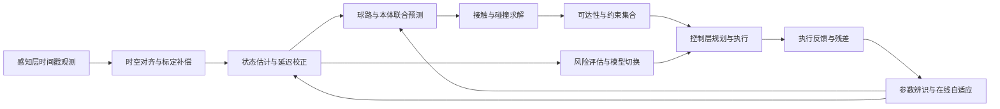

# 建模层

**执行摘要：**建模层的职责，是把感知层输出的离散、带噪、带时延观测，转化为可供规划与控制直接使用的状态、约束和风险量。对球类机器人而言，建模不是单一动力学方程，而是由运动学、刚体动力学、球/拍/台接触、传感器误差、参数辨识、降阶与实时数值策略共同组成的可计算系统；其优劣直接决定击球点预测精度、控制稳定性与系统可部署性。

## 建模层定位与接口

**要点摘要：**建模层不是“感知后的数学描述”，而是感知层与控制层之间的状态—约束生成器。本章在既有《000为球类机器人总的技术报告》框架、已完成的《001 感知层》以及已上传《002 建模层》草稿基础上，补足接口定义、可计算模型、辨识闭环与验证路径，使本章可直接作为后续控制层和系统落地的接口规范。fileciteturn0file0 fileciteturn0file1 fileciteturn0file2

| 项目 | 建议定义 |
|---|---|
| 层目标 | 将感知层输出的球、机器人与环境观测，统一映射为 **可预测状态**、**可求解约束**、**可传递不确定度** 与 **可更新参数集**；支撑从软实时到硬实时的规划与控制。 |
| 功能模块 | 坐标系与运动学、刚体动力学、球/羽球/球拍飞行与驱动模型、接触与碰撞、传感器与环境误差模型、参数辨识与在线自适应、降阶与模型切换、实时求解与数值稳定、鲁棒性与风险评估。 |
| 输入接口 | 来自感知层的时间戳观测 \(z_k\)：球/羽球位置、速度、旋转候选值、置信度、延迟估计、外参与标定残差；来自本体的 \(q,\dot q,\tau,i,T\)；来自环境的台面/地面/网高/边界/球种配置。DeepMind、MIT、ETH 的实机系统都将感知延迟、机器人状态与控制周期显式并行管理。citeturn28view0turn14view0turn15view1 |
| 输出接口 | 向控制层输出 \(\hat x_k,\Sigma_k,\hat t_{\text{hit}},\hat x_{\text{hit}},J(q),M(q),\Theta,\mathcal C\)：即状态估计、协方差、击球时刻/位置、雅可比与惯量、已辨识参数、接触/约束集合；向感知层反向输出 ROI、轨迹先验、数据关联门限与标定残差。citeturn29view2turn17view0 |
| 与感知层关系 | 感知层负责“测到什么”；建模层负责“真实状态是什么、未来会怎样、误差有多大”。现有《001 感知层》已将检测、跟踪、三维重建、速度/旋转估计和延迟治理作为前置能力，本章默认这些能力已可通过统一时间戳接口接入。fileciteturn0file1 |
| 与控制层关系 | 控制层负责“如何打到、打向哪里、怎样保持稳定”；建模层必须给出 **局部线性化、可达性边界、风险界、接触前预测**。HITTER 与 LATENT 的路线都表明，高层模型式规划与低层学习控制解耦，比端到端黑盒更利于落地。citeturn33view0turn33view1 |

建议把建模层统一抽象为如下状态—观测系统：
\[
x_k=[q,\dot q,p_b,v_b,\omega_b,\theta,\beta]^\top,\qquad  
x_{k+1}=f(x_k,u_k,\theta)+w_k,
\]
\[
z_k=h(x_{k-\delta_k},\beta_k)+n_k,
\]
其中 \(q,\dot q\) 为机器人广义坐标与速度，\((p_b,v_b,\omega_b)\) 为来球/羽球状态，\(\theta\) 为待辨识物理参数，\(\beta\) 为传感器偏置、延迟与外参误差；\(\delta_k\) 允许显式表示迟到观测。该抽象兼容 Lie-group 运动学、多体动力学、递推滤波、增量图优化与在线辨识。citeturn24view0turn9view0turn17view0

实现优先来源建议如下：多体运动学/动力学优先采用 Pinocchio 或同类 Featherstone 路线实现；接触仿真与参数连续化优先参照 MuJoCo；空间—时间标定优先采用 Kalibr；在线优化优先采用 CasADi+IPOPT；异步多相机状态图优化优先采用 GTSAM/ISAM2。citeturn6view3turn7view3turn9view0turn14view0turn17view0

## 建模方法全景

**要点摘要：**球类机器人建模层应采用“双模型制”：离线高保真模型用于辨识、仿真和误差解释；在线降阶模型用于实时估计、预测和控制。其核心不是“模型越复杂越好”，而是“模型复杂度与截止时间相匹配”。DeepMind、MIT、ETH 之所以可在实机中稳定运行，关键都在这种分层建模。citeturn28view0turn14view0turn14view3

下图给出本章建议的数据流。该结构与既有感知层章节中的“多传感感知—状态估计—控制”主链保持一致，但将参数辨识、接触模型和风险界评估纳入统一闭环。fileciteturn0file1 fileciteturn0file2



对在线系统，建议同时维护三套模型：其一是**几何模型**，用于坐标换算、雅可比、可达性；其二是**动力学与接触模型**，用于击球前后状态传播与逆动力学；其三是**随机误差模型**，用于延迟、噪声、辨识后参数协方差和风险传播。DeepMind 的延迟分布建模、MIT 的简化飞行—反弹预测、ETH 的真实相机噪声回灌与系统辨识，分别对应这三套模型的典型实现。citeturn28view0turn14view0turn15view3

## 核心模型与算法细化

**要点摘要：**下表给出建模层各技术维度的“最低可落地粒度”。表中“典型参数范围”包含两类信息：一类是赛事器材与实机系统的客观规格，另一类是用于初始化辨识的工程建议区间；后者必须通过现场数据二次收敛后再固化。citeturn20search1turn22search0turn23search3turn28view0turn14view0turn15view1

| 技术维度 | 理论公式或伪代码 | 常用方法比较 | 实现注意事项 | 典型参数范围与单位 | 验证与标定实验设计 |
|---|---|---|---|---|---|
| 运动学建模 | 正运动学建议写成 POE/Lie-group 形式：\(\,^{W}\!T_E(q)=\prod_i e^{\hat\xi_i q_i}M\)；逆运动学建议写成约束优化：\(\min_q\|\log(T_d^{-1}T_E(q))\|_W^2\)。 | DH：实现快、适合串联专机；POE/Lie-group：坐标自由、适合浮基与多体；解析 IK：硬实时最好；数值 IK：通用；OCP 型 IK：能直接处理击球时刻、姿态和关节约束。 | 世界系、球台系、拍面系、相机系必须显式命名；快环避免欧拉角，统一用旋转矩阵/四元数/指数坐标；四元数每步归一化，监视 \(\sigma_{\min}(J)\) 防奇异。 | 角度 rad，角速度 rad/s，末端位置误差建议初始化控制在 mm 级到 cm 级；拍面法向允许误差可从 \(5^\circ\!\sim\!10^\circ\) 起步。 | 步骤：静态手眼标定→工作空间扫面→FK/IK 回放。设备：标定板、MoCap/激光跟踪、编码器。指标：位置 RMSE、姿态误差、IK 成功率、奇异区占比。 |
| 动力学建模 | 标准形式：\(M(q)\ddot q+C(q,\dot q)\dot q+g(q)+\tau_f+J_c^\top\lambda=\tau\)。牛顿–欧拉适合递推逆动力学；拉格朗日适合推导能量一致的解析模型。 | RNEA/CRBA：递推、适合在线；拉格朗日：表达清晰、适合离线分析；Lie-group 形式：适合浮基、多体和高阶导数。 | 惯量、传动比、关节零偏和柔顺性须与控制器使用的同一坐标体系一致；摩擦、阻尼不要隐含进“黑箱增益”；浮基系统必须保留 SE(3) 自由度。 | 质量 kg，转动惯量 kg·m²，阻尼 N·m·s/rad；高频伺服步长通常是 ms 级，高层动力学更新可放宽到 5–10 ms。 | 步骤：关节 PRBS/扫频激励→电流/扭矩记录→离线拟合 \(M,C,g,\tau_f\)。设备：电流采集、编码器、六维力/扭矩传感器。指标：一步预测误差、力矩残差、能量守恒偏差。 |
| 轮/球体与驱动机构模型 | 来球/球体：\(\dot p=v,\;m\dot v=mg-k_d\|v\|v+k_m(\omega\times v)\)；羽毛球可用高阻力指数/分段模型。驱动链：\(J_m\ddot\theta+b_m\dot\theta+\tau_f=\tau_m-N^{-1}\tau_{load}\)。 | 纯球体模型：乒乓/网球可用；羽毛球指数衰减模型：更贴近高阻力飞行；电机模型可从电流环一阶、速度环二阶到含齿隙与柔顺的传动模型逐级增加复杂度。 | MIT 已证明“零入射旋转 + 拟合 lumped drag/反弹参数”是能实时工作的强简化；羽毛球不要照搬球体 Magnus 模型；驱动侧建议将电流饱和、死区和回差单列。 | 比赛器材初始化：乒乓球 40 mm、2.7 g；网球 6.54–6.86 cm、56.0–59.4 g；羽毛球 4.74–5.50 g，球头直径 25–28 mm，裙部直径 58–68 mm。 | 步骤：飞行轨迹采样→反演 \(k_d,k_m,e_n,e_t\)；电机阶跃/正弦扫频→拟合 \(J_m,b_m,\tau_f\)。设备：高速相机/动捕、示波器、电流采样。指标：落点 RMSE、击球前速度误差、驱动频响带宽。 |
| 接触与碰撞模型 | 冲量法：\(M(q)(\dot q^+-\dot q^-)=J^\top\Lambda\)；法向恢复：\(v_n^+=-e_n v_n^-\)；切向满足 \(\|\Lambda_t\|\le \mu\Lambda_n\)。 | 刚性冲量模型：快、适合在线估计；罚函数/顺应接触：连续可导、适合优化和仿真；互补约束：最物理，但求解难。 | 台面、地面、拍面三类接触应分开建模；若规划器需要梯度，优先使用平滑接触；刚性库仑摩擦在大摩擦和刚体假设下会引入不适定，需加正则或顺应层。 | 恢复系数 \(e_n\) 无量纲、摩擦系数 \(\mu\) 无量纲、接触法向刚度 N/m；工程上先扫参、后辨识，不建议跨场地复用。 | 步骤：标准发球/抛球试验→台面反弹、拍面反弹、地面滑移分开采；设备：高速相机、力板/力传感器、标准球拍。指标：反弹后速度误差、接触时刻误差、模型可导性与求解收敛率。 |
| 传感器与环境模型 | \(z_k=h(x_{k-\delta_k})+b_k+n_k\)，其中 \(b_k\) 为偏置，\(\delta_k\) 为时延；滚动快门、外参漂移和时间偏置应显式建模。 | Gaussian+延迟模型：工程主力；EKF/UKF 异步更新：中低复杂度；增量因子图：适合多相机异步、不必配对同步。 | Kalibr 类工具应同时做空间与时间标定；若使用滚动快门相机，必须考虑行曝光延迟；观测方差要按传感器类型和距离分段，而不是固定常数。 | 时间偏置 ms，位置噪声 mm–cm，速度噪声 m/s，角速度噪声 rad/s；外部动捕、固定双目、机载双目的量级不同，应分层配置噪声。 | 步骤：硬触发/闪光同步→时延测量；标定板多姿态拍摄→外参；静止与动态采样→噪声协方差。设备：触发器、LED、棋盘/AprilTag、日志系统。指标：重投影误差、时间偏置残差、NEES/NIS、一致性检验。 |
| 参数辨识与自适应建模 | 批量最小二乘：\(\theta^\*=\arg\min_\theta\sum_k\|y_k-\hat y_k(\theta)\|_{W}^2\)；RLS：\(K_k=P_{k-1}\phi_k(\lambda+\phi_k^\top P_{k-1}\phi_k)^{-1}\)，再更新 \(\theta_k,P_k\)。 | 批量 LS/NLS：精度高、适合离线；RLS：在线轻量；双重 EKF/UKF：可同时估计状态与参数；残差学习：适合未建模项。 | 需要持续激励；参数上下界与物理可行域必须显式约束；在线更新要有冻结条件，避免把感知异常学成“新参数”。 | 忘记因子 \(\lambda\) 常取 0.95–0.999；离线窗口可按 5–30 s 采样段组织；更新频率建议低于状态估计频率一个层级。 | 步骤：分球种、球速、转速与场地产生辨识集/验证集；设备：标准发球机、动捕/高速相机、力传感器。指标：一步预测误差、跨批次重复性、参数方差、验证集外推误差。 |
| 模型简化与降阶策略 | 线性化后可写成 \(x_r=V^\top x\)；更常用的是物理降阶：保留击球相关状态，冻结快衰减或弱可观测状态。 | 全模型：解释力强；lumped 参数模型：最实用；分段/模式切换模型：适合“飞行—反弹—击球”多阶段；物理主干+学习残差：兼顾泛化与实时性。 | 在线模型只保留“会改变击球决策”的状态；乒乓/网球可先保留 \(p,v,\omega\)，羽毛球可先保留 \(p,v\) 与高阻力速度指数；长期漂移参数放入慢环。 | 在线状态维数建议控制在个位数到十余维；慢环参数集与快环状态集分离维护。 | 步骤：全模型与降阶模型并行回放；设备：离线日志与剖析工具。指标：运行时间缩减比、击球点偏差、命中率退化幅度。 |
| 实时可计算性与数值稳定性 | 典型快环伪代码：`delay_update -> predict_hit -> solve_IK/OCP -> safety_clip -> send_cmd`；滤波建议采用平方根形式，旋转建议保持在单位四元数或 SE(3) 上积分。 | EKF 比 UKF 更轻；增量图优化比全批更适合持续更新；FHMPC 在低自由度击球任务中优于缩短时域 MPC；显式积分便宜但刚性接触下可能不稳。 | 为每个求解器设置 deadline、warm-start 与 fallback；超过截止时间时退回上轮可行解或启发式减配模型；所有协方差保持对称正定。 | 估计环可配到 100–400 Hz，规划环 20–100 Hz，伺服环 500 Hz–1 kHz 以上；截止时间应小于来球剩余可操作时间的 10–20%。 | 步骤：WCRT 压测、极端球速回放、随机延迟注入。设备：profiling、时间戳日志、硬件在环。指标：deadline miss rate、求解收敛率、条件数、NaN/发散次数。 |
| 模型不确定性与鲁棒性分析 | 协方差传播：\(P_{k+1}=A_kP_kA_k^\top+Q_k\)；也可用 sigma-point、Monte Carlo、区间包络或风险约束。 | KF/UKF 协方差传播：在线便宜；Monte Carlo：离线最稳妥；因子图：可统一异步多测量；域随机化/残差学习：增强 sim-to-real 鲁棒性。 | 把不确定性分为：感知噪声、延迟抖动、参数漂移、接触失配、环境变化五类；控制层调用时至少应接收命中概率或风险界。 | 在线可维护方差、分位数、命中概率；离线 Monte Carlo 可用 100–1000 条轨迹评估策略边界。 | 步骤：换球、换台、换灯光、换场地做 A/B 测试；设备：标准化测试集与自动回放工具。指标：落点 RMSE、命中率下降、CVaR 距离、跨域稳定性。 |

表中方法骨架综合自 Lie-group 多体动力学、Pinocchio/MuJoCo 官方文档、DeepMind/MIT/ETH/Tübingen/Georgia Tech 等原始论文；器材几何初值采用比赛器材规格摘要。羽毛球飞行应优先采用高阻力指数衰减或分段模型，因为最新实验显示羽毛球速度沿飞行距离近似指数衰减，且可在约 3.35 m 内衰减一半；其自然旋转与短暂 Magnus 效应虽常被忽略，但在切削球和左右手差异下可观察到。citeturn24view0turn6view3turn7view3turn28view0turn14view0turn15view1turn17view0turn12academia1turn12academia2turn36view0turn36view1turn20search1turn22search0turn23search3

## 实时性、复杂度与方法选型

**要点摘要：**在“平台不特定、实时性可配置”的前提下，正确的选型原则不是追求最复杂模型，而是按照截止时间分配模型复杂度：硬实时环只保留递推和闭式结构，软实时环才引入图优化、非线性辨识和多假设推断。DeepMind、ETH 与 MIT 的实机数字给出了很清楚的工程边界。citeturn28view0turn15view1turn14view0

| 模块 | 主流方法 | 近似复杂度或已公开实测 | 实时性评估 | 推荐场景 |
|---|---|---|---|---|
| 几何 FK/Jacobian | 递推 FK、雅可比 | 与自由度线性相关；Pinocchio 实现 RNEA/CRBA/Jacobian 等递推算法。citeturn6view3turn24view0 | **硬实时友好** | 所有平台的快环基础库 |
| 逆运动学 | 解析 IK / LM / SQP-OCP | 解析 IK 最低；数值 IK 与迭代次数相关；OCP 型 IK 能并入终端击球约束。MIT 将其并入 OCP/MPC。citeturn14view0 | 解析 IK **硬实时**；OCP **firm real-time** | 专机优先解析 IK；浮基/冗余系统用 LM 或 OCP |
| 逆动力学 | RNEA / Lagrange | RNEA 为递推 \(O(n)\)；拉格朗日更适合离线推导与敏感度分析。citeturn24view0turn6view3 | **硬实时友好** | 伺服前馈、约束线性化 |
| 状态估计 | KF / EKF / UKF | 小状态维下 KF/EKF 在线代价低；UKF 约为 \(2n+1\) sigma-point 传播；ETH 400 Hz 状态估计已在实机验证。citeturn15view1turn13view1 | KF/EKF **硬实时**；UKF **firm real-time** | 球/羽球预测、延迟补偿 |
| 异步融合 | 增量因子图 + ISAM2 | 图规模随检测增长，但增量重线性化可维持实时推断。Georgia Tech 方案显式针对异步多相机、不需要成对同步。citeturn17view0turn17view1 | **soft/firm real-time** | 多相机异步、早期旋转/落点推断 |
| 接触求解 | 冲量 / 顺应接触 / 互补约束 | 冲量最快；顺应接触更适合梯度优化；互补约束物理性最好但解算压力最大。MuJoCo 通过 `solref/solimp` 提供平滑接触与 continuation。citeturn7view2turn7view3 | 冲量 **硬实时**；顺应接触 **firm** | 在线预测优先冲量或平滑罚函数 |
| 在线规划 | FHMPC / SHMPC | MIT 报告 FHMPC 在真实预测数据上平均 3.2 ms、99.5% 收敛，优于 SHMPC 的 6.7 ms。citeturn14view0 | **firm real-time** | 低自由度击球与终端约束规划 |
| 参数更新 | 批量 NLS / RLS / 双 EKF | 批量 NLS 离线最强；RLS 与双 EKF 适合慢环在线修正。ETH 将 system identification 作为部署前提；MIT 用最小二乘拟合 drag/反弹参数。citeturn15view3turn14view0 | 批量 **offline**；RLS **soft/firm** | 慢环参数漂移、换球换台后重整定 |

推荐的分时域调度如下：**高速估计环**承担时空对齐、延迟更新、状态传播与安全阈值判断；**中速预测环**承担击球点预测、可达性计算、接触前滚动规划；**低速辨识环**承担批量拟合、重标定与模型切换。参考已公开系统，高速估计环可以落在 100–400 Hz，中速预测/控制在 20–100 Hz，机载感知或外部视觉通常在 60–125 Hz 量级；MIT 的端到端“新观测到新轨迹执行”反应时间为 7.5–16 ms，DeepMind 的感知系统可到 125 Hz，ETH 采用 60/400/100 Hz 异步流水线。citeturn14view0turn29view3turn15view1

建议的在线执行伪代码如下：

```text
for every estimator tick:
    ingest(timestamped_observations)
    z_sync = spatiotemporal_compensation(z, calib, delay)
    x_hat, P = delayed_filter_update(x_hat, P, z_sync)

for every planner tick:
    theta = adaptive_update_if_trustworthy(theta, residuals)
    traj_candidates = rollout(reduced_model, x_hat, theta, uncertainty=P)
    hit_plan = choose_min_risk_feasible_candidate(traj_candidates, control_constraints)
    if solver_deadline_risk:
        hit_plan = fallback_plan(previous_feasible_plan)

send_to_controller(hit_plan, x_hat, P, model_confidence)
```

数值稳定性上，建议强制执行四条工程规则：其一，旋转量采用单位四元数或 SE(3) 积分，绝不在快环里直接积累欧拉角；其二，滤波协方差采用平方根形式或最少做对称化/正定修复；其三，所有优化器设置 warm-start、最大迭代步和保底可行解；其四，接触与摩擦若需要导数，优先使用平滑顺应层而非非正则刚性切换。MuJoCo 文档明确指出接触参数既影响数值可导性，也可用于 continuation；MIT 的 FHMPC 之所以稳定，关键也在固定时域、warm-start 与轨迹平滑策略。citeturn7view2turn7view3turn14view0

## 验证、标定与评价

**要点摘要：**建模层验证必须覆盖“几何正确、动力学正确、误差可解释、实时截止满足、跨场景不过度退化”五个层面。只做离线拟合而不做闭环回放，等价于没有验证。Kalibr、DeepMind、MIT、ETH 和异步因子图路线都强调了这一点。citeturn9view0turn28view0turn14view0turn13view1turn17view0

| 实验对象 | 关键步骤 | 所需设备 | 评价指标 | 建议判据 |
|---|---|---|---|---|
| 坐标链与运动学 | 标定板/AprilTag 静态采样；工作空间网格扫面；FK/IK 回放 | 标定板、MoCap/激光跟踪、编码器 | 重投影误差、末端位置误差、姿态误差、IK 成功率 | 重投影误差稳定在像素级；末端静态误差显著小于拍面半径 |
| 驱动链与关节动力学 | 阶跃、扫频、PRBS 激励；扭矩/电流回归 | 电流采样、示波器、编码器、力矩传感器 | 一步预测 NRMSE、频响带宽、摩擦残差 | 高频环截止满足控制层要求；残差无显著偏置 |
| 飞行与反弹模型 | 发球机/抛球机分球种采样；台面/拍面/地面接触分开拟合 | 高速相机或动捕、发球机、标准球拍/球台 | 落点 RMSE、反弹后速度误差、时刻误差 | 命中点预测误差小于拍面半径的 1/3 为宜 |
| 噪声、延迟与标定误差 | 硬触发/闪光同步；静止噪声统计；滚动快门/时偏敏感性回放 | 触发器、LED、日志系统 | 时间偏置、协方差一致性、NEES/NIS、迟到包比例 | 固定多目系统尽量压到 ms 级；机载系统至少要可估可补 |
| 在线辨识与模型切换 | 换球、换场、换灯光；慢环参数冻结/解冻试验 | 标准测试集、日志回放系统 | 参数方差、收敛时间、跨域退化率 | 参数更新后性能提升且不引发快环发散 |
| 端到端闭环 | 真实来球回放；极限球速/旋转/遮挡/延迟注入 | 硬件在环、自动回放框架 | hit-rate、landing RMSE、deadline miss rate、CVaR miss distance | 硬实时模式 deadline miss rate 宜低于千分级；软实时模式至少低于 1% |

若需要统一 KPI，建议建模层采用五个主指标：**一步预测误差**、**击球点预测误差**、**时间一致性误差**、**求解截止违约率** 和 **跨域退化率**。其中，击球点预测误差应同时以绝对值和相对值报告：绝对值便于工程排障，相对拍面半径或可达窗口的归一化误差更适合跨平台比较；因子图、多体递推与 MPC 的对比实验也都应以“同一真实日志回放”完成，避免训练分布不同造成误判。citeturn17view0turn14view0turn28view0

## 实施建议与下一步工作清单

**要点摘要：**若本项目下一阶段要保持与《001 感知层》同等细致程度，最务实的路线不是一次性做全，而是先固化统一状态接口，再建设“离线高保真、在线降阶、慢环辨识”的三层架构；这与当前主流实机系统的做法一致，也最符合平台不特定、实时性可配置的约束。fileciteturn0file1 fileciteturn0file2 citeturn28view0turn14view0turn15view3turn33view0turn33view1

| 优先级 | 工作项 | 交付物 | 主要风险 | 完成判据 | 下一步衔接 |
|---|---|---|---|---|---|
| P0 | 统一坐标系、状态向量和 I/O 契约 | `ModelState`、`ModelParam`、`ModelUncertainty` 接口文档 | 感知层/控制层字段不一致 | 三层可用同一日志格式回放 | 直接衔接控制层状态接口设计 |
| P0 | 建立在线降阶基线模型 | 可实时运行的 \(p,v,\omega,q,\dot q\) 联合模型 | 过度简化导致误差过大 | 在离线日志上满足命中点误差目标 | 作为控制层第一版预测器 |
| P0 | 建立参数辨识数据闭环 | 发球—采集—拟合—验证流水线 | 数据分布不充分 | 系统可重现同一批参数 | 作为后续自适应模型的训练基础 |
| P1 | 接入时延/噪声显式建模 | 延迟补偿模块与协方差传播模块 | 时间戳质量不足 | 迟到观测可校正且 NEES/NIS 通过 | 衔接控制层风险约束 |
| P1 | 建立接触与反弹分模型 | 台面、拍面、地面独立参数包 | 把多种接触混进同一参数集 | 三类接触误差可独立解释 | 衔接击球策略与拍面规划 |
| P1 | 建立实时求解器分级机制 | hard/firm/soft real-time 三档设置 | 单一求解器覆盖所有模式 | 截止时间与性能可配置 | 衔接平台选型与部署配置 |
| P2 | 引入异步图优化或残差学习 | 因子图/残差网络插件化模块 | 计算预算被上层吞噬 | 可按需开启，不破坏基线 | 衔接多相机和类人全身系统 |
| P2 | 建立鲁棒性测试基准 | 换场、换球、换灯、换延迟测试集 | 只在单场景过拟合 | 跨域退化率有可追踪基线 | 为后续控制层和系统集成验收提供统一基准 |

综合建议是：**短期先做“物理主干 + EKF/RLS + 固定时域规划”的可解释基线；中期引入异步因子图与平滑接触；长期若要走类人多拍路线，再引入 HITTER/LATENT 风格的“模型式高层 + 学习型全身控制”双层架构。** 这一顺序能最大程度复用既有感知层成果，也最符合当前公开实机系统的技术演化路径。citeturn14view0turn17view0turn33view0turn33view1