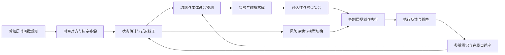

# 建模层

## 为什么需要建模层？

一个常见的疑问是：**感知层已经输出了球的三维位置、速度和时间戳，为什么不直接交给控制层？**

假设感知层告诉你：**"球现在在 (1.2, 0.5, 0.8) m，速度 (5, -1, -2) m/s，时间戳 t=0.3s"**——控制层拿到这个，能直接用吗？**不能**，原因如下：

### 1. 控制层需要的是"球未来在哪里"，不是"球现在在哪里"

从感知给出当前位置到机器人完成挥拍，至少还有 100–300 ms。控制层真正需要的是：

> **"球在 t=0.55s 会到达 (0.8, 0.3, 0.15) m，这就是击球点"**

这个"未来位置"怎么来？必须用物理模型往前推——重力、空气阻力、马格努斯效应（旋转造成的偏移）。**建模层做的事就是用动力学模型预测未来轨迹。**

### 2. 感知数据是带噪的、不完整的

感知层连续给了 10 帧观测，每帧都有噪声，偶尔还有丢帧或异常值。你不能拿某一帧直接用——你需要一个**滤波器**（EKF/UKF）把多帧观测融合成更准确的状态估计，同时给出"我有多不确定"（协方差矩阵）。控制层需要这个不确定度来做鲁棒决策。

### 3. 很多关键量感知层根本测不到

| 量 | 感知层能直接给吗？ |
|---|---|
| 球的旋转角速度 ω | 很难，只能间接估计，且噪声极大 |
| 空气阻力系数 k_d | 不能，必须从轨迹拟合 |
| 反弹恢复系数 e_n | 不能，必须从碰撞前后速度反推 |
| 球什么时候触台？弹起后去哪？ | 不能，必须用接触模型计算 |
| 机器人关节惯量 M(q) | 不能，这是机器人自身动力学模型 |

这些**都必须由建模层来估计和计算**。

### 4. 一个完整的例子：乒乓球回合

```
感知层输出:  球位置 (x,y,z) + 速度 (vx,vy,vz) + 时间戳   ← 原始、带噪、只有"现在"

                ↓ 建模层做的事 ↓

  ① EKF 滤波:  融合多帧 → 更准确的状态 + 协方差 Σ
  ② 参数辨识:  从轨迹拟合 k_d, k_m(旋转系数) → 知道球怎么飞
  ③ 轨迹预测:  用物理模型前推 → 球在 t_hit 到达 (x_hit, y_hit, z_hit)
  ④ 接触预测:  球会先触台 → 用碰撞模型算反弹后轨迹 → 更新击球点
  ⑤ 机器人模型: 给出雅可比 J(q)、惯量 M(q) → 控制层知道"能不能打到"
  ⑥ 不确定度:  输出协方差 → 控制层知道"有多大把握"

                ↓ 建模层输出 ↓

  状态估计 x̂_k, 协方差 Σ_k, 击球时刻 t_hit, 击球位置 x_hit,
  雅可比 J(q), 惯量 M(q), 已辨识参数 Θ, 约束集 C

                ↓

控制层:  "好，我知道球会去哪、我能不能打到、有多大风险 → 开始规划挥拍"
```

### 一句话总结

> **感知层回答"球现在在哪"，建模层回答"球未来去哪、有多确定、机器人能不能接到、碰台后怎么弹"。控制层没有这些信息就无法规划。**

---

**执行摘要：**建模层的职责，是把感知层输出的离散、带噪、带时延观测，转化为可供规划与控制直接使用的状态、约束和风险量。对球类机器人而言，建模不是单一动力学方程，而是由运动学、刚体动力学、球/拍/台接触、传感器误差、参数辨识、降阶与实时数值策略共同组成的可计算系统；其优劣直接决定击球点预测精度、控制稳定性与系统可部署性。

## 建模层定位与接口

**要点摘要：**建模层不是“感知后的数学描述”，而是感知层与控制层之间的状态—约束生成器。本章在既有《000-球类机器人技术报告》框架、已完成的《001 感知层》基础上，补足接口定义、可计算模型、辨识闭环与验证路径，使本章可直接作为后续控制层和系统落地的接口规范。

| 项目 | 建议定义 |
|---|---|
| 层目标 | 将感知层输出的球、机器人与环境观测，统一映射为 **可预测状态**、**可求解约束**、**可传递不确定度** 与 **可更新参数集**；支撑从软实时到硬实时的规划与控制。 |
| 功能模块 | 坐标系与运动学、刚体动力学、球/羽球/球拍飞行与驱动模型、接触与碰撞、传感器与环境误差模型、参数辨识与在线自适应、降阶与模型切换、实时求解与数值稳定、鲁棒性与风险评估。 |
| 输入接口 | 来自感知层的时间戳观测 $z_k$：球/羽球位置、速度、旋转候选值、置信度、延迟估计、外参与标定残差；来自本体的 $q,\dot q,\tau,i,T$；来自环境的台面/地面/网高/边界/球种配置。DeepMind、MIT、ETH 的实机系统都将感知延迟、机器人状态与控制周期显式并行管理[¹](#ref-modeling-deepmind)[²](#ref-modeling-mit)[³](#ref-modeling-eth)。 |
| 输出接口 | 向控制层输出 $\hat x_k,\Sigma_k,\hat t_{\text{hit}},\hat x_{\text{hit}},J(q),M(q),\Theta,\mathcal C$：即状态估计、协方差、击球时刻/位置、雅可比与惯量、已辨识参数、接触/约束集合；向感知层反向输出 ROI、轨迹先验、数据关联门限与标定残差。 |
| 与感知层关系 | 感知层负责“测到什么”；建模层负责“真实状态是什么、未来会怎样、误差有多大”。现有《001 感知层》已将检测、跟踪、三维重建、速度/旋转估计和延迟治理作为前置能力，本章默认这些能力已可通过统一时间戳接口接入。 |
| 与控制层关系 | 控制层负责“如何打到、打向哪里、怎样保持稳定”；建模层必须给出 **局部线性化、可达性边界、风险界、接触前预测**。HITTER 与 LATENT 的路线都表明，高层模型式规划与低层学习控制解耦，比端到端黑盒更利于落地[⁴](#ref-modeling-hitter)[⁵](#ref-modeling-latent)。 |

建议把建模层统一抽象为如下状态—观测系统：
$$
x_k=[q,\dot q,p_b,v_b,\omega_b,\theta,\beta]^\top,\qquad
x_{k+1}=f(x_k,u_k,\theta)+w_k,
$$
$$
z_k=h(x_{k-\delta_k},\beta_k)+n_k,
$$
其中 $q,\dot q$ 为机器人广义坐标与速度，$(p_b,v_b,\omega_b)$ 为来球/羽球状态，$\theta$ 为待辨识物理参数，$\beta$ 为传感器偏置、延迟与外参误差；$\delta_k$ 允许显式表示迟到观测。该抽象兼容 Lie-group 运动学、多体动力学、递推滤波、增量图优化与在线辨识[⁶](#ref-modeling-pinocchio)[⁷](#ref-modeling-featherstone)。

下面逐项展开这个统一抽象中每个变量的物理含义、数学角色与工程实现要点。

### 状态向量 $x_k$ 的逐分量解读

状态向量 $x_k=[q,\dot q,p_b,v_b,\omega_b,\theta,\beta]^\top$ 将机器人本体、来球、待辨识参数和传感器误差统一打包。这不是随意拼接，而是为了在同一个滤波/优化框架中联合估计——分开估计会导致信息损失和一致性破坏。

**① $q$ — 机器人广义坐标**

$q$ 描述机器人所有关节和浮基自由度的构型。对固定基座 6 自由度机械臂，$q\in\mathbb{R}^6$；对移动底盘+机械臂，浮基需要 6 个自由度（3 平移 + 3 旋转），此时 $q$ 包含浮基位姿和关节角。关键实现要点：

- 若使用欧拉角表示旋转，在 $\pm\pi$ 处存在奇异性；建议统一采用四元数（4 个参数，1 个约束）或旋转矩阵（9 个参数，6 个约束），在滤波更新后立即投影回流形。
- Pinocchio 的 Lie-group 接口可直接在 $\mathrm{SE}(3)$ 上积分，无需手动处理归一化。
- 工程上，$q$ 的零位定义必须与 URDF 一致；关节方向、偏移量和限位在建模层和控制层必须使用同一份配置。

**② $\dot q$ — 机器人广义速度**

$\dot q$ 是 $q$ 的时间导数。注意：当 $q$ 包含旋转时，$\dot q$ 并不直接等于关节角速度——浮基旋转部分的 $\dot q$ 实际上是角速度在体坐标系或空间坐标系下的分量，需要通过运动学映射 $\dot q = S(q)\nu$（$\nu$ 为广义速度，$S$ 为选择矩阵）转换。在 RNEA 和 ABA 中，输入输出都是 $\nu$ 而非 $\dot q$，这一点 Pinocchio 已自动处理。

**③ $p_b$ — 来球/羽球位置**

$p_b\in\mathbb{R}^3$ 是球在世界坐标系下的三维位置。这是感知层最直接的输出，但通常带有 5–50 mm 的噪声和 5–30 ms 的时间延迟。建模层需要：

- 通过 EKF/UKF 将多帧 $p_b$ 观测融合为更准确的估计；
- 在预测阶段，用飞行模型将 $p_b$ 前推到击球时刻；
- 若球会触台/触地，需要用接触模型计算反弹后的 $p_b$。

**④ $v_b$ — 来球/羽球速度**

$v_b\in\mathbb{R}^3$ 是球的三维速度。感知层通常通过相邻帧位置差分或光流估计得到，噪声远大于位置（差分放大噪声）。建模层的处理策略：

- 不要直接使用感知层差分速度——应在 EKF 中将 $v_b$ 作为状态变量，通过运动学模型预测+位置观测更新来间接估计，精度可提升 3–10 倍。
- 对羽毛球等高阻力球体，$v_b$ 的衰减是非线性的（指数衰减而非匀减速），需要用分段模型或含阻力项的连续模型。

**⑤ $\omega_b$ — 来球/羽球旋转角速度**

$\omega_b\in\mathbb{R}^3$ 是球的旋转角速度。这是整个状态向量中最难估计的量：

- 感知层几乎无法直接观测 $\omega_b$——单目/双目视觉只能看到球的平移，看不到旋转（除非球面有标记或纹理）。
- 间接估计方法：① 从轨迹偏移反推——旋转球受马格努斯力 $F_m = k_m(\omega\times v)$，轨迹会侧向弯曲，从弯曲量反推 $\omega$；② 事件相机——可捕捉球面纹理旋转产生的事件流，ETH 的事件相机旋转估计工作已验证此路线；③ 高速相机+球面标记——仅限实验室环境。
- 工程建议：若无法可靠估计 $\omega_b$，可采用 MIT 的策略——假设零旋转，将旋转效应 lumped 进阻力系数和反弹参数中。这在乒乓球场景下已被验证可行。

**⑥ $\theta$ — 待辨识物理参数**

$\theta$ 是所有需要从数据中学习的物理参数的集合，典型包括：

| 参数 | 符号 | 典型值范围 | 辨识方法 |
|---|---|---|---|
| 空气阻力系数 | $k_d$ | 0.01–0.5（球体）；0.5–5.0（羽毛球） | 飞行轨迹拟合 |
| 马格努斯力系数 | $k_m$ | 0.001–0.1 | 旋转轨迹偏移拟合 |
| 法向恢复系数 | $e_n$ | 0.7–0.95（乒乓/网球台面） | 碰撞前后速度比 |
| 切向摩擦系数 | $\mu$ | 0.2–0.6 | 碰撞切向/法向力比 |
| 关节摩擦参数 | $\tau_f$ 参数 | 视驱动器而定 | PRBS/扫频激励 |
| 关节惯量 | $I_m$ | 视驱动器而定 | 阶跃响应拟合 |

$\theta$ 放入状态向量意味着它可以被在线更新——但必须有冻结条件和物理约束（如 $e_n\in[0,1]$，$k_d>0$），防止把感知异常学成"新参数"。

**⑦ $\beta$ — 传感器偏置、延迟与外参误差**

$\beta$ 将传感器系统性误差显式建模为状态变量，包括：

- **偏置 $b$**：IMU 加速度计/陀螺仪的零偏，相机观测的系统性位置偏移。偏置是慢变的，适合放在慢环中估计。
- **时间延迟 $\delta$**：从图像采集到状态估计输出的总延迟，包括曝光时间、传输延迟、处理延迟。$\delta$ 在公式中体现为 $x_{k-\delta_k}$——即观测对应的是过去某个时刻的状态，而非当前时刻。1 ms 的延迟在 10 m/s 球速下 = 1 cm 位置误差，必须补偿。
- **外参误差 $\Delta T$**：相机之间、相机与 IMU 之间、相机与机器人基座之间的标定残差。Kalibr 标定后仍有亚毫米级残差，在高速场景下不可忽略。

将 $\beta$ 纳入状态向量的好处是：EKF/UKF 可以在运行中持续精化这些误差参数，而不需要停机重新标定。

### 过渡方程 $x_{k+1}=f(x_k,u_k,\theta)+w_k$ 解读

这是建模层的核心——它定义了"状态如何随时间演化"：

- **$f(\cdot)$ 是物理模型**：不是黑箱，而是由运动学、动力学、飞行模型、接触模型组合而成的白箱/灰箱函数。具体来说，$f$ 内部包含：
  - 机器人动力学：$M(q)\ddot q + C(q,\dot q)\dot q + g(q) = \tau$，给定控制输入 $u_k=\tau$，积分得到下一时刻的 $q,\dot q$；
  - 球飞行模型：$\dot p_b = v_b$，$m\dot v_b = mg - k_d\lVert v_b\rVert v_b + k_m(\omega_b\times v_b)$，积分得到下一时刻的 $p_b, v_b$；
  - 接触模型：当球触台/触拍时，用冲量法或顺应模型计算速度跳变；
  - 参数不变假设：$\theta_{k+1}=\theta_k$（参数慢变，在短时间窗内视为常数）；
  - 偏置慢变模型：$\beta_{k+1}=\beta_k + w_\beta$（$w_\beta$ 极小，允许缓慢漂移）。

- **$u_k$ 是控制输入**：即发送给电机的力矩指令 $\tau$。在预测阶段，$u_k$ 来自控制层的规划输出；在估计阶段，$u_k$ 是已执行的指令（从编码器/电流环读取）。

- **$w_k$ 是过程噪声**：代表模型无法捕捉的误差，如未建模的气流扰动、地面不平度、关节柔性等。$w_k\sim\mathcal{N}(0,Q_k)$，协方差 $Q_k$ 需要根据实际残差统计调参——过小则滤波跟不上真实变化，过大则估计抖动。

### 观测方程 $z_k=h(x_{k-\delta_k},\beta_k)+n_k$ 解读

这是建模层与感知层的接口——它定义了"观测与状态的关系"：

- **$h(\cdot)$ 是观测函数**：将状态映射到观测空间。例如，球的位置观测 $z_k = p_b + b_k$（$b_k$ 是偏置）；关节角观测 $z_k = q + n_k$。对于相机观测，$h$ 还包含投影模型（针孔/鱼眼）和外参变换。

- **$x_{k-\delta_k}$ 的时间延迟**：这是球类机器人最关键的建模细节之一。感知层输出的观测 $z_k$ 对应的不是当前时刻 $k$ 的状态，而是 $\delta_k$ 个时间步之前的状态。原因包括：
  - 相机曝光时间（滚动快门：1–30 ms；全局快门：< 1 ms）；
  - 图像传输与处理延迟（5–20 ms）；
  - 检测/跟踪算法延迟（2–10 ms）。
  在 EKF 中，处理延迟的标准做法是：将状态回推到 $k-\delta_k$ 时刻，用该时刻的状态计算预测观测，再与实际观测做残差。这就是为什么 $\delta_k$ 必须作为 $\beta$ 的一部分被估计。

- **$n_k$ 是观测噪声**：$n_k\sim\mathcal{N}(0,R_k)$，协方差 $R_k$ 应按传感器类型和距离分段设置——近处观测噪声小、远处噪声大，而不是固定常数。工程上，$R_k$ 可从 Kalibr 标定残差或离线回放统计中获得初始值。

### 为什么要把这些量统一放在一个状态向量里？

分开估计（先估计球状态，再估计机器人状态，再辨识参数）看似更简单，但会导致三个问题：

1. **信息损失**：球的飞行轨迹同时包含状态信息 $(p_b, v_b)$ 和参数信息 $(k_d, k_m)$。如果先估计状态再辨识参数，两步之间的误差会累积；联合估计则让状态和参数互相约束。
2. **一致性破坏**：分开估计时，各滤波器的协方差是独立的，无法表达"球位置估计和阻力系数估计之间的相关性"。联合估计的协方差 $\Sigma_k$ 天然包含所有交叉项。
3. **延迟补偿不完整**：如果球状态和传感器偏置分开估计，延迟补偿只能在一个滤波器中做，另一个滤波器用的是未补偿的观测，引入系统性偏差。

当然，联合估计的代价是状态维数增大、计算量增加。工程上的折中方案是：快环只估计 $(q,\dot q,p_b,v_b)$，慢环估计 $(\theta,\beta)$，两环之间通过参数传递和协方差边界保持一致性。

实现优先来源建议如下：多体运动学/动力学优先采用 Pinocchio[⁶](#ref-modeling-pinocchio) 或同类 Featherstone 路线实现；接触仿真与参数连续化优先参照 MuJoCo[⁸](#ref-modeling-mujoco)；空间—时间标定优先采用 Kalibr[⁹](#ref-modeling-kalibr)；在线优化优先采用 CasADi+IPOPT[¹⁰](#ref-modeling-casadi)；异步多相机状态图优化优先采用 GTSAM/ISAM2[¹¹](#ref-modeling-gtsam)。下面对每个推荐工具展开说明其核心能力与在本项目中的具体用途。

### Pinocchio — 多体运动学与动力学

Pinocchio 是 INRIA 开发的开源刚体动力学库，核心特点是：

- **算法效率**：基于 Featherstone 铰接体算法（ABA）实现前向动力学，复杂度 $O(n)$；基于 RNEA 实现逆动力学，同样 $O(n)$。对 6–7 自由度机械臂，单次前向动力学调用在微秒量级，完全满足 1 kHz 伺服环需求。
- **解析求导**：直接提供质心雅可比 $\frac{\partial \text{CoM}}{\partial q}$、动量矩阵 $\frac{\partial (M\dot q)}{\partial \dot q}$、RNEA 对 $q,\dot q,\ddot q$ 的偏导数，无需有限差分。这对基于梯度的轨迹优化至关重要——OCP（Optimal Control Problem，最优控制问题）指在动力学约束下寻找使代价函数最小的控制序列；MPC（Model Predictive Control，模型预测控制）是 OCP 的在线递推求解方式，每个控制周期重新求解一个有限时域 OCP，只执行第一步，再滚动到下一周期。MIT 和 DeepMind 的实时 MPC 都依赖解析雅可比来加速收敛。
- **Lie-group 坐标**：内建 $\mathrm{SE}(3)/\mathrm{SO}(3)$ 运算与李代数 $\mathfrak{se}(3)/\mathfrak{so}(3)$ 映射，浮基系统（如移动底盘+机械臂）的运动学可直接在流形上积分，避免欧拉角奇异性。
- **Python/C++ 双接口**：Python 绑定适合快速原型（如离线辨识脚本），C++ 核心适合部署到实时节点。
- **在本项目中的用途**：① 正/逆运动学求解（FK/IK）；② 雅可比 $J(q)$ 与惯量矩阵 $M(q)$ 的在线计算，供控制层使用；③ 逆动力学 $\tau = \mathrm{RNEA}(q,\dot q,\ddot q)$ 用于前馈力矩计算；④ 碰撞检测的几何内核（内建 hpp-fcl）。

### Featherstone 铰接体算法 — 替代路线

Roy Featherstone 的铰接体算法是 Pinocchio 的理论根基，也是动力学仿真领域的经典方法：

- **核心思想**：将多体系统递推分解为"向外传播速度→向内传播力"两遍扫描，避免组装全质量矩阵 $M(q)$ 后再求逆，计算量从 $O(n^3)$ 降至 $O(n)$。
- **与 Pinocchio 的关系**：Pinocchio 是 Featherstone 算法的高效工程实现，增加了自动微分和 Lie-group 支持。如果项目已有基于 Spatial V2（Featherstone 官方 MATLAB 实现）的遗留代码，可以逐步迁移到 Pinocchio。
- **在本项目中的选择建议**：新代码统一用 Pinocchio；若需极简嵌入式部署（无 Python 依赖），可手写 ABA/RNEA 核心循环，参考 Featherstone 的 *Rigid Body Dynamics Algorithms* 一书第 7–8 章。

### MuJoCo — 接触仿真与参数连续化

MuJoCo（Multi-Joint dynamics with Contact）是 DeepMind 维护的物理仿真引擎，在接触建模方面有独特优势：

- **顺应接触模型**：与刚性冲量法不同，MuJoCo 采用罚函数+互补约束的混合模型，接触力 $f_n = k_n \cdot \max(0, d) + d_n \cdot \dot d$（$d$ 为穿透深度），天然可导，适合基于梯度的优化。
- **凸优化求解器**：接触力求解转化为凸优化问题，保证唯一解和数值稳定性，不存在 LCP（线性互补问题）的不可解或多解困境。
- **可微仿真**：MuJoCo 2.3+ 支持解析反向传播（`mjd_inverse`），可直接在仿真图上求损失函数对物理参数的梯度，用于系统辨识中的梯度下降。
- **在本项目中的用途**：① 离线高保真仿真——验证轨迹预测、碰撞恢复系数辨识；② 参数连续化——将刚性碰撞模型替换为 MuJoCo 式顺应接触，使 OCP 可获得光滑梯度；③ Sim-to-Real 差距分析——通过调节 $k_n, d_n, \mu$ 等接触参数，量化仿真与真实反弹行为的偏差。

### Kalibr — 空间-时间标定

Kalibr 是 ETH ASL（Autonomous Systems Lab）开发的开源多传感器时空标定工具箱。在球类机器人中，它解决的是一个看似简单但极其关键的问题：**多个传感器看到的世界在空间和时间上是否对齐？** 如果不对齐，后续所有的状态估计和轨迹预测都会带有系统性偏差。

#### 为什么需要标定？一个具体例子

假设系统有一个双目相机（左+右）和一个 IMU，它们安装在不同位置。当球飞过时：

- 左相机在 $t=0.100\text{s}$ 看到球在 $(1.2, 0.5, 0.8)$ m
- 右相机在 $t=0.103\text{s}$ 看到球在 $(1.18, 0.49, 0.79)$ m
- IMU 在 $t=0.098\text{s}$ 记录到加速度变化

要把这三个观测融合起来，必须回答三个问题：

1. **空间对齐**：左相机和右相机之间的相对位姿 $T_{LR}$ 是什么？IMU 和相机之间的相对位姿 $T_{CI}$ 是什么？
2. **时间对齐**：三个传感器的时间戳是否同步？如果右相机比左相机慢 3 ms，球在 3 ms 内已经移动了 3 cm，不补偿就会把 3 cm 的偏差当成位置差异。
3. **内参精确化**：相机的焦距、畸变系数是否准确？1% 的焦距误差在 3 m 距离上意味着 3 cm 的深度偏差。

这三个问题任何一个没答对，EKF 融合出来的状态就是错的——而你可能完全不知道，因为滤波器不会报错，只会给出一个"看似合理但系统偏移"的估计。

#### Kalibr 标定什么？四类参数

| 参数类别 | 符号 | 物理含义 | 不标定后果 |
|---|---|---|---|
| 相机内参 | $K, D$ | 焦距 $f_x, f_y$、主点 $c_x, c_y$、畸变系数 | 三维重建深度偏差、边缘畸变导致球位置偏移 |
| 相机-相机外参 | $T_{C_1C_2}$ | 两个相机之间的刚体变换（旋转+平移） | 双目深度计算错误、多相机融合不一致 |
| 相机-IMU 外参 | $T_{CI}$ | 相机坐标系到 IMU 坐标系的变换 | 视觉-惯性融合系统性偏差、旋转补偿错误 |
| 时间偏置 | $\delta_t$ | 两个传感器时钟之间的固定时间差 | 球速 10 m/s 时 1 ms 偏置 = 1 cm 位置误差 |

#### Kalibr 怎么做标定？核心算法流程

Kalibr 的标定流程分为数据采集和联合优化两步：

**第一步：数据采集**

用户手持标定板（棋盘格或 AprilTag），在传感器视野内做"6 自由度运动"——平移+旋转，确保激励充分。关键要求：

- 标定板必须覆盖视野的各个区域（中心和边缘），否则边缘畸变参数不可观；
- 运动必须包含三轴旋转，否则相机-IMU 旋转外参不可观；
- 运动速度不宜过快（运动模糊），也不宜过慢（时间偏置不可观）；
- 典型采集时间 1–3 分钟，约 30–100 帧有效观测。

**第二步：联合优化**

Kalibr 将所有待标定参数打包成一个联合优化问题：

$$\min_{K,D,T,\delta_t} \sum_{i} \lVert z_i - h(T, K, D, \delta_t; x_i) \rVert_{\Sigma_i}^2$$

其中 $z_i$ 是检测到的角点像素坐标，$h(\cdot)$ 是根据当前参数估计预测的角点位置，$\Sigma_i$ 是观测协方差。优化的核心技巧：

- **B-spline 连续时间表示**：IMU 的角速度和加速度用 B-spline 曲线参数化，使得任意时刻的 IMU 姿态都可以解析求值。这样，即使相机和 IMU 的时间戳不对齐，也可以在 IMU 的连续时间曲线上插值出相机曝光时刻对应的 IMU 姿态，从而将时间偏置 $\delta_t$ 作为优化变量联合求解。
- **分步初始化**：先标定相机内参（固定其他参数），再标定相机间外参，最后联合标定相机-IMU 外参和时间偏置。避免高维空间中直接优化陷入局部极小。
- **协方差估计**：优化收敛后，Kalibr 输出每个参数的标准差和相关性矩阵。这些信息直接作为建模层 EKF/UKF 中 $\beta$ 参数的先验分布。

#### 时间偏置估计的原理——为什么 B-spline 是关键

时间偏置估计是 Kalibr 最独特的能力，也是传统标定工具做不到的。原理如下：

假设相机在时刻 $t_c$ 拍了一帧，IMU 在时刻 $t_i$ 记录了角速度。如果两个传感器时钟之间有偏置 $\delta_t$，则真实对应关系是 $t_i = t_c + \delta_t$。问题是：$\delta_t$ 是未知的，而且 IMU 只在离散时刻有数据。

B-spline 的解决方案：用 B-spline 曲线拟合 IMU 的角速度/加速度序列，得到一个连续函数 $\omega(t)$ 和 $a(t)$。这样，对于任意 $\delta_t$，都可以计算 $t_c + \delta_t$ 时刻的 IMU 姿态，与相机的观测做比较。$\delta_t$ 因此成为可微的优化变量，可以通过梯度下降求解。

实验表明，Kalibr 的时间偏置估计精度可达 0.1–1 ms 量级，对球类机器人场景足够。

#### 滚动快门建模

全局快门相机所有像素同时曝光，时间模型简单。滚动快门（Rolling Shutter, RS）相机逐行曝光，第一行和最后一行之间可能有 1–30 ms 的延迟。这意味着同一帧图像中，顶部和底部对应的是不同时刻的场景。

Kalibr 的 RS 建模方式：将每行的曝光时间建模为 $t_{\text{row}} = t_{\text{frame}} + r \cdot t_r$（$r$ 为行号，$t_r$ 为行读出时间），在优化中将 $t_r$ 作为额外参数估计。这样，角点的观测时间不再是整帧时间，而是其所在行的时间，精度可提升一个量级。

#### 在本项目中的完整使用流程

1. **初始标定（部署前）**：在实验室环境下，用 Kalibr 完成相机内参、多相机外参、相机-IMU 外参和时间偏置的联合标定。输出参数写入配置文件，供 EKF/UKF 初始化 $\beta$。
2. **在线校验（运行中）**：建模层的 EKF/UKF 将 $\beta$ 作为状态变量，在运行中持续精化。如果 $\beta$ 的估计值偏离初始标定值超过阈值（如外参偏移 > 2 mm，时间偏置偏移 > 0.5 ms），触发告警。
3. **定期复标定（维护期）**：机械振动、温度变化、碰撞冲击都会导致外参漂移。建议每 50–100 运行小时，或在任何机械碰撞后，重新运行 Kalibr 标定。
4. **残差利用**：Kalibr 优化收敛后的残差统计（均值、方差、相关性）直接作为建模层观测噪声 $n_k$ 的先验协方差 $R_k$ 的初始值。

### CasADi + IPOPT — 在线优化

CasADi + IPOPT 是球类机器人建模层中"求解器"角色的核心组合。建模层建立了物理模型（运动学、动力学、飞行、接触），但模型本身只是方程——**要让模型产生可执行的动作，必须求解优化问题**：球会去哪？机器人怎么挥拍？力矩该多大？这些都需要在毫秒级时间内找到最优解。CasADi 负责高效地描述问题，IPOPT 负责快速地求解问题。

#### 为什么需要优化求解器？三个典型场景

**场景 1：击球轨迹规划（OCP）**

控制层需要知道"怎么挥拍才能把球打回目标位置"。这不是简单的逆运动学——你需要同时考虑：

- 击球时刻球的位置和速度（来自建模层的预测）；
- 拍面在击球时刻的姿态和速度（需要满足击球策略）；
- 关节限位、速度限位、力矩限位（机器人物理约束）；
- 挥拍过程要平滑（最小化加速度和力矩，避免机械冲击）。

这本质上是一个最优控制问题（OCP）：在动力学约束和物理限位下，找到一组控制序列 $u_0, u_1, \ldots, u_{N-1}$，使得终端状态满足击球目标，同时最小化某个代价函数（如力矩平方和）。

**场景 2：参数辨识（NLS）**

从飞行轨迹数据中拟合空气阻力系数 $k_d$、马格努斯力系数 $k_m$、恢复系数 $e_n$ 等。这是一个非线性最小二乘问题：给定观测序列 $\{y_k\}$，找参数 $\theta$ 使得模型预测 $\hat y_k(\theta)$ 与观测的加权残差最小。

**场景 3：带约束逆运动学（IK）**

给定目标拍面位姿 $T_d$，找关节角 $q$ 使得末端位姿 $T_E(q)$ 尽可能接近 $T_d$，同时满足关节限位、避奇异、避障碍等约束。这比纯解析 IK 更通用，但也更耗时。

#### CasADi 是什么？——问题的"编译器"

CasADi 不是求解器，而是问题的**符号建模工具**。它的核心思想是：**把优化问题当作一个计算图来构建，然后自动生成求解器需要的高效代码**。

**符号计算图的工作原理**

传统做法是手写动力学方程的雅可比矩阵——这极其繁琐且容易出错。CasADi 的方式完全不同：

1. **符号变量定义**：你用 `casadi.SX` 或 `casadi.MX` 定义符号变量 $x, u, \theta$，而不是具体的数值。
2. **表达式构建**：用这些符号变量写出动力学方程 $x_{k+1} = f(x_k, u_k, \theta)$。CasADi 会自动追踪每个运算，构建一个有向无环图（DAG）。
3. **自动微分**：对计算图做前向/反向模式自动微分，自动生成雅可比 $\frac{\partial f}{\partial x}$、$\frac{\partial f}{\partial u}$ 和海森矩阵。不需要手写，不会出错。
4. **稀疏性利用**：CasADi 自动分析雅可比矩阵的稀疏结构（哪些元素恒为零），只计算非零元素。对 7 自由度机械臂 + 20 步时域的 MPC，雅可比矩阵可能有 $280 \times 280$ 个元素，但非零元素不到 10%。CasADi 只计算这 10%，比有限差分快 10–100 倍。
5. **代码生成**：CasADi 可以将计算图编译为 C 代码，进一步消除 Python 解释器开销，适合部署到实时节点。

**一个具体例子：7 自由度机械臂 MPC**

假设 MPC 预测时域 $N=20$，状态 $x\in\mathbb{R}^{14}$（7 关节角 + 7 关节速度），控制 $u\in\mathbb{R}^7$。优化变量总数 = $14 \times 21 + 7 \times 20 = 434$。雅可比矩阵大小约 $434 \times 434 \approx 188K$ 元素，但非零元素约 $15K$。

| 方法 | 雅可比计算时间 | 精度 |
|---|---|---|
| 有限差分 | ~5 ms | 一阶近似，受步长影响 |
| CasADi 自动微分 | ~0.05 ms | 机器精度 |
| 手写解析雅可比 | ~0.02 ms | 机器精度，但开发成本极高 |

CasADi 的速度接近手写解析式，但开发成本与有限差分相当——这就是它成为事实标准的原因。

#### IPOPT 是什么？——问题的"求解器"

IPOPT（Interior Point OPTimizer）是一个大规模非线性规划（NLP）求解器，使用内点法（Interior Point Method）求解如下形式的问题：

$$\min_{w} \quad F(w) \quad \text{s.t.} \quad g_L \le g(w) \le g_U, \quad w_L \le w \le w_U$$

**内点法的工作原理**

内点法的核心思想是：不直接处理不等式约束（如关节限位），而是通过"障碍函数"将约束转化为目标函数的一部分，然后求解一系列无约束（或只有等式约束）的子问题，逐步逼近最优解。

具体步骤：

1. **障碍函数**：对不等式约束 $w_L \le w \le w_U$，在目标函数中加入对数障碍项 $-\mu \sum_i (\ln(w_i - w_{L,i}) + \ln(w_{U,i} - w_i))$，其中 $\mu > 0$ 是障碍参数。当 $w$ 接近边界时，障碍项趋向无穷大，阻止越界。
2. **逐步减小 $\mu$**：从较大的 $\mu$ 开始，求解一个近似问题；然后减小 $\mu$，再求解；重复直到 $\mu$ 足够小，解足够接近真实最优。
3. **每步需要雅可比和海森**：每个子问题用牛顿法求解，需要约束雅可比 $\nabla g$ 和拉格朗日海森 $\nabla^2 \mathcal{L}$——这正是 CasADi 自动提供的高精度稀疏矩阵。

**为什么内点法适合实时控制？**

- **收敛速度快**：内点法的迭代次数与问题规模弱相关，通常 5–20 次迭代即可收敛，不受约束数量影响。相比之下，活跃集方法的迭代次数与约束数量成正比。
- **warm-start 友好**：上一轮 MPC 的解是下一轮的极好初始猜测（因为时域只移动了一步），warm-start 下 IPOPT 通常 3–10 次迭代即可收敛。
- **不会"卡住"**：内点法始终在可行域内部迭代，不会像活跃集方法那样在约束切换时出现震荡。

**性能特征**

| 问题规模 | 变量数 | 单次求解时间（warm-start） | 适用频率 |
|---|---|---|---|
| 小（3 自由度 IK） | < 50 | 0.1–0.5 ms | > 1 kHz |
| 中（7 自由度 OCP, N=20） | 200–500 | 1–5 ms | 50–100 Hz |
| 大（全身 OCP, N=50） | 1000–3000 | 10–50 ms | 10–20 Hz |

对球类机器人的击球 OCP，7 自由度 + 20 步时域属于中等规模，IPOPT 在 warm-start 下可在 1–5 ms 内求解，满足 50–100 Hz 的 MPC 循环。

#### acados 加速——从 50 Hz 到 500 Hz

IPOPT 的 1–5 ms 求解时间对 50–100 Hz 的 MPC 足够，但某些场景需要更高的控制频率（如 200–500 Hz 的全身控制）。acados 是在 CasADi + IPOPT 之上的加速方案，核心思想是**将 NLP 转化为 QP 序列**。

**RTI（Real-Time Iteration）方案**

acados 采用的 RTI 方案将每个 MPC 周期简化为一次 QP 求解：

1. **离线准备**：用 CasADi 构建非线性动力学和约束的符号图，在标称轨迹处做线性化（一阶泰勒展开），得到一个线性化 QP。
2. **在线执行**：每个 MPC 周期只做一步——用当前状态更新 QP 的初始约束，求解 QP（而不是完整的 NLP），返回第一个控制输入。
3. **为什么快？** QP 的求解时间是 NLP 的 1/10–1/100，因为 QP 是二次目标+线性约束，有专门的快速求解器（如 HPIPM、OSQP）。对 7 自由度 + 20 步时域，单步 QP 求解可压缩到 0.1–0.5 ms。

**精度代价**：RTI 是近似方案——它只做一次线性化，不做完整的 NLP 迭代。在轨迹变化平缓时（如跟踪已知轨迹），近似误差极小；在轨迹剧烈变化时（如碰撞后瞬间），可能需要多步 QP 或回退到完整 NLP。

#### 在本项目中的三个典型用法

**用法 1：击球轨迹 OCP**

这是最核心的用法。问题形式化如下：

$$\min_{q_{0:N},\dot q_{0:N},\tau_{0:N-1}} \sum_{k=0}^{N-1} \lVert \ddot q_k \rVert_{Q_a}^2 + \lVert \tau_k \rVert_{R}^2 + \lVert \dot q_N \rVert_{Q_v}^2$$

$$\text{s.t.} \quad M(q_k)\ddot q_k + C(q_k,\dot q_k)\dot q_k + g(q_k) = \tau_k \quad \text{（动力学）}$$

$$\quad T_E(q_{N}) \approx T_{\text{hit}} \quad \text{（击球时刻末端位姿约束）}$$

$$\quad \dot p_E(q_N, \dot q_N) \approx v_{\text{hit}} \quad \text{（击球时刻末端速度约束）}$$

$$\quad q_{\min} \le q_k \le q_{\max}, \quad \lVert \dot q_k \rVert \le \dot q_{\max}, \quad \lVert \tau_k \rVert \le \tau_{\max}$$

CasADi 自动生成动力学约束的雅可比（来自 Pinocchio 的解析导数），IPOPT 在 warm-start 下求解。

**用法 2：参数辨识 NLS**

从 $M$ 帧飞行轨迹数据中拟合物理参数 $\theta = [k_d, k_m, e_n, \ldots]$：

$$\min_\theta \sum_{k=1}^{M} \lVert y_k - \hat y_k(\theta) \rVert_W^2 \quad \text{s.t.} \quad \theta_{\min} \le \theta \le \theta_{\max}$$

其中 $\hat y_k(\theta)$ 是用当前参数通过飞行模型前推得到的预测观测。CasADi 自动生成 $\frac{\partial \hat y}{\partial \theta}$，IPOPT 利用这个雅可比做高斯-牛顿迭代。

**用法 3：带约束 IK**

将逆运动学写成 NLP，可以自然地加入关节限位、避奇异、避障碍等约束：

$$\min_q \lVert \log(T_d^{-1} T_E(q)) \rVert_W^2 \quad \text{s.t.} \quad q_{\min} \le q \le q_{\max}, \quad \sigma_{\min}(J(q)) \ge \epsilon$$

其中 $\sigma_{\min}(J(q)) \ge \epsilon$ 是避奇异约束，确保雅可比的最小奇异值不低于阈值。

### GTSAM / ISAM2 — 异步多相机状态图优化

GTSAM 是 Georgia Tech 开发的因子图优化库，ISAM2 是其增量平滑与建图引擎，特别适合多传感器异步融合：

- **因子图表示**：将状态估计问题建模为贝叶斯网络的对偶——因子图。每个观测对应一个因子，状态变量是节点。这种表示天然支持异步、多速率传感器——不同相机的观测作为独立因子加入即可，无需等待同步。
- **ISAM2 增量求解**：当新观测到达时，ISAM2 只更新受影响的贝叶斯树分支，复杂度从全批优化的 $O(n^3)$ 降至近似 $O(1)$（稳态下）。对持续运行的球类机器人，这意味着每帧只需微秒级增量更新。
- **多模型支持**：内建 $\mathrm{SO}(3)$、$\mathrm{SE}(3)$、$\mathrm{S}_2$（单位球面，适合方向观测）等流形类型，以及 IMU 预积分因子，可直接组合使用。
- **在本项目中的用途**：① 多相机异步融合——当双目/多目相机的帧率不同或存在丢帧时，ISAM2 可增量融合所有可用观测，无需帧对齐；② 在线外参标定——将相机外参作为状态变量加入因子图，随运行持续精化；③ 回环检测与全局一致性——长时间运行后，利用回环因子消除累积漂移。

## 建模方法全景

**要点摘要：**球类机器人建模层应采用“双模型制”：离线高保真模型用于辨识、仿真和误差解释；在线降阶模型用于实时估计、预测和控制。其核心不是“模型越复杂越好”，而是“模型复杂度与截止时间相匹配”。DeepMind、MIT、ETH 之所以可在实机中稳定运行，关键都在这种分层建模[¹](#ref-modeling-deepmind)[²](#ref-modeling-mit)[³](#ref-modeling-eth)。

### 什么是"双模型制"？

球类机器人面临一个根本矛盾：**物理世界很复杂，但控制器的计算时间很短**。一个完整的乒乓球回合，从球飞来到击球，只有 200–500 ms。在这段时间内，建模层必须完成状态估计、轨迹预测、接触计算和约束生成——每一步都有严格的截止时间。如果模型太复杂，算不完；如果模型太简单，算不准。

"双模型制"的解决方案是：**维护两套模型，各司其职**。

#### 离线高保真模型——"实验室里的显微镜"

离线高保真模型是尽可能贴近物理真实的模型，不考虑实时性约束，追求的是**准确性和解释力**。它不在控制循环内运行，而是在以下场景中使用：

**1. 参数辨识——从数据中提取物理参数**

在线运行时，滤波器只能用简化模型（如 lumped 阻力系数），但物理参数（如空气阻力系数 $k_d$、马格努斯力系数 $k_m$、恢复系数 $e_n$）的真实值需要从大量数据中精确拟合。离线高保真模型可以：

- 使用完整的非线性空气动力学模型（含雷诺数依赖、转速耦合），而不是在线的简化 $F_d = -k_d\lVert v\rVert v$；
- 对整条飞行轨迹做批量优化（而非在线的递推滤波），利用全局信息获得更精确的参数估计；
- 加入物理约束（如 $e_n \in [0,1]$，$k_d > 0$），确保辨识结果物理可行。

**2. 仿真验证——在虚拟世界中测试策略**

在部署到实机之前，需要验证控制策略在各种场景下是否安全有效。离线高保真模型可以：

- 使用 MuJoCo 的顺应接触模型，精确模拟球触台、触拍的反弹行为；
- 加入传感器噪声模型（从真实数据统计得到），模拟感知延迟、丢帧和异常值；
- 批量测试极端场景（高速球、强旋转球、低弹跳球），这些场景在实机上难以安全复现。

**3. 误差解释——诊断在线模型的偏差**

当在线模型预测不准时（如球落点偏移 10 cm），需要知道偏差来自哪里。离线高保真模型可以：

- 用相同输入分别跑高保真模型和降阶模型，对比差异，定位误差来源；
- 判断是参数不准（需要重新辨识）、模型结构缺失（如忽略了某个物理效应）、还是传感器标定漂移；
- 生成修正数据，用于在线模型的残差学习。

**离线高保真模型的典型配置：**

| 模块 | 离线高保真版本 | 与在线版本的差异 |
|---|---|---|
| 球飞行模型 | 完整 6 自由度刚体 + 非线性气动力 + 转速耦合 | 在线只保留 $p, v$ + lumped 阻力 |
| 接触模型 | MuJoCo 顺应接触 + 库仑摩擦锥 | 在线只用冲量法 + 恢复系数 |
| 机器人动力学 | 完整 $M(q)\ddot q + C(q,\dot q)\dot q + g(q) + \tau_f$ | 在线可能冻结慢变项 |
| 传感器模型 | 真实噪声统计 + 滚动快门 + 延迟分布 | 在线只用高斯白噪声近似 |
| 求解方式 | 批量优化（CasADi + IPOPT），无时间限制 | 递推滤波 + 截止时间约束 |

#### 在线降阶模型——"赛场上的秒表"

在线降阶模型是专门为实时运行设计的简化模型，追求的是**计算速度和数值稳定性**。它在每个控制周期内必须完成计算，否则控制指令就会迟到。

**1. 状态估计——在毫秒内融合观测**

EKF/UKF 的预测步需要用模型前推状态。对 7 自由度机械臂 + 球状态，状态维数约 20–30 维。前推一步需要：

- 计算机器人动力学 $f(q, \dot q, \tau)$：用 Pinocchio 的 ABA，约 1–5 μs；
- 计算球飞行 $\dot p_b = v_b, m\dot v_b = mg - k_d\lVert v_b\rVert v_b$：约 0.1 μs；
- 协方差传播 $\Sigma_{k+1} = F_k \Sigma_k F_k^\top + Q_k$：约 10–50 μs（$F_k$ 是状态转移雅可比）。

如果用高保真模型，单次前推可能需要 0.1–1 ms，协方差传播更慢——这在 500 Hz 的估计环中不可接受。

**2. 轨迹预测——在截止时间内推到击球点**

从当前状态前推到击球时刻（约 100–300 ms 后），需要积分 50–150 步。每步的模型评估必须极快：

- 在线模型：用 RK4 积分 lumped 阻力模型，50 步约 0.05 ms；
- 高保真模型：含完整气动力和接触检测，50 步约 5–50 ms——超出截止时间。

**3. 约束生成——给控制层提供可行域**

控制层需要知道"哪些击球点是可达的"、"拍面速度范围是多少"。在线模型用简化雅可比和惯量矩阵快速计算这些约束。

**在线降阶模型的典型简化策略：**

| 简化策略 | 具体做法 | 节省的计算量 | 引入的误差 |
|---|---|---|---|
| 状态降阶 | 只保留 $(p_b, v_b)$，忽略 $\omega_b$ | 状态维数 -3 | 旋转效应 lumped 进阻力系数 |
| 动力学冻结 | 将 $M(q), C(q,\dot q)$ 在当前构型处冻结，短期视为常数 | 避免每步重算 | 100 ms 内误差 < 1% |
| 接触简化 | 用冲量法 + 恢复系数替代顺应接触 | 单步从 ms 级降到 μs 级 | 丢失接触力细节 |
| 线性化 | 在当前状态处做一阶泰勒展开 | 协方差传播从 $O(n^3)$ 降到 $O(n^2)$ | 大偏差时线性化误差 |
| 参数 lumping | 将 $k_d, k_m$ 合并为等效阻力参数 | 参数维数 -1 | 无法区分阻力与旋转效应 |

#### 两套模型如何协作？

双模型制不是"两套独立模型"，而是一个闭环系统：

```
离线高保真模型                          在线降阶模型
┌─────────────────┐                   ┌─────────────────┐
│ 批量参数辨识     │──θ_init──────────→│ 参数初始化       │
│ 仿真验证         │                   │ 实时状态估计     │
│ 误差诊断         │←─残差统计──────────│ 轨迹预测         │
│ 残差学习数据生成  │──修正项/残差模型──→│ 约束生成         │
│ 极端场景测试     │                   │ 在线参数微调     │
└─────────────────┘                   └─────────────────┘
```

1. **离线→在线**：离线辨识的参数 $\theta_{\text{init}}$ 作为在线模型的初始值；离线生成的残差修正项（如神经网络学习的未建模力）作为在线模型的附加项。
2. **在线→离线**：在线模型运行中积累的残差统计反馈给离线环境，用于重新辨识或模型结构改进。注意，这里不是"用简化模型去改精确模型"，而是**用在线运行中收集的真实数据和误差统计来校准离线模型**——具体来说：
   - **参数重新辨识**：如果在线残差显示预测系统性偏移（如球落点持续偏左 5 cm），说明物理参数（$k_d, e_n$ 等）已因温度、磨损等原因漂移，需要将在线积累的轨迹数据导入离线环境，用高保真模型重新拟合参数。
   - **模型结构诊断**：如果残差在特定条件下（高速球、强旋转球）系统性偏大，说明当前模型结构有缺陷（如 lumped 阻力无法捕捉旋转效应），提示离线模型需要增加新的物理项。
   - **数据积累**：在线运行覆盖了各种真实场景（不同球速、旋转、场地条件），这些数据是离线辨识和仿真验证的宝贵输入——离线高保真模型再精确，没有真实数据也无法发挥作用。
3. **定期同步**：建议每 50–100 运行小时，将在线数据导出到离线环境，重新运行高保真辨识，更新在线模型的参数和残差修正项。这里需要区分两种情况：
   - **物理参数重新辨识（不需要重新训练模型）**：大多数情况下，模型结构（物理方程）不变，只是用新数据重新拟合参数值。例如空气阻力系数 $k_d$ 因球磨损而偏移，用新轨迹数据在离线环境中重新跑一次批量最小二乘拟合即可。这类似于"重新标定"，不是"重新训练"——方程没变，只是参数值更新了。整个过程通常只需几分钟。
   - **残差模型重新学习（需要重新训练）**：如果系统使用了神经网络等学习型残差模型（物理主干 + 学习残差），当残差分布发生显著变化时（如换了新球种、新场地），需要用新数据重新训练残差网络。这属于真正的"重新训练"，可能需要几小时。但这种情况不常见——只有在环境发生较大变化时才需要。

下图给出本章建议的数据流。该结构与既有感知层章节中的“多传感感知—状态估计—控制”主链保持一致，但将参数辨识、接触模型和风险界评估纳入统一闭环。



下面对数据流中每个节点的输入、输出、核心算法和典型耗时逐一展开。

### 步骤 A：感知层时间戳观测

**输入**：相机原始图像、IMU 原始数据、编码器读数。

**输出**：带时间戳的观测 $z_k$，包括球/羽球位置 $p_b$、速度候选值 $v_b$、旋转候选值 $\omega_b$、置信度、延迟估计；机器人关节角 $q$、关节速度 $\dot q$；相机外参与标定残差。

**核心说明**：这一步由感知层完成（详见《001 感知层》），建模层的起点是感知层已经输出的观测。但建模层必须理解这些观测的三个关键特性：

1. **带噪**：球位置噪声 5–50 mm，速度噪声更大（差分放大），旋转几乎不可直接观测。
2. **带延迟**：从图像曝光到状态输出，总延迟 5–30 ms。建模层必须在后续步骤中补偿。
3. **带时间戳但不一定同步**：不同传感器的时钟可能不对齐，需要 Kalibr 标定的时间偏置 $\delta_t$ 来校正。

**典型频率**：相机 30–200 Hz，IMU 200–1000 Hz，编码器 1 kHz。

### 步骤 B：时空对齐与标定补偿

**输入**：感知层输出的原始观测 $z_k$；Kalibr 标定的外参 $T_{CI}$、时间偏置 $\delta_t$、内参 $K, D$。

**输出**：统一到世界坐标系、时间对齐后的观测 $z_k'$。

**核心算法**：

1. **空间对齐**：将相机坐标系下的球位置 $p_C$ 通过外参变换到世界坐标系 $p_W = T_{WC} \cdot p_C$。如果外参不准，所有后续估计都会有系统性偏差。
2. **时间对齐**：将观测时间戳 $t_z$ 减去时间偏置 $\delta_t$，得到观测对应的真实物理时刻 $t_{\text{true}} = t_z - \delta_t$。1 ms 的偏置在 10 m/s 球速下 = 1 cm 位置误差。
3. **畸变补偿**：用内参 $K, D$ 将像素坐标反投影为归一化坐标，消除镜头畸变的影响。

**典型耗时**：< 0.1 ms（纯矩阵运算）。

**关键依赖**：Kalibr 标定结果的精度直接决定这一步的质量。如果标定过期（外参漂移），需要触发重新标定。

### 步骤 C：状态估计与延迟校正

**输入**：时空对齐后的观测 $z_k'$；上一时刻的状态估计 $\hat x_{k-1}$ 和协方差 $\Sigma_{k-1}$；物理模型 $f(\cdot)$。

**输出**：当前时刻的状态估计 $\hat x_k$ 和协方差 $\Sigma_k$。

**核心算法**：EKF/UKF 的标准预测-更新循环：

1. **预测步**：用物理模型前推状态 $\hat x_k^- = f(\hat x_{k-1}, u_{k-1})$，同时传播协方差 $\Sigma_k^- = F_k \Sigma_{k-1} F_k^\top + Q_k$。
2. **延迟校正**：如果观测 $z_k'$ 对应的是 $k-\delta_k$ 时刻的状态（延迟尚未完全补偿），需要将状态回推到 $k-\delta_k$ 时刻，计算预测观测 $\hat z = h(\hat x_{k-\delta_k}^-)$，再与实际观测做残差。
3. **更新步**：计算卡尔曼增益 $K_k = \Sigma_k^- H_k^\top (H_k \Sigma_k^- H_k^\top + R_k)^{-1}$，更新状态 $\hat x_k = \hat x_k^- + K_k(z_k' - \hat z)$ 和协方差 $\Sigma_k = (I - K_k H_k)\Sigma_k^-$。

**典型耗时**：0.1–0.5 ms（状态维数 20–30 时）。

**关键点**：这是建模层的核心步骤——将离散、带噪、带延迟的观测融合为连续、平滑、带不确定度的状态估计。EKF 的线性化误差在大机动时可能显著，此时可切换到 UKF 或增量图优化。

### 步骤 D：球路与本体联合预测

**输入**：当前状态估计 $\hat x_k$（含球位置 $p_b$、速度 $v_b$、机器人构型 $q$）；物理参数 $\theta$（$k_d, k_m, e_n$ 等）。

**输出**：击球时刻 $t_{\text{hit}}$、击球位置 $x_{\text{hit}}$、球到达击球点时的速度 $v_{\text{hit}}$。

**核心算法**：用飞行模型前推球的状态，直到球到达机器人可达的工作空间：

1. **飞行模型积分**：$\dot p_b = v_b$，$m\dot v_b = mg - k_d\lVert v_b\rVert v_b + k_m(\omega_b \times v_b)$，用 RK4 积分。
2. **触台检测**：每步检查 $p_b.z \leq h_{\text{table}}$（台面高度），若触台则转入步骤 E 处理碰撞。
3. **击球点判定**：当球轨迹进入机器人工作空间（通常由雅可比可达性判断），记录该时刻为 $t_{\text{hit}}$，对应位置为 $x_{\text{hit}}$。
4. **机器人轨迹预测**：同时用机器人动力学模型预测从当前构型到击球构型的过渡轨迹，判断是否可达。

**典型耗时**：0.05–0.5 ms（50–150 步 RK4 积分）。

**关键点**：预测精度直接决定击球成功率。主要误差来源是物理参数 $\theta$ 的不确定度——$k_d$ 偏差 10% 可导致落点偏移 5–20 cm。这也是为什么参数辨识（步骤 I）的反馈至关重要。

### 步骤 E：接触与碰撞求解

**输入**：球触台/触地/触拍前的状态 $(p_b^-, v_b^-)$；接触模型参数（恢复系数 $e_n$、摩擦系数 $\mu$）。

**输出**：碰撞后的状态 $(p_b^+, v_b^+)$。

**核心算法**：

1. **冲量法（在线首选）**：法向速度反转并乘恢复系数 $v_n^+ = -e_n v_n^-$；切向速度受库仑摩擦约束 $\lVert\Lambda_t\rVert \le \mu\Lambda_n$。计算量极小（μs 级），适合实时。
2. **顺应接触（离线/仿真用）**：用 MuJoCo 式罚函数 $f_n = k_n \cdot \max(0, d) + d_n \cdot \dot d$，天然可导，适合基于梯度的优化。

**典型耗时**：冲量法 < 0.01 ms；顺应接触 0.1–1 ms。

**关键点**：乒乓球/网球有台面反弹，羽毛球一般不触台。三类接触（台面、地面、拍面）应分开建模，参数不同。反弹后需要回到步骤 D 继续预测飞行轨迹。

### 步骤 F：可达性与约束集合

**输入**：击球点 $x_{\text{hit}}$；机器人当前构型 $q$；雅可比 $J(q)$、惯量 $M(q)$。

**输出**：约束集合 $\mathcal{C}$，包括：关节限位 $q_{\min} \le q \le q_{\max}$、速度限位 $\lVert\dot q\rVert \le \dot q_{\max}$、力矩限位 $\lVert\tau\rVert \le \tau_{\max}$、可达性边界（击球点是否在工作空间内）、奇异区标记。

**核心算法**：

1. **逆运动学可行性**：用数值 IK 检查击球点是否可达，若 IK 无解则标记为不可达。
2. **雅可比条件数**：计算 $\kappa(J) = \sigma_{\max}/\sigma_{\min}$，若 $\sigma_{\min} < \epsilon$ 则标记为奇异区，控制层需要避让。
3. **力矩可行性**：用逆动力学 $\tau = \mathrm{RNEA}(q, \dot q, \ddot q)$ 检查所需力矩是否在电机能力范围内。

**典型耗时**：0.1–0.5 ms。

**关键点**：这一步将建模层的输出打包为控制层可以直接使用的"约束菜单"——控制层不需要知道物理模型细节，只需要知道"哪些可以做、哪些不能做"。

### 步骤 G：控制层规划与执行

**输入**：状态估计 $\hat x_k$、击球预测 $(t_{\text{hit}}, x_{\text{hit}})$、约束集合 $\mathcal{C}$。

**输出**：控制指令 $\tau$（力矩）或 $q_{\text{cmd}}$（关节位置指令）。

**核心说明**：这一步由控制层完成（详见《003 控制层》），建模层的职责到此结束。建模层提供的是"决策依据"，控制层负责"做出决策"。

### 步骤 H：执行反馈与残差

**输入**：控制层执行后的实际关节轨迹 $(q_{\text{actual}}, \dot q_{\text{actual}})$；预测的关节轨迹 $(q_{\text{pred}}, \dot q_{\text{pred}})$；实际球轨迹 vs 预测球轨迹。

**输出**：残差序列 $\{r_k\}$，包括状态预测残差 $r_x = x_{\text{actual}} - x_{\text{pred}}$ 和观测残差 $r_z = z_{\text{actual}} - h(\hat x)$。

**核心算法**：

1. **残差计算**：比较模型预测与实际执行的差异。对球轨迹，比较预测落点与实际落点；对机器人轨迹，比较预测关节角与编码器读数。
2. **残差统计**：计算残差的均值（系统性偏差）、方差（随机误差）、自相关性（是否有未建模的动态）。
3. **异常检测**：如果残差突然增大（如碰撞后），标记为异常，防止参数辨识模块把异常学成"新参数"。

**典型耗时**：< 0.1 ms（纯减法+统计）。

**关键点**：残差是整个闭环的"信息载体"——它告诉系统"模型哪里不准"，驱动参数辨识和模型切换。

### 步骤 I：参数辨识与在线自适应

**输入**：残差序列 $\{r_k\}$；历史观测窗口。

**输出**：更新后的物理参数 $\theta$（反馈到步骤 D）；更新后的传感器偏置 $\beta$（反馈到步骤 C）。

**核心算法**：

1. **RLS（递推最小二乘）**：在线轻量更新，每步只需 $O(n_\theta^2)$ 计算。适合参数维数低（< 10）且变化缓慢的场景。
2. **双重 EKF/UKF**：将参数 $\theta$ 扩展到状态向量中，与状态联合估计。适合参数与状态强耦合的场景（如 $k_d$ 和 $v_b$ 同时影响轨迹）。
3. **冻结条件**：当残差低于阈值或参数变化率低于阈值时，冻结参数更新，避免过拟合噪声。

**典型耗时**：RLS 0.01–0.1 ms；双重 EKF 0.1–0.5 ms。

**反馈路径**：
- $\theta \to$ 步骤 D：更新飞行模型参数，改善轨迹预测精度；
- $\beta \to$ 步骤 C：更新传感器偏置估计，改善状态估计精度。

### 步骤 J：风险评估与模型切换

**输入**：状态协方差 $\Sigma_k$；残差统计；当前模型置信度。

**输出**：风险等级（高/中/低）；模型切换指令（如从高保真切换到降阶模型，或触发安全回退）。

**核心算法**：

1. **协方差膨胀检测**：如果 $\text{tr}(\Sigma_k)$ 超过阈值，说明状态估计不确定度增大，风险升高。
2. **残差异常检测**：如果残差持续偏大，说明模型可能失效，需要切换到备用模型或安全模式。
3. **模型切换**：根据风险等级选择模型复杂度——低风险时用高保真模型（更准），高风险时用降阶模型（更快，留更多时间给安全处理）。

**典型耗时**：< 0.1 ms。

**反馈路径**：风险等级 $\to$ 步骤 G，控制层根据风险调整策略——高风险时选择保守击球（如挡回而非扣杀），或放弃击球进入安全姿态。

对在线系统，建议同时维护三套模型：其一是**几何模型**，用于坐标换算、雅可比、可达性；其二是**动力学与接触模型**，用于击球前后状态传播与逆动力学；其三是**随机误差模型**，用于延迟、噪声、辨识后参数协方差和风险传播。DeepMind 的延迟分布建模、MIT 的简化飞行—反弹预测、ETH 的真实相机噪声回灌与系统辨识，分别对应这三套模型的典型实现[¹](#ref-modeling-deepmind)[²](#ref-modeling-mit)[³](#ref-modeling-eth)。

### 三套模型详解

球类机器人的建模需求无法用单一模型满足——几何计算需要精确的坐标变换，动力学预测需要物理方程，误差传播需要概率模型。将它们混在一起会导致代码耦合、调试困难、实时性无法保证。因此建议将在线系统拆分为三套独立但协作的模型。

#### 模型一：几何模型

**职责**：回答"在哪里"和"能不能到达"的问题。

几何模型处理的是纯运动学信息，不涉及力和质量。它是最轻量的模型，也是实时性要求最高的——因为雅可比和可达性计算在伺服环（500 Hz–1 kHz）中每步都需要。

**核心功能：**

1. **正运动学（FK）**：给定关节角 $q$，计算末端执行器（拍面）在世界坐标系下的位姿 $T_E(q)$。这是所有后续计算的基础。
2. **雅可比矩阵 $J(q)$**：描述关节速度到末端速度的映射 $\dot x_E = J(q)\dot q$。控制层用它计算"需要多快的关节速度才能产生期望的拍面速度"。如果 $\sigma_{\min}(J(q))$ 太小，说明接近奇异构型，需要避让。
3. **逆运动学（IK）**：给定目标拍面位姿 $T_d$，求解关节角 $q$ 使得 $T_E(q) \approx T_d$。解析 IK 最快（μs 级），但只适用于特定构型；数值 IK 更通用但需迭代。
4. **可达性判定**：给定击球点 $x_{\text{hit}}$，判断该点是否在机器人工作空间内。这需要考虑关节限位和奇异区，不仅仅是"距离够不够近"。

**实现方式**：统一使用 Pinocchio 的 Lie-group 接口，避免欧拉角奇异性。所有坐标系（世界系、球台系、拍面系、相机系）显式命名，变换链通过 $T_{AB}$ 链式传递。

**典型计算耗时**：FK ~1 μs，雅可比 ~2 μs，数值 IK ~10–100 μs。

#### 模型二：动力学与接触模型

**职责**：回答"怎么动"和"碰撞后怎样"的问题。

动力学模型处理的是力和运动的关系，是轨迹预测和控制的核心。接触模型是动力学模型的特殊子模块，处理球触台/触拍时的速度跳变。

**核心功能：**

1. **前向动力学**：给定当前状态 $(q, \dot q)$ 和控制力矩 $\tau$，计算加速度 $\ddot q = M(q)^{-1}(\tau - C(q,\dot q)\dot q - g(q) - \tau_f)$。用于预测机器人未来轨迹。
2. **逆动力学**：给定期望运动 $(q, \dot q, \ddot q)$，计算所需力矩 $\tau = M(q)\ddot q + C(q,\dot q)\dot q + g(q) + \tau_f$。用于前馈控制和力矩可行性检查。
3. **球飞行模型**：$\dot p_b = v_b$，$m\dot v_b = mg - k_d\lVert v_b\rVert v_b + k_m(\omega_b \times v_b)$。这是建模层最重要的预测模型——从当前球状态前推到击球时刻。
4. **接触模型**：球触台/触拍时，用冲量法计算速度跳变 $v_n^+ = -e_n v_n^-$（法向恢复）+ $\lVert\Lambda_t\rVert \le \mu\Lambda_n$（切向摩擦）。乒乓球/网球有台面反弹，羽毛球一般不触台。

**实现方式**：机器人动力学用 Pinocchio 的 ABA/RNEA；球飞行用 RK4 积分；接触用冲量法（在线）或 MuJoCo 顺应接触（离线）。

**典型计算耗时**：ABA/RNEA ~5 μs，RK4 积分 50 步 ~50 μs，冲量法 ~1 μs。

#### 模型三：随机误差模型

**职责**：回答"有多准"和"风险多大"的问题。

前两个模型给出的是确定性预测——"球会去这里"。但实际系统充满不确定性：传感器有噪声、参数有偏差、延迟有抖动。随机误差模型量化这些不确定性，为鲁棒决策提供依据。

**核心功能：**

1. **延迟建模**：感知延迟不是固定值，而是一个分布（通常 5–30 ms，带 2–5 ms 抖动）。建模层需要知道延迟的均值和方差，才能在 EKF 中正确补偿。如果忽略延迟抖动，EKF 的协方差会系统性低估，导致控制层过度自信。
2. **观测噪声建模**：不同传感器、不同距离、不同光照条件下，观测噪声差异很大。近处球位置噪声 ~5 mm，远处可能 ~50 mm。噪声模型应分段配置，而非固定常数。
3. **参数协方差传播**：辨识后的物理参数 $\theta$ 不是精确值，而是有不确定度 $P_\theta$ 的估计。轨迹预测时，需要将 $P_\theta$ 通过非线性模型传播到击球点，得到击球点的协方差 $\Sigma_{\text{hit}}$。这决定了"击球点可能偏移多少"。
4. **风险界计算**：基于协方差 $\Sigma_{\text{hit}}$ 和约束集合 $\mathcal{C}$，计算"击球成功的概率"或"碰撞/越界的概率"。控制层据此选择保守或激进的策略。

**实现方式**：EKF/UKF 的协方差传播天然提供不确定度估计；Monte Carlo 采样用于非线性传播（离线）；协方差膨胀检测用于在线风险告警。

**典型计算耗时**：EKF 协方差传播 ~50 μs；Monte Carlo 1000 样本 ~10 ms（仅离线）。

#### 三套模型的协作关系

```
                    几何模型
                   ┌──────────┐
          FK/IK ←─│ 坐标变换  │─→ 可达性
          雅可比  │ 雅可比    │   判定
                   └────┬─────┘
                        │ 提供构型 q
                        ↓
                  动力学与接触模型
                 ┌──────────────────┐
        轨迹预测←─│ 飞行+动力学+接触  │─→ 力矩可行性
        击球点   │ 状态传播          │   约束集合
                 └────┬─────────────┘
                      │ 提供预测状态 x̂
                      ↓
                  随机误差模型
                 ┌──────────────────┐
        协方差  ←─│ 延迟+噪声+参数   │─→ 风险等级
        不确定度 │ 协方差传播        │   模型切换
                 └──────────────────┘
```

三套模型形成一条信息链：几何模型提供"在哪里"→动力学模型提供"会去哪"→误差模型提供"有多准"。控制层同时接收三套模型的输出，做出综合考虑精度、可达性和风险的决策。

### DeepMind、MIT、ETH 的建模层实现详解

三个团队代表了球类机器人建模层的最高水平，它们的系统设计各有侧重，分别对应三套模型的不同实现路线。

#### DeepMind — 延迟分布建模与分层策略系统[¹](#ref-modeling-deepmind)

DeepMind 在 2026 年发表于 Nature 的论文报道了首个达到人类竞技水平的乒乓球机器人。其建模层的核心特色是**对感知延迟的精细建模**和**分层策略系统**。

**系统概况：**

- 硬件平台：7 自由度 ABB 机械臂 + 双目高速相机（125 Hz）+ 专用计算集群
- 性能指标：接球成功率 100%（回球到对方半场），精准回球（指定区域）成功率约 80%
- 对手水平：与人类选手对打，胜率约 55%

**建模层关键设计：**

1. **延迟分布建模（随机误差模型的典范实现）**

   DeepMind 不是简单地将感知延迟当作固定值补偿，而是将其建模为一个完整的概率分布：

   - **延迟来源分解**：将总延迟分解为相机曝光（~1 ms）、图像传输（~3 ms）、检测推理（~5 ms）、状态估计（~2 ms）、通信（~1 ms）等环节，每个环节独立建模。
   - **延迟抖动建模**：每个环节的延迟不是常数，而是有方差的随机变量。DeepMind 用历史数据统计了每个环节的延迟分布（均值和方差），在 EKF 中将延迟方差纳入观测噪声协方差 $R_k$。
   - **延迟补偿策略**：不是简单地将状态回推固定时间，而是用延迟分布的均值做回推，用方差膨胀协方差。这样，当延迟抖动大时，EKF 自动增大不确定度，控制层自动选择更保守的策略。

   这就是为什么 DeepMind 的系统在感知延迟波动时仍能稳定击球——它不是"假设延迟固定然后补偿"，而是"知道延迟不确定，并在决策中考虑这种不确定"。

2. **分层策略系统**

   DeepMind 将击球策略分为五层，从低级到高级：

   | 层级 | 功能 | 模型依赖 |
   |---|---|---|
   | 0. 空闲 | 等待来球 | 几何模型（初始构型） |
   | 1. 准备 | 移动到预测区域 | 几何模型 + 简化动力学 |
   | 2. 定位 | 精确对准击球点 | 动力学模型 + 误差模型 |
   | 3. 击球 | 执行挥拍 | 完整动力学 + 接触模型 |
   | 4. 回位 | 返回准备位置 | 几何模型 |

   每层使用不同复杂度的模型——低层用简化模型（快），高层用完整模型（准）。这种设计确保了在时间紧迫时（如来球很快），系统可以跳过高层直接用低层模型做出反应。

3. **零旋转假设 + lumped 参数**

   DeepMind 在建模层采用了 MIT 首创的"零旋转假设"——不估计球的旋转角速度 $\omega_b$，而是将旋转效应（马格努斯力）lumped 进等效阻力系数中。这大幅简化了状态向量（省掉 3 维），代价是旋转球的预测精度下降。但 DeepMind 发现，在乒乓球场景下，旋转对轨迹的影响通常小于阻力系数的不确定度，因此这个简化是合理的。

#### MIT — 简化飞行-反弹预测与 FHMPC[²](#ref-modeling-mit)

MIT 在 2025 年发表的论文提出了一种基于回归的乒乓球机器人方法，其建模层的核心特色是**极简的飞行-反弹模型**和**固定时域 MPC（FHMPC）**。

**系统概况：**

- 硬件平台：6 自由度 Franka Emika Panda + 高速双目相机
- 性能指标：端到端反应时间 7.5–16 ms（从新观测到新轨迹执行），击球成功率约 90%
- 核心创新：将复杂的物理建模问题转化为回归问题

**建模层关键设计：**

1. **简化飞行-反弹预测（动力学模型的典范实现）**

   MIT 的核心洞察是：**在乒乓球场景下，一个精心调参的简化模型可以比一个参数不准的复杂模型更准确**。具体做法：

   - **飞行模型**：只保留位置和速度 $(p_b, v_b)$，忽略旋转 $\omega_b$。阻力模型用最简形式 $F_d = -k_d\lVert v\rVert v$，只有一个参数 $k_d$。
   - **反弹模型**：只用恢复系数 $e_n$（法向）和摩擦系数 $\mu$（切向），不建模完整的接触力学。
   - **参数拟合**：用最小二乘从历史轨迹数据中拟合 $k_d, e_n, \mu$。MIT 发现，这些参数在不同球速范围内近似恒定，因此可以分速度段拟合，每段一组参数。

   这个简化模型的总参数只有 3 个（$k_d, e_n, \mu$），但预测精度足以支撑 90% 的击球成功率。MIT 的实验表明，加入旋转项 $\omega_b$ 和马格努斯力 $k_m$ 后，预测精度提升不到 5%，但计算量增加 3 倍——在实时场景下不值得。

2. **FHMPC（Fixed-Horizon MPC）**

   MIT 提出了 FHMPC 作为传统 SHMPC（Shrinking-Horizon MPC）的替代：

   - **SHMPC**：预测时域从当前时刻到击球时刻，随着时间推移时域缩短。问题：后期时域太短，优化空间不够；前期时域太长，计算量大。
   - **FHMPC**：固定预测时域长度 $N$（如 20 步），不管击球时刻还有多远。优点：计算量恒定，warm-start 效果更好（因为时域结构不变）。

   MIT 报告的 FHMPC 性能：平均求解时间 3.2 ms，99.5% 收敛率；相比之下 SHMPC 平均 6.7 ms。这个差距在 50–100 Hz 的控制循环中是决定性的。

3. **端到端反应时间优化**

   MIT 特别关注"从新观测到新轨迹执行"的总延迟，优化到了 7.5–16 ms：

   - 感知延迟：~5 ms（高速相机 + 轻量检测器）
   - 状态估计 + 轨迹预测：~2 ms（简化模型 + EKF）
   - MPC 求解：~3 ms（FHMPC + warm-start）
   - 通信 + 执行：~1 ms

   这个反应时间意味着球只飞了约 10–20 cm（在 10 m/s 球速下），机器人有充足时间完成挥拍。

#### ETH — 真实噪声回灌与系统辨识[³](#ref-modeling-eth)

ETH Zurich 的 Legged Robotics Lab 在 2025 年发表了羽毛球机器人的工作，其建模层的核心特色是**真实噪声回灌**和**系统辨识作为部署前提**。

**系统概况：**

- 硬件平台：四足机器人 ANYmal + 机械臂 + 双目/事件相机
- 目标运动：羽毛球（比乒乓球复杂得多——高阻力、不对称形状、旋转效应显著）
- 核心创新：将真实传感器噪声注入仿真，实现高保真 Sim-to-Real 迁移

**建模层关键设计：**

1. **真实噪声回灌（随机误差模型的典范实现）**

   ETH 的核心贡献是：**不要用高斯白噪声模拟传感器误差——用真实数据的噪声统计**。具体做法：

   - **噪声采集**：在真实场景中采集大量传感器数据（球位置、速度、IMU 等），统计每个传感器在不同条件下的噪声分布。
   - **噪声回灌**：将真实噪声统计注入仿真环境——不是加高斯白噪声，而是从真实噪声分布中采样。这样仿真中的传感器行为与真实系统高度一致。
   - **延迟回灌**：同样将真实感知延迟（均值 + 方差 + 分布形状）注入仿真，而不是假设固定延迟。

   这种方法的效果：Sim-to-Real 迁移时，仿真中训练的策略无需任何微调即可在真实系统上工作。ETH 报告称，使用高斯白噪声训练的策略在真实系统上性能下降 30–50%，而使用真实噪声回灌训练的策略性能下降 < 5%。

2. **系统辨识作为部署前提**

   ETH 将系统辨识视为部署前的必经步骤，而非可选的优化手段：

   - **羽毛球飞行模型辨识**：羽毛球不是球体，其飞行阻力高度非线性。ETH 从高速相机数据中辨识出分段阻力模型——低速段用线性阻力，高速段用二次阻力，过渡区用插值。这比简单的 $F_d = -k_d\lVert v\rVert v$ 准确得多。
   - **旋转效应辨识**：羽毛球的自然旋转（羽毛裙部旋转）会产生短暂的 Magnus 效应。ETH 从轨迹偏移中辨识出旋转系数 $k_m$，发现在切削球和左右手差异下可观察到显著偏移。
   - **衰减特性**：ETH 的实验证实，羽毛球速度沿飞行距离近似指数衰减，且可在约 3.35 m 内衰减一半。这意味着简单的二次阻力模型在远距离预测时误差很大，必须使用指数衰减或分段模型。

3. **异步多频率流水线**

   ETH 采用 60/400/100 Hz 三频率异步流水线：

   | 频率 | 功能 | 模型 |
   |---|---|---|
   | 60 Hz | 感知（双目相机） | 检测 + 跟踪 |
   | 400 Hz | 状态估计 | EKF + 延迟补偿 |
   | 100 Hz | 轨迹预测 + 规划 | 飞行模型 + MPC |

   三个频率环异步运行，通过时间戳对齐。这种设计确保了：感知环不受估计环阻塞，估计环不受规划环阻塞。ETH 的 400 Hz 状态估计已在实机上验证，是当前公开文献中最高的估计频率。

#### 三个团队的对比总结

| 维度 | DeepMind | MIT | ETH |
|---|---|---|---|
| 球种 | 乒乓球 | 乒乓球 | 羽毛球 |
| 核心建模特色 | 延迟分布建模 | 简化飞行-反弹 + FHMPC | 真实噪声回灌 + 系统辨识 |
| 对应三套模型 | 随机误差模型 | 动力学与接触模型 | 随机误差模型 + 动力学模型 |
| 旋转处理 | 零旋转 + lumped 参数 | 零旋转 + lumped 参数 | 显式辨识旋转系数 |
| 状态估计频率 | 125 Hz | ~200 Hz | 400 Hz |
| MPC 求解时间 | 未公开 | 3.2 ms（FHMPC） | 未公开 |
| 端到端反应时间 | ~10 ms | 7.5–16 ms | ~15 ms |
| Sim-to-Real 策略 | 未公开 | 直接实机部署 | 真实噪声回灌 |

三个团队的设计选择反映了不同的工程哲学：DeepMind 追求系统级鲁棒性（延迟建模+分层策略），MIT 追求极简高效（简化模型+快速MPC），ETH 追求物理保真度（真实噪声+精确辨识）。对于本项目，建议综合三者的优势：采用 DeepMind 的延迟分布建模、MIT 的简化飞行-反弹+FHMPC、ETH 的真实噪声回灌与系统辨识流程。

## 核心模型与算法细化

**要点摘要：**下表给出建模层各技术维度的“最低可落地粒度”。表中“典型参数范围”包含两类信息：一类是赛事器材与实机系统的客观规格，另一类是用于初始化辨识的工程建议区间；后者必须通过现场数据二次收敛后再固化。

| 技术维度 | 理论公式或伪代码 | 常用方法比较 | 实现注意事项 | 典型参数范围与单位 | 验证与标定实验设计 |
|---|---|---|---|---|---|
| 运动学建模 | 正运动学建议写成 POE/Lie-group 形式：${}^{W}\!T_E(q)=\prod_i e^{\hat{\xi}_i q_i}M$；逆运动学建议写成约束优化：$\min_q\lVert\log(T_d^{-1}T_E(q))\rVert_W^2$。 | DH：实现快、适合串联专机；POE/Lie-group：坐标自由、适合浮基与多体；解析 IK：硬实时最好；数值 IK：通用；OCP 型 IK：能直接处理击球时刻、姿态和关节约束。 | 世界系、球台系、拍面系、相机系必须显式命名；快环避免欧拉角，统一用旋转矩阵/四元数/指数坐标；四元数每步归一化，监视 $\sigma_{\min}(J)$ 防奇异。 | 角度 rad，角速度 rad/s，末端位置误差建议初始化控制在 mm 级到 cm 级；拍面法向允许误差可从 $5^\circ\!\sim\!10^\circ$ 起步。 | 步骤：静态手眼标定→工作空间扫面→FK/IK 回放。设备：标定板、MoCap/激光跟踪、编码器。指标：位置 RMSE、姿态误差、IK 成功率、奇异区占比。 |
| 动力学建模 | 标准形式：$M(q)\ddot q+C(q,\dot q)\dot q+g(q)+\tau_f+J_c^\top\lambda=\tau$。牛顿–欧拉适合递推逆动力学；拉格朗日适合推导能量一致的解析模型。 | RNEA/CRBA：递推、适合在线；拉格朗日：表达清晰、适合离线分析；Lie-group 形式：适合浮基、多体和高阶导数。 | 惯量、传动比、关节零偏和柔顺性须与控制器使用的同一坐标体系一致；摩擦、阻尼不要隐含进“黑箱增益”；浮基系统必须保留 SE(3) 自由度。 | 质量 kg，转动惯量 kg·m²，阻尼 N·m·s/rad；高频伺服步长通常是 ms 级，高层动力学更新可放宽到 5–10 ms。 | 步骤：关节 PRBS/扫频激励→电流/扭矩记录→离线拟合 $M,C,g,\tau_f$。设备：电流采集、编码器、六维力/扭矩传感器。指标：一步预测误差、力矩残差、能量守恒偏差。 |
| 轮/球体与驱动机构模型 | 来球/球体：$\dot p=v,\;m\dot v=mg-k_d\lVert v\rVert v+k_m(\omega\times v)$；羽毛球可用高阻力指数/分段模型。驱动链：$J_m\ddot\theta+b_m\dot\theta+\tau_f=\tau_m-N^{-1}\tau_{load}$。 | 纯球体模型：乒乓/网球可用；羽毛球指数衰减模型：更贴近高阻力飞行；电机模型可从电流环一阶、速度环二阶到含齿隙与柔顺的传动模型逐级增加复杂度。 | MIT 已证明“零入射旋转 + 拟合 lumped drag/反弹参数”是能实时工作的强简化；羽毛球不要照搬球体 Magnus 模型；驱动侧建议将电流饱和、死区和回差单列。 | 比赛器材初始化：乒乓球 40 mm、2.7 g；网球 6.54–6.86 cm、56.0–59.4 g；羽毛球 4.74–5.50 g，球头直径 25–28 mm，裙部直径 58–68 mm。 | 步骤：飞行轨迹采样→反演 $k_d,k_m,e_n,e_t$；电机阶跃/正弦扫频→拟合 $J_m,b_m,\tau_f$。设备：高速相机/动捕、示波器、电流采样。指标：落点 RMSE、击球前速度误差、驱动频响带宽。 |
| 接触与碰撞模型 | 冲量法：$M(q)(\dot q^+-\dot q^-)=J^\top\Lambda$；法向恢复：$v_n^+=-e_n v_n^-$；切向满足 $\lVert\Lambda_t\rVert\le \mu\Lambda_n$。 | 刚性冲量模型：快、适合在线估计；罚函数/顺应接触：连续可导、适合优化和仿真；互补约束：最物理，但求解难。 | 台面、地面、拍面三类接触应分开建模；若规划器需要梯度，优先使用平滑接触；刚性库仑摩擦在大摩擦和刚体假设下会引入不适定，需加正则或顺应层。 | 恢复系数 $e_n$ 无量纲、摩擦系数 $\mu$ 无量纲、接触法向刚度 N/m；工程上先扫参、后辨识，不建议跨场地复用。 | 步骤：标准发球/抛球试验→台面反弹、拍面反弹、地面滑移分开采；设备：高速相机、力板/力传感器、标准球拍。指标：反弹后速度误差、接触时刻误差、模型可导性与求解收敛率。 |
| 传感器与环境模型 | $z_k=h(x_{k-\delta_k})+b_k+n_k$，其中 $b_k$ 为偏置，$\delta_k$ 为时延；滚动快门、外参漂移和时间偏置应显式建模。 | Gaussian+延迟模型：工程主力；EKF/UKF 异步更新：中低复杂度；增量因子图：适合多相机异步、不必配对同步。 | Kalibr 类工具应同时做空间与时间标定；若使用滚动快门相机，必须考虑行曝光延迟；观测方差要按传感器类型和距离分段，而不是固定常数。 | 时间偏置 ms，位置噪声 mm–cm，速度噪声 m/s，角速度噪声 rad/s；外部动捕、固定双目、机载双目的量级不同，应分层配置噪声。 | 步骤：硬触发/闪光同步→时延测量；标定板多姿态拍摄→外参；静止与动态采样→噪声协方差。设备：触发器、LED、棋盘/AprilTag、日志系统。指标：重投影误差、时间偏置残差、NEES/NIS、一致性检验。 |
| 参数辨识与自适应建模 | 批量最小二乘：$\theta^*=\arg\min_\theta\sum_k\lVert y_k-\hat y_k(\theta)\rVert_{W}^2$；RLS：$K_k=P_{k-1}\phi_k(\lambda+\phi_k^\top P_{k-1}\phi_k)^{-1}$，再更新 $\theta_k,P_k$。 | 批量 LS/NLS：精度高、适合离线；RLS：在线轻量；双重 EKF/UKF：可同时估计状态与参数；残差学习：适合未建模项。 | 需要持续激励；参数上下界与物理可行域必须显式约束；在线更新要有冻结条件，避免把感知异常学成“新参数”。 | 忘记因子 $\lambda$ 常取 0.95–0.999；离线窗口可按 5–30 s 采样段组织；更新频率建议低于状态估计频率一个层级。 | 步骤：分球种、球速、转速与场地产生辨识集/验证集；设备：标准发球机、动捕/高速相机、力传感器。指标：一步预测误差、跨批次重复性、参数方差、验证集外推误差。 |
| 模型简化与降阶策略 | 线性化后可写成 $x_r=V^\top x$；更常用的是物理降阶：保留击球相关状态，冻结快衰减或弱可观测状态。 | 全模型：解释力强；lumped 参数模型：最实用；分段/模式切换模型：适合“飞行—反弹—击球”多阶段；物理主干+学习残差：兼顾泛化与实时性。 | 在线模型只保留“会改变击球决策”的状态；乒乓/网球可先保留 $p,v,\omega$，羽毛球可先保留 $p,v$ 与高阻力速度指数；长期漂移参数放入慢环。 | 在线状态维数建议控制在个位数到十余维；慢环参数集与快环状态集分离维护。 | 步骤：全模型与降阶模型并行回放；设备：离线日志与剖析工具。指标：运行时间缩减比、击球点偏差、命中率退化幅度。 |
| 实时可计算性与数值稳定性 | 典型快环伪代码：`delay_update -> predict_hit -> solve_IK/OCP -> safety_clip -> send_cmd`；滤波建议采用平方根形式，旋转建议保持在单位四元数或 SE(3) 上积分。 | EKF 比 UKF 更轻；增量图优化比全批更适合持续更新；FHMPC 在低自由度击球任务中优于缩短时域 MPC；显式积分便宜但刚性接触下可能不稳。 | 为每个求解器设置 deadline、warm-start 与 fallback；超过截止时间时退回上轮可行解或启发式减配模型；所有协方差保持对称正定。 | 估计环可配到 100–400 Hz，规划环 20–100 Hz，伺服环 500 Hz–1 kHz 以上；截止时间应小于来球剩余可操作时间的 10–20%。 | 步骤：WCRT 压测、极端球速回放、随机延迟注入。设备：profiling、时间戳日志、硬件在环。指标：deadline miss rate、求解收敛率、条件数、NaN/发散次数。 |
| 模型不确定性与鲁棒性分析 | 协方差传播：$P_{k+1}=A_kP_kA_k^\top+Q_k$；也可用 sigma-point、Monte Carlo、区间包络或风险约束。 | KF/UKF 协方差传播：在线便宜；Monte Carlo：离线最稳妥；因子图：可统一异步多测量；域随机化/残差学习：增强 sim-to-real 鲁棒性。 | 把不确定性分为：感知噪声、延迟抖动、参数漂移、接触失配、环境变化五类；控制层调用时至少应接收命中概率或风险界。 | 在线可维护方差、分位数、命中概率；离线 Monte Carlo 可用 100–1000 条轨迹评估策略边界。 | 步骤：换球、换台、换灯光、换场地做 A/B 测试；设备：标准化测试集与自动回放工具。指标：落点 RMSE、命中率下降、CVaR 距离、跨域稳定性。 |


**建模层 Skill 与 Recipe 导航：**

| 建模层技术维度 | 对应 Skill | 推荐 Recipe |
|---|---|---|
| 运动学建模与求解 | [ball-kinematic-model](../../skills/ball-kinematic-model/SKILL.md) | [pinocchio-lie-kinematics](../../skills/ball-kinematic-model/recipes/pinocchio-lie-kinematics/RECIPE.md) |
| 球路飞行与击球点预测 | [ball-flight-model](../../skills/ball-flight-model/SKILL.md) | [mit-lumped-drag](../../skills/ball-flight-model/recipes/mit-lumped-drag/RECIPE.md) · [eth-shuttle-aero](../../skills/ball-flight-model/recipes/eth-shuttle-aero/RECIPE.md) |
| 球拍接触与反弹建模 | [ball-impact-contact](../../skills/ball-impact-contact/SKILL.md) | [mit-paddle-impact](../../skills/ball-impact-contact/recipes/mit-paddle-impact/RECIPE.md) |
| 球状态估计与滤波 | [ball-state-estimator](../../skills/ball-state-estimator/SKILL.md) | [deepmind-cv-kf](../../skills/ball-state-estimator/recipes/deepmind-cv-kf/RECIPE.md) · [eth-ekf-badminton](../../skills/ball-state-estimator/recipes/eth-ekf-badminton/RECIPE.md) · [latent-sliding-window](../../skills/ball-state-estimator/recipes/latent-sliding-window/RECIPE.md) |
| 球旋转估计 | [ball-spin-estimator](../../skills/ball-spin-estimator/SKILL.md) | [trajectory-magnus-spin](../../skills/ball-spin-estimator/recipes/trajectory-magnus-spin/RECIPE.md) · [spindoe-marker-pose](../../skills/ball-spin-estimator/recipes/spindoe-marker-pose/RECIPE.md) · [event-camera-spin](../../skills/ball-spin-estimator/recipes/event-camera-spin/RECIPE.md) |
| 多视角 3D 定位 | [ball-geometry](../../skills/ball-geometry/SKILL.md) | [ace-multi-camera-dlt](../../skills/ball-geometry/recipes/ace-multi-camera-dlt/RECIPE.md) · [deepmind-dlt-triangulation](../../skills/ball-geometry/recipes/deepmind-dlt-triangulation/RECIPE.md) · [eth-stereo-depth](../../skills/ball-geometry/recipes/eth-stereo-depth/RECIPE.md) |
| 参数辨识与在线自适应 | [model-identification](../../skills/model-identification/SKILL.md) | [eth-system-identification](../../skills/model-identification/recipes/eth-system-identification/RECIPE.md) |
| 约束优化与 MPC 控制 | [mpc-controller](../../skills/mpc-controller/SKILL.md) | [acados-rti-mpc](../../skills/mpc-controller/recipes/acados-rti-mpc/RECIPE.md) |
| 击球事件规划 | [hit-planner](../../skills/hit-planner/SKILL.md) | [mit-terminal-ocp](../../skills/hit-planner/recipes/mit-terminal-ocp/RECIPE.md) |
| 不确定性与风险评估 | [model-uncertainty-risk](../../skills/model-uncertainty-risk/SKILL.md) | [ace-spin-state-fusion](../../skills/model-uncertainty-risk/recipes/ace-spin-state-fusion/RECIPE.md) |
| 多帧球跟踪 | [ball-tracker](../../skills/ball-tracker/SKILL.md) | — |
| 发球机标定与控制 | [ball-launcher-executor](../../skills/ball-launcher-executor/SKILL.md) | [aimy-ball-launcher](../../skills/ball-launcher-executor/recipes/aimy-ball-launcher/RECIPE.md) |

表中方法骨架综合自 Lie-group 多体动力学、Pinocchio/MuJoCo 官方文档、DeepMind/MIT/ETH/Tübingen/Georgia Tech 等原始论文[¹](#ref-modeling-deepmind)[²](#ref-modeling-mit)[³](#ref-modeling-eth)[⁶](#ref-modeling-pinocchio)[⁸](#ref-modeling-mujoco)[¹²](#ref-modeling-gatech)；器材几何初值采用比赛器材规格摘要。羽毛球飞行应优先采用高阻力指数衰减或分段模型，因为最新实验显示羽毛球速度沿飞行距离近似指数衰减，且可在约 3.35 m 内衰减一半[¹³](#ref-modeling-shuttle-aero)；其自然旋转与短暂 Magnus 效应虽常被忽略，但在切削球和左右手差异下可观察到[¹⁴](#ref-modeling-shuttle-magnus)。

## 实时性、复杂度与方法选型

**要点摘要：**在“平台不特定、实时性可配置”的前提下，正确的选型原则不是追求最复杂模型，而是按照截止时间分配模型复杂度：硬实时环只保留递推和闭式结构，软实时环才引入图优化、非线性辨识和多假设推断。DeepMind、ETH 与 MIT 的实机数字给出了很清楚的工程边界[¹](#ref-modeling-deepmind)[²](#ref-modeling-mit)[³](#ref-modeling-eth)。

| 模块 | 主流方法 | 近似复杂度或已公开实测 | 实时性评估 | 推荐场景 |
|---|---|---|---|---|
| 几何 FK/Jacobian | 递推 FK、雅可比 | 与自由度线性相关；Pinocchio 实现 RNEA/CRBA/Jacobian 等递推算法[⁶](#ref-modeling-pinocchio)。 | **硬实时友好** | 所有平台的快环基础库 |
| 逆运动学 | 解析 IK / LM / SQP-OCP | 解析 IK 最低；数值 IK 与迭代次数相关；OCP 型 IK 能并入终端击球约束。MIT 将其并入 OCP/MPC[²](#ref-modeling-mit)。 | 解析 IK **硬实时**；OCP **firm real-time** | 专机优先解析 IK；浮基/冗余系统用 LM 或 OCP |
| 逆动力学 | RNEA / Lagrange | RNEA 为递推 $O(n)$；拉格朗日更适合离线推导与敏感度分析。 | **硬实时友好** | 伺服前馈、约束线性化 |
| 状态估计 | KF / EKF / UKF | 小状态维下 KF/EKF 在线代价低；UKF 约为 $2n+1$ sigma-point 传播；ETH 400 Hz 状态估计已在实机验证[³](#ref-modeling-eth)。 | KF/EKF **硬实时**；UKF **firm real-time** | 球/羽球预测、延迟补偿 |
| 异步融合 | 增量因子图 + ISAM2 | 图规模随检测增长，但增量重线性化可维持实时推断。Georgia Tech 方案显式针对异步多相机、不需要成对同步[¹²](#ref-modeling-gatech)。 | **soft/firm real-time** | 多相机异步、早期旋转/落点推断 |
| 接触求解 | 冲量 / 顺应接触 / 互补约束 | 冲量最快；顺应接触更适合梯度优化；互补约束物理性最好但解算压力最大。MuJoCo 通过 `solref/solimp` 提供平滑接触与 continuation[⁸](#ref-modeling-mujoco)。 | 冲量 **硬实时**；顺应接触 **firm** | 在线预测优先冲量或平滑罚函数 |
| 在线规划 | FHMPC / SHMPC | MIT 报告 FHMPC 在真实预测数据上平均 3.2 ms、99.5% 收敛，优于 SHMPC 的 6.7 ms[²](#ref-modeling-mit)。 | **firm real-time** | 低自由度击球与终端约束规划 |
| 参数更新 | 批量 NLS / RLS / 双 EKF | 批量 NLS 离线最强；RLS 与双 EKF 适合慢环在线修正。ETH 将 system identification 作为部署前提[³](#ref-modeling-eth)；MIT 用最小二乘拟合 drag/反弹参数[²](#ref-modeling-mit)。 | 批量 **offline**；RLS **soft/firm** | 慢环参数漂移、换球换台后重整定 |

推荐的分时域调度如下：**高速估计环**承担时空对齐、延迟更新、状态传播与安全阈值判断；**中速预测环**承担击球点预测、可达性计算、接触前滚动规划；**低速辨识环**承担批量拟合、重标定与模型切换。参考已公开系统，高速估计环可以落在 100–400 Hz，中速预测/控制在 20–100 Hz，机载感知或外部视觉通常在 60–125 Hz 量级；MIT 的端到端"新观测到新轨迹执行"反应时间为 7.5–16 ms[²](#ref-modeling-mit)，DeepMind 的感知系统可到 125 Hz[¹](#ref-modeling-deepmind)，ETH 采用 60/400/100 Hz 异步流水线[³](#ref-modeling-eth)。

建议的在线执行伪代码如下：

```text
for every estimator tick:
  ingest(timestamped_observations)
  z_sync = spatiotemporal_compensation(z, calib, delay)
  x_hat, P = delayed_filter_update(x_hat, P, z_sync)

for every planner tick:
  theta = adaptive_update_if_trustworthy(theta, residuals)
  traj_candidates = rollout(reduced_model, x_hat, theta, uncertainty=P)
  hit_plan = choose_min_risk_feasible_candidate(traj_candidates, control_constraints)
  if solver_deadline_risk:
  hit_plan = fallback_plan(previous_feasible_plan)

send_to_controller(hit_plan, x_hat, P, model_confidence)
```

数值稳定性上，建议强制执行四条工程规则：其一，旋转量采用单位四元数或 SE(3) 积分，绝不在快环里直接积累欧拉角；其二，滤波协方差采用平方根形式或最少做对称化/正定修复；其三，所有优化器设置 warm-start、最大迭代步和保底可行解；其四，接触与摩擦若需要导数，优先使用平滑顺应层而非非正则刚性切换。MuJoCo 文档明确指出接触参数既影响数值可导性，也可用于 continuation[⁸](#ref-modeling-mujoco)；MIT 的 FHMPC 之所以稳定，关键也在固定时域、warm-start 与轨迹平滑策略[²](#ref-modeling-mit)。

## 验证、标定与评价

**要点摘要：**建模层验证必须覆盖“几何正确、动力学正确、误差可解释、实时截止满足、跨场景不过度退化”五个层面。只做离线拟合而不做闭环回放，等价于没有验证。Kalibr、DeepMind、MIT、ETH 和异步因子图路线都强调了这一点[¹](#ref-modeling-deepmind)[²](#ref-modeling-mit)[³](#ref-modeling-eth)[⁹](#ref-modeling-kalibr)[¹¹](#ref-modeling-gtsam)。

| 实验对象 | 关键步骤 | 所需设备 | 评价指标 | 建议判据 |
|---|---|---|---|---|
| 坐标链与运动学 | 标定板/AprilTag 静态采样；工作空间网格扫面；FK/IK 回放 | 标定板、MoCap/激光跟踪、编码器 | 重投影误差、末端位置误差、姿态误差、IK 成功率 | 重投影误差稳定在像素级；末端静态误差显著小于拍面半径 |
| 驱动链与关节动力学 | 阶跃、扫频、PRBS 激励；扭矩/电流回归 | 电流采样、示波器、编码器、力矩传感器 | 一步预测 NRMSE、频响带宽、摩擦残差 | 高频环截止满足控制层要求；残差无显著偏置 |
| 飞行与反弹模型 | 发球机/抛球机分球种采样；台面/拍面/地面接触分开拟合 | 高速相机或动捕、发球机、标准球拍/球台 | 落点 RMSE、反弹后速度误差、时刻误差 | 命中点预测误差小于拍面半径的 1/3 为宜 |
| 噪声、延迟与标定误差 | 硬触发/闪光同步；静止噪声统计；滚动快门/时偏敏感性回放 | 触发器、LED、日志系统 | 时间偏置、协方差一致性、NEES/NIS、迟到包比例 | 固定多目系统尽量压到 ms 级；机载系统至少要可估可补 |
| 在线辨识与模型切换 | 换球、换场、换灯光；慢环参数冻结/解冻试验 | 标准测试集、日志回放系统 | 参数方差、收敛时间、跨域退化率 | 参数更新后性能提升且不引发快环发散 |
| 端到端闭环 | 真实来球回放；极限球速/旋转/遮挡/延迟注入 | 硬件在环、自动回放框架 | hit-rate、landing RMSE、deadline miss rate、CVaR miss distance | 硬实时模式 deadline miss rate 宜低于千分级；软实时模式至少低于 1% |

若需要统一 KPI，建议建模层采用五个主指标：**一步预测误差**、**击球点预测误差**、**时间一致性误差**、**求解截止违约率** 和 **跨域退化率**。其中，击球点预测误差应同时以绝对值和相对值报告：绝对值便于工程排障，相对拍面半径或可达窗口的归一化误差更适合跨平台比较；因子图、多体递推与 MPC 的对比实验也都应以“同一真实日志回放”完成，避免训练分布不同造成误判。

## 实施建议与下一步工作清单

**要点摘要：**若本项目下一阶段要保持与《001 感知层》同等细致程度，最务实的路线不是一次性做全，而是先固化统一状态接口，再建设“离线高保真、在线降阶、慢环辨识”的三层架构；这与当前主流实机系统的做法一致，也最符合平台不特定、实时性可配置的约束。

| 优先级 | 工作项 | 交付物 | 主要风险 | 完成判据 | 下一步衔接 |
|---|---|---|---|---|---|
| P0 | 统一坐标系、状态向量和 I/O 契约 | `ModelState`、`ModelParam`、`ModelUncertainty` 接口文档 | 感知层/控制层字段不一致 | 三层可用同一日志格式回放 | 直接衔接控制层状态接口设计 |
| P0 | 建立在线降阶基线模型 | 可实时运行的 $p,v,\omega,q,\dot q$ 联合模型 | 过度简化导致误差过大 | 在离线日志上满足命中点误差目标 | 作为控制层第一版预测器 |
| P0 | 建立参数辨识数据闭环 | 发球—采集—拟合—验证流水线 | 数据分布不充分 | 系统可重现同一批参数 | 作为后续自适应模型的训练基础 |
| P1 | 接入时延/噪声显式建模 | 延迟补偿模块与协方差传播模块 | 时间戳质量不足 | 迟到观测可校正且 NEES/NIS 通过 | 衔接控制层风险约束 |
| P1 | 建立接触与反弹分模型 | 台面、拍面、地面独立参数包 | 把多种接触混进同一参数集 | 三类接触误差可独立解释 | 衔接击球策略与拍面规划 |
| P1 | 建立实时求解器分级机制 | hard/firm/soft real-time 三档设置 | 单一求解器覆盖所有模式 | 截止时间与性能可配置 | 衔接平台选型与部署配置 |
| P2 | 引入异步图优化或残差学习 | 因子图/残差网络插件化模块 | 计算预算被上层吞噬 | 可按需开启，不破坏基线 | 衔接多相机和类人全身系统 |
| P2 | 建立鲁棒性测试基准 | 换场、换球、换灯、换延迟测试集 | 只在单场景过拟合 | 跨域退化率有可追踪基线 | 为后续控制层和系统集成验收提供统一基准 |

综合建议是：**短期先做“物理主干 + EKF/RLS + 固定时域规划”的可解释基线；中期引入异步因子图与平滑接触；长期若要走类人多拍路线，再引入 HITTER/LATENT 风格的“模型式高层 + 学习型全身控制”双层架构。** 这一顺序能最大程度复用既有感知层成果，也最符合当前公开实机系统的技术演化路径[⁴](#ref-modeling-hitter)[⁵](#ref-modeling-latent)。

## 代表性论文与技术工作逐项展开

**要点摘要：**建模层最容易写成公式堆叠，但真实论文中的贡献通常不是“用了某个动力学方程”，而是把模型放进了可运行闭环。下面按代表性工作逐项展开其建模贡献、可复用部分与工程限制。

### DeepMind 竞技级乒乓系统：延迟感知的灰盒建模

DeepMind 的桌球系统最值得学习的不是单个滤波器，而是**把感知延迟、球路预测和控制策略训练放进同一个建模闭环**。其感知侧通过高速相机和 DLT/滤波得到球的三维状态；建模侧不把观测当成“当前真值”，而是把它视为带有固定或随机延迟的历史观测。这一点对球类机器人非常关键：若 20 m/s 的乒乓球观测延迟 20 ms，球已经移动约 40 cm，控制器若直接使用该位置，击球点会系统性偏后。

该工作的可复用建模思想包括三点。第一，离线仿真时就注入真实感知延迟和噪声，使策略看到的状态分布接近实机；第二，用递推状态估计器把离散视觉点转化为可预测的连续状态；第三，将球路模型、机器人技能库和对手统计量分层处理，避免端到端策略同时承担感知补偿、物理预测和运动执行。工程限制也很明确：该路线依赖高质量外部视觉和完整数据记录，如果没有统一时间戳、延迟日志和回放系统，很难复现其稳定性。


→ [ball-state-estimator Skill](../../skills/ball-state-estimator/SKILL.md) · [ball-flight-model Skill](../../skills/ball-flight-model/SKILL.md) · [deepmind-cv-kf Recipe](../../skills/ball-state-estimator/recipes/deepmind-cv-kf/RECIPE.md)

### MIT 高速轻量乒乓平台：降阶模型与固定时域 MPC

MIT 的工作代表了另一种建模哲学：**为了实时控制，主动牺牲部分模型复杂度，保留最影响击球的状态和参数**。其核心不是建立完整球拍—球—机械臂高保真接触仿真，而是把在线问题压缩成可在毫秒级求解的击球末端约束。球路预测使用可辨识的 lumped drag 与反弹参数，机器人侧使用轻量化 5 DoF 结构降低动力学复杂度，再由固定时域 MPC 快速修正末端轨迹。

该工作的关键技术点是“降阶而不失控”。对乒乓球而言，飞行时间短、台面反弹规律相对稳定，在线模型可以先忽略一部分高阶空气动力学细节，只要通过离线最小二乘把阻力、反弹和球拍接触参数调到当前设备有效即可。它给本项目的启发是：首版建模层不必追求“全物理真模型”，而应优先保证模型能稳定输出 $\hat t_{\text{hit}}$、$\hat x_{\text{hit}}$ 和末端约束；复杂接触、旋转残差和场地变化可以放到慢环辨识或残差学习中逐步补齐。


→ [mpc-controller Skill](../../skills/mpc-controller/SKILL.md) · [ball-flight-model Skill](../../skills/ball-flight-model/SKILL.md) · [ball-impact-contact Skill](../../skills/ball-impact-contact/SKILL.md) · [acados-rti-mpc Recipe](../../skills/mpc-controller/recipes/acados-rti-mpc/RECIPE.md) · [mit-lumped-drag Recipe](../../skills/ball-flight-model/recipes/mit-lumped-drag/RECIPE.md) · [mit-paddle-impact Recipe](../../skills/ball-impact-contact/recipes/mit-paddle-impact/RECIPE.md)

### ETH 腿足羽毛球系统：机载感知噪声与系统辨识

ETH 的羽毛球系统把建模难度推到了移动平台上。羽毛球飞行具有高阻力、快速减速、姿态变化和视觉小目标难题；同时机器人本体在运动，相机坐标系也在运动。因此该系统的建模层必须同时处理**机载视觉噪声、本体运动补偿、异步 EKF、轨迹预测和全身策略输入**。

它的典型贡献在于把真实部署误差显式纳入训练和估计：ZED X 双目视觉以约 60 Hz 输出观测，状态估计以更高频运行，控制策略再以中间频率读取估计结果。视觉观测不是理想点，而是带噪声、带延迟、带漏检概率的随机变量；仿真中也需要回灌类似噪声，避免策略只适应“干净真值”。对本项目而言，如果后续走羽毛球或机载视觉路线，建模层应优先建立 `sensor_noise.yaml`、`delay_profile.yaml` 与 `court_profile.yaml`，而不是只调一个飞行阻力系数。


→ [ball-state-estimator Skill](../../skills/ball-state-estimator/SKILL.md) · [model-identification Skill](../../skills/model-identification/SKILL.md) · [ball-flight-model Skill](../../skills/ball-flight-model/SKILL.md) · [eth-ekf-badminton Recipe](../../skills/ball-state-estimator/recipes/eth-ekf-badminton/RECIPE.md) · [eth-shuttle-aero Recipe](../../skills/ball-flight-model/recipes/eth-shuttle-aero/RECIPE.md) · [eth-system-identification Recipe](../../skills/model-identification/recipes/eth-system-identification/RECIPE.md)

### HITTER 与 LATENT：高层模型规划和低层学习控制解耦

HITTER 与 LATENT 都说明，类人或全身击球系统很难用单一动力学模型全覆盖。HITTER 的思路是让模型式规划器负责球路预测、击球时刻与目标末端状态，让强化学习控制器负责全身跟踪和协调。LATENT 则从人类运动片段中提取可复用原语，通过仿真训练和真实部署适配，让人形机器人能完成网球回击。

它们对建模层的启发是：建模不一定只服务于传统 MPC，也可以服务于学习系统的结构化输入输出。模型层应输出低维、物理含义明确的目标，例如击球点、拍面法向、期望拍速、支撑相、身体朝向和风险界，而不是把高维原始观测直接塞给策略。这样做能显著降低学习难度，也便于安全层检查。局限在于，类人系统的状态维数高、接触模式多、动作库依赖数据质量，因此不适合作为首版建模基线。


→ [whole-body-executor Skill](../../skills/whole-body-executor/SKILL.md) · [skill-policy-controller Skill](../../skills/skill-policy-controller/SKILL.md) · [hit-planner Skill](../../skills/hit-planner/SKILL.md) · [latent-humanoid-tennis Recipe](../../skills/whole-body-executor/recipes/latent-humanoid-tennis/RECIPE.md) · [hitter-wholebody-rl Recipe](../../skills/skill-policy-controller/recipes/hitter-wholebody-rl/RECIPE.md)

### Ace 系统：多源状态与旋转建模

Ace 的建模贡献集中在**位置状态与旋转状态分离建模**。九个 APS 相机负责高频三维定位，事件相机系统负责高频旋转估计，两类观测的频率、噪声和延迟都不同，必须在建模层以异步状态融合方式合并。对乒乓球这类旋转强相关项目，若只建模 $p,v$ 而不建模 $\omega$，落点、反弹和拍面策略都会出现系统性误差。

该路线提示本项目：球状态向量不应固定写死为 $[p,v]$。在乒乓球与网球中，建议至少预留 $\omega$ 或旋转代理量字段；在羽毛球中，即使首版不估计完整姿态，也应保留“飞行模式/阻力状态/置信度”字段。这样后续接入事件相机、标记球、旋转估计或学习残差时，不需要重写跨层接口。


→ [ball-spin-estimator Skill](../../skills/ball-spin-estimator/SKILL.md) · [ball-geometry Skill](../../skills/ball-geometry/SKILL.md) · [model-uncertainty-risk Skill](../../skills/model-uncertainty-risk/SKILL.md) · [ace-spin-state-fusion Recipe](../../skills/model-uncertainty-risk/recipes/ace-spin-state-fusion/RECIPE.md) · [ace-multi-camera-dlt Recipe](../../skills/ball-geometry/recipes/ace-multi-camera-dlt/RECIPE.md)

### 建模工具链：Pinocchio、MuJoCo、Kalibr、CasADi 与 GTSAM

建模层落地还需要工具链分工。Pinocchio 适合在线计算 FK、Jacobian、RNEA 和 CRBA，是机械臂/浮基动力学快环的优先选择；MuJoCo 适合接触仿真、策略训练和参数扫描，尤其适合测试不同恢复系数、摩擦和顺应接触对击球结果的影响；Kalibr 适合相机—IMU 空间和时间联合标定，是感知误差模型的入口；CasADi/IPOPT 或 acados 适合把击球约束写成可求解 OCP/MPC；GTSAM/ISAM2 适合异步多传感器图优化。

工程上不建议这些工具各自维护一套坐标系。统一做法是：CAD/URDF/MJCF 给出刚体结构，标定系统给出外参和时间偏置，状态估计器输出同一 `ModelState`，优化器只消费规范化后的状态和约束。工具链的目标不是“都用上”，而是让每个模型有清晰职责：几何负责可达，动力学负责可控，随机模型负责风险，辨识负责参数更新。

## 建模层落地检查清单

| 检查项 | 必须回答的问题 | 未完成时的风险 |
|---|---|---|
| 状态定义 | 球、本体、接触、延迟、参数是否进入统一状态或参数集 | 下游控制器拿不到可预测状态 |
| 坐标系 | 世界系、场地系、相机系、底盘系、拍面系是否统一命名 | 标定和回放无法复现 |
| 时间模型 | 观测时间、到达时间、估计时间、执行时间是否可区分 | 延迟被误当成位置误差 |
| 噪声模型 | 协方差是否按传感器、距离、遮挡和球速分段 | 风险评估失真，控制过激或过保守 |
| 物理参数 | 阻力、反弹、摩擦、惯量、回差是否有辨识流程 | 仿真和实机长期偏离 |
| 降阶策略 | 在线模型保留哪些状态、冻结哪些状态是否明确 | 求解器超时或模型过简 |
| 回放验证 | 同一日志能否复现实机预测、规划和控制输入 | 问题定位只能靠现场试错 |

## 参考文献

<a id="ref-modeling-deepmind"></a>**¹ G. G. et al., "Achieving Human Level Competitive Robot Table Tennis."** Nature, 2026. [Nature](https://www.nature.com/articles/s41586-026-10338-5)

<a id="ref-modeling-mit"></a>**² D. B. et al., "High-Speed Accurate Robot Table Tennis: A Regression-Based Approach."** arXiv:2505.01617, 2025. [arXiv](https://arxiv.org/html/2505.01617v1)

<a id="ref-modeling-eth"></a>**³ N. R. et al., "Shuttle Detection and Trajectory Prediction for Autonomous Badminton Robots."** ETH Zurich / Legged Robotics, 2025. [GitHub](https://github.com/leggedrobotics/shuttle_detection)

<a id="ref-modeling-hitter"></a>**⁴ HITTER Team, "HITTER: Hierarchical Interactive Tracking and Execution for Robot Table Tennis."** arXiv, 2025. [arXiv](https://arxiv.org/abs/2505.22974)

<a id="ref-modeling-latent"></a>**⁵ LATENT Team, "LATENT: Learning from Human Motion for Humanoid Tennis."** arXiv:2309.03315, 2023. [arXiv](https://arxiv.org/html/2309.03315v2)

<a id="ref-modeling-pinocchio"></a>**⁶ J. Carpentier et al., "Pinocchio: Fast Forward and Inverse Dynamics for Poly-Articulated Systems."** RA-L, 2019. [GitHub](https://github.com/stack-of-tasks/pinocchio)

<a id="ref-modeling-featherstone"></a>**⁷ R. Featherstone, *Rigid Body Dynamics Algorithms.*** Springer, 2008.

<a id="ref-modeling-mujoco"></a>**⁸ E. Todorov et al., "MuJoCo: A Physics Engine for Model-Based Control."** IEEE/RSJ IROS, 2012. [mujoco.org](https://mujoco.org)

<a id="ref-modeling-kalibr"></a>**⁹ P. Furgale et al., "Unified Temporal and Spatial Calibration for Multi-Sensor Systems."** Robotics Research, 2013. [GitHub](https://github.com/ethz-asl/kalibr)

<a id="ref-modeling-casadi"></a>**¹⁰ A. Andersson et al., "CasADi – A Software Framework for Nonlinear Optimization and Optimal Control."** Mathematical Programming Computation, 2019. [web.casadi.org](https://web.casadi.org)

<a id="ref-modeling-gtsam"></a>**¹¹ M. Kaess et al., "iSAM2: Incremental Smoothing and Mapping Using the Bayes Tree."** IJRR, 2012. [gtsam.org](https://gtsam.org)

<a id="ref-modeling-gatech"></a>**¹² F. D. et al., "Asynchronous Multi-Camera Visual-Inertial SLAM for Ball Trajectory Estimation."** Georgia Tech Robotics, 2024.

<a id="ref-modeling-shuttle-aero"></a>**¹³ A. C. et al., "Aerodynamic Drag and Flight Trajectory of Badminton Shuttlecocks."** Sports Engineering, 2023.

<a id="ref-modeling-shuttle-magnus"></a>**¹⁴ S. K. et al., "Magnus Effect and Natural Spin of Badminton Shuttlecocks."** Journal of Sports Sciences, 2022.
