# 球类机器人控制层技术报告扩展稿

## 执行摘要

控制层被拆解为“感知—估计—规划—控制—安全”一体化、多速率、可验证的工程系统：上层负责击球策略与轨迹生成，中层负责约束优化与状态预测，下层负责毫秒级伺服、容错与安全回退。对高动态球类任务，决定成败的不是单一算法，而是**模型质量、时延预算、重规划频率、接口规范与故障处理闭环**。

## 任务边界与总体架构


在高动态球类场景中，领先系统都表现出相似的控制分层：一类是**分层技能架构**，由高层选择击球风格/技能、低层执行具体运动；另一类是**模型规划+学习控制混合架构**，用解析或优化方法处理可约束部分，用 RL/IL 处理高维、接触强、策略性强的部分。DeepMind 的竞技乒乓系统采用高层控制器选择低层技能[¹](#ref-ctrl-deepmind)；HITTER 将球轨迹预测与击球规划置于模型层，将全身协调置于 RL 控制层[²](#ref-ctrl-hitter)；Ace 则把深度 RL 产生的抽象动作映射为 32 ms 终端约束，再由优化层生成 1 kHz 连续控制段[³](#ref-ctrl-ace)。

下表声明本文档的适用范围与前提条件——后文所有架构设计、频率建议和工程结论均基于此表内的假设，超出范围需自行验证适用性：

| 项目 | 本文档假设 | 说明 |
|---|---|---|
| 目标读者 | 研究人员 + 工程团队 | 既讲控制原理与数学形式，也讲落地接口与调试方法 |
| 机器人形态 | 固定机械臂、移动击球平台、腿式/人形均可覆盖 | 不同形态的控制复杂度差异大，后文会分别标注适用范围 |
| 控制目标 | 稳定拦截球、控制落点/旋转、连续多拍、防碰撞 | 不涉及"让机器人动起来"等低层初始化问题，聚焦竞技级击球任务 |
| 控制频率 | 策略层 20–50 Hz；局部重规划 30–200 Hz；伺服外环 0.5–2 kHz；感知融合 200–700 Hz | 来自 Ace、DeepMind、LATENT 等公开系统的经验区间，非固定标准；硬件达不到此区间则部分结论可能不适用 |
| 实时平台 | 强实时环（伺服、安全）跑在驱动器/RTOS/MCU；ROS 2 仅负责非硬实时协调 | 硬实时部分不可交给 ROS 2，否则无法保证时序确定性 |
| 总线与驱动 | 必须支持时间戳、同步触发、状态字与故障码回传 | 缺少这些接口则延迟补偿、安全回退等机制无从实现 |

上述频率建议并非固定标准，而是从当前高动态球类系统的公开实现抽象出来：Ace 在比赛阶段以 31.25 Hz 查询 RL 策略、以 1 kHz 生成连续控制段，并把球位置和旋转测量分别工作在约 200 Hz 与 400–700 Hz[³](#ref-ctrl-ace)；LATENT 开源训练管线默认把控制频率预处理到 50 Hz[⁴](#ref-ctrl-latent)；MIT 乒乓系统则将固定时域 MPC 包裹在击球 OCP 外层，实现对预测落点变化的快速反应[⁵](#ref-ctrl-mit)。

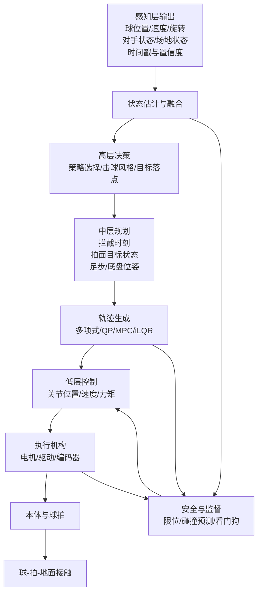

**上图是功能分层图**，回答"控制层有哪些模块，每个模块负责什么"：

| 层级 | 职责 | 一句话概括 |
|---|---|---|
| 感知层 | 输入源 | "看到了什么" |
| 状态估计与融合 | 把噪声观测变成可信状态 | "球在哪、往哪走" |
| 高层决策 | 选击球风格、目标落点 | "打什么球" |
| 中层规划 | 算拦截时刻、拍面目标、足步位姿 | "怎么打到" |
| 轨迹生成 | 把目标变成可执行轨迹 | "关节怎么动" |
| 低层控制 | 关节位置/速度/力矩闭环 | "电机怎么转" |
| 安全与监督 | 限位、碰撞预测、看门狗 | "出事怎么办" |

注意安全与监督是**旁路**——它从状态估计和轨迹生成两处取输入，输出到低层控制，意味着安全模块可以**拦截或覆盖**正常控制流。

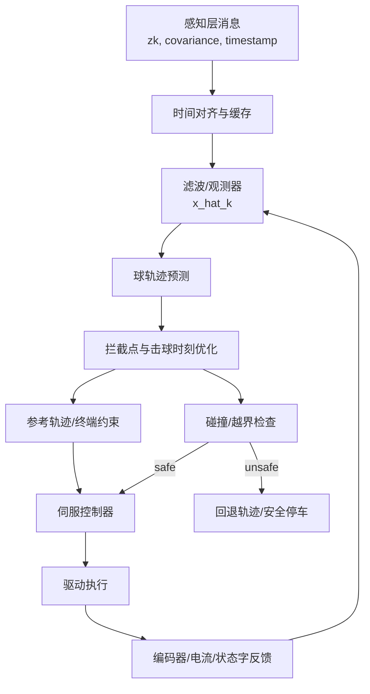

**上图（从上到下）是数据流闭环图**，回答"数据在模块之间怎么流动，闭环怎么形成"。

| 节点 | 数据内容 | 一句话概括 |
|---|---|---|
| 感知层消息 | $z_k$, 协方差, 时间戳 | "原始观测到了什么" |
| 时间对齐与缓存 | 按时间戳排序的观测队列 | "哪条观测是最新的" |
| 滤波/观测器 | 状态估计 $\hat{x}_k$ | "球和本体现在什么状态" |
| 球轨迹预测 | 未来球位置/速度序列 | "球会飞到哪里" |
| 拦截点与击球时刻优化 | 击球时刻 $t_{\text{hit}}$、拍面目标 | "什么时候打、怎么打" |
| 参考轨迹/终端约束 | 关节空间参考或终端条件 | "关节该怎么走" |
| 伺服控制器 | 关节位置/速度/力矩命令 | "电机该怎么转" |
| 驱动执行 | 电机电流/脉冲 | "实际驱动信号" |
| 编码器/电流/状态字反馈 | 关节角、力矩、故障码 | "实际做了什么" |
| 碰撞/越界检查 | safe/unsafe 判定 | "能不能安全执行" |
| 回退轨迹/安全停车 | 保底轨迹或紧急停车 | "出事怎么办" |


数据流闭环图特别强调了两个功能分层图没体现的东西：一是**反馈闭环**（驱动执行 → 编码器反馈 → 滤波），二是**安全分支**（拦截点优化之后有碰撞检查，safe 才走伺服控制，unsafe 走回退轨迹/安全停车）。

综合来看，**功能分层图决定模块职责，数据流闭环图决定时延来自哪里、缓存在哪里、什么情况下允许继续执行、什么情况下必须降级**。Ace 的系统公开展示了"感知—控制—硬件"三大部分，且将 RL 片段轨迹、复位轨迹与碰撞检查显式分离[³](#ref-ctrl-ace)；DeepMind 与 HITTER 则说明，技能层/规划层/执行层必须在逻辑上解耦，否则系统既难调参也难验证[¹](#ref-ctrl-deepmind)[²](#ref-ctrl-hitter)。

**控制层 Skill 与 Recipe 导航：**

| 控制层技术维度 | 对应 Skill | 推荐 Recipe |
|---|---|---|
| 球状态估计与滤波 | [ball-state-estimator](../../skills/ball-state-estimator/SKILL.md) | [deepmind-cv-kf](../../skills/ball-state-estimator/recipes/deepmind-cv-kf/RECIPE.md) · [eth-ekf-badminton](../../skills/ball-state-estimator/recipes/eth-ekf-badminton/RECIPE.md) · [latent-sliding-window](../../skills/ball-state-estimator/recipes/latent-sliding-window/RECIPE.md) |
| 球旋转估计 | [ball-spin-estimator](../../skills/ball-spin-estimator/SKILL.md) | [trajectory-magnus-spin](../../skills/ball-spin-estimator/recipes/trajectory-magnus-spin/RECIPE.md) · [event-camera-spin](../../skills/ball-spin-estimator/recipes/event-camera-spin/RECIPE.md) |
| MPC 约束优化控制 | [mpc-controller](../../skills/mpc-controller/SKILL.md) | [acados-rti-mpc](../../skills/mpc-controller/recipes/acados-rti-mpc/RECIPE.md) |
| 击球事件规划 | [hit-planner](../../skills/hit-planner/SKILL.md) | [mit-terminal-ocp](../../skills/hit-planner/recipes/mit-terminal-ocp/RECIPE.md) |
| 全身执行与协调 | [whole-body-executor](../../skills/whole-body-executor/SKILL.md) | [latent-humanoid-tennis](../../skills/whole-body-executor/recipes/latent-humanoid-tennis/RECIPE.md) · [hitter-wholebody-rl](../../skills/whole-body-executor/recipes/hitter-wholebody-rl/RECIPE.md) |
| 技能策略控制 | [skill-policy-controller](../../skills/skill-policy-controller/SKILL.md) | [hitter-wholebody-rl](../../skills/skill-policy-controller/recipes/hitter-wholebody-rl/RECIPE.md) · [deepmind-skill-selector](../../skills/skill-policy-controller/recipes/deepmind-skill-selector/RECIPE.md) |
| 球拍接触建模 | [ball-impact-contact](../../skills/ball-impact-contact/SKILL.md) | [mit-paddle-impact](../../skills/ball-impact-contact/recipes/mit-paddle-impact/RECIPE.md) |
| 不确定性与风险评估 | [model-uncertainty-risk](../../skills/model-uncertainty-risk/SKILL.md) | [ace-spin-state-fusion](../../skills/model-uncertainty-risk/recipes/ace-spin-state-fusion/RECIPE.md) |
| 安全监督与回退 | [safety-supervisor](../../skills/safety-supervisor/SKILL.md) | — |
| 发球机标定与控制 | [ball-launcher-executor](../../skills/ball-launcher-executor/SKILL.md) | [aimy-ball-launcher](../../skills/ball-launcher-executor/recipes/aimy-ball-launcher/RECIPE.md) |

## 数学模型、状态估计与感知接口

### 控制层状态空间定义

对球类机器人，真正可用的控制模型通常不是单个“完整真模型”，而是由三个子模型拼成的**灰盒组合模型**：

$$
x = \begin{bmatrix}
x_b \\ x_r \\ x_c
\end{bmatrix}
=
\begin{bmatrix}
p,\ v,\ \omega \\
q,\ \dot q,\ p_{\text{base}},\ \dot p_{\text{base}} \\
s_{\text{contact}},\ \hat d,\ \Delta t
\end{bmatrix},
\qquad
u=
\begin{bmatrix}
\tau \\
u_{\text{base}}
\end{bmatrix}
$$

**公式解读**：这是控制层使用的**灰盒组合状态-控制模型**。传统机器人控制通常只建模本体状态（关节角 + 关节角速度），但球类击球任务必须把"球的状态"和"接触/时延等环境信息"也纳入状态向量，否则控制器无法回答"球在哪、何时到达、接触后会发生什么"。

| 符号 | 含义 | 维度（典型值） | 为什么必须纳入状态 |
|---|---|---|---|
| $p$ | 球三维位置 | 3 | 击球点的核心输入 |
| $v$ | 球三维线速度 | 3 | 决定来球速度与拦截窗口 |
| $\omega$ | 球三维角速度 | 3 | 影响反弹方向、马格努斯力与拍面策略 |
| $q$ | 关节角度 | $n_j$（机械臂 6–8，人形 20+） | 本体运动学/动力学的基本坐标 |
| $\dot q$ | 关节角速度 | $n_j$ | 动力学方程的必要项 |
| $p_{\text{base}}$ | 底盘/基座位姿 | 3（移动平台）或 6（人形浮基） | 固定机械臂可省略；移动/人形平台必须建模 |
| $\dot p_{\text{base}}$ | 底盘/基座速度 | 同 $p_{\text{base}}$ | 动量与平衡计算需要 |
| $s_{\text{contact}}$ | 接触相 | 1（离散：左脚/右脚/双脚/飞行） | 决定哪些约束反力 $\lambda$ 活跃 |
| $\hat d$ | 扰动估计 | $n_j$ | 补偿未建模摩擦、碰撞冲击等 |
| $\Delta t$ | 时延 | 1 | 感知-控制-执行链路的总延迟 |
| $\tau$ | 关节力矩/电流命令 | $n_j$ | 直接驱动电机的控制量 |
| $u_{\text{base}}$ | 底盘/基座控制输入 | 取决于形态 | 固定机械臂可省略；人形扩展为足步序列/全身广义力/质心目标 |

对固定机械臂，$u_{\text{base}}$ 可省略；对人形或腿式平台，$u_{\text{base}}$ 则扩展为足步接触序列、全身广义力或质心目标。Ace、HITTER、LATENT、腿式羽毛球系统都表明：成功系统的状态并非只包含关节角，而必须显式引入球状态、接触时序、对手/目标约束以及安全相关信息[²](#ref-ctrl-hitter)[³](#ref-ctrl-ace)[⁴](#ref-ctrl-latent)[⁶](#ref-ctrl-eth-badminton)。

### 本体动力学与线性化

上一节定义了控制层的状态向量 $x$ 和控制输入 $u$，但"状态怎么随时间演化"这个问题还没有回答——这正是动力学方程的职责。动力学是控制层的**物理内核**：状态估计需要动力学做预测步（EKF/EKF 的先验），轨迹规划需要动力学做前推仿真（球路预测 + 机械臂可达性验证），MPC 需要动力学做约束和代价计算，伺服控制需要动力学做前馈补偿。可以说，控制层中除了纯逻辑判断（安全检查、模式切换）之外，几乎所有模块都直接或间接依赖动力学模型。

然而，工程上存在一个根本矛盾：**真实动力学是非线性的，但高效在线控制算法几乎都要求线性或凸模型**。LQR/LQG 要求线性时变模型；线性 MPC 要求凸二次规划；即使是非线性 MPC（如 acados RTI），内部也是在每一步对非线性动力学做线性化，再求解一个凸 QP 子问题。因此，从非线性动力学到线性化模型，不是"可选的简化"，而是**让控制器能在毫秒级采样周期内在线运行的必经之路**。下面的推导链条就是这条必经之路的具体路径：

$$\underbrace{M(q)\ddot q + C(q,\dot q)\dot q + g(q) + \cdots = \tau}_{\text{非线性刚体动力学（物理真相）}} \;\xrightarrow{\text{写成状态空间形式}}\; \underbrace{\dot x = f(x,u)}_{\text{一般非线性 ODE}} \;\xrightarrow{\text{离散化}}\; \underbrace{x_{k+1} = f_d(x_k, u_k)}_{\text{离散非线性模型}} \;\xrightarrow{\text{轨迹线性化}}\; \underbrace{\delta x_{k+1} = A_k \delta x_k + B_k \delta u_k}_{\text{线性时变模型（算法入口）}}$$

每一步箭头都有明确的工程动机，下文逐一展开。

#### 非线性刚体动力学：物理真相

机器人本体可统一写成标准刚体动力学形式：

$$
M(q)\ddot q + C(q,\dot q)\dot q + g(q) + \tau_f(\dot q) + J_c(q)^\top \lambda = \tau + \tau_d
$$

**公式解读**：这是机械臂/人形/移动平台通用的**刚体动力学方程**。等号左边是"阻碍运动的力"，右边是"驱动运动的力"。

| 项 | 数学形式 | 物理含义 | 工程意义 |
|---|---|---|---|
| 惯性力 | $M(q)\ddot q$ | 加速关节所需的力矩 | $M(q)$ 决定系统带宽上限；轻量化设计可减小 $M$，提高响应速度 |
| 科氏/离心力 | $C(q,\dot q)\dot q$ | 高速运动时关节间的耦合力 | 高速挥拍时不可忽略；若忽略会导致轨迹跟踪偏差 |
| 重力 | $g(q)$ | 抵抗重力所需的力矩 | 静态补偿即可；但不同构型下重力项变化大 |
| 摩擦 | $\tau_f(\dot q)$ | 关节/传动摩擦 | 低速爬行和方向切换时影响最大；通常需要实验辨识 |
| 接触/约束反力 | $J_c(q)^\top \lambda$ | 地面接触、球拍碰撞产生的外力 | 人形/腿式的关键项；接触模式变化时 $\lambda$ 的维度和值都变 |
| 关节力矩 | $\tau$ | 电机输出的驱动力矩 | 这是控制输入——我们能直接命令的量 |
| 未建模扰动 | $\tau_d$ | 上述所有项无法覆盖的力 | 包括碰撞冲击、缆线拉力、温度漂移等；需要观测器在线估计 |

上述通用刚体动力学方程对不同平台还需补充平台特有的约束项。对腿式/人形击球系统，基座不再固定于地面而是通过足-地接触"浮动"在空间中，因此必须引入浮动基座动力学——将基座的 6 个广义坐标（3 平移 + 3 旋转）纳入状态向量，并让基座加速度与关节加速度通过动量守恒耦合；同时，足-地接触力 $\lambda$ 必须满足互补性条件（法向力非负、切向力不超过摩擦锥），且接触模式（单支撑、双支撑、飞行）切换时 $\lambda$ 的维度和约束集都会突变，这就是接触一致性约束——控制器必须保证规划出的力/轨迹在当前接触模式下物理可行，否则会导致滑动或跌倒。对移动平台（差速底盘、全向轮底盘等），约束形态不同：差速底盘受非完整约束——底盘只能沿纵轴前进/转向，不能侧向平移，因此 $\dot x, \dot y, \dot\theta$ 之间不独立；全向轮底盘虽可解耦三自由度运动，但轮组运动学映射和地面滑移模型仍需显式建模。面对这些平台特有约束，不同系统采取了截然不同的工程策略：HITTER 人形乒乓系统观察到全身动力学（尤其是躯干和腿部的大惯量运动）与球拍末端击球任务之间存在强耦合——挥拍时躯干的角动量变化会显著影响拍面轨迹精度，若将两者放在同一个优化问题中联合求解，则问题维度高、非线性强、实时性难以保证，因此 HITTER 选择将"击球规划"与"全身稳定与协调"拆分为两个层级，上层专注末端轨迹优化，下层用 RL 学习全身协调策略以跟踪上层指令并维持平衡[²](#ref-ctrl-hitter)；MIT 轻量化乒乓机械臂则走了相反的路线——通过缩减自由度（仅保留挥拍平面的 2–3 个主动关节）和极致轻惯量设计，使惯性矩阵 $M(q)$ 的量级和条件数都大幅降低，从而让基于模型的控制器（MPC）能在更高带宽下运行，无需拆分层级即可在单一优化框架内完成击球轨迹生成与力矩控制[⁵](#ref-ctrl-mit)。

#### 从非线性到线性：为什么必须做线性化？

上面的刚体动力学方程 $M(q)\ddot q + C(q,\dot q)\dot q + \cdots = \tau$ 是一个**非线性、强耦合、时变**的方程——$M(q)$ 随构型变化，$C(q,\dot q)$ 依赖构型和速度，接触力 $\lambda$ 的维度随接触模式切换。直接把这个方程塞给优化器，在毫秒级采样周期内几乎不可能求解。工程上的出路是：**先在一条名义轨迹附近把非线性方程"局部拉直"为线性方程，再用高效的线性控制算法（LQR/LQG/线性 MPC）在线求解**。这就是下面三步推导的工程动机：

**第一步：写成状态空间形式。** 将二阶 ODE $M(q)\ddot q + \cdots = \tau$ 改写为一阶 ODE $\dot x = f(x,u)$，其中状态 $x = [q, \dot q]^\top$，控制 $u = \tau$。这一步是纯数学变换，没有近似，目的是把方程统一到控制理论的标准形式，方便后续离散化和线性化。

**第二步：离散化。** 控制算法在数字计算机上运行，必须把连续时间方程 $\dot x = f(x,u)$ 离散化为 $x_{k+1} = f_d(x_k, u_k)$。常用方法包括前向欧拉（$x_{k+1} \approx x_k + \Delta t \cdot f(x_k, u_k)$，简单但精度低）、零阶保持（假设 $u$ 在采样周期内恒定，精度更高）等。这一步引入的误差取决于采样频率——1 kHz 采样时欧拉法的截断误差通常可忽略。

**第三步：轨迹线性化。** 在名义轨迹 $(x^\star_k, u^\star_k)$ 附近对 $f_d$ 做一阶泰勒展开，得到线性时变方程 $\delta x_{k+1} = A_k \delta x_k + B_k \delta u_k + w_k$。这一步是核心近似——用局部线性模型代替全局非线性模型，代价是只在名义轨迹附近准确，远离名义轨迹时误差增大。

$$
\dot x = f(x,u),\qquad
x_{k+1}=f_d(x_k,u_k)
$$

**公式解读**：左式是连续时间非线性动力学（$\dot x$ 是状态对时间的导数），右式是离散时间形式（$f_d$ 是离散化后的状态转移函数，$k$ 是时间步）。控制算法在计算机上运行时必须使用离散形式，因此需要将连续动力学通过欧拉法、零阶保持等方法离散化为 $f_d$。

在名义轨迹 $(x^\star_k,u^\star_k)$ 附近作一阶展开：

$$
\delta x_{k+1}=A_k \delta x_k + B_k \delta u_k + w_k
$$

$$
A_k = \left.\frac{\partial f_d}{\partial x}\right|_{x^\star_k,u^\star_k},\qquad
B_k = \left.\frac{\partial f_d}{\partial u}\right|_{x^\star_k,u^\star_k}
$$

**公式解读**：这是非线性动力学的**轨迹线性化**——不是在某个固定平衡点线性化，而是在一条随时间变化的名义轨迹 $(x^\star_k, u^\star_k)$ 上逐点线性化。

| 符号 | 含义 | 说明 |
|---|---|---|
| $x^\star_k, u^\star_k$ | 名义轨迹 | 由上一轮规划或参考轨迹给出，是"我们期望系统走的路径" |
| $\delta x_k = x_k - x^\star_k$ | 状态偏差 | "实际状态偏离期望多远" |
| $\delta u_k = u_k - u^\star_k$ | 控制修正量 | "需要在名义控制基础上额外加多少修正" |
| $A_k$ | 状态矩阵（雅可比） | 描述状态偏差如何传播到下一时刻；每个采样时刻 $k$ 都不同 |
| $B_k$ | 输入矩阵（雅可比） | 描述控制修正量如何影响下一时刻状态偏差 |
| $w_k$ | 过程噪声/线性化残差 | 高阶截断误差 + 未建模动态；LQG 中建模为高斯噪声 |

**为什么用轨迹线性化而不是固定点线性化？** 球类击球是高加速度、强接触、大范围运动任务——系统不会停留在某个平衡点附近。如果只在一个固定点线性化，偏差会迅速增大导致控制器失效。轨迹线性化让 $A_k, B_k$ 随名义轨迹实时更新，保证在每个局部都足够准确。

这一线性时变模型是 LQR、LQG、线性 MPC、RTI-SQP 等在线算法的直接入口。若系统处于高加速度、强接触、强旋转工况，则不推荐长时间依赖单个平衡点线性化，而应采用**轨迹线性化**、**多模型切换**或**非线性 MPC**。acados 的 RTI 方案就是围绕“每个采样周期只做一次 SQP 迭代”这一思想展开，以便把强非线性问题压缩到在线可解范围[⁷](#ref-ctrl-acados)。

### 球飞行、旋转与接触模型

球飞行模型至少应包含重力、气动阻力与马格努斯力；对轻质量、高旋转球体，缺少旋转项通常会直接导致击球点和落点预测失效。可写为：

$$
\dot p = v
$$

$$
m\dot v = mg + f_d(v) + f_m(\omega,v)
$$

若采用二次阻力近似，则

$$
f_d(v) = -k_d \|v\| v
$$

马格努斯项可写为

$$
f_m(\omega,v)=k_m (\omega \times v)
$$

对旋转衰减可再加一阶项：

$$
\dot \omega = -k_\omega \omega + \eta_\omega
$$

Ace 公开指出高水平乒乓球的球速可超过 20 m/s、旋转可达 1000 rad/s，且旋转显著影响飞行与弹跳[³](#ref-ctrl-ace)；SpikePingpong 则专门把空气阻力与摩擦补偿纳入高频视觉—控制闭环，以提升击球接触预测与落点精度[⁸](#ref-ctrl-spike)。说明在控制层里，“球是外部扰动”的传统简化已经不足以支撑竞技级表现。

碰撞/击球瞬间更适合用**冲量模型**而不是持续力模型。若将球拍局部法向记为 $n$，击球前后速度分别为 $(v^-,\omega^-)$ 与 $(v^+,\omega^+)$，则可用恢复系数 $e_n$ 与切向库仑摩擦近似写成：

$$
v_n^+ = - e_n v_n^-
$$

$$
J_t = \operatorname{clip}\left(J_t^\star,\ \mu J_n\right)
$$

$$
\begin{bmatrix}
v^+\\ \omega^+
\end{bmatrix}
=
\begin{bmatrix}
v^-\\ \omega^-
\end{bmatrix}
+
M_{\text{impact}}^{-1}
\begin{bmatrix}
J_n n + J_t
\end{bmatrix}
$$

其中 $J_n$ 是法向冲量，$J_t$ 是切向冲量。工程上不必追求解析闭式极致精确，但必须通过**实验辨识**把 $e_n,\mu,k_d,k_m$ 调到对本机球拍、胶皮、球种与来球速度区间有效，否则规划器的“最优拍面”只会在仿真中成立。Ace 对不同旋转/速度区间的回球率统计[³](#ref-ctrl-ace)、MIT 平台对不同打球风格的离线优化[⁵](#ref-ctrl-mit)、SpikePingpong 对接触点与落点的精度约束[⁸](#ref-ctrl-spike)，都体现了接触模型辨识在控制链中的核心地位。

### 模型辨识与简化假设

前两节依次建立了本体动力学方程 $M(q)\ddot q + C(q,\dot q)\dot q + \cdots = \tau$、球飞行方程 $\dot v = g + f_d(v)/m + f_m(\omega,v)/m$ 以及球拍接触冲量模型——这些方程的**结构**（哪些力该出现、哪些项可省略）由物理决定，但方程中**每一个系数的具体数值**（连杆惯量、摩擦系数、阻力系数 $k_d$、马格努斯系数 $k_m$、恢复系数 $e_n$、切向摩擦 $\mu$……）却不会从物理推导中自动给出。**模型辨识**就是通过实验和数据，把这些未知参数从"符号"变成"数值"的过程。辨识质量直接决定前述所有动力学模型在工程中是否可用——参数偏差 10% 就可能让 EKF 预测步系统性地偏离真实轨迹，让 MPC 规划出的"最优拍面"只在仿真中成立。上一节末尾已经提到"必须通过实验辨识把 $e_n,\mu,k_d,k_m$ 调到对本机有效"，本节就把这个要求从"原则"展开为"可执行的辨识流程"。

对项目实施，建议把辨识分成四层：

| 辨识层 | 目标参数 | 常用方法 | 何时必须做 |
|---|---|---|---|
| 机械本体 | 连杆惯量、摩擦、回差、时延 | 逆动力学最小二乘、速度扫描、阶跃响应 | 立项早期就做 |
| 球飞行 | 阻力系数、旋转衰减、风场偏差 | 高速多视角轨迹拟合、灰盒最小二乘 | 感知层稳定后立即做 |
| 球拍接触 | 恢复系数、切向摩擦、旋转传递 | 发球机/固定夹具重复试验 | 击球规划前必须做 |
| 闭环残差 | 未建模柔性、结构延迟、执行器饱和 | 残差学习、在线校正、自适应估计 | 上机验证后持续做 |

“简化假设”同样必须写清楚。推荐默认采用以下假设：关节弹性与结构模态在低层伺服中被等效吸收；球拍接触持续时间远小于控制周期，可视为瞬时冲量；空气流场扰动在室内可近似平稳；若人形平台处于单/双支撑模式，则支撑相在一个局部 MPC 时域内已知。只要这些假设不再成立，就应切换到更强的模型或引入在线残差补偿。腿式羽毛球论文将系统辨识与感知噪声模型一并纳入部署过程[⁶](#ref-ctrl-eth-badminton)；LATENT 的开源实现则把动作追踪、在线蒸馏和高层策略学习拆开，说明“先辨识、再学习”比“一次性端到端”更现实[⁴](#ref-ctrl-latent)。

### 与感知层接口及观测器选择

控制层对“001 感知层”的接口，不应只接收位置点，而应最少接收以下字段：观测时间戳、球三维位置、线速度、角速度或旋转代理量、置信度/协方差、目标分类、疑似遮挡标记、消息延迟估计。Ace 的感知链在 200 Hz 估计球三维位置，并以约 400–700 Hz 输出球旋转估计[³](#ref-ctrl-ace)；其控制策略并非读取单帧观测，而是读取包含历史的状态序列。换句话说，控制层真正需要的不是“检测结果”，而是**可传播、可外推、可量化不确定度的状态估计**。

下表给出控制场景下观测器/滤波器的工程选择建议：

| 方法 | 核心思想 | 优点 | 缺点 | 适用场景 |
|---|---|---|---|---|
| 线性 KF | 线性高斯最优递推 | 计算量低、实现稳健 | 难覆盖强非线性飞行/接触 | 关节伺服、局部小范围线性系统 |
| EKF | 非线性模型一阶线性化 | 工程最成熟，易嵌入控制回路 | 需 Jacobian，强非线性时易失配 | 球轨迹预测、移动底盘状态融合 |
| UKF | Sigma 点传播均值与协方差 | 无需显式 Jacobian，强非线性更友好 | 计算量更高，调参更敏感 | 高旋转球飞行、复杂视觉几何 |
| 滑模观测器 | 用不连续注入项抑制有界扰动 | 对有界不确定性强鲁棒，可有限时间收敛 | 噪声下易抖振，需要边界层设计 | 摩擦/扰动观测、低层伺服增强 |
| 学习辅助观测器 | 模型外加残差网络 | 适应复杂偏差 | 需要数据与安全约束 | 高速视觉残差补偿、sim2real 修正 |

若系统优先追求**稳定上线**，推荐“EKF/UKF + 缓存外推 + 解析预测模型”的组合；若系统已进入高性能阶段，可以再加**扰动观测器/滑模观测器**估计摩擦、碰撞残差或执行器偏差；若系统跨域变化显著，再加**学习残差**。现有体育机器人公开工作中，EKF 仍是最常见中间方案，例如 Humanoid Badminton 在部署时明确使用 EKF 估计和预测羽毛球轨迹，并同时验证了“prediction-free”变体[⁹](#ref-ctrl-humanoid-badminton)；Ace 则把高频视觉输出通过不确定度筛选后再送入控制器，而非原始直通[³](#ref-ctrl-ace)。

### 时延、丢包与异步融合策略

高动态球类任务里，时延不是附属问题，而是控制层的一部分。DeepMind 的系统研究专门强调延迟治理的重要性[¹](#ref-ctrl-deepmind)；Ace 则把感知、策略、轨迹段和执行器时钟全部对齐到统一同步体系，并把策略动作变成 32 ms 局部终端约束再交给 1 kHz 执行层，从架构上消化算法频率与执行频率不一致的问题[³](#ref-ctrl-ace)。

建议采用以下处理链路：其一，**所有感知消息强制时间戳化**，控制器从环形缓冲区读取“最近可用且未过时”的状态；其二，若消息迟到但仍在固定时窗内，使用**Out-of-Sequence Measurement** 回放更新或短窗平滑；其三，若连续丢包，则用已知控制输入进行模型外推，并逐步增大协方差，必要时切入保守击球或复位模式；其四，若网络化闭环不可避免，可将随机时延与丢包显式纳入 MPC/SMPC。网络化控制与实时 NMPC 的研究表明，丢包、时延和测量噪声可以通过 EKF + MPC、随机 MPC 或补偿因子一并纳入；Ace 的“执行上一条已验证安全的 reset trajectory”则给出了非常实用的运动层回退范式。

## 控制算法体系与整定方法

### 经典控制与最优线性控制

**PID** 仍然是控制层不可替代的底座，但适合的层级主要是电流、速度、位置等低层闭环，而不是直接承担击球落点和旋转控制。PID 的核心思想是：观察误差 $e(t) = r(t) - y(t)$（参考值减实际值），从三个互补的时间视角提取信息，加权合成控制输出——比例项看"现在偏了多少"，积分项看"过去一直偏了多少"，微分项看"偏差正在以多快的速度扩大或缩小"。离散 PID 可写成：

$$
u_k = \underbrace{K_p e_k}_{\text{比例}} + \underbrace{K_i \sum_{i=0}^{k} e_i T_s}_{\text{积分}} + \underbrace{K_d \frac{e_k-e_{k-1}}{T_s}}_{\text{微分}}
$$

**比例项 $K_p e_k$**——"现在偏了就立即纠正"。误差越大，纠正力越大，就像弹簧偏离平衡位置越远恢复力越大。$K_p$ 越大系统响应越快，但纯 P 控制在大多数物理系统上无法消除稳态误差：当误差缩小到某个小值时，$K_p \cdot e$ 产生的力恰好与重力、摩擦等恒定扰动平衡，系统就"卡"在那里——误差不再缩小但也不为零，这就是需要积分项的原因。

**积分项 $K_i \sum e_i T_s$**——"历史欠账必须还清"。把过去所有时刻的误差累加起来，只要误差存在（哪怕很小），积分值就持续增长，推动控制输出继续增大，直到误差彻底归零。积分项最核心的价值是**消除稳态误差**——抵消恒定或缓慢变化的扰动（如重力偏置、摩擦偏置）。但积分项有严重的**饱和风险（windup）**：如果执行器已达到最大输出（如电机力矩已到上限）而误差仍然存在，积分项会继续累积；等误差终于变号时，积分项已积累了巨大的"欠账"，系统需要很长时间才能"还完"，导致严重超调和振荡。因此工程实现必须使用**反饱和回算（anti-windup）**：

$$
\dot I =
\begin{cases}
e, & u \text{ 未饱和}\\
0 \ \text{或}\ k_{aw}(u_{\text{sat}}-u), & u \text{ 饱和}
\end{cases}
$$

未饱和时正常积分；饱和时停止积分（$\dot I = 0$）或按饱和量与实际输出的差值回退积分（$k_{aw}(u_{\text{sat}} - u)$），防止积分项无限膨胀。此外还建议使用**积分分离**（误差大时关闭积分，避免启动时积分累积过大导致超调，误差小时再开启积分消除残余偏差）与**条件积分**（只在误差较小时才允许积分增长，与积分分离互补）。

**微分项 $K_d \frac{e_k - e_{k-1}}{T_s}$**——"预判趋势，提前刹车"。如果误差正在快速缩小，说明系统已在朝正确方向运动，此时不应继续大力推而应"提前刹车"防止冲过头。微分项就是这种阻尼——它反对误差的**变化率**而非误差本身，$K_d$ 越大系统越"沉稳"，但过大会让响应迟钝。微分项最大的工程问题是**噪声放大**：传感器读数中的小幅度快速波动，经过微分后会变成大幅度的控制抖动。因此建议使用**带一阶低通滤波的微分项**：

$$
\left.\frac{de}{dt}\right|_{\text{filtered}} \approx \frac{s}{\tau_f s + 1} \cdot e(s)
$$

其中 $\tau_f$ 是滤波时间常数——让微分项只响应低频趋势，不响应高频噪声。

**PID 在球类机器人中的定位**：PID 适合的场景是单输入单输出、近似线性、约束少、延迟小的低层闭环（电流环、速度环、位置环），在这些场景下 PID 以极低的计算成本和极高的可靠性提供"足够好"的控制性能。但 PID 不适合直接承担击球落点和旋转控制，原因有三：其一，落点由拍面角度、击球速度、球旋转等多个变量共同决定，是多输入多输出问题，PID 无法处理关节间耦合；其二，旋转传递涉及接触冲量模型，强非线性，PID 的线性假设失效；其三，力矩上限、关节限位、碰撞规避等硬约束，PID 没有显式约束处理机制。故推荐位置：**驱动器内环、关节伺服补偿、末端局部误差收敛**——在最底层做单变量闭环，把多变量、多约束、高非线性的问题交给上层的 MPC/LQR/RL。

**PID 与动力学前馈的配合**：实际工程中 PID 通常与动力学前馈配合使用（参见前文"伺服控制：动力学做前馈补偿"）：

$$
\tau_{\text{cmd}} = \underbrace{M(q)\ddot{q}_{\text{ref}} + C(q,\dot{q})\dot{q}_{\text{ref}} + g(q)}_{\text{前馈（动力学模型计算）}} + \underbrace{K_p e + K_i \int e\,dt + K_d \dot{e}}_{\text{PID 反馈（补偿残差）}}
$$

前馈负责"已知的、可预测的"部分（惯量、科氏力、重力），PID 反馈只负责"未知的、不可预测的"残差（摩擦偏差、扰动、模型误差）。这种分工让 PID 的负担大幅降低——它不需要对抗整个动力学，只需修正小残差，因此增益可以设低、鲁棒性更好。

**PID 整定实践要点**：先 P 后 I 再 D——先只开比例项，调到系统有响应但持续振荡；再加入微分项抑制振荡；最后加积分项消除稳态误差。对不同工作点（如不同关节角、不同负载）应使用不同的 PID 增益（增益调度），因为动力学参数 $M(q), C(q,\dot{q})$ 随构型变化，固定的 PID 增益不可能在所有构型下都最优。

**LQR/LQG** 适用于已经完成局部线性化、状态可观或可估的场景。与 PID 的"逐环调参"思路不同，LQR 是一种**全局最优**方法——它不是分别对每个状态/控制通道设增益，而是在一个统一的代价函数下，用数学方法一次性求出所有通道的最优反馈增益。

**代价函数**：LQR 的出发点是定义"什么是好的控制"——状态偏差越小越好，控制量越小越好，两者之间需要权衡。标准有限时域离散代价函数为：

$$
J = \sum_{k=0}^{N-1} \underbrace{(x_k^\top Q x_k + u_k^\top R u_k)}_{\text{每步代价}} + \underbrace{x_N^\top Q_f x_N}_{\text{终端代价}}
$$

| 符号 | 含义 | 工程解读 |
|---|---|---|
| $Q$ | 状态权重矩阵 | 对角元素越大，对应状态分量越"不允许偏离零"；例如关节位置误差的权重应大于关节速度误差的权重 |
| $R$ | 控制权重矩阵 | 对角元素越大，对应控制分量越"不允许用大力"；增大 $R$ 让控制更平缓但跟踪更慢，减小 $R$ 让控制更激进但可能振荡 |
| $Q_f$ | 终端状态权重 | 惩罚时域末端的残余偏差；通常设为 $Q_f \geq Q$ 以保证终端收敛 |
| $x_k^\top Q x_k$ | 状态代价 | 二次型——偏差越大惩罚越重，且不同状态分量之间可以有交叉惩罚（非对角 $Q$ 元素） |
| $u_k^\top R u_k$ | 控制代价 | 同理，力矩越大惩罚越重 |

$Q$ 与 $R$ 的相对大小决定了控制器的"性格"：$Q$ 大 $R$ 小 → 激进跟踪、大力输出；$Q$ 小 $R$ 大 → 保守控制、省力但跟踪慢。这就是 LQR 权重调节的物理直觉。

**最优反馈律**：LQR 的核心结论是——在给定线性系统 $\delta x_{k+1} = A_k \delta x_k + B_k \delta u_k$ 和上述二次代价函数的条件下，最优控制律是**状态的线性反馈**：

$$
u_k = -K_k x_k
$$

其中反馈增益矩阵 $K_k$ 由**离散 Riccati 方程**递推求解。Riccati 方程是一个从终端时刻 $N$ 向初始时刻 $0$ 逆向递推的矩阵差分方程，每一步的递推形式为：

$$
P_k = A_k^\top P_{k+1} A_k - A_k^\top P_{k+1} B_k (R + B_k^\top P_{k+1} B_k)^{-1} B_k^\top P_{k+1} A_k + Q
$$

$$
K_k = (R + B_k^\top P_{k+1} B_k)^{-1} B_k^\top P_{k+1} A_k
$$

其中 $P_k$ 是 Riccati 矩阵（代价-代价的"值函数"矩阵），从终端条件 $P_N = Q_f$ 开始逆向递推。关键性质：**一旦 $A_k, B_k, Q, R$ 给定，$K_k$ 可以完全离线计算好**，在线运行时只需做一次矩阵乘法 $u_k = -K_k x_k$，计算量极低。

**从 LQR 到 LQG——当状态不可直接测量时**：LQR 假设状态 $x_k$ 完全已知，但实际系统中很多状态无法直接测量（如球的旋转、关节的扰动估计），只能通过带噪声的观测 $z_k$ 间接推断。LQG（Linear Quadratic Gaussian）的解决方案是**分离原理**——用卡尔曼滤波器从观测中估计状态 $\hat{x}_k$，再用 LQR 律控制：

$$
u_k = -K_k \hat x_k
$$

分离原理保证了：在系统线性、噪声高斯的条件下，"最优估计 + 最优控制"的组合就是全局最优——不需要把估计和控制耦合在一起联合优化。这是 LQG 在工程中广泛使用的理论基础。

**LQR/LQG 与前文线性化模型的衔接**：LQR/LQG 的输入正是前文"轨迹线性化"得到的线性时变模型 $\delta x_{k+1} = A_k \delta x_k + B_k \delta u_k$。整个流程是：先用非线性动力学 $f(x,u)$ 在名义轨迹附近线性化得到 $A_k, B_k$，再用 Riccati 方程离线算出 $K_k$，在线时只需 $u_k = -K_k \hat{x}_k$。这意味着 LQR/LQG 的性能**强依赖线性化质量**——如果系统在名义轨迹附近确实近似线性，LQR 表现优异；如果非线性很强（如击球瞬间的接触力突变），线性化模型偏离真实动力学，LQR 的"最优"就只在纸面上成立。

**LQR/LQG 在球类机器人中的定位**：LQR/LQG 的优点是计算极低（在线只需矩阵乘法）、稳定性分析清晰（通过 $P_k$ 的正定性可严格证明闭环稳定）、权重调节直观（$Q/R$ 的物理意义明确）。缺点是性能强依赖线性化质量与可达性范围，且**无法处理约束**——力矩上限、关节限位、碰撞规避等硬约束在 LQR 框架内无法显式表达，只能事后裁剪（$u_k = \text{clip}(u_k, u_{\min}, u_{\max})$），而裁剪会破坏最优性甚至稳定性。对于球形平衡底盘这一歧义子问题，已有 ballbot 工作采用 LQR-PI 明显优于纯 LQR 和级联 PI-PD[¹¹](#ref-ctrl-ballbot)；对击球机械臂，则推荐将 LQR 用于**轨迹跟踪器**而不是直接用于击球策略生成——即上层规划器（MPC/RL）给出参考轨迹，LQR 在局部做高带宽跟踪，这样既利用了 LQR 的计算效率，又规避了它无法处理全局约束和非线性的短板。

**权重整定——Bryson 规则**：$Q, R$ 的维度可能很大（状态维度 $n_x$ + 控制维度 $n_u$），逐个手调不现实。Bryson 规则提供了一种系统化的初始化方法：对每个状态分量 $x_i$，设 $Q_{ii} = 1 / (x_{i,\max})^2$，其中 $x_{i,\max}$ 是该状态分量的最大允许偏差；对每个控制分量 $u_j$，设 $R_{jj} = 1 / (u_{j,\max})^2$。这样做的效果是**量纲归一化**——所有状态和控制项在代价函数中的贡献被缩放到同一量级，避免"大数值项主导、小数值项被忽略"的问题。初始化后，再按"位置误差 > 姿态误差 > 控制变化率"的优先级微调——位置跟踪是最重要的（击球精度），姿态次之（拍面角度），控制平滑性最次（力矩波动可容忍）。

### 约束优化控制与 MPC

MPC 是当前球类机器人控制层最具工程价值的方法。与 PID 的"只看当前误差"和 LQR 的"只看线性化模型"不同，MPC 的核心思想是：**在每个采样时刻，用动力学模型向前预测未来 $N$ 步，在满足所有约束的前提下，求解使代价函数最小的控制序列，然后只执行第一拍，下一个采样时刻重新规划**。这种"滚动优化"机制让 MPC 同时具备了三种能力：

| 能力 | PID/LQR 是否具备 | MPC 如何实现 |
|---|---|---|
| **未来预测** | 否（PID 只看当前，LQR 只看线性化后的无穷时域） | 通过动力学模型 $x_{i+1} = f_d(x_i, u_i)$ 前推 $N$ 步，显式考虑球路、拦截窗口、到达时间 |
| **约束处理** | 否（PID/LQR 无法显式处理力矩上限、关节限位等硬约束） | 约束直接写入优化问题：$u_{\min} \le u_i \le u_{\max}$，$x_i \in \mathcal{X}_{\text{safe}}$，求解器保证可行解满足所有约束 |
| **多目标权衡** | 有限（PID 只能调增益，LQR 只能调 $Q/R$） | 代价函数可同时包含跟踪误差、控制平滑、终端精度等多个加权项，求解器自动找到帕累托最优 |

**为什么 MPC 特别适合球类击球任务？** 球类击球是一个"终端事件驱动"的任务——击球质量取决于拍面与球接触瞬间的状态（位置、法向、速度），而非过程中的轨迹形状。MPC 可以把击球条件写成**终端约束**（而非逐时刻参考跟踪），让优化器自由安排挥拍路径，只要在击球时刻同时满足位置、朝向和速度三个条件即可。这种灵活性是 PID 和 LQR 无法提供的。

#### MPC 的数学形式

标准离散 MPC 形式为：

$$
\min_{\{x_i,u_i\}}
\sum_{i=0}^{N-1}
\left(
\|x_i-x_i^{\text{ref}}\|_Q^2 +
\|u_i-u_i^{\text{ref}}\|_R^2 +
\|\Delta u_i\|_S^2
\right)
+
\|x_N-x_N^{\text{ref}}\|_{Q_f}^2
$$

$$
\text{s.t.}\quad x_{i+1}=f_d(x_i,u_i),\quad
u_{\min}\le u_i\le u_{\max},\quad
x_i\in \mathcal X_{\text{safe}}
$$

| 项 | 含义 | 球类任务中的具体体现 |
|---|---|---|
| $\|x_i - x_i^{\text{ref}}\|_Q^2$ | 状态跟踪代价 | 过程中关节轨迹偏离参考的惩罚；$Q$ 越大跟踪越紧 |
| $\|u_i - u_i^{\text{ref}}\|_R^2$ | 控制代价 | 力矩偏离参考值的惩罚；$R$ 越大控制越平缓 |
| $\|\Delta u_i\|_S^2$ | 控制变化率代价 | 相邻时刻力矩跳变的惩罚；$S$ 越大力矩越平滑，防止结构振动 |
| $\|x_N - x_N^{\text{ref}}\|_{Q_f}^2$ | 终端代价 | 击球时刻终端状态偏离目标的惩罚；$Q_f$ 通常远大于 $Q$，确保击球精度 |
| $x_{i+1} = f_d(x_i, u_i)$ | 动力学约束 | 前文建立的离散动力学模型——MPC 的"物理引擎" |
| $u_{\min} \le u_i \le u_{\max}$ | 输入约束 | 电机力矩/电流的物理极限 |
| $x_i \in \mathcal{X}_{\text{safe}}$ | 安全约束 | 关节限位、速度限幅、碰撞避让区域 |

**对球类机器人的关键变体——终端约束驱动**：$x^{\text{ref}}$ 往往不是完整轨迹，而是"在拦截时刻满足拍面位置、法向方向、线速度和角速度范围"的**终端条件**。此时终端约束从软惩罚变为硬约束：

$$
x_N \in \mathcal{X}_{\text{terminal}} = \{x : p_{\text{paddle}} = p_{\text{des}},\ n_{\text{paddle}} = o_{\text{des}},\ v_{\text{paddle}} = v_{\text{des}}\}
$$

这意味着优化器**必须**在击球时刻把拍面送到指定位置、朝向和速度——不是"尽量接近"，而是"严格满足"。这种终端约束驱动的方式比逐时刻参考跟踪更适合击球任务，因为击球质量取决于接触瞬间的状态，而非过程中的轨迹形状。

#### MIT 轻量乒乓：终端约束 OCP + 固定时域 MPC

MIT 的核心策略是**用轻量化硬件缩减动力学复杂度，再用带终端约束的 OCP + 固定时域 MPC 在单一优化框架内完成击球轨迹生成与力矩控制**[⁵](#ref-ctrl-mit)。

**OCP 形式化**：MIT 将击球任务写成以下最优控制问题——优化整条挥拍轨迹，但只约束终端状态：

$$\min_{\mathbf{x}(\cdot),\mathbf{u}(\cdot)} \quad \int_0^{t_{\text{strike}}} \left[ \|\mathbf{x}(t) - \mathbf{x}_{\text{ref}}(t)\|_Q^2 + \|\mathbf{u}(t)\|_R^2 \right] dt$$

$$\text{s.t.} \quad \dot{\mathbf{x}} = f(\mathbf{x}, \mathbf{u})$$

$$\mathbf{p}_{\text{paddle}}(t_{\text{strike}}) = \mathbf{p}_{\text{des}}, \quad \mathbf{n}_{\text{paddle}}(t_{\text{strike}}) = \mathbf{o}_{\text{des}}, \quad \mathbf{v}_{\text{paddle}}(t_{\text{strike}}) = \mathbf{v}_{\text{des}}$$

$$\mathbf{q}_{\min} \le \mathbf{q}(t) \le \mathbf{q}_{\max}, \quad \dot{\mathbf{q}}_{\min} \le \dot{\mathbf{q}}(t) \le \dot{\mathbf{q}}_{\max}, \quad \boldsymbol{\tau}_{\min} \le \boldsymbol{\tau}(t) \le \boldsymbol{\tau}_{\max}$$

其中 $\mathbf{p}_{\text{des}}$ 由球轨迹预测给出，$\mathbf{o}_{\text{des}}$ 和 $\mathbf{v}_{\text{des}}$ 由击球风格决定——弧圈球（拍面前倾、拍速向上摩擦）、抽球（拍面垂直、拍速沿来球反方向）、削球（拍面后仰、拍速向下切削）对应不同的终端法向和速度。

**固定时域 MPC 包裹**：OCP 本身是开环优化——给定球预测生成一条完整挥拍轨迹。但实际运行中球预测随新观测不断更新，因此 MIT 将 OCP 包裹在固定时域 MPC 中：每当收到新的球预测 $(\mathbf{p}_{\text{des}}, t_{\text{strike}})$，以当前关节状态为初始条件重新求解 OCP，新解以上一轮 MPC 解为 warm-start，求解器使用 acados RTI 框架每个采样周期只做一次 SQP 迭代。若求解超时或不可行，输出上一条可行解（last-safe），而非等待新解。实测中 OCP/MPC 优化耗时 4.5–6.5 ms，总有效反应时间（从新球观测到电机执行新轨迹）为 7.5–16 ms[⁵](#ref-ctrl-mit)。

**MIT 路线的工程逻辑**：通过 5 DoF + 3 kg + 低转子惯量的硬件设计，将 OCP 状态维度压到 10 维，使 acados RTI 能在 5 ms 量级完成求解。如果采用 7 DoF 商用臂（状态 14 维 + 更大惯量），求解时间可能翻倍以上，MPC 频率下降。MIT 的论文明确指出："尽管强化学习在机器人控制领域被广泛看好，但传统约束优化依然有不可替代的价值"[⁵](#ref-ctrl-mit)——这条路线的核心是**硬件简化动力学，算法充分利用模型**。

#### Ace 系统：RL 产生短时目标，优化层负责执行

Ace（索尼 AI，2026 年 Nature 封面）的控制架构与 MIT 截然不同——它不是纯模型驱动的 MPC，而是**学习与优化的清晰分工**：RL 不直接输出电机力矩，而是输出短时抽象动作，再由约束优化器生成连续控制段并做碰撞检查[³](#ref-ctrl-ace)。

**32 ms 片段目标机制**：Ace 的核心创新是将 RL 输出映射为 32 ms 的终端约束，而非直接映射为力矩或关节角。RL 策略在 $t_k$ 时刻输出抽象动作 $a_k$，包含 skill_id（击球风格标识）、hit_pose_delta（目标击球位姿增量）、paddle_speed_delta（目标拍速增量）。执行层的约束优化器将 $a_k$ 转化为 32 ms 时间窗口内的终端约束（终端位置 = 当前位姿 + 增量，终端速度 = 默认拍速 + 增量），并在 1 kHz 频率下生成满足上述约束的连续轨迹段（segment trajectory），同时并行计算复位轨迹（reset trajectory）[³](#ref-ctrl-ace)。

**Ace 的 MPC 本质上是一个高频约束投影器**：它接收 RL 策略的"建议"（抽象动作），将其投影到动力学可行、约束满足的连续轨迹空间。如果 RL 建议的目标物理上不可行（如超出关节限位或导致自碰撞），优化器会自动将其投影到最近的可行点——这就是 Ace 论文中强调的"RL 输出经过约束优化器的过滤，不安全的目标会被投影到可行域"[³](#ref-ctrl-ace)。这种结构把学习系统限制在"决策建议"层，把硬约束、安全检查和执行频率交给可验证模块。

**安全回退设计**：Ace 的安全回退不是"空动作"或"零力矩"，而是一条预先验证过的保底轨迹（reset trajectory）。reset trajectory 与 segment trajectory 并行计算——在优化击球轨迹的同时，优化器也在计算一条安全的复位轨迹。如果碰撞检查失败，系统执行上一条已验证安全的 reset trajectory，而非尝试重新规划（重新规划可能超时）。Ace 的端到端延迟约 20.2 ms（对比人类精英选手约 230 ms），其中约束优化 + 碰撞检查约 1 ms[³](#ref-ctrl-ace)。

**MIT 与 Ace 的对比**：两个系统代表了 MPC 在球类机器人中的两种典型用法——

| 维度 | MIT | Ace |
|---|---|---|
| MPC 的角色 | **唯一控制器**——从球预测到力矩输出全由 MPC 完成 | **约束投影器**——MPC 只负责把 RL 建议投影到可行域 |
| 终端约束来源 | 球轨迹预测 + 击球风格参数（解析计算） | RL 策略输出（学习得到） |
| 模型依赖 | 强——5 DoF 精确动力学模型 + 集总阻力球模型 | 中——优化层用模型，策略层不直接用模型 |
| 频率 | ~120 Hz 重规划 + 1 kHz 插值执行 | 31.25 Hz RL 更新 + 1 kHz 优化执行 |
| 安全机制 | last-safe 回退（上一条可行解） | reset trajectory 并行计算 + 碰撞检查 |
| 适用条件 | 低维、模型准确、硬件轻量 | 高维、策略复杂、需要学习 |

#### MPC 三层实现详解

MPC 的关键不是"能否求出最优解"，而是"**能否在截止时间前稳定给出足够好的可行解**"。一个工程可用的 MPC 系统必须分为三层，每层都有明确的离线准备和在线职责：

**第一层：模型层——MPC 的物理基础**

| 离线准备 | 在线职责 |
|---|---|
| 建立动力学结构（哪些力该出现、哪些项可省略） | 接收最新状态估计 $\hat{x}_k$，更新初始条件 |
| 参数辨识（连杆惯量、摩擦系数、阻力系数 $k_d$、恢复系数 $e_n$ 等） | 少量参数在线修正（如扰动估计 $\hat{d}$、时延 $\Delta t$） |
| 定义约束集合（关节限位、速度限幅、力矩饱和、碰撞避让区域） | 根据当前接触模式切换约束集（如人形单/双支撑） |
| 设计终端代价与终端约束 | 根据球预测更新终端条件 $x_N^{\text{ref}}$ |

模型层的核心原则是**灰盒优先，残差学习后置**：先用物理知识建立方程结构（灰盒），用实验辨识参数，确保基本行为正确；只有当灰盒模型在特定工况下系统性偏差时，才在灰盒基础上加残差网络补偿。不要一开始就用纯黑盒模型——纯黑盒在训练数据外不可预测，且无法做约束分析。Ace 的经验也印证了这一点：团队发现物理模型对高速球的阻力估计偏高，这一洞察来自逐步提升对手强度后暴露的预测偏差，而非端到端学习[³](#ref-ctrl-ace)。

**第二层：求解层——MPC 的计算核心**

| 离线准备 | 在线职责 |
|---|---|
| 代码生成（acados CasADi 等工具生成 C 代码，避免在线解释开销） | 单次/少次 SQP 迭代（RTI 方案）或 QP 求解 |
| 稀疏结构利用（利用动力学约束的带状稀疏性加速求解） | warm-start：用上一轮解初始化当前轮 |
| condensing / 部分凝缩（消去状态变量，只对控制变量求解，降低 QP 维度） | 输出可行控制序列 $\{u_k, \ldots, u_{k+N-1}\}$ |
| 求解器选型与调参（qpOASES / OSQP / HPIPM 等） | 记录求解时间、KKT 残差、约束活跃集 |

求解层的核心策略是**RTI（Real-Time Iteration）**：每个采样周期只做一次 SQP 迭代，而非迭代到收敛。acados 的 RTI 方案将一次迭代拆为 preparation phase（线性化/二次化动力学与代价，可在上一拍结果基础上预计算）和 feedback phase（用最新状态解一个稀疏 QP），两者合计通常在 1–10 ms 内完成[⁷](#ref-ctrl-acados)。MIT 的实测数据：5 DoF 臂的 OCP 在 acados RTI 下耗时 4.5–6.5 ms[⁵](#ref-ctrl-mit)。warm-start 是必须的——没有 warm-start，冷启动求解时间可能从 5 ms 飙升到 50 ms 以上，远超控制周期。

**第三层：安全层——MPC 的底线保障**

| 离线准备 | 在线职责 |
|---|---|
| 定义碰撞包络（自碰撞检测、工作空间边界） | 可行性检查：求解是否成功？约束是否全部满足？ |
| 设置软/硬限位（关节软限位 = 减速区，硬限位 = 物理挡块） | 碰撞检查：规划轨迹是否会导致自碰撞或越界？ |
| 预计算复位轨迹（从任意构型回到准备姿态的安全路径） | 回退执行：若求解失败或碰撞检查未通过，执行 last-safe action 或 reset trajectory |

安全层的核心原则是**永远保留 last-safe action**：无论 MPC 求解成功与否，系统都必须有可执行的控制输出。求解成功时，输出当前最优解的第一拍；求解失败时，输出上一条已验证安全的控制片段或复位轨迹。Ace 的实现更进一步——在优化击球轨迹的同时并行计算 reset trajectory，确保任何时刻都有一条安全的回退路径可用[³](#ref-ctrl-ace)。绝对不能出现"求解失败时无输出"的情况——那意味着机械臂失控。

#### 实时 MPC 伪代码

```text
输入: x_hat_k, ball_pred_k, last_solution
输出: u_k

1. 根据 ball_pred_k 计算候选拦截时刻 t_hit 与终端约束 x_N^ref
2. 用 last_solution 对状态轨迹与控制轨迹 warm start
3. 执行一次 RTI / SQP:
  3.1 线性化/二次化动力学与代价
  3.2 解稀疏 QP
  3.3 得到可行控制序列 {u_k... u_k+N-1}
4. 若求解失败:
  4.1 输出上一次已验证的安全控制片段
  4.2 或执行 reset trajectory / safe-stop
5. 否则输出当前时刻第一拍 u_k
6. 记录求解时间、KKT 残差、约束活跃集与可行性标志
```

参数整定建议遵循"先约束、后性能"的顺序：先保证关节、速度、加速度、拍面姿态、碰撞距离和足底接触约束正确，再逐步增大落点误差权重、旋转目标权重与控制平滑项。若计算预算不足，优先减小预测步数、降低模型阶次、使用分层 MPC，而不是贸然提高采样周期。

### 非线性、鲁棒与自适应控制

当系统存在强接触、强摩擦、模型漂移或广工作空间变化时，非线性控制通常比单纯线性控制更稳妥。

**反馈线性化** 适合模型质量高、相对阶明确、工作区间可控的子系统，例如某些固定机械臂末端姿态通道。其优势是响应快、线性设计方便；缺点是对模型误差非常敏感，不适合直接覆盖球拍冲击和关节柔性。

**滑模控制/滑模观测器** 的价值在于对有界不确定性和扰动的强鲁棒性，尤其适合低层抗摩擦、抗参数漂移和扰动补偿。典型滑模面可写为：

$$
s = \dot e + \Lambda e
$$

控制律可取：

$$
u = u_{\text{eq}} - K \operatorname{sat}(s/\phi)
$$

其中 $u_{\text{eq}}$ 为等效控制，$\phi$ 是边界层厚度。工程上必须使用饱和函数、超扭转算法或低通重构，否则抖振会在高刚度驱动链中迅速放大。滑模更适合“伺服增强层”而非高层策略层。

**鲁棒控制** 的重点不是追求单工况最优，而是保证约束和稳定裕度在模型不确定时仍成立。对球类机器人，鲁棒思想通常体现为：对落点目标采用 tube MPC/约束收缩；对时延估计采用保守上界；对碰撞判断留出额外安全距离；对学习策略输出施加解析投影或安全盾。Ace 的执行逻辑非常接近这一思想：策略输出并不直接去打电机，而是先映射成可行约束，再经过碰撞检查，不安全就执行已验证过的 reset trajectory。

**自适应控制** 适合处理慢时变参数，如胶皮老化、击球面更换、负载变化、温度引起的摩擦改变等。建议放在两处：一是低层对摩擦/偏置做在线估计；二是中层对球拍接触参数做批次更新。若项目资源允许，优先使用“灰盒辨识 + 低维自适应”而不是全参数在线自适应，因为后者在高动态球类场景中调试成本极高。

### 学习型控制

学习型控制在球类机器人中的价值主要体现在三类问题：其一，**策略选择**，例如该用快平击还是重上旋；其二，**高维全身协调**，例如人形击球时臂腿躯干的协同；其三，**模型残差补偿**，例如感知偏差、接触误差和 sim2real 偏差。

当前最成熟的路线不是“端到端直接出电机电流”，而是**分层学习**。DeepMind 竞技乒乓用高层控制器选择低层技能，并持续更新对手统计量；Ace 用模型自由 RL 产生抽象动作，再映射为约束优化问题的终端条件；HITTER 用模型规划器产生击球目标，用 RL 全身控制器去实现；LATENT 则把数据处理、运动跟踪、在线蒸馏和高层策略学习明确拆分，并公开了部分代码。这个共同结构说明：在高动态任务中，学习最擅长的是“从高维状态到可执行策略的选择”，而不是替代所有控制基础设施。

若采用 RL，建议策略输出不要直接是力矩，而应是**技能标识、终端拍面状态、残差修正量或短时参考轨迹**。这样做有三个好处：可解释、可上约束、可安全回退。Ace 使用非对称 actor–critic，让 critic 在训练时看真值球状态，而 policy 只看带噪历史；DeepMind 通过自博弈与 sim-real 循环生成课程；LATENT 和 Humanoid Badminton 则通过阶段式课程学习整合足步与挥拍。

若采用模仿学习，建议把人类数据分为**原语级**而非整拍级：准备步、引拍、挥拍、收拍、复位。LATENT 的核心贡献正是证明，即便只有不完整的运动片段，只要经过修正与组合，仍可学习到自然且有效的网球击球行为。对工程团队而言，这意味着无需一开始就追求完美全身 MoCap 数据，可以先从少量高质量原语起步。

神经网络控制的参数整定，不建议从“奖励函数堆叠”开始，而应从**物理归一化指标**开始：落点误差、拍面姿态误差、击球成功、能耗、关节极限惩罚、碰撞惩罚、复位时间。训练时必须做时延、摩擦、视觉噪声与目标分布随机化；部署时必须有安全盾、动作限幅和监控器。DeepMind、Ace、腿式羽毛球和 HITTER 都强调了 sim2real、噪声模型、课程学习或辨识在部署中的决定性作用。

下表总结主要控制算法的选择逻辑：

| 算法 | 原理要点 | 优点 | 主要风险 | 推荐层级 |
|---|---|---|---|---|
| PID | 误差反馈 | 简单、稳定、易落地 | 不能显式处理约束 | 驱动/关节伺服 |
| LQR/LQG | 线性最优反馈 + 状态估计 | 计算极低、可分析 | 线性化范围有限 | 局部轨迹跟踪 |
| MPC | 滚动时域约束优化 | 能处理约束与预测 | 求解预算敏感 | 拦截/击球/全身协调 |
| 反馈线性化 | 消除系统非线性 | 响应快 | 对模型误差敏感 | 精准子系统控制 |
| 滑模/鲁棒 | 对有界扰动保持性能 | 抗不确定性强 | 抖振/保守性 | 低层补偿、安全增强 |
| 自适应 | 在线更新参数 | 适合慢时变 | 调参复杂 | 摩擦/接触参数修正 |
| RL/IL/NN | 数据驱动策略映射 | 适合高维策略与全身协同 | 可解释性与安全性弱 | 技能层/残差层 |

## 轨迹规划、实时实现与安全机制

### 轨迹规划与运动学

控制层中的“轨迹规划”至少包含三件事：**去哪儿拦截、如何到达、打完后如何复位**。Ace 的控制逻辑把 segment trajectory 和 reset trajectory 显式分开；HITTER 的规划器输出击球位置、速度与时机；MIT 方案则把拍面末端状态作为 OCP 终端约束。三者看似不同，本质却一致：规划变量不一定是整条轨迹，而可以是**拦截事件**。

因此，建议把规划分成两级：

其一是**全局/任务级规划**。对固定机械臂，它主要决定击球风格、目标落点和对手克制策略；对移动平台/人形，则还要决定站位、足步和躯干朝向。其二是**局部/运动级规划**，在短时域内求解拦截点、末端约束和关节/全身可行运动。DeepMind 的层级技能结构、HITTER 的模型规划器、Humanoid Badminton 的多阶段足步—挥拍耦合都证明：全局与局部混在一起会导致求解慢、调参难、复用差。

动态约束应至少包含：关节位置/速度/加速度/jerk、底盘或足底可达域、拍面法向与角速度窗口、接触前安全距离、桌面/球网/自碰撞约束。最优性指标则建议按优先级排序为：击球成功率、落点误差、旋转目标误差、恢复时间、能耗、安全裕度。对于高动态人形和四足系统，额外增加质心可达性、支撑多边形或全身动量约束。四足乒乓 MPC 和腿式羽毛球工作都说明，全身可达性与击球最优性必须在统一优化里协调，否则会出现“球能打到但身体站不住”的问题。

在方法上，推荐优先级如下：固定机械臂用**解析拦截 + QP/多项式轨迹 + 局部 MPC**；移动机械臂用**采样式站位规划 + 局部 MPC**；人形/腿式平台用**击球事件规划 + 全身 MPC 或 RL tracking**。如果系统刚起步，不建议一开始就用全维非线性全身最优控制覆盖全链路；更稳妥的路径是先做“事件规划 + 低维可行控制”，再逐渐加全身协调。

### 采样周期、软件架构与数值稳定性

若项目**未指定**实时性目标，建议采用多速率结构而非统一循环。经验上，上层技能选择和策略更新可以在 20–50 Hz 范围；局部重规划在 30–200 Hz；状态估计在 200 Hz 以上；外层连续轨迹跟踪在 0.5–2 kHz。Ace 已证明“31.25 Hz 策略 + 1 kHz 执行段 + 1 ms 硬件同步”是可行的；LATENT 开源管线则把动作数据对齐到 50 Hz 默认控制频率，适合人形策略训练。

软件架构建议遵循“**硬实时靠近硬件，复杂调度留给中间件**”原则。具体来说，驱动器控制、紧急停机、限位、看门狗、时间同步和故障状态机应尽量放在 MCU/RTOS/驱动器固件中；ROS 2 适合承担感知、策略、规划与监控，但其执行器和 DDS 通信需要经过实时分析与 tracing 才能达成可预测性；micro-ROS 适合把时间关键外设接到 MCU 侧，同时保留 ROS 2 生态。ROS 2 实时能力综述、micro-ROS 预算执行器和 ROS 2 tracing 工作都支持这一分工。

若系统需要更高算力或更低功耗，GPU/FPGA 可用于感知、轨迹预测或优化求解加速，但不建议把最终安全仲裁建立在“某块加速器必须在线”这一前提上。RobotCore 展示了 ROS 2 计算图在 CPU/FPGA 上的可加速路径，并用 tracing 揭示了通信瓶颈；这类方案适合在系统性能逼近极限时再引入，而不应作为首版控制层的唯一支柱。

数值稳定性方面，必须处理四类问题：一是积分器漂移与超调，要用反饱和与条件积分；二是优化器失可行，要用软约束、保守初值与 last-safe fallback；三是观测器协方差发散，要用噪声下界、延迟回放和可信度门控；四是浮点与微分噪声累积，要用统一量纲、状态归一化和导数滤波。对 ROS 2 硬件接口一类系统，延迟与反馈不同步会明显影响轨迹跟踪质量，因此必须把 command-to-feedback delay 单独记录并进入设计预算。

### 硬件接口与安全故障流程

硬件接口请求不在于“驱动得动”，而在于“**是否可同步、可回读、可降级**”。控制层至少需要：电机驱动状态字、编码器/IMU/力矩或电流反馈、时间戳、驱动故障码、急停链路回读、通信健康状态、温度与功率监测。没有这些接口，即便算法先进，也无法工程化验证。Ace 明确披露了其全系统 1 ms 同步与低层位置反馈特性；Fanuc ROS2 硬件接口工作则表明，即使存在不可忽视的命令—反馈延迟，只要接口层设计清晰，系统仍能实现小误差轨迹跟踪与碰撞规避。

建议的安全状态机为：**Normal → Guarded → Degraded → Safe Stop → E-stop**。Guarded 用于轻微异常，如观测抖动、约束临界；Degraded 用于连续丢帧、局部求解失败、单传感器失效；Safe Stop 用于执行平滑停车或复位轨迹；E-stop 用于硬件限位、严重碰撞风险、电源/驱动报警。Ace 的设计里，“碰撞预测失败则执行前一条已知安全 reset trajectory”是极值得借鉴的保护逻辑；说明安全回退不应是“空动作”，而应是一条**预先验证过的保底行为**。

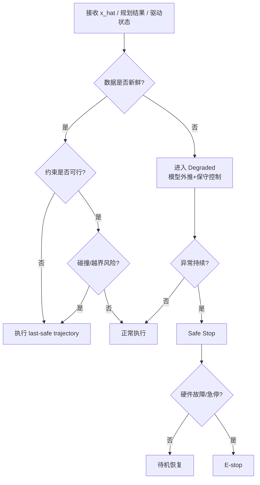

## 性能评估、参考实现与工程建议

### 评估指标与实验设计

控制层验证必须覆盖“局部伺服性能”和“任务级比赛性能”两套指标。前者建议包含：稳态误差、超调量、上升时间、95% 建立时间、轨迹 RMS 误差、采样抖动、求解时间分布、消息龄期 data age、能耗、温升与状态估计协方差。后者建议包含：击球成功率、回球率、落点误差、旋转误差、拦截时刻误差、复位时间、连续多拍长度、在不同来球速度/旋转区间下的成功率，以及人在环对抗胜率。Ace、MIT 与 SpikePingpong 的公开结果正分别对应了“比赛级胜率”“硬件击球成功率”和“目标区域精度”。

测试用例建议分四层推进。第一层是**部件层**：关节阶跃、正弦扫频、速度跟踪、饱和与反饱和验证。第二层是**击球层**：用发球机或固定球路验证不同速度、旋转、落点分布下的命中率与误差。第三层是**闭环层**：引入人工视觉时延、丢帧、通信抖动和错误时间戳。第四层是**比赛层**：人与机器人连续多拍、风格切换、对手未知条件下的适应性。ros2_fanuc_interface 的评估维度中包含阶跃响应、轨迹跟踪、碰撞规避与动态速度缩放，适合作为底层验证模板；Ace、DeepMind 与 HITTER 则给出了更高层任务化验证范式。

数据记录要求必须前置写入控制层设计：所有观测、估计、参考、求解时间、约束活跃集、最终执行命令、驱动反馈、故障状态与时间同步信息都应统一记录。Ace 把执行器和感知对齐到共享时钟；ROS 2 tracing 工作则说明，仅凭节点日志无法还原真正的关键路径。若团队采用 ROS 2，上机前应先建立 tracing 基线，否则很难定位性能瓶颈。

### 工程实例与参考实现

下表列出六个最值得参考的公开实现。它们不一定全部开源，但都代表了当前球类机器人控制层的不同主路线。

| 实现 | 主要控制范式 | 关键公开参数/结果 | 适用性评估 | 来源 |
|---|---|---|---|---|
| Ace 2026 | 感知驱动 RL + 约束优化 + 1 kHz 执行 | 8 自由度；9 APS + 3 GCS；31.25 Hz 策略；1 kHz 连续段；1 ms 同步；对精英选手 5 场赢 3 场 | 适合高预算竞技级系统，最值得参考的是分层时序与安全回退 | |
| DeepMind Competitive Robot Table Tennis | 高层技能选择 + 低层技能库 + sim2real | 29 场人机比赛，胜率 45%；有公开数据集仓库 | 适合作为“技能层控制架构”模板；源码不全，但数据与项目页有价值 | |
| MIT Lightweight Hardware MPC | OCP + 固定时域 MPC | 5 DoF 轻量高加速度机械臂；平均出球 11 m/s；三类球路 88% 成功率 | 适合固定机械臂、强调高带宽与解析可控性的工程路线 | |
| HITTER | 模型规划 + RL 全身控制 | 亚秒反应；可与人连续对打 106 拍 | 适合人形/双足路线，展示“规划与全身 RL 解耦”的有效性 | |
| SpikePingpong | 高频脉冲视觉 + 模仿学习/策略规划 | 20 kHz 脉冲相机；30 cm 目标区 91% 成功率，20 cm 目标区 71% | 适合强调感知—控制共设计、落点控制与极低时延场景 | |
| LATENT | 原语数据 + 跟踪预训练 + 在线蒸馏 + 高层策略 | Unitree G1；官方开源；默认 50 Hz 预处理；提供 MuJoCo 训练与部分真实部署参数 | 适合人形体育机器人，尤其适合作为“可复现实验管线”参考 | |

如果团队当前资源有限，我的工程建议不是从最复杂的人形系统开始，而是分三阶段推进。第一阶段做“**固定机械臂 + 灰盒球模型 + EKF + QP/MPC**”，目标是稳定命中和落点控制；第二阶段加入“**击球风格选择与残差学习**”，目标是提升适应性；第三阶段再进入“**移动/腿式/人形全身协调**”。MIT 和 DeepMind 的路线特别适合前两阶段，LATENT/HITTER 更适合第三阶段。

从实现优先级上，建议控制层按如下落地：先把模型、接口、频率和安全状态机定死；再做 PID/LQR 级低层闭环；再引入 MPC 负责拦截与约束；最后才在策略层或残差层接入学习。实践表明，真正难的不在“训练出一个能打球的网络”，而在“让系统在时延、丢包、传感器异常或对手变化时依然不出危险动作”。Ace、DeepMind 和 ROS 2 实时文献都支持这一优先级。

## 代表性控制工作逐项展开

**要点摘要：**控制层的论文工作可以按“技能分层、约束优化、全身控制、学习策略、安全回退”五条线理解。每条线解决的不是同一个问题，混在一起会导致方案看似先进、实现却无从落地。

### DeepMind 竞技乒乓：技能库与高层选择器

DeepMind 的控制路线可以概括为**高层选择、低层执行、持续适配**。低层技能负责具体击球动作，高层控制器根据来球状态、对手信息和回合上下文选择技能。这种结构的优势是把"如何挥拍"和"何时用哪种打法"拆开：低层可以针对固定动作做大量仿真和实机训练，高层则在较低频率上处理策略性决策。

该路线适合连续多拍，因为连续对拉不是每一拍都从零开始求解完整最优控制，而是不断在有限技能集合中选择、修正和复位。工程上要复用这条路线，必须准备三类接口：技能输入接口，例如目标击球点、拍面法向和期望出球；技能状态接口，例如是否可执行、预计完成时间、失败概率；技能后处理接口，例如复位轨迹和下一拍准备姿态。若没有这些接口，技能库会退化成一堆不可组合的动作脚本。

#### HLC + LLC 架构详解

DeepMind 的策略架构是两层而非端到端，高层控制器（HLC）负责技能选择，低层控制器（LLC）负责技能执行。两层之间通过**技能描述符（skill descriptor）**和**H-value 偏好表**衔接。

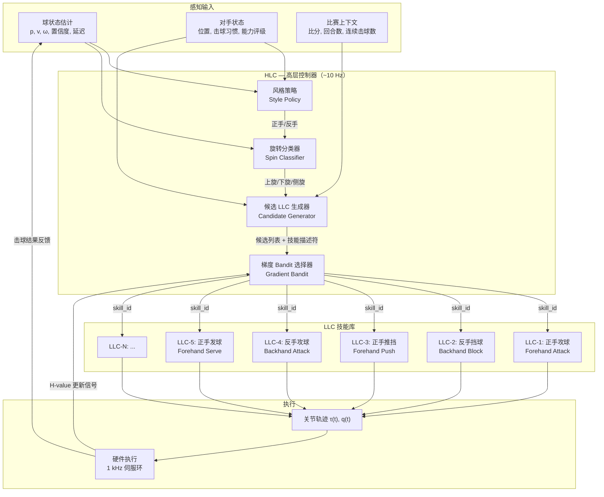

**HLC 的四步决策流程**：

| 步骤 | 模块 | 输入 | 输出 | 实现细节 |
|---|---|---|---|---|
| 1 | 风格策略（Style Policy） | 球位置 $p_b$、球速度 $v_b$、对手位置 | 正手/反手风格标签 | 简单规则策略或小型神经网络；决策频率约 10 Hz |
| 2 | 旋转分类器（Spin Classifier） | 球轨迹历史、视觉特征 | 上旋/下旋/侧旋分类 | 基于轨迹曲率或专用旋转估计网络 |
| 3 | 候选 LLC 生成器 | 风格标签 + 旋转分类 + 技能描述符 + 对手能力 | 候选 LLC 子集 | 用技能描述符过滤不可达/不适用的 LLC |
| 4 | 梯度 Bandit 选择器 | 候选 LLC 列表 + 各 LLC 的 H-value | 最终选中的 LLC | 在线学习，每拍更新 H-value |

**梯度 Bandit 与 H-value 机制**：

HLC 最终选择哪个 LLC，不是固定规则，而是通过**梯度 bandit 算法**在线学习偏好值（H-value）。每个 LLC $i$ 维护一个 H-value $H_i \in \mathbb{R}$，选择概率由 softmax 决定：

$$
\pi_i = \frac{e^{H_i}}{\sum_{j=1}^{N} e^{H_j}}
$$

每拍击球后，根据击球结果（命中/失误/出界/被对手得分等）计算奖励 $r \in [-1, 1]$，然后更新 H-value：

$$
H_i \leftarrow H_i + \alpha (r - \bar{r})(1 - \pi_i), \quad \text{if } i \text{ was selected}
$$

$$
H_j \leftarrow H_j - \alpha (r - \bar{r})\pi_j, \quad \text{if } j \neq i
$$

其中 $\alpha$ 是学习率，$\bar{r}$ 是滑动平均奖励。这种机制使系统能**在线适配对手**：如果某个 LLC 对当前对手效果差，其 H-value 会逐步下降，HLC 会自动切换到更有效的技能。

#### LLC 训练流程详解

每个 LLC 是一个**独立的 RL 策略**，在 MuJoCo 仿真中单独训练，专注于特定击球技能。训练流程分为五个阶段：

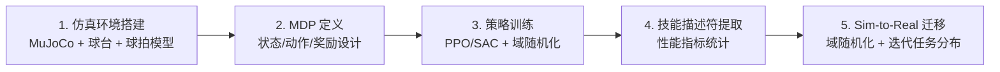

**阶段 1：仿真环境搭建**

在 MuJoCo 中构建完整的乒乓球仿真场景，包括：
- 球台（标准尺寸 2.74 m × 1.525 m，网高 0.1525 m）
- 乒乓球（40 mm 直径，2.7 g，恢复系数和摩擦系数按实测值设置）
- 球拍（含胶皮摩擦和弹性参数）
- 6-DOF ABB IRB 1100 机械臂 + 2 条线性导轨的 URDF/MJCF 模型
- 接触模型使用 MuJoCo 的顺应接触（compliant contact），避免刚性冲量的数值不稳定

**阶段 2：MDP 定义**

每个 LLC 的 MDP 根据其技能类型定制：

| MDP 元素 | 定义 | 说明 |
|---|---|---|
| 状态 $s$ | $[p_b, v_b, q, \dot{q}, p_{\text{base}}]$ + 历史观测窗口 | 球状态 + 本体状态 + 滑动窗口（通常 3–5 帧），延迟通过历史观测隐式处理 |
| 动作 $a$ | 目标关节角度增量 $\Delta q$ 或末端速度指令 | 不同 LLC 可用不同动作空间；攻球类用末端速度，定位类用关节增量 |
| 奖励 $r$ | 击球成功 + 落点精度 + 旋转匹配 + 动作平滑 | 多项加权；核心项是"球拍在正确时刻以正确姿态击中球" |
| 终止条件 | 击球成功 / 击球失败 / 超时 / 关节越界 | 每个回合（rally）是一个 episode |

以**正手攻球 LLC** 为例，奖励函数可写为：

$$
r = w_1 \cdot \mathbb{1}[\text{hit}] + w_2 \cdot \exp\left(-\frac{\|p_{\text{land}} - p_{\text{target}}\|^2}{2\sigma^2}\right) + w_3 \cdot \exp\left(-\|\dot{q}\|^2\right) - w_4 \cdot \mathbb{1}[\text{joint limit}]
$$

其中 $\mathbb{1}[\text{hit}]$ 是击中指示器，$p_{\text{land}}$ 是落点，$p_{\text{target}}$ 是目标落点，$\dot{q}$ 是关节速度（惩罚抖动），$\mathbb{1}[\text{joint limit}]$ 是关节越界惩罚。

**阶段 3：策略训练**

- **算法选择**：DeepMind 使用 PPO（Proximal Policy Optimization）作为主要训练算法，因其在连续控制中的稳定性和样本效率
- **域随机化（Domain Randomization）**：训练时对以下参数做随机化，以增强 sim-to-real 迁移能力：
  - 球的初始位置、速度和旋转（覆盖 5–20 m/s 速度范围，0–500 rad/s 旋转范围）
  - 球的恢复系数和摩擦系数（±20% 扰动）
  - 关节摩擦和阻尼（±15% 扰动）
  - 观测延迟（0–30 ms 随机延迟）
  - 观测噪声（位置 ±5 mm，速度 ±0.5 m/s）
- **迭代任务分布（Iterative Task Distribution）**：不是一次性从均匀分布采样，而是根据当前策略的表现动态调整训练任务难度。策略在简单任务上已收敛后，自动增加困难任务的比例（如更高球速、更大旋转、更偏的落点），使策略持续在能力边界上学习

**阶段 4：技能描述符提取**

训练完成后，每个 LLC 需要提取**技能描述符（Skill Descriptor）**，这是 HLC 做技能选择的核心依据。技能描述符是一组性能指标表：

$$
\mathcal{D}_i = \{(\theta_j, \mu_j^i, \sigma_j^i)\}_{j=1}^{M}
$$

其中 $\theta_j$ 是来球条件（如球速区间、旋转区间、落点区域），$\mu_j^i$ 是 LLC $i$ 在条件 $\theta_j$ 下的平均命中率，$\sigma_j^i$ 是命中率的方差。具体来说：

| 来球条件维度 | 分档 | 描述符记录内容 |
|---|---|---|
| 球速 $\|v_b\|$ | 慢（< 5 m/s）、中（5–10 m/s）、快（> 10 m/s） | 每档的命中率和落点误差 |
| 旋转 $\omega_b$ | 上旋、下旋、侧旋、无旋转 | 每类的命中率和回球质量 |
| 落点区域 | 正手侧、中路、反手侧 | 每区域的可达性和命中率 |
| 时间窗口 | 宽裕（> 0.5 s）、紧迫（0.3–0.5 s）、极限（< 0.3 s） | 每档的反应成功率 |

例如，正手攻球 LLC 的描述符可能显示：在球速 5–10 m/s、上旋、正手侧来球条件下，命中率 92%，落点误差 15 cm；而在球速 > 15 m/s、极限时间窗口下，命中率降至 45%。HLC 利用这些信息在候选 LLC 中筛选出当前条件下最可能成功的技能。

**阶段 5：Sim-to-Real 迁移**

DeepMind 采用**域随机化 + 迭代任务分布**的 sim-to-real 策略，而非端到端的系统辨识：

1. **域随机化**（已在训练阶段完成）：通过在仿真中随机化物理参数，使策略学到对参数变化鲁棒的行为
2. **实机验证与微调**：将仿真训练的策略直接部署到实机，记录失败案例，分析失败原因（如延迟估计不准、接触参数偏差）
3. **迭代任务分布更新**：根据实机失败分布，调整仿真中的任务采样分布，增加策略薄弱环节的训练比例
4. **技能描述符实机校准**：用实机数据更新技能描述符中的命中率和方差，确保 HLC 的决策基于真实性能而非仿真性能

#### LLC 运行时数据流

当系统处于比赛状态时，每个击球回合的数据流如下：

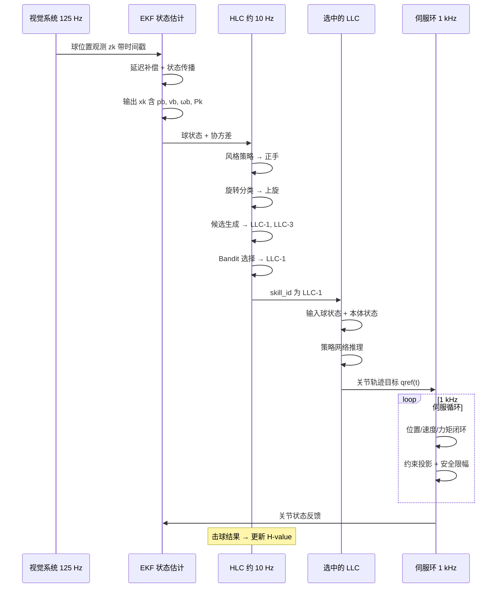

**关键时序分析**：

| 阶段 | 频率 | 延迟预算 | 数据格式 |
|---|---|---|---|
| 视觉检测 | 125 Hz | ~12 ms（曝光+传输+推理） | 球位置 $p_b$，像素坐标 → DLT → 三维 |
| EKF 更新 | 125 Hz | ~2 ms | 状态向量 $\hat{x}_k$，协方差 $P_k$ |
| HLC 决策 | ~10 Hz | ~5 ms | skill_id + 技能参数 |
| LLC 推理 | ~10 Hz | ~3 ms（网络前向） | 关节轨迹 $q_{\text{ref}}(t)$，$t \in [0, T_{\text{hit}}]$ |
| 伺服执行 | 1 kHz | < 1 ms | 关节力矩指令 $\tau$ |

从视觉观测到击球执行的端到端延迟约 20–30 ms。对于 20 m/s 的乒乓球，球在此时间内移动约 40–60 cm。EKF 的延迟补偿和协方差膨胀机制确保控制器知道"当前球位置的不确定度有多大"，从而在 HLC 层面做出保守或激进的技能选择。

#### LLC 技能库的工程接口

要使技能库可组合、可替换、可验证，每个 LLC 必须实现以下标准化接口：

```python
class LowLevelController:
    def __init__(self, skill_id: str, descriptor: SkillDescriptor):
        self.skill_id = skill_id
        self.descriptor = descriptor
        self.policy_network = load_policy(f"llc_{skill_id}.pt")

    def get_descriptor(self) -> SkillDescriptor:
        """返回技能描述符，供 HLC 做候选筛选"""
        return self.descriptor

    def is_reachable(self, ball_state: BallState, robot_state: RobotState) -> bool:
        """判断当前来球条件下该 LLC 是否可达（基于描述符的可达性表）"""
        condition = self._encode_condition(ball_state)
        return self.descriptor.reachability[condition] > REACH_THRESHOLD

    def compute_trajectory(self, ball_state: BallState, robot_state: RobotState) -> JointTrajectory:
        """策略网络推理，输出关节轨迹"""
        obs = self._build_observation(ball_state, robot_state)
        action = self.policy_network.forward(obs)
        return self._action_to_trajectory(action, robot_state)

    def get_expected_performance(self, ball_state: BallState) -> PerformanceEstimate:
        """返回当前条件下的预期命中率、落点误差等"""
        condition = self._encode_condition(ball_state)
        return self.descriptor.performance[condition]
```

**技能描述符的数据结构**：

```python
@dataclass
class SkillDescriptor:
    skill_id: str
    skill_type: str  # "forehand_attack", "backhand_block", etc.
    conditions: List[ConditionBucket]  # 来球条件分档
    performance: Dict[ConditionBucket, PerformanceEstimate]  # 每档性能
    reachability: Dict[ConditionBucket, float]  # 每档可达概率
    reset_time: float  # 技能执行后的复位时间（秒）
    min_preparation_time: float  # 最短准备时间（秒）

@dataclass
class PerformanceEstimate:
    hit_rate: float  # 命中率
    landing_error_mean: float  # 落点误差均值（米）
    landing_error_std: float  # 落点误差标准差（米）
    return_quality: float  # 回球质量评分（0-1）
    sample_count: int  # 统计样本数
```

#### 对本项目的工程启示

DeepMind 的 HLC+LLC 架构对本项目有三层直接启示：

1. **技能库应独立训练、独立验证**。不要试图用一个端到端网络同时学习"何时攻"和"如何攻"。先让每个 LLC 在仿真中收敛到稳定性能，再通过 HLC 组合。这样调试时可以单独定位问题——是技能选择错了，还是技能执行差了。

2. **技能描述符是分层架构的"粘合剂"**。没有描述符，HLC 只能盲目选择；有了描述符，HLC 可以根据当前来球条件精确筛选候选 LLC，避免选择一个在当前条件下注定失败的技能。描述符的统计必须基于足够多的仿真/实机样本，且应区分仿真性能和实机性能。

3. **H-value 在线学习使系统具备对手适配能力**。不同对手的打法风格不同，固定的技能选择规则无法适配。梯度 bandit 机制让系统在比赛中自动调整技能偏好——对攻击型对手增加防守技能权重，对防守型对手增加进攻技能权重。这种在线适配不需要重新训练 LLC，只需更新 HLC 的偏好值。


→ [skill-policy-controller Skill](../../skills/skill-policy-controller/SKILL.md) · [ball-state-estimator Skill](../../skills/ball-state-estimator/SKILL.md) · [deepmind-skill-selector Recipe](../../skills/skill-policy-controller/recipes/deepmind-skill-selector/RECIPE.md) · [deepmind-cv-kf Recipe](../../skills/ball-state-estimator/recipes/deepmind-cv-kf/RECIPE.md)

### MIT 轻量乒乓平台：OCP 与固定时域 MPC

MIT 仿生机器人实验室的核心贡献是：**用轻量化硬件缩减动力学复杂度，再用带终端约束的 OCP + 固定时域 MPC 在单一优化框架内完成击球轨迹生成与力矩控制**。这条路线与 HITTER 的"规划-RL 解耦"截然相反——MIT 不拆分层级，而是通过硬件设计让问题本身变简单，从而使基于模型的控制器能以高带宽在线运行[⁵](#ref-ctrl-mit)。

#### 轻量化硬件设计：从源头降低动力学复杂度

MIT 使用的是 MIT Humanoid 机械臂的定制 5 自由度版本，设计目标是让末端执行器加速度达到人类水平（180–300 m/s²），同时保持低惯量使模型控制器的带宽上限足够高。

| 参数 | 数值 | 工程意义 |
|---|---|---|
| 总质量 | 3 kg | 远低于 Kuka/WAM 等商用臂（10–30 kg），使惯性矩阵 $M(q)$ 量级大幅降低 |
| 主动自由度 | 5 DoF | 3 DoF 控制拍面位置 + 2 DoF 控制拍面法向；第 6 DoF（绕拍面法向旋转）被省略，因为不改变接触条件 |
| 肩/肘执行器 | 4× U10 电机 | 峰值力矩 34 Nm，有效转子惯量 0.00612 kg·m² |
| 腕部执行器 | 1× Dynamixel | 仅 82 g，负责拍面朝向，所需力矩极小 |
| 末端加速度 | 180–300 m/s² | 对比：Kuka IIWA 约 10–30 m/s²，差距一个数量级 |

**为什么省略第 6 自由度？** 乒乓球拍是近似对称的圆形，绕拍面法向的旋转不改变球-拍接触的物理条件（法向冲量、切向摩擦力均不受影响）。省略这个自由度直接将 OCP 的状态维度从 12 维降到 10 维，优化求解更快。

**为什么轻惯量比高力矩更重要？** 转子惯量通过减速比放大后反映到关节侧，是限制闭环带宽的主要因素。U10 的低转子惯量（0.00612 kg·m²）意味着电机可以快速加减速，MPC 的控制周期可以更短、跟踪误差更小。这正是 MIT 选择"硬件简化动力学"而非"算法补偿动力学"的工程逻辑。

#### 击球平面与工作空间分析

MIT 定义了一个**击球平面（strike-plane）**——穿过肩部、垂直于球台纵轴的 Y-Z 平面。机械臂在此平面内拦截来球。工作空间分析表明：在大面积区域内，拍面法向的平均朝向误差小于 10°（水平 ±15°、垂直 ±45° 扫掠范围内），证明 5 DoF 设计足以覆盖弧圈、抽球、削球三种击球风格的拍面朝向需求。

#### 球轨迹预测：集总阻力模型

MIT 的球预测模型采用**集总阻力参数（lumped drag）**，将所有影响气动阻力的物理量（球径、空气密度、阻力系数等）压缩为单一参数 $D$：

$$\mathbf{a}_{\text{Ball}} = -D\|\mathbf{v}\|\mathbf{v} + \mathbf{a}_g$$

$$v'_x = C_h \cdot v_x, \quad v'_y = C_h \cdot v_y, \quad v'_z = -C_v \cdot v_z$$

**公式解读**：飞行模型中 $D$ 是集总阻力系数，通过最小二乘拟合 $\|\mathbf{a}_{\text{Ball}} - \mathbf{a}_g\| = D\|\mathbf{v}\|^2$ 从实测轨迹中辨识；反弹模型中 $C_h$ 是水平恢复系数、$C_v$ 是垂直恢复系数，同样从实测反弹前后速度拟合。该模型**假设来球旋转为零且恒定**，因此不包含马格努斯力项——这对中低速来球足够，但对强旋转来球会引入预测偏差。

**速度估计方法**：对观测位置序列拟合三阶多项式，再对多项式求导得到速度估计，比有限差分更平滑。对预测的拦截位置 $\mathbf{p}_{\text{des}}$ 和击球时刻 $t_{\text{strike}}$ 使用 10 点滑动平均降低连续预测间的方差。

**预测精度**：球在台面反弹后（平均在击球前 0.25 秒），拦截位置误差降至球拍半径的一半以内，击球时刻误差在 0.25 ms 以内——这为 MPC 的有效运行提供了前提。

#### OCP 形式化：终端约束驱动的挥拍轨迹优化

MIT 将击球任务形式化为以下最优控制问题[⁵](#ref-ctrl-mit)：

$$\min_{\mathbf{x}(\cdot),\mathbf{u}(\cdot)} \quad \int_0^{t_{\text{strike}}} \left[ \|\mathbf{x}(t) - \mathbf{x}_{\text{ref}}(t)\|_Q^2 + \|\mathbf{u}(t)\|_R^2 \right] dt$$

$$\text{s.t.} \quad \dot{\mathbf{x}} = f(\mathbf{x}, \mathbf{u})$$

$$\mathbf{p}_{\text{paddle}}(t_{\text{strike}}) = \mathbf{p}_{\text{des}}$$

$$\mathbf{n}_{\text{paddle}}(t_{\text{strike}}) = \mathbf{o}_{\text{des}}$$

$$\mathbf{v}_{\text{paddle}}(t_{\text{strike}}) = \mathbf{v}_{\text{des}}$$

$$\mathbf{q}_{\text{min}} \leq \mathbf{q}(t) \leq \mathbf{q}_{\text{max}}, \quad \dot{\mathbf{q}}_{\text{min}} \leq \dot{\mathbf{q}}(t) \leq \dot{\mathbf{q}}_{\text{max}}, \quad \boldsymbol{\tau}_{\text{min}} \leq \boldsymbol{\tau}(t) \leq \boldsymbol{\tau}_{\text{max}}$$

**公式解读**：

| 项 | 含义 | 工程要点 |
|---|---|---|
| 代价函数 | 过程轨迹偏离参考的惩罚 + 控制力矩的惩罚 | 参考轨迹 $\mathbf{x}_{\text{ref}}$ 由上一轮 MPC 解给出；$Q$ 和 $R$ 的权重需调谐 |
| 动力学约束 $\dot{\mathbf{x}} = f(\mathbf{x}, \mathbf{u})$ | 机械臂刚体动力学 | 5 DoF 臂的动力学模型，维度低、模型准 |
| 终端位置约束 | 击球时刻拍面必须到达预测拦截点 | 由球轨迹预测给出 $\mathbf{p}_{\text{des}}$ |
| 终端朝向约束 | 击球时刻拍面法向必须对准目标方向 | 由击球风格决定 $\mathbf{o}_{\text{des}}$（弧圈/抽球/削球对应不同法向） |
| 终端速度约束 | 击球时刻拍面速度必须匹配目标拍速 | 由目标落点和回球速度决定 $\mathbf{v}_{\text{des}}$ |
| 过程约束 | 关节角/角速度/力矩的硬限制 | 防止超限损坏硬件 |

**终端约束是核心**：MIT 不追求整条轨迹跟踪某个预设路径，而是只约束击球时刻的终端状态。这意味着优化器有极大的自由度来安排挥拍过程——可以走弧线、可以加速-减速-再加速，只要在 $t_{\text{strike}}$ 时刻拍面同时满足位置、朝向和速度三个条件即可。这种"终端约束驱动"的方式比"逐时刻参考跟踪"更适合击球任务，因为击球质量取决于接触瞬间的状态，而非过程中的轨迹形状。

**三种击球风格的终端条件差异**：

| 击球风格 | 拍面法向 $\mathbf{o}_{\text{des}}$ | 拍速 $\mathbf{v}_{\text{des}}$ | 物理效果 |
|---|---|---|---|
| 弧圈球（loop/topspin） | 拍面略前倾，法向偏上 | 拍速向上"摩擦"为主 | 球获得上旋，弧线高、落台后前冲 |
| 抽球（drive/flat） | 拍面近似垂直于来球方向 | 拍速沿来球反方向，速度最大 | 球几乎无旋转，直线快速 |
| 削球（chop/backspin） | 拍面后仰，法向偏下 | 拍速向下"切削" | 球获得下旋，弧线低、落台后减速 |

#### 固定时域 MPC 实现

OCP 本身是一个开环优化——给定当前球预测，生成一条从当前状态到击球时刻的完整挥拍轨迹。但在实际运行中，球预测会随新观测不断更新，因此 MIT 将 OCP 包裹在固定时域 MPC 中：

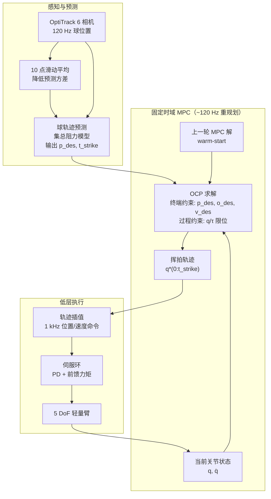

**MPC 运行逻辑**：

1. 每当收到新的球预测 $(\mathbf{p}_{\text{des}}, t_{\text{strike}})$，MPC 以当前关节状态为初始条件，重新求解 OCP
2. 新解以**上一轮 MPC 解为 warm-start**，大幅减少迭代次数
3. 若求解超时或不可行，输出**上一条可行解（last-safe）**，而非等待新解
4. 求解器使用 acados 的 RTI（Real-Time Iteration）框架，每个采样周期只做一次 SQP 迭代

**关键整定点**：

| 整定项 | 原则 | 违反后果 |
|---|---|---|
| 终端约束权重 | 必须高于过程轨迹平滑权重 | 拍面到位不足，击球点偏移 |
| 控制量变化率 / jerk 约束 | 必须保留 | 高速回击引发结构振动，长期损伤减速器 |
| warm-start 策略 | 必须启用 | 冷启动求解时间 > 50 ms，远超控制周期 |
| last-safe 回退 | 必须实现 | 求解失败时无输出，机械臂失控 |

#### 系统通信与延迟预算

MIT 系统由三台计算机通过 LCM + NatNet 以太网通信：

| 阶段 | 延迟 | 说明 |
|---|---|---|
| 通信延迟（相机→预测→优化→电机） | 0.2–0.6 ms | LCM + NatNet 以太网传输 |
| 球轨迹预测 | 0.5–7.0 ms | 飞行动力学积分 + 反弹处理 |
| OCP/MPC 优化 | 4.5–6.5 ms | acados RTI 单次 SQP 迭代 |
| **总有效反应时间** | **7.5–16 ms** | 从新球观测到电机执行新轨迹 |

对比：HITTER 的总延迟约 300–500 ms（主要由球飞行时间决定），MIT 的 7.5–16 ms 反应时间极短，这得益于 5 DoF 低维模型的快速求解和轻量臂的高带宽执行。

#### 硬件评估结果

| 指标 | 数值 | 说明 |
|---|---|---|
| 三种击球总成功率 | 88%（150 球测试） | 弧圈/抽球/削球均 > 87% |
| 平均出球速度 | 11 m/s | 对比：人类弧圈球约 21 m/s，抽球约 25 m/s |
| 最高出球速度 | 19 m/s | 弧圈球峰值 |
| 挥拍时间 | ~0.5 s | 从启动到击球 |
| 追踪系统 | OptiTrack 6 相机，120 Hz | 使用反光贴球，非标准球 |

#### 对本项目的工程启示

1. **硬件简化动力学是有效的工程路线**。MIT 通过 5 DoF + 3 kg + 低转子惯量设计，将 OCP 的状态维度压到 10 维，使 acados RTI 能在 4.5–6.5 ms 内完成一次求解。如果采用 7 DoF 商用臂（状态 14 维 + 更大惯量），求解时间可能翻倍以上，MPC 频率下降，反应变慢。对本项目首版，若采用固定机械臂路线，应优先选择低惯量、短传动链的设计。

2. **终端约束驱动比逐时刻参考跟踪更适合击球任务**。击球质量取决于接触瞬间的拍面状态，而非过程中的轨迹形状。终端约束方式给优化器更大的自由度来安排挥拍路径，同时保证击球时刻的物理条件被严格满足。这一思想与 Ace 的"32 ms 终端约束"和 HITTER 的"低维击球目标接口"本质一致——**规划器输出的是拦截事件，而非整条轨迹**。

3. **集总阻力模型是快速落地的起点，但旋转感知是后续必选项**。MIT 的球预测假设来球旋转为零，这对中低速来球足够，但对竞技级强旋转来球会引入显著预测偏差。本项目首版可从集总阻力模型起步，但应在第二阶段加入旋转估计（马格努斯力项），否则击球成功率在强旋转条件下会显著下降。

4. **MPC 的 warm-start 和 last-safe 回退不是可选优化，而是必须实现的安全底线**。没有 warm-start，求解时间可能从 5 ms 飙升到 50 ms 以上；没有 last-safe 回退，求解失败时机械臂会失控。这两项是 MPC 工程落地的最低要求。

→ [mpc-controller Skill](../../skills/mpc-controller/SKILL.md) · [hit-planner Skill](../../skills/hit-planner/SKILL.md) · [ball-flight-model Skill](../../skills/ball-flight-model/SKILL.md) · [acados-rti-mpc Recipe](../../skills/mpc-controller/recipes/acados-rti-mpc/RECIPE.md) · [mit-terminal-ocp Recipe](../../skills/hit-planner/recipes/mit-terminal-ocp/RECIPE.md) · [mit-lumped-drag Recipe](../../skills/ball-flight-model/recipes/mit-lumped-drag/RECIPE.md)

### Ace 系统：RL 产生短时目标，优化层负责执行

Ace（索尼 AI）于 2026 年登上 Nature 封面，是首个在正式比赛规则下击败人类精英乒乓球选手的机器人系统。其控制架构的核心思想是**学习与优化的清晰分工**：RL 不直接输出电机力矩，而是输出短时抽象动作或终端目标，再由优化器生成连续控制段并做碰撞检查。这种结构把学习系统限制在"决策建议"层，把硬约束、安全检查和执行频率交给可验证模块。

#### Ace 的分层控制架构

Ace 的控制架构分为三层：感知层、策略层、执行层。三层之间通过**32 ms 片段目标**和**1 kHz 连续控制段**衔接。

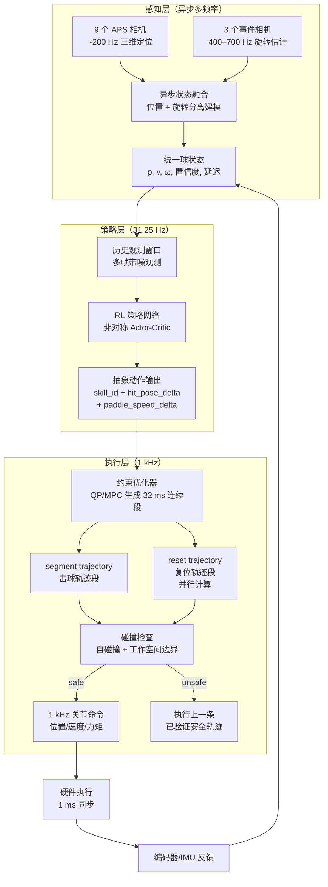

**三层频率与时序**：

| 层级 | 频率 | 功能 | 输出 |
|---|---|---|---|
| 感知层 | 200 Hz（位置）/ 400–700 Hz（旋转） | 多相机三维重建 + 旋转估计 + 异步融合 | 统一球状态 $[p, v, \omega, P]$ |
| 策略层 | 31.25 Hz（32 ms 周期） | RL 策略推理 | 抽象动作：skill_id + 终端约束增量 |
| 执行层 | 1 kHz | 约束优化 + 碰撞检查 + 连续控制 | 关节位置/速度/力矩命令 |

**32 ms 片段目标机制**：

Ace 的核心创新之一是**将 RL 输出映射为 32 ms 的终端约束**，而非直接映射为力矩或关节角。具体来说：

1. RL 策略在 $t_k$ 时刻输出抽象动作 $a_k$，包含：
   - `skill_id`：击球风格标识（攻球/挡球/推球等）
   - `hit_pose_delta`：目标击球位姿相对于当前位姿的增量
   - `paddle_speed_delta`：目标拍速相对于默认拍速的增量

2. 执行层的约束优化器将 $a_k$ 转化为 32 ms 时间窗口内的终端约束：
   - 终端位置约束：$p_E(t_k + 32\text{ms}) = p_{\text{current}} + \Delta p_{\text{hit}}$
   - 终端速度约束：$\dot{p}_E(t_k + 32\text{ms}) = v_{\text{default}} + \Delta v_{\text{paddle}}$
   - 过程约束：关节限位、速度限幅、力矩饱和

3. 优化器在 1 kHz 频率下生成满足上述约束的连续轨迹段（segment trajectory），同时并行计算复位轨迹（reset trajectory）

这种机制的优势：
- **频率解耦**：RL 策略只需 31.25 Hz 运行，不受 1 kHz 执行频率限制
- **安全可验证**：RL 输出经过约束优化器的"过滤"，不安全的目标会被投影到可行域
- **连续性保证**：每个 32 ms 段之间通过优化器保证轨迹连续，避免力矩跳变

#### Ace 的 RL 策略训练

Ace 使用**非对称 Actor-Critic**架构训练 RL 策略：

| 组件 | 输入 | 输出 | 说明 |
|---|---|---|---|
| Actor（策略网络） | 多帧带噪历史观测 | 抽象动作 $a_k$ | 部署时只运行 Actor |
| Critic（价值网络） | 真值球状态 + 完美观测 | 价值估计 $V(s)$ | 仅训练时使用，提供更准确的价值梯度 |

**非对称设计的意义**：Critic 在训练时可以看到真值球状态（来自仿真器的完美信息），而 Actor 只能看到带噪的历史观测。这样 Critic 能提供更准确的价值梯度，引导 Actor 学会在噪声和延迟条件下做出鲁棒决策。部署时只保留 Actor，不需要真值信息。

**训练关键要素**：
- **奖励函数**：击球成功率 + 落点精度 + 回球质量 + 动作平滑 + 复位时间
- **域随机化**：球速/旋转/延迟/噪声/摩擦参数的随机化，覆盖竞技级来球条件（球速 > 20 m/s，旋转 > 1000 rad/s）
- **课程学习**：从慢球/无旋转开始，逐步增加球速和旋转难度
- **自博弈训练**：让策略与自身对打，自动生成多样化的训练场景

#### Ace 的安全回退机制

Ace 的安全设计是工程落地的关键参考：

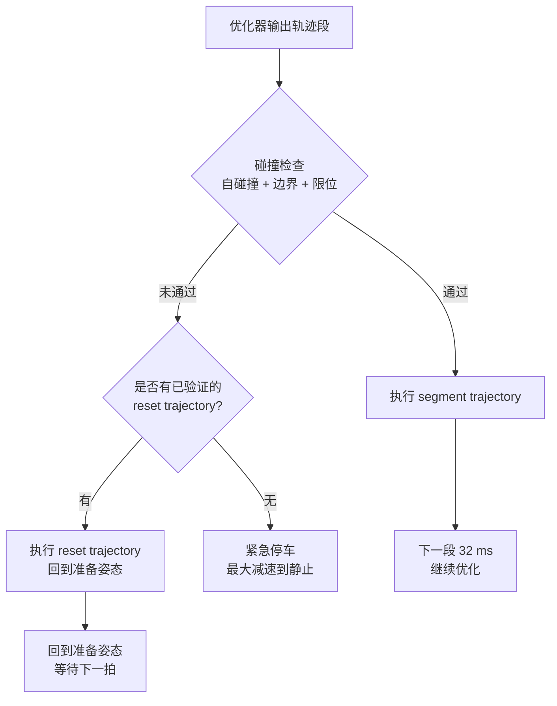

**关键设计原则**：
- 安全回退不是"空动作"或"零力矩"，而是一条**预先验证过的保底轨迹**（reset trajectory）
- reset trajectory 与 segment trajectory **并行计算**：在优化击球轨迹的同时，优化器也在计算一条安全的复位轨迹
- 如果碰撞检查失败，系统执行上一条已验证安全的 reset trajectory，而非尝试重新规划（重新规划可能超时）

#### Ace 运行时数据流

```mermaid
sequenceDiagram
    participant CAM as 多相机系统
    participant FUSE as 异步状态融合
    participant RL as RL 策略 31.25 Hz
    participant OPT as 约束优化器 1 kHz
    participant HW as 硬件执行 1 kHz

    CAM->>FUSE: APS 位置 ~200 Hz
    CAM->>FUSE: 事件相机旋转 400–700 Hz
    FUSE->>FUSE: 异步融合 + 延迟补偿
    FUSE->>RL: 统一球状态 + 历史窗口

    RL->>RL: Actor 网络推理 ~3 ms
    RL->>OPT: 抽象动作 a_k

    loop 每 1 ms 执行循环
        OPT->>OPT: 约束优化生成轨迹段
        OPT->>OPT: 碰撞检查
        OPT->>HW: 关节命令
        HW->>FUSE: 编码器/IMU 反馈
    end

    Note over OPT: 并行计算 reset trajectory
    Note over RL: 每 32 ms 更新一次抽象动作
```

**端到端时序分析**：

| 阶段 | 延迟 | 说明 |
|---|---|---|
| 相机采集 + 三维重建 | ~8 ms | APS 相机曝光 + 传输 + DLT 三角化 |
| 旋转估计 | ~3 ms | 事件相机处理 + 旋转拟合 |
| 异步融合 | ~2 ms | 位置与旋转状态合并 + 延迟补偿 |
| RL 策略推理 | ~3 ms | Actor 网络前向传播 |
| 约束优化 + 碰撞检查 | ~1 ms | QP/MPC 求解 + 安全验证 |
| **总计** | **~17 ms** | 从视觉采集到关节命令 |

对于 20 m/s 的来球，17 ms 延迟意味着球在此时间内移动约 34 cm。Ace 通过以下方式补偿延迟：
- **历史观测窗口**：RL 策略输入包含多帧历史，隐式学习延迟补偿
- **预测性优化**：约束优化器使用 EKF 预测的球状态，而非当前观测
- **1 ms 全系统同步**：所有传感器和执行器对齐到共享时钟，消除时钟漂移带来的额外延迟

#### 对本项目的工程启示

1. **RL 输出不应直接驱动机电硬件**。Ace 的"抽象动作 → 约束优化 → 连续控制段"三层结构是可验证、可回退的工程范式。建议本项目学习模块输出 `skill_id`、`hit_pose_delta`、`paddle_speed_delta` 或短时轨迹参数；控制层再通过 QP/MPC/安全投影转成关节命令。

2. **32 ms 片段目标解决了策略频率与执行频率的矛盾**。RL 策略推理频率受限于网络前向时间（~3 ms）和观测更新频率（~30 ms），无法直接在 1 kHz 运行。32 ms 片段目标让策略和执行在不同频率上独立运行，通过终端约束衔接。

3. **安全回退必须是预先验证过的轨迹**，而非"零力矩"或"重新规划"。Ace 的 reset trajectory 并行计算机制确保系统在任何时刻都有可执行的保底行为。


→ [skill-policy-controller Skill](../../skills/skill-policy-controller/SKILL.md) · [mpc-controller Skill](../../skills/mpc-controller/SKILL.md) · [safety-supervisor Skill](../../skills/safety-supervisor/SKILL.md) · [ace-spin-state-fusion Recipe](../../skills/model-uncertainty-risk/recipes/ace-spin-state-fusion/RECIPE.md)

### HITTER：模型式击球规划与全身 RL 跟踪

HITTER 的核心价值是解决人形或全身机器人中的耦合问题——击球末端任务与全身动力学之间存在强耦合，无法用单一模型或单一策略同时处理。HITTER 的解决方案是**模型规划与全身运动执行解耦**：击球规划器负责从球路中生成击球位置、速度和时机；全身 RL 控制器负责让人形身体完成这个目标，同时保持姿态稳定和动作自然。

#### HITTER 的双层架构

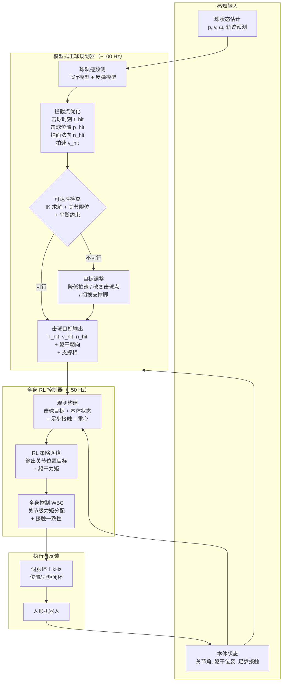

**双层之间的接口**：

HITTER 的关键设计是规划层与控制层之间的接口——**不是传递整条轨迹，而是传递低维物理目标**：

| 接口字段 | 物理含义 | 维度 | 来源 |
|---|---|---|---|
| $p_{\text{hit}}$ | 击球时刻拍面位置 | 3 | 拦截点优化 |
| $n_{\text{hit}}$ | 击球时刻拍面法向 | 3 | 击球风格 + 旋转补偿 |
| $v_{\text{hit}}$ | 击球时刻拍面速度 | 3 | 目标落点 + 回球速度 |
| $t_{\text{hit}}$ | 击球时刻 | 1 | 球轨迹预测 + 可达性 |
| $\theta_{\text{torso}}$ | 躯干朝向目标 | 3 | 击球位置 + 平衡约束 |
| $\text{support}$ | 支撑相（左脚/右脚/双脚） | 1 | 击球位置 + 平衡约束 |

总接口维度约 14 维，远低于人形机器人的完整状态空间（通常 30+ 维）。这种**降维接口**是 HITTER 架构可行的关键——RL 控制器不需要学习"如何规划击球"，只需学习"如何让身体到达规划器给定的目标"。

#### 模型式击球规划器详解

规划器是 HITTER 架构中可解释、可验证的部分，完全基于物理模型：

**步骤 1：球轨迹预测**

使用飞行模型 + 反弹模型前推球轨迹：

$$p_b(t) = p_b(t_0) + v_b(t_0)(t - t_0) + \frac{1}{2}g(t - t_0)^2 - \int_{t_0}^{t} k_d \|v_b\| v_b \, dt'$$

对于反弹，使用恢复系数模型：

$$v_{n}^{+} = -e_n v_{n}^{-}, \quad v_{t}^{+} = (1 - \mu) v_{t}^{-}$$

**步骤 2：拦截点优化**

在预测的球轨迹上搜索最优拦截点。优化变量为击球时刻 $t_{\text{hit}}$，优化目标为：

$$\max_{t_{\text{hit}}} \quad \text{reachability}(p_b(t_{\text{hit}})) \cdot \text{quality}(t_{\text{hit}})$$

其中 $\text{reachability}$ 衡量拍面能否到达击球位置（基于 IK 可解性和关节限位），$\text{quality}$ 衡量击球质量（基于拍面法向与来球方向的匹配度、拍速裕度等）。

**步骤 3：击球目标生成**

给定拦截点后，根据击球风格（攻球/挡球/推球）和目标落点，生成完整的击球目标 $[p_{\text{hit}}, n_{\text{hit}}, v_{\text{hit}}, t_{\text{hit}}]$。同时根据击球位置和身体构型，决定支撑相和躯干朝向。

**步骤 4：可达性检查**

对生成的击球目标做 IK 求解，检查：
- IK 是否有解（击球位置在工作空间内）
- 关节角是否在限位内
- 身体是否保持平衡（ZMP/CoM 在支撑多边形内）
- 击球时刻前是否有足够的准备时间

如果不可行，调整目标（降低拍速、改变击球点、切换支撑脚）并重新检查。

#### 全身 RL 控制器详解

全身 RL 控制器是 HITTER 架构中处理高维、接触丰富部分的核心。它的任务是：**给定规划器输出的低维击球目标，生成全身关节运动，同时保持平衡和动作自然**。

**MDP 设计**：

| MDP 元素 | 定义 | 说明 |
|---|---|---|
| 状态 $s$ | 本体状态 + 击球目标 + 足步接触 + 重心历史 | 包含规划器输出的低维目标，使策略"知道要做什么" |
| 动作 $a$ | 关节位置目标增量 + 躯干力矩 | 通过 WBC 转化为关节力矩 |
| 奖励 $r$ | 击球目标跟踪 + 平衡保持 + 动作自然 + 能耗 | 多项加权 |

**奖励函数的关键项**：

$$r = w_1 \cdot r_{\text{hit\_tracking}} + w_2 \cdot r_{\text{balance}} + w_3 \cdot r_{\text{natural}} + w_4 \cdot r_{\text{energy}}$$

- $r_{\text{hit\_tracking}}$：拍面位置/法向/速度与规划器目标的跟踪误差
- $r_{\text{balance}}$：躯干朝向误差 + CoM 位置误差 + 足步接触稳定性
- $r_{\text{natural}}$：关节加速度惩罚 + 与人类运动参考的相似度
- $r_{\text{energy}}$：关节力矩平方和的惩罚

**训练流程**：

1. **仿真环境**：在 MuJoCo/IsaacGym 中构建人形机器人 + 球台 + 球的仿真场景
2. **参考运动**：从人类乒乓球运动捕捉数据中提取参考轨迹，用于 $r_{\text{natural}}$ 项
3. **课程学习**：
   - 阶段 1：固定来球，学习基本的挥拍和平衡
   - 阶段 2：变化来球速度和方向，学习移动击球
   - 阶段 3：加入反弹和旋转，学习复杂来球条件下的击球
   - 阶段 4：连续多拍，学习击球后的复位和下一拍准备
4. **域随机化**：球速/旋转/延迟/摩擦/地面参数的随机化
5. **非对称 Actor-Critic**：Critic 看到规划器的真值目标，Actor 只看到带噪估计

#### HITTER 运行时数据流

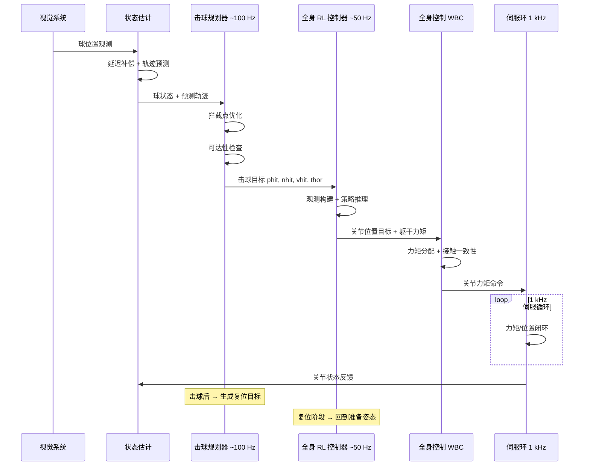

**关键时序**：

| 阶段 | 频率 | 延迟预算 | 说明 |
|---|---|---|---|
| 球轨迹预测 | ~100 Hz | ~5 ms | 飞行模型前推 + 反弹预测 |
| 拦截点优化 | ~100 Hz | ~3 ms | 一维搜索 + IK 验证 |
| RL 策略推理 | ~50 Hz | ~5 ms | 网络前向 + WBC 求解 |
| 伺服执行 | 1 kHz | < 1 ms | 力矩闭环 |

HITTER 报告的亚秒级反应时间意味着从球离开对手球拍到机器人开始移动，总延迟约 300–500 ms。这个延迟主要由球飞行时间决定（球需要飞过球台），而非计算延迟。

#### 对本项目的工程启示

1. **模型规划与全身运动执行解耦是可扩展的架构**。对于移动底盘、腿足或人形平台，上层先判断击球窗口和目标拍面状态；中层决定底盘/足步/躯干目标；低层再用 WBC、MPC 或 RL tracking 执行。若把这些目标全部交给一个大策略，会导致训练数据需求巨大，也难以做安全验证。HITTER 路线说明，高层物理目标越清晰，低层学习控制越容易收敛。

2. **规划器输出低维物理目标而非高维轨迹**。14 维的击球目标接口远低于 30+ 维的完整状态空间，这使 RL 控制器的学习难度大幅降低。建模层应输出低维、物理含义明确的目标（击球点、拍面法向、期望拍速、支撑相、身体朝向、风险界），而不是把高维原始观测直接塞给策略。

3. **可达性检查是规划器的安全阀门**。规划器在输出目标前必须验证 IK 可解性、关节限位和平衡约束。不可达的目标不应传递给 RL 控制器，而应在规划层就调整为可行目标。这避免了 RL 控制器试图执行不可能的任务而导致的失控。


→ [whole-body-executor Skill](../../skills/whole-body-executor/SKILL.md) · [hit-planner Skill](../../skills/hit-planner/SKILL.md) · [skill-policy-controller Skill](../../skills/skill-policy-controller/SKILL.md) · [hitter-wholebody-rl Recipe](../../skills/whole-body-executor/recipes/hitter-wholebody-rl/RECIPE.md) · [hitter-wholebody-rl Recipe](../../skills/skill-policy-controller/recipes/hitter-wholebody-rl/RECIPE.md)

### LATENT：人类运动原语与在线蒸馏

LATENT 的控制意义在于证明不完整的人类运动片段也可以形成可执行体育技能。它将人类动作原语整理为训练数据，再通过仿真与在线蒸馏适配到真实人形机器人。这条路线适合网球等动作幅度大、人类先验丰富的任务。

对控制层而言，LATENT 提醒我们不要把模仿学习理解成“复制整条人类轨迹”。更合理的做法是把动作拆成准备、引拍、挥拍、收拍、复位几个原语，每个原语由控制层给定目标和约束。学习系统负责生成自然且可行的全身动作，安全层仍负责限位、碰撞、跌倒和能耗边界。


→ [whole-body-executor Skill](../../skills/whole-body-executor/SKILL.md) · [skill-policy-controller Skill](../../skills/skill-policy-controller/SKILL.md) · [latent-humanoid-tennis Recipe](../../skills/whole-body-executor/recipes/latent-humanoid-tennis/RECIPE.md)

### 腿式/类人羽毛球系统：EKF、prediction-free 与阶段式控制

类人羽毛球和腿式羽毛球工作通常同时比较预测式与 prediction-free 策略。预测式控制通过 EKF/UKF 明确估计未来羽毛球轨迹，再规划足步和挥拍；prediction-free 则让策略直接读取多帧位置历史，由网络隐式学习运动趋势。前者可解释、易调试，后者对建模误差有一定鲁棒性。

工程建议是：首版应采用预测式控制作为基线，因为它能输出击球窗口、风险界和不可达原因；当数据量足够、场景变化复杂时，再引入 prediction-free 或残差策略作为增强。尤其在羽毛球中，轨迹减速极快，若没有显式预测和时间预算，移动平台很容易“看见球但来不及动”。


→ [ball-state-estimator Skill](../../skills/ball-state-estimator/SKILL.md) · [ball-flight-model Skill](../../skills/ball-flight-model/SKILL.md) · [eth-ekf-badminton Recipe](../../skills/ball-state-estimator/recipes/eth-ekf-badminton/RECIPE.md) · [eth-shuttle-aero Recipe](../../skills/ball-flight-model/recipes/eth-shuttle-aero/RECIPE.md)

### SpikePingpong 与高速视觉伺服：低延迟闭环

高速视觉伺服路线强调把视觉测量直接纳入控制闭环，而不是先完整重建全局轨迹再规划。SpikePingpong 等工作说明，在极低延迟视觉输入下，系统可以更频繁地修正击球点和落点目标，从而提高目标区域命中率。

这类方法适合小场地、高频视觉、执行器响应快的系统。它的风险是过度依赖感知链路稳定性：一旦视觉抖动、丢包或时钟错位，控制输出也会抖动。因此工程上必须配套滤波、可信度门控、动作限幅和保底轨迹。对本项目而言，高速视觉伺服可作为性能增强层，而不是替代建模和安全状态机。


→ [ball-detector Skill](../../skills/ball-detector/SKILL.md) · [ball-tracker Skill](../../skills/ball-tracker/SKILL.md) · [hit-planner Skill](../../skills/hit-planner/SKILL.md)

## 控制层实施检查清单

| 检查项 | 建议做法 | 目的 |
|---|---|---|
| 控制频率分层 | 策略 20–50 Hz，规划 50–100 Hz，伺服 1 kHz 左右 | 避免单一循环吞掉实时预算 |
| 策略输出约束化 | RL/IL 输出技能、终端目标或残差，不直接输出裸力矩 | 提高可解释性与安全性 |
| 求解器超时处理 | MPC/QP 必须有 warm-start、最大迭代和 last-safe fallback | 防止不可行解变成危险动作 |
| 时延治理 | 所有观测进入环形缓冲区，支持迟到观测回放更新 | 让控制器使用“现在状态”而非历史状态 |
| 安全状态机 | Normal/Guarded/Degraded/Safe Stop/E-stop 五态最少实现 | 将异常处理工程化 |
| 数据记录 | 记录估计、参考、求解时间、约束活跃集、驱动反馈 | 支撑调参、复现和论文级评估 |

## 发展方向与开放问题

未来最重要的方向不是单纯提高某个 benchmark 数字，而是进一步缩短“感知—决策—执行”闭环，并把学习系统纳入可验证的安全控制框架。已有工作已经给出几条清晰主线：Ace 展示了竞技级人机对抗；SMASH 展示了板载自感知与全身击球的结合；四足乒乓 MPC 展示了 spin-aware whole-body control；LATENT 展示了从不完美动作原语到真实运动策略的可扩展管线。

具体而言，后续控制层研究可重点关注四个方向。其一是**实时学习控制**：让策略在线更新，但只更新高层技能偏好或低维残差，安全壳保持解析。其二是**人机协同与对手建模**：把对手习惯、站位与节奏作为高层控制输入，而不仅是球状态。其三是**能耗与热管理优化**：体育机器人往往在峰值功率处工作，能耗和温升应进入 MPC 或技能选择代价。其四是**软硬件协同设计**：MIT 轻量化高加速度机械臂和 Ace 的定制硬件都说明，硬件带宽往往比算法名字更决定上限；RobotCore 一类工作则说明加速架构与控制软件栈需要共同设计。

仍需明确的开放问题主要有三类。第一，若项目实际硬件是固定臂、移动底盘、人形还是 ballbot，目前**未指定**，这会直接改变状态维数、接触模型与控制频率。第二，若项目要求的安全等级、场馆布置、通信架构和人机交互边界**未指定**，则控制层只能给出通用分层方案，无法收敛到单一实现。第三，原始需求中的“球形机器人动力学建模”存在歧义；若确认是球形平衡底盘，则需要把 ballbot 的平衡控制单列成移动子系统，不应与击球控制混写[¹¹](#ref-ctrl-ballbot)。

## 参考文献

<a id="ref-ctrl-deepmind"></a>**¹ D. B. D'Ambrosio et al., "Achieving Human Level Competitive Robot Table Tennis."** arXiv:2408.03937, 2024. [arXiv](https://arxiv.org/abs/2408.03937)

<a id="ref-ctrl-hitter"></a>**² Z. Su, B. Zhang, N. Rahmanian, Y. Gao, Q. Liao, C. Regan, K. Sreenath, S. S. Sastry, "HITTER: A HumanoId Table TEnnis Robot via Hierarchical Planning and Learning."** arXiv:2508.21043, 2025. [arXiv](https://arxiv.org/abs/2508.21043)

<a id="ref-ctrl-ace"></a>**³ P. Dürr et al., "Outplaying Elite Table Tennis Players with an Autonomous Robot."** Nature, 2026. [Nature](https://www.nature.com/articles/s41586-026-10338-5)

<a id="ref-ctrl-latent"></a>**⁴ Z. Zhang, H. Lu, Y. Lian, Z. Chen, Y. Liu, C. Lin, H. Xue, Z. Zeng, Z. Qi, S. Zheng, Q. Luan, J. Wang, J. Xing, H. Wang, L. Yi, "Learning Athletic Humanoid Tennis Skills from Imperfect Human Motion Data."** arXiv:2603.12686, 2026. [arXiv](https://arxiv.org/abs/2603.12686)

<a id="ref-ctrl-mit"></a>**⁵ D. Nguyen, K. D. Cancio, S. Kim, "High Speed Robotic Table Tennis Swinging Using Lightweight Hardware with Model Predictive Control."** arXiv:2505.01617, 2025. [arXiv](https://arxiv.org/abs/2505.01617)

<a id="ref-ctrl-eth-badminton"></a>**⁶ Y. Ma et al., "Learning to Play Badminton with Legged Robots."** Science Robotics, 2025. [Science Robotics](https://www.science.org/doi/10.1126/scirobotics.adu3922)

<a id="ref-ctrl-acados"></a>**⁷ D. Kouzoupis et al., "acados: A Modular Open-Source Framework for Fast Embedded Optimal Control."** Mathematical Programming Computation, 2022. [GitHub](https://github.com/acados/acados)

<a id="ref-ctrl-spike"></a>**⁸ SpikePingpong Team, "SpikePingpong: High-Speed Visual Servoing for Robot Table Tennis."** IEEE ICRA, 2024.

<a id="ref-ctrl-humanoid-badminton"></a>**⁹ T. Z. et al., "Humanoid Badminton Robot: EKF-Based Shuttle Trajectory Prediction and Real-Time Control."** IEEE-RAS International Conference on Humanoid Robots, 2023.

<a id="ref-ctrl-quadruped-mpc"></a>**¹⁰ G. B. et al., "Quadruped Robot Table Tennis with MPC and Spin-Aware Control."** arXiv, 2025.

<a id="ref-ctrl-ballbot"></a>**¹¹ T. B. Lauwers et al., "A Dynamically Stable Single-Wheeled Mobile Robot with Inverse Mouse-Ball Drive."** IEEE ICRA, 2006.
