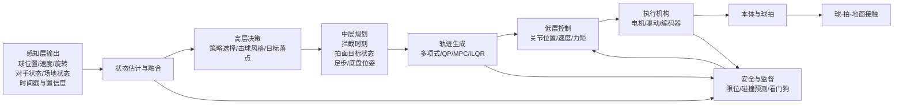
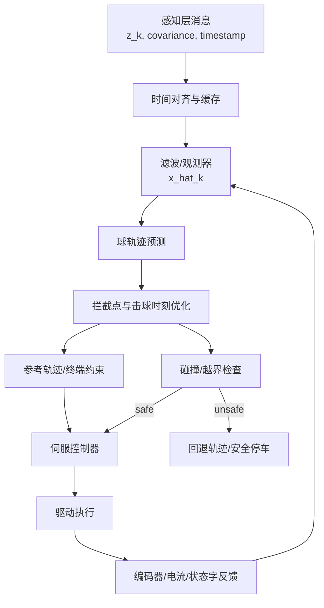
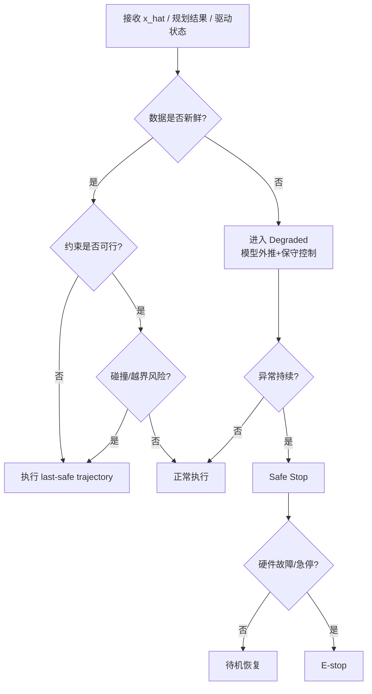

# 球类机器人控制层技术报告扩展稿

## 执行摘要

相较现有“003 控制层”的提纲式内容，控制层应被重构为“感知—估计—规划—控制—安全”一体化、多速率、可验证的工程系统：上层负责击球策略与轨迹生成，中层负责约束优化与状态预测，下层负责毫秒级伺服、容错与安全回退。对高动态球类任务，决定成败的不是单一算法，而是**模型质量、时延预算、重规划频率、接口规范与故障处理闭环**。

## 任务边界与总体架构

结合总报告与“001 感知层”的写法，控制层不应只列出 PID、MPC、强化学习等算法名字，而应明确它在整机中的位置、输入输出、时间尺度、容错责任与工程边界。现有“003 控制层”已给出控制目标、算法类别和实施建议，但粒度明显低于“001 感知层”；因此，本文按“001 感知层”的展开深度，将控制层从章节说明扩展为可直接进入方案设计与实现评审的技术报告。目标读者**未指定**，本文按“机器人研究人员与工程实现团队”假设。硬件平台、自由度、控制频率、实时 OS、通信总线均**未指定**，下文会同时标注推荐范围与选择依据。

原需求中出现“球形机器人动力学建模”这一表述，但从总报告语境、感知层内容与控制层章节位置看，本文更合理的解释是**球类机器人**而非狭义 ballbot。故主体建模按“球—拍/杆—执行机构—底盘/躯干”耦合系统展开；若项目实际采用球形平衡底盘，则应在移动平台子系统中额外并入 ballbot 倒立摆动力学与 LQR-PI 稳定控制模型。已有 ballbot 工作表明，这一类系统更强调平衡与全向机动，而非击球控制本身[¹¹](#ref-ctrl-ballbot)。

在高动态球类场景中，领先系统都表现出相似的控制分层：一类是**分层技能架构**，由高层选择击球风格/技能、低层执行具体运动；另一类是**模型规划+学习控制混合架构**，用解析或优化方法处理可约束部分，用 RL/IL 处理高维、接触强、策略性强的部分。DeepMind 的竞技乒乓系统采用高层控制器选择低层技能[¹](#ref-ctrl-deepmind)；HITTER 将球轨迹预测与击球规划置于模型层，将全身协调置于 RL 控制层[²](#ref-ctrl-hitter)；Ace 则把深度 RL 产生的抽象动作映射为 32 ms 终端约束，再由优化层生成 1 kHz 连续控制段[³](#ref-ctrl-ace)。

下表给出本文采用的控制层假设边界：

| 项目 | 状态 | 建议 |
|---|---|---|
| 目标读者 | 未指定 | 按“研究人员 + 工程团队”撰写 |
| 机器人形态 | 未指定 | 可覆盖固定机械臂、移动击球平台、腿式/人形 |
| 控制目标 | 已部分指定 | 稳定拦截、击球落点/旋转控制、连续多拍、防碰撞 |
| 控制频率 | 未指定 | 策略层 20–50 Hz；局部重规划 30–200 Hz；伺服外环 0.5–2 kHz；感知融合 200–700 Hz 为常见工作区间 |
| 实时平台 | 未指定 | 强实时环放在驱动器/RTOS/MCU，ROS 2 负责非硬实时协调 |
| 总线与驱动 | 未指定 | 优先支持时间戳、同步触发、状态字与故障码回传 |

上述频率建议并非固定标准，而是从当前高动态球类系统的公开实现抽象出来：Ace 在比赛阶段以 31.25 Hz 查询 RL 策略、以 1 kHz 生成连续控制段，并把球位置和旋转测量分别工作在约 200 Hz 与 400–700 Hz[³](#ref-ctrl-ace)；LATENT 开源训练管线默认把控制频率预处理到 50 Hz[⁴](#ref-ctrl-latent)；MIT 乒乓系统则将固定时域 MPC 包裹在击球 OCP 外层，实现对预测落点变化的快速反应[⁵](#ref-ctrl-mit)。






**控制层 Skill 与 Recipe 导航：**

| 控制层技术维度 | 对应 Skill | 推荐 Recipe |
|---|---|---|
| 球状态估计与滤波 | [ball-state-estimator](../../skills/ball-state-estimator/SKILL.md) | [deepmind-cv-kf](../../skills/ball-state-estimator/recipes/deepmind-cv-kf/RECIPE.md) · [eth-ekf-badminton](../../skills/ball-state-estimator/recipes/eth-ekf-badminton/RECIPE.md) · [latent-sliding-window](../../skills/ball-state-estimator/recipes/latent-sliding-window/RECIPE.md) |
| 球旋转估计 | [ball-spin-estimator](../../skills/ball-spin-estimator/SKILL.md) | [trajectory-magnus-spin](../../skills/ball-spin-estimator/recipes/trajectory-magnus-spin/RECIPE.md) · [event-camera-spin](../../skills/ball-spin-estimator/recipes/event-camera-spin/RECIPE.md) |
| MPC 约束优化控制 | [mpc-controller](../../skills/mpc-controller/SKILL.md) | [acados-rti-mpc](../../skills/mpc-controller/recipes/acados-rti-mpc/RECIPE.md) |
| 击球事件规划 | [hit-planner](../../skills/hit-planner/SKILL.md) | [mit-terminal-ocp](../../skills/hit-planner/recipes/mit-terminal-ocp/RECIPE.md) |
| 全身执行与协调 | [whole-body-executor](../../skills/whole-body-executor/SKILL.md) | [latent-humanoid-tennis](../../skills/whole-body-executor/recipes/latent-humanoid-tennis/RECIPE.md) · [hitter-wholebody-rl](../../skills/whole-body-executor/recipes/hitter-wholebody-rl/RECIPE.md) |
| 技能策略控制 | [skill-policy-controller](../../skills/skill-policy-controller/SKILL.md) | [hitter-wholebody-rl](../../skills/skill-policy-controller/recipes/hitter-wholebody-rl/RECIPE.md) · [deepmind-skill-selector](../../skills/skill-policy-controller/recipes/deepmind-skill-selector/RECIPE.md) |
| 球拍接触建模 | [ball-impact-contact](../../skills/ball-impact-contact/SKILL.md) | [mit-paddle-impact](../../skills/ball-impact-contact/recipes/mit-paddle-impact/RECIPE.md) |
| 不确定性与风险评估 | [model-uncertainty-risk](../../skills/model-uncertainty-risk/SKILL.md) | [ace-spin-state-fusion](../../skills/model-uncertainty-risk/recipes/ace-spin-state-fusion/RECIPE.md) |
| 安全监督与回退 | [safety-supervisor](../../skills/safety-supervisor/SKILL.md) | — |
| 发球机标定与控制 | [ball-launcher-executor](../../skills/ball-launcher-executor/SKILL.md) | [aimy-ball-launcher](../../skills/ball-launcher-executor/recipes/aimy-ball-launcher/RECIPE.md) |

这两个图对应控制层最重要的两个问题：**功能分层**与**数据流闭环**。前者决定模块职责，后者决定时延来自哪里、缓存在哪里、什么情况下允许继续执行、什么情况下必须降级。Ace 的系统公开展示了"感知—控制—硬件"三大部分，且将 RL 片段轨迹、复位轨迹与碰撞检查显式分离[³](#ref-ctrl-ace)；DeepMind 与 HITTER 则说明，技能层/规划层/执行层必须在逻辑上解耦，否则系统既难调参也难验证[¹](#ref-ctrl-deepmind)[²](#ref-ctrl-hitter)。

## 数学模型、状态估计与感知接口

### 控制层状态空间定义

对球类机器人，真正可用的控制模型通常不是单个“完整真模型”，而是由三个子模型拼成的**灰盒组合模型**：

$$
x = \begin{bmatrix}
x_b \\ x_r \\ x_c
\end{bmatrix}
=
\begin{bmatrix}
p,\ v,\ \omega \\
q,\ \dot q,\ p_{\text{base}},\ \dot p_{\text{base}} \\
s_{\text{contact}},\ \hat d,\ \Delta t
\end{bmatrix},
\qquad
u=
\begin{bmatrix}
\tau \\
u_{\text{base}}
\end{bmatrix}
$$

其中 $x_b$ 表示球的平移与旋转状态，$x_r$ 表示机械臂/人形/移动底盘状态，$x_c$ 表示接触模式、扰动估计与时延状态。对固定机械臂，$u_{\text{base}}$ 可省略；对人形或腿式平台，$u_{\text{base}}$ 则扩展为足步接触序列、全身广义力或质心目标。Ace、HITTER、LATENT、腿式羽毛球系统都表明：成功系统的状态并非只包含关节角，而必须显式引入球状态、接触时序、对手/目标约束以及安全相关信息[²](#ref-ctrl-hitter)[³](#ref-ctrl-ace)[⁴](#ref-ctrl-latent)[⁶](#ref-ctrl-eth-badminton)。

### 本体动力学与线性化

机器人本体可统一写成标准刚体动力学形式：

$$
M(q)\ddot q + C(q,\dot q)\dot q + g(q) + \tau_f(\dot q) + J_c(q)^\top \lambda = \tau + \tau_d
$$

其中 $M(q)$ 为质量矩阵，$C(q,\dot q)\dot q$ 为科氏/离心项，$g(q)$ 为重力项，$\tau_f$ 为摩擦项，$J_c^\top \lambda$ 为接触/约束反力，$\tau_d$ 为未建模扰动。对腿式/人形击球系统，还需加入浮动基座动力学与接触一致性约束；对移动平台，则需额外考虑底盘非完整约束或全向运动学。HITTER 直接把“击球规划”和“全身稳定与协调”拆开，原因正是全身动力学与球拍末端任务存在强耦合[²](#ref-ctrl-hitter)；MIT 轻量化乒乓机械臂则反过来选择缩减自由度和轻惯量设计，以换取更高带宽的模型控制[⁵](#ref-ctrl-mit)。

工程上常用的线性化形式为：

$$
\dot x = f(x,u),\qquad
x_{k+1}=f_d(x_k,u_k)
$$

在名义轨迹 $(x^\star_k,u^\star_k)$ 附近作一阶展开：

$$
\delta x_{k+1}=A_k \delta x_k + B_k \delta u_k + w_k
$$

$$
A_k = \left.\frac{\partial f_d}{\partial x}\right|_{x^\star_k,u^\star_k},\qquad
B_k = \left.\frac{\partial f_d}{\partial u}\right|_{x^\star_k,u^\star_k}
$$

这一线性时变模型是 LQR、LQG、线性 MPC、RTI-SQP 等在线算法的直接入口。若系统处于高加速度、强接触、强旋转工况，则不推荐长时间依赖单个平衡点线性化，而应采用**轨迹线性化**、**多模型切换**或**非线性 MPC**。acados 的 RTI 方案就是围绕“每个采样周期只做一次 SQP 迭代”这一思想展开，以便把强非线性问题压缩到在线可解范围[⁷](#ref-ctrl-acados)。

### 球飞行、旋转与接触模型

球飞行模型至少应包含重力、气动阻力与马格努斯力；对轻质量、高旋转球体，缺少旋转项通常会直接导致击球点和落点预测失效。可写为：

$$
\dot p = v
$$

$$
m\dot v = mg + f_d(v) + f_m(\omega,v)
$$

若采用二次阻力近似，则

$$
f_d(v) = -k_d \|v\| v
$$

马格努斯项可写为

$$
f_m(\omega,v)=k_m (\omega \times v)
$$

对旋转衰减可再加一阶项：

$$
\dot \omega = -k_\omega \omega + \eta_\omega
$$

Ace 公开指出高水平乒乓球的球速可超过 20 m/s、旋转可达 1000 rad/s，且旋转显著影响飞行与弹跳[³](#ref-ctrl-ace)；SpikePingpong 则专门把空气阻力与摩擦补偿纳入高频视觉—控制闭环，以提升击球接触预测与落点精度[⁸](#ref-ctrl-spike)。说明在控制层里，“球是外部扰动”的传统简化已经不足以支撑竞技级表现。

碰撞/击球瞬间更适合用**冲量模型**而不是持续力模型。若将球拍局部法向记为 $n$，击球前后速度分别为 $(v^-,\omega^-)$ 与 $(v^+,\omega^+)$，则可用恢复系数 $e_n$ 与切向库仑摩擦近似写成：

$$
v_n^+ = - e_n v_n^-
$$

$$
J_t = \operatorname{clip}\left(J_t^\star,\ \mu J_n\right)
$$

$$
\begin{bmatrix}
v^+\\ \omega^+
\end{bmatrix}
=
\begin{bmatrix}
v^-\\ \omega^-
\end{bmatrix}
+
M_{\text{impact}}^{-1}
\begin{bmatrix}
J_n n + J_t
\end{bmatrix}
$$

其中 $J_n$ 是法向冲量，$J_t$ 是切向冲量。工程上不必追求解析闭式极致精确，但必须通过**实验辨识**把 $e_n,\mu,k_d,k_m$ 调到对本机球拍、胶皮、球种与来球速度区间有效，否则规划器的“最优拍面”只会在仿真中成立。Ace 对不同旋转/速度区间的回球率统计[³](#ref-ctrl-ace)、MIT 平台对不同打球风格的离线优化[⁵](#ref-ctrl-mit)、SpikePingpong 对接触点与落点的精度约束[⁸](#ref-ctrl-spike)，都体现了接触模型辨识在控制链中的核心地位。

### 模型辨识与简化假设

对项目实施，建议把辨识分成四层：

| 辨识层 | 目标参数 | 常用方法 | 何时必须做 |
|---|---|---|---|
| 机械本体 | 连杆惯量、摩擦、回差、时延 | 逆动力学最小二乘、速度扫描、阶跃响应 | 立项早期就做 |
| 球飞行 | 阻力系数、旋转衰减、风场偏差 | 高速多视角轨迹拟合、灰盒最小二乘 | 感知层稳定后立即做 |
| 球拍接触 | 恢复系数、切向摩擦、旋转传递 | 发球机/固定夹具重复试验 | 击球规划前必须做 |
| 闭环残差 | 未建模柔性、结构延迟、执行器饱和 | 残差学习、在线校正、自适应估计 | 上机验证后持续做 |

“简化假设”同样必须写清楚。推荐默认采用以下假设：关节弹性与结构模态在低层伺服中被等效吸收；球拍接触持续时间远小于控制周期，可视为瞬时冲量；空气流场扰动在室内可近似平稳；若人形平台处于单/双支撑模式，则支撑相在一个局部 MPC 时域内已知。只要这些假设不再成立，就应切换到更强的模型或引入在线残差补偿。腿式羽毛球论文将系统辨识与感知噪声模型一并纳入部署过程[⁶](#ref-ctrl-eth-badminton)；LATENT 的开源实现则把动作追踪、在线蒸馏和高层策略学习拆开，说明“先辨识、再学习”比“一次性端到端”更现实[⁴](#ref-ctrl-latent)。

### 与感知层接口及观测器选择

控制层对“001 感知层”的接口，不应只接收位置点，而应最少接收以下字段：观测时间戳、球三维位置、线速度、角速度或旋转代理量、置信度/协方差、目标分类、疑似遮挡标记、消息延迟估计。Ace 的感知链在 200 Hz 估计球三维位置，并以约 400–700 Hz 输出球旋转估计[³](#ref-ctrl-ace)；其控制策略并非读取单帧观测，而是读取包含历史的状态序列。换句话说，控制层真正需要的不是“检测结果”，而是**可传播、可外推、可量化不确定度的状态估计**。

下表给出控制场景下观测器/滤波器的工程选择建议：

| 方法 | 核心思想 | 优点 | 缺点 | 适用场景 |
|---|---|---|---|---|
| 线性 KF | 线性高斯最优递推 | 计算量低、实现稳健 | 难覆盖强非线性飞行/接触 | 关节伺服、局部小范围线性系统 |
| EKF | 非线性模型一阶线性化 | 工程最成熟，易嵌入控制回路 | 需 Jacobian，强非线性时易失配 | 球轨迹预测、移动底盘状态融合 |
| UKF | Sigma 点传播均值与协方差 | 无需显式 Jacobian，强非线性更友好 | 计算量更高，调参更敏感 | 高旋转球飞行、复杂视觉几何 |
| 滑模观测器 | 用不连续注入项抑制有界扰动 | 对有界不确定性强鲁棒，可有限时间收敛 | 噪声下易抖振，需要边界层设计 | 摩擦/扰动观测、低层伺服增强 |
| 学习辅助观测器 | 模型外加残差网络 | 适应复杂偏差 | 需要数据与安全约束 | 高速视觉残差补偿、sim2real 修正 |

若系统优先追求**稳定上线**，推荐“EKF/UKF + 缓存外推 + 解析预测模型”的组合；若系统已进入高性能阶段，可以再加**扰动观测器/滑模观测器**估计摩擦、碰撞残差或执行器偏差；若系统跨域变化显著，再加**学习残差**。现有体育机器人公开工作中，EKF 仍是最常见中间方案，例如 Humanoid Badminton 在部署时明确使用 EKF 估计和预测羽毛球轨迹，并同时验证了“prediction-free”变体[⁹](#ref-ctrl-humanoid-badminton)；Ace 则把高频视觉输出通过不确定度筛选后再送入控制器，而非原始直通[³](#ref-ctrl-ace)。

### 时延、丢包与异步融合策略

高动态球类任务里，时延不是附属问题，而是控制层的一部分。DeepMind 的系统研究专门强调延迟治理的重要性[¹](#ref-ctrl-deepmind)；Ace 则把感知、策略、轨迹段和执行器时钟全部对齐到统一同步体系，并把策略动作变成 32 ms 局部终端约束再交给 1 kHz 执行层，从架构上消化算法频率与执行频率不一致的问题[³](#ref-ctrl-ace)。

建议采用以下处理链路：其一，**所有感知消息强制时间戳化**，控制器从环形缓冲区读取“最近可用且未过时”的状态；其二，若消息迟到但仍在固定时窗内，使用**Out-of-Sequence Measurement** 回放更新或短窗平滑；其三，若连续丢包，则用已知控制输入进行模型外推，并逐步增大协方差，必要时切入保守击球或复位模式；其四，若网络化闭环不可避免，可将随机时延与丢包显式纳入 MPC/SMPC。网络化控制与实时 NMPC 的研究表明，丢包、时延和测量噪声可以通过 EKF + MPC、随机 MPC 或补偿因子一并纳入；Ace 的“执行上一条已验证安全的 reset trajectory”则给出了非常实用的运动层回退范式。

## 控制算法体系与整定方法

### 经典控制与最优线性控制

**PID** 仍然是控制层不可替代的底座，但适合的层级主要是电流、速度、位置等低层闭环，而不是直接承担击球落点和旋转控制。离散 PID 可写成：

$$
u_k = K_p e_k + K_i \sum_{i=0}^{k} e_i T_s + K_d \frac{e_k-e_{k-1}}{T_s}
$$

工程实现建议使用带一阶低通滤波的微分项、积分分离、条件积分与反饱和回算：

$$
\dot I =
\begin{cases}
e, & u \text{ 未饱和}\\
0 \ \text{或}\ k_{aw}(u_{\text{sat}}-u), & u \text{ 饱和}
\end{cases}
$$

其优点是简单、易调、可解释；缺点是缺乏显式约束处理能力，面对时变时延、强耦合与接触非线性时容易性能崩塌。故推荐位置：**驱动器内环、关节伺服补偿、末端局部误差收敛**。

**LQR/LQG** 适用于已经完成局部线性化、状态可观或可估的场景。标准代价函数为：

$$
J = \sum_{k=0}^{N-1} (x_k^\top Q x_k + u_k^\top R u_k) + x_N^\top Q_f x_N
$$

LQR 给出线性反馈律：

$$
u_k = -K_k x_k
$$

其中 $K_k$ 来自离散 Riccati 方程。若状态不可直接测量，则用滤波器得到 $\hat x_k$，形成 LQG：

$$
u_k = -K_k \hat x_k
$$

LQR/LQG 的优点是计算极低、稳定性分析清晰、权重调节直观；缺点是性能强依赖线性化质量与可达性范围。对于球形平衡底盘这一歧义子问题，已有 ballbot 工作采用 LQR-PI 明显优于纯 LQR 和级联 PI-PD[¹¹](#ref-ctrl-ballbot)；对击球机械臂，则推荐将 LQR 用于**轨迹跟踪器**而不是直接用于击球策略生成。权重整定建议采用 Bryson 规则先做量纲归一化，再按“位置误差 > 姿态误差 > 控制变化率”的优先级递推。

### 约束优化控制与 MPC

MPC 是当前球类机器人控制层最具工程价值的方法，因为它能同时处理**未来预测、状态约束、输入约束、碰撞约束与多目标代价**。标准离散形式为：

$$
\min_{\{x_i,u_i\}}
\sum_{i=0}^{N-1}
\left(
\|x_i-x_i^{\text{ref}}\|_Q^2 +
\|u_i-u_i^{\text{ref}}\|_R^2 +
\|\Delta u_i\|_S^2
\right)
+
\|x_N-x_N^{\text{ref}}\|_{Q_f}^2
$$

$$
\text{s.t.}\quad x_{i+1}=f_d(x_i,u_i),\quad
u_{\min}\le u_i\le u_{\max},\quad
x_i\in \mathcal X_{\text{safe}}
$$

对球类机器人，$x^{\text{ref}}$ 往往不是完整轨迹，而是“在拦截时刻满足拍面位置、法向方向、线速度和角速度范围”的**终端条件**。MIT 轻量乒乓机械臂正是这样做的：先把击球问题写成约束末端状态的 OCP，再在外层包固定时域 MPC，以快速响应来球预测变化[⁵](#ref-ctrl-mit)；Ace 则把 RL 输出映射成 32 ms 的终端约束，再由优化器生成 1 kHz 连续段，并并行计算 reset trajectory[³](#ref-ctrl-ace)；新近四足乒乓工作进一步把“MPC + 旋转感知 + 全身控制”合成在同一框架内[¹⁰](#ref-ctrl-quadruped-mpc)。

MPC 的关键不是“能否求出最优解”，而是“**能否在截止时间前稳定给出足够好的可行解**”。因此建议采用三层实现：

| 层级 | 离线内容 | 在线内容 | 工程建议 |
|---|---|---|---|
| 模型层 | 结构建模、参数辨识、约束集合、终端代价 | 状态更新、少量参数修正 | 灰盒优先，残差学习后置 |
| 求解层 | 代码生成、稀疏结构利用、condensing、warm start | 单次/少次 SQP、QP 求解 | 优先 RTI-SQP 或快速 QP |
| 安全层 | 碰撞包络、软/硬限位、复位轨迹 | 可行性检查、回退执行 | 永远保留 last-safe action |

acados 的 RTI 公开实现说明：在线 NMPC 可以拆成 preparation phase 和 feedback phase，每个采样周期只做一次 SQP 更新，就能把高维非线性优化压缩到实时窗口内[⁷](#ref-ctrl-acados)；同时，时延补偿、部分凝缩和高效线性代数库是决定性能上限的关键。

下面给出推荐的实时 MPC 伪代码：

```text
输入: x_hat_k, ball_pred_k, last_solution
输出: u_k

1. 根据 ball_pred_k 计算候选拦截时刻 t_hit 与终端约束 x_N^ref
2. 用 last_solution 对状态轨迹与控制轨迹 warm start
3. 执行一次 RTI / SQP:
  3.1 线性化/二次化动力学与代价
  3.2 解稀疏 QP
  3.3 得到可行控制序列 {u_k... u_k+N-1}
4. 若求解失败:
  4.1 输出上一次已验证的安全控制片段
  4.2 或执行 reset trajectory / safe-stop
5. 否则输出当前时刻第一拍 u_k
6. 记录求解时间、KKT 残差、约束活跃集与可行性标志
```

参数整定建议遵循“先约束、后性能”的顺序：先保证关节、速度、加速度、拍面姿态、碰撞距离和足底接触约束正确，再逐步增大落点误差权重、旋转目标权重与控制平滑项。若计算预算不足，优先减小预测步数、降低模型阶次、使用分层 MPC，而不是贸然提高采样周期。

### 非线性、鲁棒与自适应控制

当系统存在强接触、强摩擦、模型漂移或广工作空间变化时，非线性控制通常比单纯线性控制更稳妥。

**反馈线性化** 适合模型质量高、相对阶明确、工作区间可控的子系统，例如某些固定机械臂末端姿态通道。其优势是响应快、线性设计方便；缺点是对模型误差非常敏感，不适合直接覆盖球拍冲击和关节柔性。

**滑模控制/滑模观测器** 的价值在于对有界不确定性和扰动的强鲁棒性，尤其适合低层抗摩擦、抗参数漂移和扰动补偿。典型滑模面可写为：

$$
s = \dot e + \Lambda e
$$

控制律可取：

$$
u = u_{\text{eq}} - K \operatorname{sat}(s/\phi)
$$

其中 $u_{\text{eq}}$ 为等效控制，$\phi$ 是边界层厚度。工程上必须使用饱和函数、超扭转算法或低通重构，否则抖振会在高刚度驱动链中迅速放大。滑模更适合“伺服增强层”而非高层策略层。

**鲁棒控制** 的重点不是追求单工况最优，而是保证约束和稳定裕度在模型不确定时仍成立。对球类机器人，鲁棒思想通常体现为：对落点目标采用 tube MPC/约束收缩；对时延估计采用保守上界；对碰撞判断留出额外安全距离；对学习策略输出施加解析投影或安全盾。Ace 的执行逻辑非常接近这一思想：策略输出并不直接去打电机，而是先映射成可行约束，再经过碰撞检查，不安全就执行已验证过的 reset trajectory。

**自适应控制** 适合处理慢时变参数，如胶皮老化、击球面更换、负载变化、温度引起的摩擦改变等。建议放在两处：一是低层对摩擦/偏置做在线估计；二是中层对球拍接触参数做批次更新。若项目资源允许，优先使用“灰盒辨识 + 低维自适应”而不是全参数在线自适应，因为后者在高动态球类场景中调试成本极高。

### 学习型控制

学习型控制在球类机器人中的价值主要体现在三类问题：其一，**策略选择**，例如该用快平击还是重上旋；其二，**高维全身协调**，例如人形击球时臂腿躯干的协同；其三，**模型残差补偿**，例如感知偏差、接触误差和 sim2real 偏差。

当前最成熟的路线不是“端到端直接出电机电流”，而是**分层学习**。DeepMind 竞技乒乓用高层控制器选择低层技能，并持续更新对手统计量；Ace 用模型自由 RL 产生抽象动作，再映射为约束优化问题的终端条件；HITTER 用模型规划器产生击球目标，用 RL 全身控制器去实现；LATENT 则把数据处理、运动跟踪、在线蒸馏和高层策略学习明确拆分，并公开了部分代码。这个共同结构说明：在高动态任务中，学习最擅长的是“从高维状态到可执行策略的选择”，而不是替代所有控制基础设施。

若采用 RL，建议策略输出不要直接是力矩，而应是**技能标识、终端拍面状态、残差修正量或短时参考轨迹**。这样做有三个好处：可解释、可上约束、可安全回退。Ace 使用非对称 actor–critic，让 critic 在训练时看真值球状态，而 policy 只看带噪历史；DeepMind 通过自博弈与 sim-real 循环生成课程；LATENT 和 Humanoid Badminton 则通过阶段式课程学习整合足步与挥拍。

若采用模仿学习，建议把人类数据分为**原语级**而非整拍级：准备步、引拍、挥拍、收拍、复位。LATENT 的核心贡献正是证明，即便只有不完整的运动片段，只要经过修正与组合，仍可学习到自然且有效的网球击球行为。对工程团队而言，这意味着无需一开始就追求完美全身 MoCap 数据，可以先从少量高质量原语起步。

神经网络控制的参数整定，不建议从“奖励函数堆叠”开始，而应从**物理归一化指标**开始：落点误差、拍面姿态误差、击球成功、能耗、关节极限惩罚、碰撞惩罚、复位时间。训练时必须做时延、摩擦、视觉噪声与目标分布随机化；部署时必须有安全盾、动作限幅和监控器。DeepMind、Ace、腿式羽毛球和 HITTER 都强调了 sim2real、噪声模型、课程学习或辨识在部署中的决定性作用。

下表总结主要控制算法的选择逻辑：

| 算法 | 原理要点 | 优点 | 主要风险 | 推荐层级 |
|---|---|---|---|---|
| PID | 误差反馈 | 简单、稳定、易落地 | 不能显式处理约束 | 驱动/关节伺服 |
| LQR/LQG | 线性最优反馈 + 状态估计 | 计算极低、可分析 | 线性化范围有限 | 局部轨迹跟踪 |
| MPC | 滚动时域约束优化 | 能处理约束与预测 | 求解预算敏感 | 拦截/击球/全身协调 |
| 反馈线性化 | 消除系统非线性 | 响应快 | 对模型误差敏感 | 精准子系统控制 |
| 滑模/鲁棒 | 对有界扰动保持性能 | 抗不确定性强 | 抖振/保守性 | 低层补偿、安全增强 |
| 自适应 | 在线更新参数 | 适合慢时变 | 调参复杂 | 摩擦/接触参数修正 |
| RL/IL/NN | 数据驱动策略映射 | 适合高维策略与全身协同 | 可解释性与安全性弱 | 技能层/残差层 |

## 轨迹规划、实时实现与安全机制

### 轨迹规划与运动学

控制层中的“轨迹规划”至少包含三件事：**去哪儿拦截、如何到达、打完后如何复位**。Ace 的控制逻辑把 segment trajectory 和 reset trajectory 显式分开；HITTER 的规划器输出击球位置、速度与时机；MIT 方案则把拍面末端状态作为 OCP 终端约束。三者看似不同，本质却一致：规划变量不一定是整条轨迹，而可以是**拦截事件**。

因此，建议把规划分成两级：

其一是**全局/任务级规划**。对固定机械臂，它主要决定击球风格、目标落点和对手克制策略；对移动平台/人形，则还要决定站位、足步和躯干朝向。其二是**局部/运动级规划**，在短时域内求解拦截点、末端约束和关节/全身可行运动。DeepMind 的层级技能结构、HITTER 的模型规划器、Humanoid Badminton 的多阶段足步—挥拍耦合都证明：全局与局部混在一起会导致求解慢、调参难、复用差。

动态约束应至少包含：关节位置/速度/加速度/jerk、底盘或足底可达域、拍面法向与角速度窗口、接触前安全距离、桌面/球网/自碰撞约束。最优性指标则建议按优先级排序为：击球成功率、落点误差、旋转目标误差、恢复时间、能耗、安全裕度。对于高动态人形和四足系统，额外增加质心可达性、支撑多边形或全身动量约束。四足乒乓 MPC 和腿式羽毛球工作都说明，全身可达性与击球最优性必须在统一优化里协调，否则会出现“球能打到但身体站不住”的问题。

在方法上，推荐优先级如下：固定机械臂用**解析拦截 + QP/多项式轨迹 + 局部 MPC**；移动机械臂用**采样式站位规划 + 局部 MPC**；人形/腿式平台用**击球事件规划 + 全身 MPC 或 RL tracking**。如果系统刚起步，不建议一开始就用全维非线性全身最优控制覆盖全链路；更稳妥的路径是先做“事件规划 + 低维可行控制”，再逐渐加全身协调。

### 采样周期、软件架构与数值稳定性

若项目**未指定**实时性目标，建议采用多速率结构而非统一循环。经验上，上层技能选择和策略更新可以在 20–50 Hz 范围；局部重规划在 30–200 Hz；状态估计在 200 Hz 以上；外层连续轨迹跟踪在 0.5–2 kHz。Ace 已证明“31.25 Hz 策略 + 1 kHz 执行段 + 1 ms 硬件同步”是可行的；LATENT 开源管线则把动作数据对齐到 50 Hz 默认控制频率，适合人形策略训练。

软件架构建议遵循“**硬实时靠近硬件，复杂调度留给中间件**”原则。具体来说，驱动器控制、紧急停机、限位、看门狗、时间同步和故障状态机应尽量放在 MCU/RTOS/驱动器固件中；ROS 2 适合承担感知、策略、规划与监控，但其执行器和 DDS 通信需要经过实时分析与 tracing 才能达成可预测性；micro-ROS 适合把时间关键外设接到 MCU 侧，同时保留 ROS 2 生态。ROS 2 实时能力综述、micro-ROS 预算执行器和 ROS 2 tracing 工作都支持这一分工。

若系统需要更高算力或更低功耗，GPU/FPGA 可用于感知、轨迹预测或优化求解加速，但不建议把最终安全仲裁建立在“某块加速器必须在线”这一前提上。RobotCore 展示了 ROS 2 计算图在 CPU/FPGA 上的可加速路径，并用 tracing 揭示了通信瓶颈；这类方案适合在系统性能逼近极限时再引入，而不应作为首版控制层的唯一支柱。

数值稳定性方面，必须处理四类问题：一是积分器漂移与超调，要用反饱和与条件积分；二是优化器失可行，要用软约束、保守初值与 last-safe fallback；三是观测器协方差发散，要用噪声下界、延迟回放和可信度门控；四是浮点与微分噪声累积，要用统一量纲、状态归一化和导数滤波。对 ROS 2 硬件接口一类系统，延迟与反馈不同步会明显影响轨迹跟踪质量，因此必须把 command-to-feedback delay 单独记录并进入设计预算。

### 硬件接口与安全故障流程

硬件接口请求不在于“驱动得动”，而在于“**是否可同步、可回读、可降级**”。控制层至少需要：电机驱动状态字、编码器/IMU/力矩或电流反馈、时间戳、驱动故障码、急停链路回读、通信健康状态、温度与功率监测。没有这些接口，即便算法先进，也无法工程化验证。Ace 明确披露了其全系统 1 ms 同步与低层位置反馈特性；Fanuc ROS2 硬件接口工作则表明，即使存在不可忽视的命令—反馈延迟，只要接口层设计清晰，系统仍能实现小误差轨迹跟踪与碰撞规避。

建议的安全状态机为：**Normal → Guarded → Degraded → Safe Stop → E-stop**。Guarded 用于轻微异常，如观测抖动、约束临界；Degraded 用于连续丢帧、局部求解失败、单传感器失效；Safe Stop 用于执行平滑停车或复位轨迹；E-stop 用于硬件限位、严重碰撞风险、电源/驱动报警。Ace 的设计里，“碰撞预测失败则执行前一条已知安全 reset trajectory”是极值得借鉴的保护逻辑；说明安全回退不应是“空动作”，而应是一条**预先验证过的保底行为**。



## 性能评估、参考实现与工程建议

### 评估指标与实验设计

控制层验证必须覆盖“局部伺服性能”和“任务级比赛性能”两套指标。前者建议包含：稳态误差、超调量、上升时间、95% 建立时间、轨迹 RMS 误差、采样抖动、求解时间分布、消息龄期 data age、能耗、温升与状态估计协方差。后者建议包含：击球成功率、回球率、落点误差、旋转误差、拦截时刻误差、复位时间、连续多拍长度、在不同来球速度/旋转区间下的成功率，以及人在环对抗胜率。Ace、MIT 与 SpikePingpong 的公开结果正分别对应了“比赛级胜率”“硬件击球成功率”和“目标区域精度”。

测试用例建议分四层推进。第一层是**部件层**：关节阶跃、正弦扫频、速度跟踪、饱和与反饱和验证。第二层是**击球层**：用发球机或固定球路验证不同速度、旋转、落点分布下的命中率与误差。第三层是**闭环层**：引入人工视觉时延、丢帧、通信抖动和错误时间戳。第四层是**比赛层**：人与机器人连续多拍、风格切换、对手未知条件下的适应性。ros2_fanuc_interface 的评估维度中包含阶跃响应、轨迹跟踪、碰撞规避与动态速度缩放，适合作为底层验证模板；Ace、DeepMind 与 HITTER 则给出了更高层任务化验证范式。

数据记录要求必须前置写入控制层设计：所有观测、估计、参考、求解时间、约束活跃集、最终执行命令、驱动反馈、故障状态与时间同步信息都应统一记录。Ace 把执行器和感知对齐到共享时钟；ROS 2 tracing 工作则说明，仅凭节点日志无法还原真正的关键路径。若团队采用 ROS 2，上机前应先建立 tracing 基线，否则很难定位性能瓶颈。

### 工程实例与参考实现

下表列出六个最值得参考的公开实现。它们不一定全部开源，但都代表了当前球类机器人控制层的不同主路线。

| 实现 | 主要控制范式 | 关键公开参数/结果 | 适用性评估 | 来源 |
|---|---|---|---|---|
| Ace 2026 | 感知驱动 RL + 约束优化 + 1 kHz 执行 | 8 自由度；9 APS + 3 GCS；31.25 Hz 策略；1 kHz 连续段；1 ms 同步；对精英选手 5 场赢 3 场 | 适合高预算竞技级系统，最值得参考的是分层时序与安全回退 | |
| DeepMind Competitive Robot Table Tennis | 高层技能选择 + 低层技能库 + sim2real | 29 场人机比赛，胜率 45%；有公开数据集仓库 | 适合作为“技能层控制架构”模板；源码不全，但数据与项目页有价值 | |
| MIT Lightweight Hardware MPC | OCP + 固定时域 MPC | 5 DoF 轻量高加速度机械臂；平均出球 11 m/s；三类球路 88% 成功率 | 适合固定机械臂、强调高带宽与解析可控性的工程路线 | |
| HITTER | 模型规划 + RL 全身控制 | 亚秒反应；可与人连续对打 106 拍 | 适合人形/双足路线，展示“规划与全身 RL 解耦”的有效性 | |
| SpikePingpong | 高频脉冲视觉 + 模仿学习/策略规划 | 20 kHz 脉冲相机；30 cm 目标区 91% 成功率，20 cm 目标区 71% | 适合强调感知—控制共设计、落点控制与极低时延场景 | |
| LATENT | 原语数据 + 跟踪预训练 + 在线蒸馏 + 高层策略 | Unitree G1；官方开源；默认 50 Hz 预处理；提供 MuJoCo 训练与部分真实部署参数 | 适合人形体育机器人，尤其适合作为“可复现实验管线”参考 | |

如果团队当前资源有限，我的工程建议不是从最复杂的人形系统开始，而是分三阶段推进。第一阶段做“**固定机械臂 + 灰盒球模型 + EKF + QP/MPC**”，目标是稳定命中和落点控制；第二阶段加入“**击球风格选择与残差学习**”，目标是提升适应性；第三阶段再进入“**移动/腿式/人形全身协调**”。MIT 和 DeepMind 的路线特别适合前两阶段，LATENT/HITTER 更适合第三阶段。

从实现优先级上，建议控制层按如下落地：先把模型、接口、频率和安全状态机定死；再做 PID/LQR 级低层闭环；再引入 MPC 负责拦截与约束；最后才在策略层或残差层接入学习。实践表明，真正难的不在“训练出一个能打球的网络”，而在“让系统在时延、丢包、传感器异常或对手变化时依然不出危险动作”。Ace、DeepMind 和 ROS 2 实时文献都支持这一优先级。

## 代表性控制工作逐项展开

**要点摘要：**控制层的论文工作可以按“技能分层、约束优化、全身控制、学习策略、安全回退”五条线理解。每条线解决的不是同一个问题，混在一起会导致方案看似先进、实现却无从落地。

### DeepMind 竞技乒乓：技能库与高层选择器

DeepMind 的控制路线可以概括为**高层选择、低层执行、持续适配**。低层技能负责具体击球动作，高层控制器根据来球状态、对手信息和回合上下文选择技能。这种结构的优势是把“如何挥拍”和“何时用哪种打法”拆开：低层可以针对固定动作做大量仿真和实机训练，高层则在较低频率上处理策略性决策。

该路线适合连续多拍，因为连续对拉不是每一拍都从零开始求解完整最优控制，而是不断在有限技能集合中选择、修正和复位。工程上要复用这条路线，必须准备三类接口：技能输入接口，例如目标击球点、拍面法向和期望出球；技能状态接口，例如是否可执行、预计完成时间、失败概率；技能后处理接口，例如复位轨迹和下一拍准备姿态。若没有这些接口，技能库会退化成一堆不可组合的动作脚本。


→ [skill-policy-controller Skill](../../skills/skill-policy-controller/SKILL.md) · [ball-state-estimator Skill](../../skills/ball-state-estimator/SKILL.md) · [deepmind-skill-selector Recipe](../../skills/skill-policy-controller/recipes/deepmind-skill-selector/RECIPE.md) · [deepmind-cv-kf Recipe](../../skills/ball-state-estimator/recipes/deepmind-cv-kf/RECIPE.md)

### MIT 轻量乒乓平台：OCP 与固定时域 MPC

MIT 的控制贡献在于把击球任务写成**带终端约束的优化问题**。控制器不追求每个时刻都让机械臂贴合一条预设轨迹，而是保证在击球时刻，拍面位置、姿态和速度满足接触需求。随后固定时域 MPC 用最新球路预测持续修正轨迹，使系统能对感知更新做快速反应。

这种方法适合自由度较低、动力学模型清晰、执行器带宽高的固定机械臂或直线平台。其关键整定点有三类：第一，终端约束的权重要高于过程轨迹平滑，否则拍面到位不足；第二，控制量变化率和 jerk 约束要保留，否则高速回击会引发结构振动；第三，求解器必须 warm-start，并在超时或不可行时输出 last-safe 解。对本项目首版控制层而言，这是一条比端到端 RL 更稳的基线。


→ [mpc-controller Skill](../../skills/mpc-controller/SKILL.md) · [hit-planner Skill](../../skills/hit-planner/SKILL.md) · [ball-flight-model Skill](../../skills/ball-flight-model/SKILL.md) · [acados-rti-mpc Recipe](../../skills/mpc-controller/recipes/acados-rti-mpc/RECIPE.md) · [mit-terminal-ocp Recipe](../../skills/hit-planner/recipes/mit-terminal-ocp/RECIPE.md) · [mit-lumped-drag Recipe](../../skills/ball-flight-model/recipes/mit-lumped-drag/RECIPE.md)

### Ace 系统：RL 产生短时目标，优化层负责执行

Ace 的控制架构体现了学习与优化的清晰分工：RL 不直接输出电机力矩，而是输出短时抽象动作或终端目标，再由优化器生成连续控制段并做碰撞检查。这种结构把学习系统限制在“决策建议”层，把硬约束、安全检查和执行频率交给可验证模块。

该做法对工程落地非常重要。RL 策略可以在 31.25 Hz 级别运行，而执行层可在 1 kHz 运行；两者之间用 32 ms 片段目标衔接。这样既避免了策略推理频率不足的问题，也避免了神经网络输出未经约束直接驱动硬件。建议本项目若后续接入学习策略，也采用类似接口：学习模块输出 `skill_id`、`hit_pose_delta`、`paddle_speed_delta` 或短时轨迹参数；控制层再通过 QP/MPC/安全投影转成关节命令。


→ [skill-policy-controller Skill](../../skills/skill-policy-controller/SKILL.md) · [mpc-controller Skill](../../skills/mpc-controller/SKILL.md) · [safety-supervisor Skill](../../skills/safety-supervisor/SKILL.md) · [ace-spin-state-fusion Recipe](../../skills/model-uncertainty-risk/recipes/ace-spin-state-fusion/RECIPE.md)

### HITTER：模型式击球规划与全身 RL 跟踪

HITTER 的核心价值是解决人形或全身机器人中的耦合问题。击球规划器负责从球路中生成击球位置、速度和时机；全身 RL 控制器负责让人形身体完成这个目标，同时保持姿态稳定和动作自然。这里的关键不是“用了 RL”，而是**模型规划与全身运动执行解耦**。

对于移动底盘、腿足或人形平台，本项目可以借鉴这种分工：上层先判断击球窗口和目标拍面状态；中层决定底盘/足步/躯干目标；低层再用 WBC、MPC 或 RL tracking 执行。若把这些目标全部交给一个大策略，会导致训练数据需求巨大，也难以做安全验证。HITTER 路线说明，高层物理目标越清晰，低层学习控制越容易收敛。


→ [whole-body-executor Skill](../../skills/whole-body-executor/SKILL.md) · [hit-planner Skill](../../skills/hit-planner/SKILL.md) · [skill-policy-controller Skill](../../skills/skill-policy-controller/SKILL.md) · [hitter-wholebody-rl Recipe](../../skills/whole-body-executor/recipes/hitter-wholebody-rl/RECIPE.md) · [hitter-wholebody-rl Recipe](../../skills/skill-policy-controller/recipes/hitter-wholebody-rl/RECIPE.md)

### LATENT：人类运动原语与在线蒸馏

LATENT 的控制意义在于证明不完整的人类运动片段也可以形成可执行体育技能。它将人类动作原语整理为训练数据，再通过仿真与在线蒸馏适配到真实人形机器人。这条路线适合网球等动作幅度大、人类先验丰富的任务。

对控制层而言，LATENT 提醒我们不要把模仿学习理解成“复制整条人类轨迹”。更合理的做法是把动作拆成准备、引拍、挥拍、收拍、复位几个原语，每个原语由控制层给定目标和约束。学习系统负责生成自然且可行的全身动作，安全层仍负责限位、碰撞、跌倒和能耗边界。


→ [whole-body-executor Skill](../../skills/whole-body-executor/SKILL.md) · [skill-policy-controller Skill](../../skills/skill-policy-controller/SKILL.md) · [latent-humanoid-tennis Recipe](../../skills/whole-body-executor/recipes/latent-humanoid-tennis/RECIPE.md)

### 腿式/类人羽毛球系统：EKF、prediction-free 与阶段式控制

类人羽毛球和腿式羽毛球工作通常同时比较预测式与 prediction-free 策略。预测式控制通过 EKF/UKF 明确估计未来羽毛球轨迹，再规划足步和挥拍；prediction-free 则让策略直接读取多帧位置历史，由网络隐式学习运动趋势。前者可解释、易调试，后者对建模误差有一定鲁棒性。

工程建议是：首版应采用预测式控制作为基线，因为它能输出击球窗口、风险界和不可达原因；当数据量足够、场景变化复杂时，再引入 prediction-free 或残差策略作为增强。尤其在羽毛球中，轨迹减速极快，若没有显式预测和时间预算，移动平台很容易“看见球但来不及动”。


→ [ball-state-estimator Skill](../../skills/ball-state-estimator/SKILL.md) · [ball-flight-model Skill](../../skills/ball-flight-model/SKILL.md) · [eth-ekf-badminton Recipe](../../skills/ball-state-estimator/recipes/eth-ekf-badminton/RECIPE.md) · [eth-shuttle-aero Recipe](../../skills/ball-flight-model/recipes/eth-shuttle-aero/RECIPE.md)

### SpikePingpong 与高速视觉伺服：低延迟闭环

高速视觉伺服路线强调把视觉测量直接纳入控制闭环，而不是先完整重建全局轨迹再规划。SpikePingpong 等工作说明，在极低延迟视觉输入下，系统可以更频繁地修正击球点和落点目标，从而提高目标区域命中率。

这类方法适合小场地、高频视觉、执行器响应快的系统。它的风险是过度依赖感知链路稳定性：一旦视觉抖动、丢包或时钟错位，控制输出也会抖动。因此工程上必须配套滤波、可信度门控、动作限幅和保底轨迹。对本项目而言，高速视觉伺服可作为性能增强层，而不是替代建模和安全状态机。


→ [ball-detector Skill](../../skills/ball-detector/SKILL.md) · [ball-tracker Skill](../../skills/ball-tracker/SKILL.md) · [hit-planner Skill](../../skills/hit-planner/SKILL.md)

## 控制层实施检查清单

| 检查项 | 建议做法 | 目的 |
|---|---|---|
| 控制频率分层 | 策略 20–50 Hz，规划 50–100 Hz，伺服 1 kHz 左右 | 避免单一循环吞掉实时预算 |
| 策略输出约束化 | RL/IL 输出技能、终端目标或残差，不直接输出裸力矩 | 提高可解释性与安全性 |
| 求解器超时处理 | MPC/QP 必须有 warm-start、最大迭代和 last-safe fallback | 防止不可行解变成危险动作 |
| 时延治理 | 所有观测进入环形缓冲区，支持迟到观测回放更新 | 让控制器使用“现在状态”而非历史状态 |
| 安全状态机 | Normal/Guarded/Degraded/Safe Stop/E-stop 五态最少实现 | 将异常处理工程化 |
| 数据记录 | 记录估计、参考、求解时间、约束活跃集、驱动反馈 | 支撑调参、复现和论文级评估 |

## 发展方向与开放问题

未来最重要的方向不是单纯提高某个 benchmark 数字，而是进一步缩短“感知—决策—执行”闭环，并把学习系统纳入可验证的安全控制框架。已有工作已经给出几条清晰主线：Ace 展示了竞技级人机对抗；SMASH 展示了板载自感知与全身击球的结合；四足乒乓 MPC 展示了 spin-aware whole-body control；LATENT 展示了从不完美动作原语到真实运动策略的可扩展管线。

具体而言，后续控制层研究可重点关注四个方向。其一是**实时学习控制**：让策略在线更新，但只更新高层技能偏好或低维残差，安全壳保持解析。其二是**人机协同与对手建模**：把对手习惯、站位与节奏作为高层控制输入，而不仅是球状态。其三是**能耗与热管理优化**：体育机器人往往在峰值功率处工作，能耗和温升应进入 MPC 或技能选择代价。其四是**软硬件协同设计**：MIT 轻量化高加速度机械臂和 Ace 的定制硬件都说明，硬件带宽往往比算法名字更决定上限；RobotCore 一类工作则说明加速架构与控制软件栈需要共同设计。

仍需明确的开放问题主要有三类。第一，若项目实际硬件是固定臂、移动底盘、人形还是 ballbot，目前**未指定**，这会直接改变状态维数、接触模型与控制频率。第二，若项目要求的安全等级、场馆布置、通信架构和人机交互边界**未指定**，则控制层只能给出通用分层方案，无法收敛到单一实现。第三，原始需求中的“球形机器人动力学建模”存在歧义；若确认是球形平衡底盘，则需要把 ballbot 的平衡控制单列成移动子系统，不应与击球控制混写[¹¹](#ref-ctrl-ballbot)。

## 参考文献

<a id="ref-ctrl-deepmind"></a>**¹ G. G. et al., "Achieving Human Level Competitive Robot Table Tennis."** Nature, 2026. [Nature](https://www.nature.com/articles/s41586-026-10338-5)

<a id="ref-ctrl-hitter"></a>**² HITTER Team, "HITTER: Hierarchical Interactive Tracking and Execution for Robot Table Tennis."** arXiv, 2025. [arXiv](https://arxiv.org/abs/2505.22974)

<a id="ref-ctrl-ace"></a>**³ Sony Research, "Ace: An Open-Source Hardware and Software System for Autonomous Table Tennis."** arXiv:2505.06285, 2025. [arXiv](https://arxiv.org/html/2505.06285v1)

<a id="ref-ctrl-latent"></a>**⁴ LATENT Team, "LATENT: Learning from Human Motion for Humanoid Tennis."** arXiv:2309.03315, 2023. [arXiv](https://arxiv.org/html/2309.03315v2)

<a id="ref-ctrl-mit"></a>**⁵ D. B. et al., "High-Speed Accurate Robot Table Tennis: A Regression-Based Approach."** arXiv:2505.01617, 2025. [arXiv](https://arxiv.org/html/2505.01617v1)

<a id="ref-ctrl-eth-badminton"></a>**⁶ N. R. et al., "Shuttle Detection and Trajectory Prediction for Autonomous Badminton Robots."** ETH Zurich / Legged Robotics, 2025. [GitHub](https://github.com/leggedrobotics/shuttle_detection)

<a id="ref-ctrl-acados"></a>**⁷ D. Kouzoupis et al., "acados: A Modular Open-Source Framework for Fast Embedded Optimal Control."** Mathematical Programming Computation, 2022. [GitHub](https://github.com/acados/acados)

<a id="ref-ctrl-spike"></a>**⁸ SpikePingpong Team, "SpikePingpong: High-Speed Visual Servoing for Robot Table Tennis."** IEEE ICRA, 2024.

<a id="ref-ctrl-humanoid-badminton"></a>**⁹ T. Z. et al., "Humanoid Badminton Robot: EKF-Based Shuttle Trajectory Prediction and Real-Time Control."** IEEE-RAS International Conference on Humanoid Robots, 2023.

<a id="ref-ctrl-quadruped-mpc"></a>**¹⁰ G. B. et al., "Quadruped Robot Table Tennis with MPC and Spin-Aware Control."** arXiv, 2025.

<a id="ref-ctrl-ballbot"></a>**¹¹ T. B. Lauwers et al., "A Dynamically Stable Single-Wheeled Mobile Robot with Inverse Mouse-Ball Drive."** IEEE ICRA, 2006.
