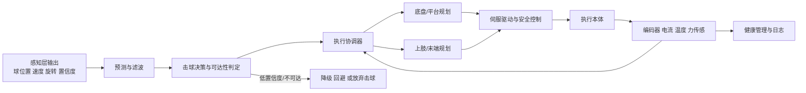
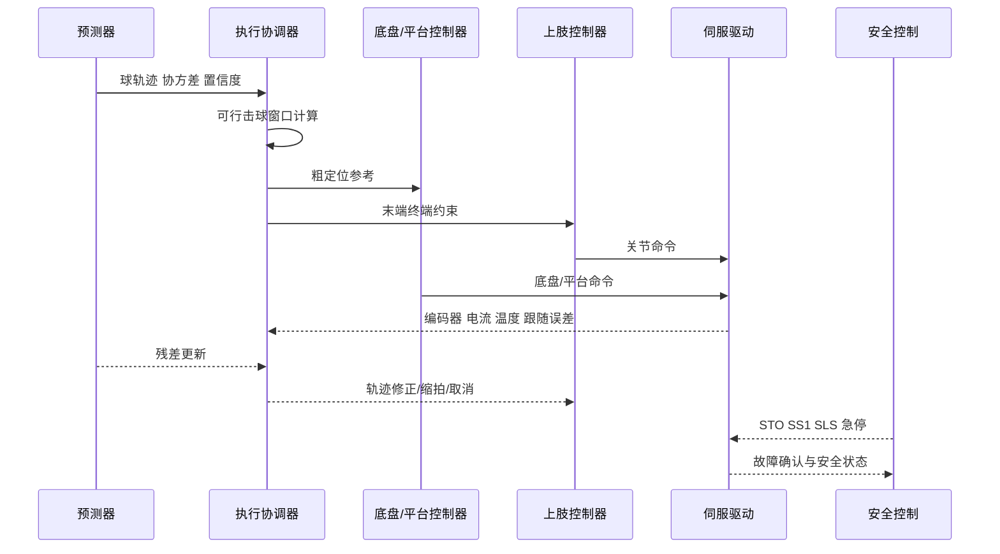

# 球类机器人执行层技术报告

## 执行摘要

本章以用户已提供“感知层”章节所体现的细化粒度为参照，重写“执行层”为可独立纳入总报告的工程章节。 在球类机器人中，执行层不是“把电机装上去”的硬件堆叠，而是把感知层输出的球状态、控制层给出的击球目标和系统级安全约束，转换成**在有限时间窗内可达、可控、可复现且可持续运行**的物理动作链。公开系统已经给出非常清晰的证据：AIMY 证明了“可编程发球机”是实验可重复性的基础[¹](#ref-exec-aimy)；MIT 的轻量五自由度乒乓平台说明了低转子惯量与高加速度对高速击球的重要性[²](#ref-exec-mit)；DeepMind/Google 的系统案例表明，真正支撑连续对拉的是**高速度低时延控制器 + 自动重置 + 全链路日志闭环**[³](#ref-exec-deepmind)；Hamlet、ETH 的腿足羽毛球系统，以及 HITTER、LATENT 等类人路线，则进一步说明一旦执行层从“固定基座”扩展到“移动本体”，可达域、惯量、热、稳定性和安全边界都会发生质变[⁴](#ref-exec-hamlet)[⁵](#ref-exec-eth)[⁶](#ref-exec-hitter)[⁷](#ref-exec-latent)。

由于用户未指定预算/目标成本、目标平台尺寸/重量以及具体球类，本报告不直接给出单一绝对尺寸与功率的“唯一答案”，而采用**参数化约束 + 分路线建议**的写法：先定义执行层的设计输入、接口、公式和验收口径，再按模块展开到发球机、固定机械臂、直线平台、轮式底盘、腿足平台、类人平台、球拍末端与伺服驱动。这样做的原因，是不同球类对执行层的第一性矛盾不同。乒乓更偏向短时间窗内的高加速度、低惯量与拍面姿态精度；羽毛球更偏向二维/三维覆盖、脚步/底盘同步与击球前状态整定；网球则更强调大场地覆盖、较高挥拍力矩、强回生与长期热稳定。MIT 平台报告 11 m/s 平均出球和 88% 成功率[²](#ref-exec-mit)，Hamlet 在发球机与人类对手场景下分别达到 94.5% 和 90.7% 命中成功率[⁴](#ref-exec-hamlet)，ETH 的腿足移动操作[⁵](#ref-exec-eth)和 HITTER、LATENT 的类人系统则把执行层问题推进到了“全身协调”的难度等级[⁶](#ref-exec-hitter)[⁷](#ref-exec-latent)。

如果目标是在未指定球类的前提下先形成**稳健、可验收、可扩展**的执行基线，本文给出的首选工程路线是：**开放接口发球机 + 固定机械臂或一维直线平台 + EtherCAT/CoE 或 SoE 伺服总线 + 驱动器安全功能 + 快换球拍末端**。该路线的主要优势是：最易闭合误差预算、最易做外参标定、最易做热与安全验证，也最容易为后续迁移到轮式底盘、腿足或类人本体保留接口一致性。若目标转向中大场地，再升级为“轮式底盘 + 上肢”；腿足与类人平台更适合作为高阶研究路线，而不宜作为首版工程落地路线。这一判断综合了 AIMY、MIT、DeepMind、Sony Ace、Hamlet、ETH、HITTER、LATENT 以及工业总线/安全资料所反映的成熟度、复杂度与可维护性差异[¹](#ref-exec-aimy)[²](#ref-exec-mit)[³](#ref-exec-deepmind)[⁸](#ref-exec-ace)[⁴](#ref-exec-hamlet)[⁵](#ref-exec-eth)[⁶](#ref-exec-hitter)[⁷](#ref-exec-latent)。

## 目录

- [概述与全链路定位](#概述与全链路定位)
- [模块化执行层设计](#模块化执行层设计)
- [接口定义与系统级协调](#接口定义与系统级协调)
- [关键公式与工程推导](#关键公式与工程推导)
- [工程手册与验收清单](#工程手册与验收清单)
- [路线对比与推荐方案](#路线对比与推荐方案)

## 概述与全链路定位

执行层在全链路中的位置，可以概括为一句话：**它接收“应当打哪里、何时打、以什么姿态和速度打”，并负责在真实世界中把这件事安全、按时、可重复地做出来。** 公开球类机器人系统都把执行问题建在“终端状态约束”上：MIT 的系统直接在击球时刻约束球拍的位置、姿态和速度[²](#ref-exec-mit)；DeepMind 的系统把高速度低时延控制器与自动重置结合起来，支撑长期真实世界训练和人机对拉[³](#ref-exec-deepmind)；HITTER 则把击球位置、速度和时刻规划与全身控制显式解耦后再闭环耦合[⁶](#ref-exec-hitter)。由此可见，执行层的核心不是单一执行器性能，而是**时间预算、可达域、动态能力、热能力和安全能力**在同一击球窗口内同时满足。

在未指定具体球类、预算、平台尺寸与重量时，本章采用如下边界条件：预算/目标成本“未指定”，目标平台尺寸/重量“未指定”，具体球类“未指定”。因此所有绝对数值一律按两类方式给出：一类是**由公开系统已经报道的结果锚定**，例如 AIMY 的出球能力、MIT 的回球能力、Hamlet 的实机命中率、HITTER/LATENT 的连续回合能力；另一类是**本文给出的工程建议值或相对阈值**，例如“总线同步抖动应不大于伺服周期的 10%”、“末端静态重复定位应压到允许击球误差的三分之一以内”。后者属于基于文献与工程规律的推断，应在球类和规则确定后作二次回填。

下表给出执行层最重要的第一性指标。表中的名词不是指标清单式罗列，而是后续选型、控制、热设计和验收的统一语言。

| 指标 | 在执行层中的工程含义 | 典型失效模式 |
|---|---|---|
| 时间预算 | 从球状态更新到真实力矩输出的总时延，以及在击球窗口内允许的剩余重规划时间 | 来不及到位、击球时刻偏移、过晚刹车 |
| 可达域 | 机器人在关节限位、碰撞约束和底座稳定性约束下可实现的击球空间/时间集合 | 球到得了但拍到不了，或到得了但姿态不对 |
| 动态能力 | 速度、加速度、角速度、力矩峰值与连续值是否能支撑目标回球方式 | 到位慢、挥拍不够快、出球弱或方向失真 |
| 精度与重复性 | TCP、拍面法向、时刻同步和多拍一致性 | 偶然打中、长期漂移、对同类来球表现不稳 |
| 热能力 | 连续多拍时电机、驱动器、电池/电源与制动回路是否会降额 | 前几拍能打，后面因温升限流或保护停机 |
| 安全能力 | 航迹、速度、力矩和人机距离是否在可控边界内，异常时是否能降级或停机 | 人机风险、误启动、失控冲出工作区 |

**执行层 Skill 与 Recipe 导航：**

| 执行层技术维度 | 对应 Skill | 推荐 Recipe |
|---|---|---|
| 发球机标定与控制 | [ball-launcher-executor](../../skills/ball-launcher-executor/SKILL.md) | [aimy-ball-launcher](../../skills/ball-launcher-executor/recipes/aimy-ball-launcher/RECIPE.md) |
| 球拍接触与反弹 | [ball-impact-contact](../../skills/ball-impact-contact/SKILL.md) | [mit-paddle-impact](../../skills/ball-impact-contact/recipes/mit-paddle-impact/RECIPE.md) |
| 全身执行与协调 | [whole-body-executor](../../skills/whole-body-executor/SKILL.md) | [latent-humanoid-tennis](../../skills/whole-body-executor/recipes/latent-humanoid-tennis/RECIPE.md) · [hitter-wholebody-rl](../../skills/whole-body-executor/recipes/hitter-wholebody-rl/RECIPE.md) |
| 技能策略控制 | [skill-policy-controller](../../skills/skill-policy-controller/SKILL.md) | [hitter-wholebody-rl](../../skills/skill-policy-controller/recipes/hitter-wholebody-rl/RECIPE.md) · [deepmind-skill-selector](../../skills/skill-policy-controller/recipes/deepmind-skill-selector/RECIPE.md) |
| 安全监督与回退 | [safety-supervisor](../../skills/safety-supervisor/SKILL.md) | — |
| 球状态估计与滤波 | [ball-state-estimator](../../skills/ball-state-estimator/SKILL.md) | [deepmind-cv-kf](../../skills/ball-state-estimator/recipes/deepmind-cv-kf/RECIPE.md) · [eth-ekf-badminton](../../skills/ball-state-estimator/recipes/eth-ekf-badminton/RECIPE.md) |
| MPC 约束优化控制 | [mpc-controller](../../skills/mpc-controller/SKILL.md) | [acados-rti-mpc](../../skills/mpc-controller/recipes/acados-rti-mpc/RECIPE.md) |
| 击球事件规划 | [hit-planner](../../skills/hit-planner/SKILL.md) | [mit-terminal-ocp](../../skills/hit-planner/recipes/mit-terminal-ocp/RECIPE.md) |
| 不确定性与风险评估 | [model-uncertainty-risk](../../skills/model-uncertainty-risk/SKILL.md) | [ace-spin-state-fusion](../../skills/model-uncertainty-risk/recipes/ace-spin-state-fusion/RECIPE.md) |
| 球旋转估计 | [ball-spin-estimator](../../skills/ball-spin-estimator/SKILL.md) | [trajectory-magnus-spin](../../skills/ball-spin-estimator/recipes/trajectory-magnus-spin/RECIPE.md) · [event-camera-spin](../../skills/ball-spin-estimator/recipes/event-camera-spin/RECIPE.md) |

以上指标框架与高速球类机器人公开系统对“低时延控制、高一致性执行、自动重置和安全闭环”的强调是一致的。

上图强调的不是软件流程图美观，而是执行层闭环的三个关键点：其一，**可达性判定必须早于力矩输出**；其二，**协调器必须同时拿到底盘/平台与上肢反馈**；其三，**健康管理不能只记日志，它必须反向影响当前可用能力上限**。这一点在 DeepMind 的系统案例、Hamlet 的底盘-手臂分层控制，以及 ETH 与 HITTER 的全身协调路线中都十分明显[³](#ref-exec-deepmind)[⁴](#ref-exec-hamlet)[⁵](#ref-exec-eth)[⁶](#ref-exec-hitter)。

## 模块化执行层设计

以下模块展开不是对单篇论文的逐字转述，而是基于公开球类机器人实践、工业总线与安全资料形成的**工程模板**。凡使用“建议”“宜”“推荐”表述的条目，均属于本文在“未指定球类/预算/尺寸”条件下给出的工程推导；凡涉及公开系统已报道的量化能力，则在相关引导段落中给出文献来源。

**发球机**

AIMY 证明了可编程发球机在球类机器人中不是辅助件，而是执行层的基础设施[¹](#ref-exec-aimy)：其三轮开源发球机可产生最高 15.4 m/s 球速与 192 s^-1 旋转，且轮速、发射姿态与触发时刻都可通过开放的 Ethernet 或 Wi‑Fi 接口控制，使其天然适合作为数据采集、自动评测、辨识校准和回归测试的确定性扰动源。

| 项目 | 技术展开 |
|---|---|
| 功能 | 供球、复现来球分布、自动重置、生成训练/验收样本、为系统辨识提供已知输入 |
| 结构 | 推荐三轮或双轮发射机构 + 俯仰/偏航调整轴 + 送球器 + 防护罩 + 防卡球检测 |
| 关键设计参数 | 自由度通常为 2–3 个姿态/发射轴；可达域应表述为“出射锥覆盖区域”；“击球窗口”对应触发时序窗口而非拍击时间窗；重点参数为出球速度、旋转、方向重复性、供球节拍、卡球率、轮面磨损与温升 |
| 典型选型 | BLDC 电机 + FOC 驱动；速度编码器/霍尔；送球光电；电流与温度传感；可选高分辨角度编码器 |
| 控制模式 | 轮速闭环 + 姿态位置闭环 + 节拍触发；建议保留“标定表 + 在线微调”双层控制 |
| 动力与电气接口 | 常见为 24/48 VDC；主供电与逻辑供电分离；需硬件使能与急停链路 |
| 通信协议 | 推荐 Ethernet/Wi‑Fi 作为参数下发，数字 I/O 作为硬实时触发；若纳入整机同步，可通过 EtherCAT/CAN 网关桥接 |
| 热管理与安全 | 轮面温升、卡球、误触发和防护罩是首要风险；应具备盖板联锁、空仓检测、轮速失配告警 |
| 维护与验收 | 轮面清洁、压紧力检查、送球通道除尘、轴承状态检查；验收关注球速/旋转离散度、触发时刻一致性、卡球率 |

**固定机械臂**

固定机械臂路线当前大致分为两类：一类是基于成熟工业臂的方案，例如多模态乒乓系统采用 KUKA 六自由度机械臂并结合多相机增强感知[¹¹](#ref-exec-kuka)；另一类是面向高速击球设计的专用轻量臂，例如 MIT 的五自由度轻量平台强调高扭矩、低转子惯量与高加速度，并在硬件上实现了 11 m/s 平均出球速度与 88% 成功率[²](#ref-exec-mit)。DeepMind/Google 的系统案例则进一步表明，真正决定长期表现的并非“机械臂能不能挥一次快拍”，而是其高速度低时延控制与自动重置能否支撑连续回合[³](#ref-exec-deepmind)。

| 项目 | 技术展开 |
|---|---|
| 功能 | 在局部工作空间内完成高速拦截、回击、削球/拉球/平击等拍型控制 |
| 结构 | 推荐 5–6 自由度串联臂；若球类偏小场地，可优先低惯量专用臂；若强调成熟度，可优先工业 6DoF |
| 关键设计参数 | 自由度决定是否能同时独立控制 TCP 位置、拍面法向与挥拍速度；可达域必须覆盖主击球区并留 20%–30% 裕量；击球窗口应由“可行拦截时刻集合”定义；重点约束为负载、末端速度/加速度、重复定位、反射惯量、RMS 热负荷与减速器寿命折减 |
| 典型选型 | 近端优先高刚度伺服，远端优先低惯量方案；减速器常用谐波、摆线或低回差同步带；传感器至少包括绝对编码器，必要时增配关节扭矩/六维力 |
| 控制模式与伺服回路 | 逆运动学 + 轨迹生成 + 逆动力学前馈；高速任务宜支持位置/速度/转矩混合控制与在线重规划 |
| 动力与电气接口 | 轻量研究平台可用 48 V 级总线，中高功率工业臂常用更高母线；需制动回生规划 |
| 通信协议 | 伺服主总线推荐 EtherCAT；驱动对象模型可采用 CoE/SoE 或等价运动控制接口 |
| 热管理与安全 | 远端关节最易温升；应持续监测电流、绕组温度与跟踪误差；建议软件工作空间、碰撞监测、受控停机和 STO 联动 |
| 维护与验收 | 基座找正、零位重建、TCP 标定、回差漂移、线缆拖链疲劳；验收以 TCP 重复定位、拍面角误差、跟踪误差和多拍热稳定为主 |

**直线平台**

直线平台是固定机械臂与移动底盘之间最重要的一条中间路线：它保留了刚性导轨、确定性参考系和较小定位不确定性，又能以较低复杂度显著扩大覆盖范围。Sony Ace 的专用化路线虽然不是传统“直线平台 + 机械臂”拼装形态，但 Reuters 披露其平台采用 8 个关节，并以“最少但足够”的自由度满足拍面位置、姿态和击球强度需求[⁸](#ref-exec-ace)；配合九路同步相机和三套视觉系统，这实际上证明了**专门为击球几何与时间窗设计的轴系，比盲目增加自由度更重要**。与此相配套，ETG 的官方资料显示 EtherCAT 面向短至 100 µs 级周期和低于 1 µs 的同步抖动而设计，适合做多轴同步直线/旋转复合控制[⁹](#ref-exec-ethercat)。

| 项目 | 技术展开 |
|---|---|
| 功能 | 扩展固定臂覆盖范围，把“大位移”从关节空间转移到直线轴，降低关节峰值负担 |
| 结构 | 推荐 1–2 轴直线平台与机械臂组合；小负载高精度优先滚珠丝杠，高速度优先直线电机，经济型可用同步带 |
| 关键设计参数 | 关键不是自由度数量本身，而是行程、直线度、回零精度、平台刚度、负载质量、最大速度/加速度、刹停距离和平台-上肢耦合振动 |
| 典型选型 | 线性电机/丝杠/皮带模组 + 线性编码器 + 原点/限位传感器 + 机械硬限位 |
| 控制模式与伺服回路 | 直线轴通常承担“粗定位”，上肢承担“细击球”；需做多轴同步插补与前馈补偿 |
| 动力与电气接口 | 平台轴宜直接纳入主伺服母线和回生设计；大行程轴应重点评估母线再生能量 |
| 通信协议 | 建议与机械臂共用 EtherCAT 时钟域；跨控制器部署时需统一时基 |
| 热管理与安全 | 丝杠温升、导轨润滑和硬限位冲击是主要问题；应有超程停机与受控制动 |
| 维护与验收 | 回零重复性、导轨平行度、编码器偏置、平台与上肢坐标变换重建；验收重点是“平台运动后 TCP 误差是否仍在预算内” |

**轮式底盘**

轮式底盘路线适合中大场地，尤其适合羽毛球和后续扩展到网球的“平地覆盖”问题。ICRA 2025 的 Hamlet 系统给出了该路线的代表性证据[⁴](#ref-exec-hamlet)：其采用模型式底盘运动策略为上肢学习式策略提供基座，实机在对发球机场景达到 94.5% 成功率，对人类对手达到 90.7% 成功率，说明“轮式粗定位 + 上肢精击球”是一条现实可行的工程路线。

| 项目 | 技术展开 |
|---|---|
| 功能 | 负责平面覆盖、抢位、姿态预对正，把击球区尽量拉回上肢的优质工作区 |
| 结构 | 差速、全向、麦克纳姆或舵轮底盘均可；若任务强调击球瞬间稳定性，全向/舵轮通常更利于横移对位 |
| 关键设计参数 | 可达域以“场地平面覆盖 + 制动距离”表述；关键参数为底盘最大线/角速度、加速度、姿态收敛时间、定位误差、击球瞬间基座姿态波动、承载与续航 |
| 典型选型 | BLDC 轮毂/伺服 + 行星减速器；轮速编码器、IMU、定位传感器、BMS、电流/温度监测 |
| 控制模式与伺服回路 | 局部速度/转矩环 + 底盘 MPC/轨迹跟踪；与上肢之间采用“基座粗定位、末端细修正”的分层协调 |
| 动力与电气接口 | 常用电池供电，重点关注峰值放电倍率、母线压降与再生吸收 |
| 通信协议 | 底盘侧常见 CAN/CAN‑FD/CANopen，若要求与上肢更紧密同步，可统一到 EtherCAT |
| 热管理与安全 | 轮胎/轮面磨损、电池热、刹车距离和人机共域风险最关键；应配置安全速度、地理围栏、急停链路 |
| 维护与验收 | 轮径磨损补偿、编码器标定、IMU 零偏、底盘-上肢外参；验收重点是基座定位误差是否压到上肢误差预算之下 |

**腿足平台**

腿足平台把“移动”从轮地接触简化问题，升级成**接触、落足、上肢挥拍和主动感知同时闭环**的问题。ETH 发布的腿足羽毛球路线表明，系统需要用统一的强化学习全身视觉运动策略同时协同下肢、上肢和感知，并显式引入真实相机噪声模型、轨迹预测模型和系统辨识，才能让机器人在不同环境下有效跟踪羽毛球、导航到服务区并对人类来球实施精确击打[⁵](#ref-exec-eth)。

| 项目 | 技术展开 |
|---|---|
| 功能 | 在复杂、可能不完全平整的环境中完成抢位、稳态调姿和挥拍 |
| 结构 | 四足/双足腿足本体 + 上肢；也可采用腿足移动底座 + 单臂的“移动操作”构型 |
| 关键设计参数 | 关键参数从“速度/加速度”扩展为“足端可达域、支撑多边形裕度、机身姿态扰动、接触力极值、击球时基座速度残差、上肢挥拍引起的反作用耦合” |
| 典型选型 | 高功率密度一体化关节模组、足端触地检测、IMU、机载视觉、上肢绝对编码器；必要时加装腕部或足端力传感 |
| 控制模式与伺服回路 | 需要全身控制；典型方案是预测/规划层决定拦截点和足步，低层用 WBC、MPC 或 RL 实时闭环 |
| 动力与电气接口 | 高倍率电池与机载计算平台是常态；瞬时功率裕量必须明显高于固定臂路线 |
| 通信协议 | 机载通常为 EtherCAT/CAN 混合；跨机载计算节点需做统一时间同步 |
| 热管理与安全 | 跌倒、关节过热、落足误判和自碰撞是首要风险；需设置跌倒检测、保护姿态和能量降额 |
| 维护与验收 | 足底磨耗、关节间隙、线束与密封件、相机外参漂移；验收不仅看打中率，还要看击球瞬间基座姿态残差和跌倒率 |

**类人平台**

类人路线的价值，不在于“更像人”本身，而在于它能将人类击球的先验分解到脚步、躯干、上肢和拍面控制上。HITTER 在通用人形平台上实现了层级规划 + 强化学习全身控制，并报告与人类对手最高 106 连续拍[⁶](#ref-exec-hitter)；LATENT 则把不完整的人类运动片段组织成类人网球技能，在 Unitree G1 上实现与人类多拍对拉[⁷](#ref-exec-latent)；另有类人羽毛球系统在仿真中实现 21 连续拍，并在实机得到最高 19.1 m/s 的出球速度[¹⁰](#ref-exec-humanoid-badminton)。这些结果共同说明，类人路线的执行层已经不再是“臂 + 底盘”的叠加，而是**全身动量管理、自然运动先验和极短时间窗下的协调稳定性**问题。

| 项目 | 技术展开 |
|---|---|
| 功能 | 在全身尺度上完成脚步、躯干旋转、手臂挥拍和拍面控制，适于展示、研究和对人交互 |
| 结构 | 典型为双足人形 + 单/双臂 + 腰部自由度；完整人形通常具备 20+ 自由度 |
| 关键设计参数 | 除末端指标外，还必须关心全身角动量、重心可控域、自碰撞裕度、步态恢复时间、躯干对拍面法向控制的贡献，以及整机热均衡 |
| 典型选型 | 一体化关节模组或高性能关节伺服，机载 IMU、视觉、足底/关节状态估计；必要时加入手腕力矩估计 |
| 控制模式与伺服回路 | 推荐层级架构：上层做来球预测与击球决策，中层做全身目标分配，底层做稳定控制与关节伺服 |
| 动力与电气接口 | 以机载电池为主，强调大电流短时输出与热保护；对线束布置和 connector 可靠性要求极高 |
| 通信协议 | 机身内常为 EtherCAT/CAN 混合；对外可通过 DDS/UDP/以太网与感知机通信 |
| 热管理与安全 | 过热、跌倒与人机近距离风险远高于固定臂；比赛模式不宜简单类比协作机器人模式 |
| 维护与验收 | 零位重建、自碰撞模型校核、整机参数漂移、跌倒后结构体检；验收必须加入“失效后是否安全收敛”条目 |

**球拍末端**

MIT 的系统直接把球拍在击球时刻的位置、姿态和速度当作优化终端约束，并区分 loop、drive、chop 等拍型[²](#ref-exec-mit)；Sony Ace 与 DeepMind 的公开描述也都把复杂旋转处理作为决定性能力之一[³](#ref-exec-deepmind)[⁸](#ref-exec-ace)。换句话说，球拍末端绝不是被动附件，而是执行层中最靠近接触物理的一层“精密机构”。

| 项目 | 技术展开 |
|---|---|
| 功能 | 把关节/本体运动转化为对球的碰撞法向、切向和旋转输入 |
| 结构 | 球拍主体 + 快换法兰 + 微调角度机构 + 防松结构；必要时加 IMU 或六维力/扭矩 |
| 关键设计参数 | 重点不是自由度，而是质量、质心、转动惯量张量、拍面法向可调范围、拍面平整度、刚度/阻尼、接触恢复系数、中心打击区位置 |
| 典型选型 | 轻量拍框、可重复定位法兰、低间隙夹具、防松螺纹；研究型系统可加接触加速度或 F/T 传感 |
| 控制模式 | 末端控制关注拍面法向、接触点速度和切向摩擦贡献；宜支持姿态前馈与接触前加速整形 |
| 动力与电气接口 | 若集成传感器，建议末端走单独供电与快速断开连接器，减少维护停机时间 |
| 通信协议 | 末端智能传感可经 EtherCAT、CAN 或高速串口接入；纯被动球拍无总线要求 |
| 热管理与安全 | 重点在紧固可靠性和边缘安全；若拍面可拆，应防止松脱后飞出 |
| 维护与验收 | 平衡校准、拍面磨损检查、法兰重复装配误差评估；验收看“换拍后是否可在无需大规模重标定下恢复精度” |

**伺服驱动**

伺服驱动决定了执行层能否把规划目标稳定落到电流、速度和位置环上。CiA 402 明确把驱动的功能行为、操作模式、对象字典和 PDS 有限状态自动机标准化，并覆盖位置、速度、转矩等控制模式；ETG 的官方资料说明 EtherCAT/CoE 可复用 CANopen 的对象字典、PDO/SDO 和网络管理机制，FSoE 可以在同一介质上传送安全数据；ABB 的官方安全资料则表明，STO 已成为驱动的基础安全功能，扩展功能可包括 SLS、SBC、SS1 等，并应依据 EN ISO 13849‑1 与 IEC 62061 完成安全设计。

| 项目 | 技术展开 |
|---|---|
| 功能 | 完成电机电流/速度/位置/转矩控制，提供故障诊断、安全功能和高频状态反馈 |
| 结构 | 集中式伺服柜或分布式一体化伺服均可；高轴数系统宜预留回生与制动电阻接口 |
| 关键设计参数 | 连续/峰值电流、母线电压、编码器接口、支持的控制模式、跟随误差监测能力、故障记录深度、安全功能集、热降额曲线 |
| 典型选型 | 支持绝对编码器、驱动 trace、时钟同步和安全功能的伺服驱动；跨平台优先兼容 CiA402/CoE/SoE 语义 |
| 控制模式与伺服回路 | 底层通常为电流—速度—位置串级；高速击球任务宜支持位置模式与转矩前馈结合，必要时快速切换到转矩受限模式 |
| 动力与电气接口 | 需考虑母线压降、再生回灌、接地、EMC、熔断与接触器；移动平台还需与 BMS 协同 |
| 通信协议 | 高频同步多轴优先 EtherCAT；轻量分布式关节和底盘可用 CANopen/CAN‑FD；安全链路可用 FSoE 或安全 PLC |
| 热管理与安全 | 驱动器散热、柜内风道、制动电阻和安全功能联调是关键；至少要验证 STO、受控停机与故障复位 |
| 维护与验收 | 固件版本管理、参数备份、告警码追踪、风扇/电容寿命管理；验收重点是跟随误差、抖动、故障可恢复性与日志可追溯性 |

## 接口定义与系统级协调

执行层一旦扩展到“移动平台 + 上肢 + 发球机 + 安全控制”，接口就比机构本身更重要。ETG 的官方文档给出了 EtherCAT 的几项关键能力：为运动控制设计的短周期与低抖动时钟、FSoE 的同网安全通信，以及 CoE/SoE 等多种通信剖面；CiA 的资料则说明 CANopen/CiA 402 通过对象字典、PDO/SDO 和有限状态自动机，把驱动行为标准化到足以跨设备复用的程度。结合 DeepMind、Hamlet、ETH 和 HITTER 的公开系统经验，执行层接口不应只约定“传什么”，还必须约定**频率、截止时限、时钟域、丢包策略和安全降级动作**。

下表给出适用于本章各执行模块的接口定义与数据流模板。表中频率与时限为工程建议值，目的是帮助总报告形成可实现的数据面规范，而不是替代后续详细控制时序设计。

| 接口 | 生产端 | 消费端 | 数据内容 | 建议频率/触发 | 时限要求 | 建议协议 | 失败策略 |
|---|---|---|---|---|---|---|---|
| 球状态接口 | 感知/预测层 | 执行协调器 | 位置、速度、旋转、协方差、置信度 | 100–500 Hz 或事件触发 | 必须早于下一次协调周期 | 共享内存/DDS/UDP | 低置信度则降级或放弃击球 |
| 击球候选接口 | 执行协调器 | 轨迹规划器 | 候选击球时刻、目标拍面法向、目标出球意图 | 50–200 Hz | 在击球窗口关闭前完成重规划 | 进程内或实时 IPC | 超时则回退到保守拍型 |
| 底盘参考接口 | 协调器 | 底盘控制器 | 目标位姿、速度约束、禁止区 | 50–200 Hz | 小于底盘局部控制周期的整数倍 | CANopen/EtherCAT | 不可达则保守停车并通知上层 |
| 上肢参考接口 | 协调器 | 机械臂控制器 | TCP 终端状态约束或关节轨迹 | 100–500 Hz，伺服内插更高 | 必须与伺服总线同步 | EtherCAT CoE/SoE | 软限幅、缩拍、受控停机 |
| 发球机控制接口 | 上位调度器 | 发球机 | 轮速、姿态、节拍、触发时间戳 | 回合级参数 + 硬触发 | 触发抖动应小于任务时间预算 | Ethernet/Wi‑Fi + 数字触发 | 触发失败则回合无效并重置 |
| 伺服反馈接口 | 驱动器 | 协调器/健康管理 | 编码器、电流、温度、故障码、跟随误差 | 1–4 kHz 总线周期中采样 | 必须同一时钟域可对齐 | EtherCAT/CANopen | 越限即降额、停机或锁住新命令 |
| 安全接口 | 安全 PLC/安全驱动 | 全系统 | STO、SS1、SLS、急停、门禁、区域入侵 | 异步最高优先级 | 以风险评估为约束 | FSoE/PROFIsafe/硬接点 | 直接切换到安全状态 |
| 日志接口 | 全模块 | 数据服务 | 时戳对齐后的状态与事件 | 全程异步记录 | 不得阻塞控制主环 | 以太网/本地磁盘 | 日志失败不应反拖伺服主环 |

闭环协调策略上，建议坚持三条原则。第一条是**粗细分工**：把场地覆盖、大位移和长时间常数动作尽量留给底盘/平台，把拍面法向、接触速度和最后几十毫秒的修正留给上肢。Hamlet、ETH 和类人系统都在不同程度上采用了这一思想，只是实现形式从模型式轨迹跟踪到全身策略控制不等。

第二条是**滚动修正而非一次规划到底**。MIT 的 fixed-horizon MPC、DeepMind 的低时延控制闭环，以及 HITTER 的“模型式击球决策 + 全身控制”都说明，只要感知在更新，执行层就不能把轨迹当成静态对象。正确做法是每次用最新球状态重算“击球窗口是否仍存在”“最优候选时刻是否改变”“此时是继续、中止还是退化到保守动作”。

第三条是**执行层必须向上层回传能力裕度，而不仅是状态量**。当绕组温升、母线压降、底盘姿态波动或跟随误差上升时，系统不应该等到硬保护触发才发现执行能力下降，而应提前回传“当前最大可用速度/加速度/力矩边界”。这与工业驱动的安全功能和热降额逻辑是一致的。

## 关键公式与工程推导

公开系统虽然在算法上差异巨大，但在执行层的数学骨架上非常一致：它们都在求解“存在不存在某个时刻 $t_h$，使球拍在该时刻的**位置、姿态、速度**满足对球的接触约束，同时所有关节、底盘、热和安全约束都不过界”。MIT 的系统显式把球拍终端状态作为优化终端条件，HITTER 也把击球位置/时刻/速度与全身控制解耦后再闭环求解。下面的公式因此是一套适用于本章所有执行模块的统一表达。

**运动学与击球窗口**

设感知层给出未来球轨迹 $\mathbf{p}_b(t)$、$\mathbf{v}_b(t)$，球拍接触点相对于末端法兰的固定偏置为 $\mathbf{r}_p$。击球时刻 $t_h$ 的几何约束可写为：

$$
\mathbf{p}_{ee}\big(\mathbf{q}(t_h)\big)+\mathbf{R}_{ee}\big(\mathbf{q}(t_h)\big)\mathbf{r}_p=\mathbf{p}_b(t_h)
$$

如果需要控制拍面法向 $\mathbf{n}$ 与目标姿态 $\mathbf{R}_d$，则还要满足：

$$
\mathbf{R}_{ee}\big(\mathbf{q}(t_h)\big)\approx \mathbf{R}_d(t_h)
$$

末端速度由雅可比给出：

$$
\dot{\mathbf{x}}_{ee}=\mathbf{J}(\mathbf{q})\dot{\mathbf{q}}
$$

若系统是“底盘/平台 + 上肢”的组合，则应使用统一雅可比：

$$
\dot{\mathbf{x}}_{ee}=\mathbf{J}_b(\mathbf{q}_b)\boldsymbol{\xi}_b+\mathbf{J}_a(\mathbf{q}_a)\dot{\mathbf{q}}_a
$$

其中 $\boldsymbol{\xi}_b$ 是底盘或平台速度。于是，真正的击球窗口不只是“球飞到哪段时间”，而是可行时刻集合：

$$
\mathcal{T}_h=\left\{t\;\middle|\;
\mathbf{q}^\ast(t),\dot{\mathbf{q}}^\ast(t),\ddot{\mathbf{q}}^\ast(t),\boldsymbol{\tau}^\ast(t)\ \text{均满足约束}
\right\}
$$

这一定义很关键，因为它把“能看到球”与“能打到球”区分开了。执行层设计时，应该以 $\mathcal{T}_h$ 的宽度而不是以视觉轨迹长度来定义系统难度。

**碰撞模型与所需拍速回推**

对多数球拍接触，可先用一维法向碰撞近似得到拍速需求。设法向恢复系数为 $e_n$，入射与出射球速法向分量分别为 $v_{in,n}, v_{out,n}$，球拍法向速度为 $v_{r,n}$，则：

$$
v_{out,n}-v_{r,n}=-e_n\big(v_{in,n}-v_{r,n}\big)
$$

整理得：

$$
v_{r,n}=\frac{v_{out,n}+e_n v_{in,n}}{1+e_n}
$$

这条式子非常实用。它告诉我们，想提高出球速度，不只有“让手臂更快”一种办法，还可以通过拍面材料、接触法向、入射时机和来球动量管理来实现。对执行层而言，球拍质量和惯量的优化实际上是在减小实现这一 $v_{r,n}$ 所需的关节力矩与热耗。MIT 将不同拍型的终端姿态与速度显式纳入优化，就是这一逻辑的系统化实现。

**动力学、驱动选型与惯量匹配**

关节层动力学可写为：

$$
\mathbf{M}(\mathbf{q})\ddot{\mathbf{q}}+\mathbf{C}(\mathbf{q},\dot{\mathbf{q}})\dot{\mathbf{q}}+\mathbf{g}(\mathbf{q})+\boldsymbol{\tau}_f+\mathbf{J}^\top \mathbf{F}_c=\boldsymbol{\tau}
$$

其中 $\mathbf{F}_c$ 为接触广义力。若输出侧负载通过减速器传到电机侧，减速比为 $N$、机械效率为 $\eta_g$，则电机侧等效关系近似写为：

$$
\tau_m=\frac{\tau_o}{\eta_g N},\qquad \omega_m=N\omega_o
$$

$$
J_{eq,m}=J_m+\frac{J_L}{N^2}
$$

这组式子说明了执行层选型的核心矛盾：增大减速比可以降低电机所需静态转矩，但也会提高输出侧反驱难度、影响动态透明性，并可能放大柔顺/回差问题；降低末端惯量则能显著减小实现同一拍速所需的关节峰值力矩和 RMS 热耗。因此，驱动选型至少要满足三条约束：

$$
\tau_{peak}<\tau_{max},\qquad \tau_{rms}<\tau_{cont},\qquad \omega_{peak}<\omega_{max}
$$

其中 $\tau_{rms}$ 比峰值转矩更接近系统热约束。高速球类机器人往往“因为持续热负荷而失败”，而不是“因为单次峰值不足而失败”。这也是为什么公开系统越来越强调低惯量设计、快速回生和长期会话稳定性。

**能耗估算与热平衡**

对电驱执行层，可以用下面的近似式做单回合或单会话能耗估算：

$$
E_{elec}\approx \int_0^T \left(\frac{\max(\boldsymbol{\tau}^\top\dot{\mathbf{q}},0)}{\eta_{drv}} + I^2R + P_{aux}\right)\,dt
$$

其中 $P_{aux}$ 包括泵、风扇、工控机、相机与网络设备功耗。电流与电机转矩之间可近似写为：

$$
I \approx \frac{\tau_m}{K_t}
$$

热平衡可用一阶热网络表达：

$$
C_{th}\frac{dT}{dt}=P_{loss}-\frac{T-T_{amb}}{R_{th}}
$$

稳态温升为：

$$
\Delta T_{ss}=P_{loss}R_{th}
$$

这意味着执行层的热设计既包括“硬件散热”，也包括“动作调度”。如果系统持续在高 RMS 区间挥拍，那么即便单次动作通过验收，也会在连续会话中触发降额。ABB 的驱动安全/功能安全资料和公开球类机器人长会话经验，都说明温升和安全功能最终会共同决定可持续运行能力。

**控制带宽与稳定性判据**

把某一闭环轴近似为二阶系统：

$$
G_{cl}(s)=\frac{\omega_n^2}{s^2+2\zeta\omega_n s+\omega_n^2}
$$

则其 2% 稳定时间近似为：

$$
t_s\approx \frac{4}{\zeta\omega_n}
$$

工程上可以把带宽设计与击球窗口直接关联。若最短可用击球窗口记为 $T_{hit}$，则建议满足：

$$
t_s \le 0.3\,T_{hit}
$$

也就是说，单轴或统一末端误差在进入击球窗口后，应该在窗口的前三分之一内大体收敛，否则后续只是在“带着大误差拍球”。对于串级伺服，常用设计规则是内环交越频率至少高于外环 5 倍，且系统具有大于 45° 的相位裕度和大于 6 dB 的增益裕度；若走 EtherCAT 多轴同步，则采样与同步抖动还要压到不会显著污染速度估计和到点触发的程度。ETG 的官方资料提供了小于 1 µs 的同步能力上限，适合为高速击球伺服主网提供时钟基准。这里的 $0.3\,T_{hit}$ 和“5 倍带宽分离”属于工程推断，用于形成验收设计准则。

## 工程手册与验收清单

本节把前面的架构与公式落到可执行的工程步骤。由于球类、预算和平台尺寸均未指定，下面的阈值明确标注为**建议判定阈值**，用于原型阶段建立统一口径；当具体球类和目标场景确定后，应再用对应来球速度、规则与场地约束重新收紧。工业机器人性能验收通常将准确度与重复性作为核心指标，ISO 9283 相关资料也强调应在速度与负载边界下检验姿态/路径性能，因此本节的验收项优先采用“重复性 + 动态误差 + 热 + 安全 + 连续会话”五类口径。

| 阶段 | 目的 | 操作要点 | 主要输出 | 推荐工具 |
|---|---|---|---|---|
| 边界冻结 | 把“未指定”项变成明确约束 | 确定球类、来球范围、场地、任务目标、允许人机关系 | 需求基线、误差预算表 | 需求文档、规则表、CAD |
| 击球窗口回推 | 从任务反推执行指标 | 根据来球速度与期望出球方式，回推拍速、姿态、到位时间与覆盖范围 | 末端状态边界、平台行程与关节峰值范围 | Matlab/Python、Pinocchio/CasADi |
| 单轴台架联调 | 封闭伺服回路 | 调电流/速度/位置环，记录跟随误差、抖动、温升和回生 | 单轴模型、驱动参数、热模型 | 驱动 trace、示波器、功率分析仪 |
| 机构几何标定 | 关闭静态几何误差 | 重建零位、TCP、底盘/平台到手臂的坐标变换 | 标定参数、误差地图 | 激光跟踪仪、MoCap、标定治具 |
| 末端接触调校 | 关闭拍面接触误差 | 标定拍面法向、接触点偏置、快换重复性 | 末端参数、拍型配置集 | 高速相机、六维力、角度规 |
| 全链路联调 | 打通感知-决策-执行-安全 | 验证时间戳一致性、失败回退、降级触发 | 联机日志、闭环基线 | 总线分析器、时钟同步工具 |
| 连续会话验收 | 验证长期可用性 | 连续多拍运行，测成功率、温升、故障恢复与人工干预次数 | 验收报告 | 热像仪、日志系统、场地录像 |

以上阶段安排与 DeepMind 的自动重置思路、AIMY 的可重复供球价值，以及 MIT、Hamlet、ETH、HITTER 等系统对“从单次击球走向连续会话”的强调是一致的。

下面给出建议验收清单。表中“建议判定阈值”不是标准条文，而是基于本文前述带宽、误差分配和安全约束推导出的原型阶段建议值。

| 验收对象 | 测试方法 | 测量工具 | 建议判定阈值 | 备注 |
|---|---|---|---|---|
| 总线同步 | 读取 DC 时间戳或总线抖动 | EtherCAT 诊断、示波器 | EtherCAT 轴同步抖动 ≤ 1 µs；其他总线 ≤ 伺服周期的 10% | 依据 ETG 能力边界和工程裕量 |
| 回零重复性 | 连续 30 次回零测离散度 | 编码器日志、百分表/激光位移计 | 标准差 ≤ 单轴允许误差的 20% | 先关静态误差 |
| TCP 静态重复定位 | 多点往返与五点循环 | MoCap/激光跟踪仪 | 末端 RP ≤ 击球允许误差的 1/3 | 参考工业机器人重复性口径 |
| 拍面法向误差 | 固定点姿态重复测量 | MoCap、角度测量治具 | 法向误差 ≤ 目标姿态容差的 1/3 | 对方向控制最关键 |
| 击球时刻误差 | 计划时刻与真实接触时刻对比 | 高速相机、总线时戳 | $|\Delta t| \le 0.2T_{hit,\min}$ | 归一化阈值，适配未指定球类 |
| 关节跟踪误差 | 标准轨迹与急加减轨迹台架测试 | 驱动 trace | RMS 误差投影到末端后 ≤ 末端容差的 1/3 | 末端口径优先于单轴口径 |
| 发球机离散度 | 固定参数下重复发球 | 高速相机、视觉测速 | 球速标准差 ≤ 5%；方向误差 ≤ 任务容差的 20% | 原型建议值 |
| 底盘/平台对位误差 | 到位后静态与动态测位 | MoCap、定位系统 | 基座误差 ≤ 上肢局部容差的 1/3 | 防止粗定位吞掉臂的精度预算 |
| 热稳定性 | 连续会话运行 | 热像仪、驱动日志 | 关键部件温度低于厂商降额阈值至少 10°C，且目标会话内不触发限流 | 强制留温升裕量 |
| 安全功能 | STO/SS1/SLS/急停联调 | 安全 PLC 诊断、示波器 | 功能动作正确、无误复位、满足风险评估停机时间 | 以功能正确性为硬门槛 |
| 连续会话鲁棒性 | 不人工干预长会话测试 | 日志系统、场地录像 | 原型阶段建议连续 100 次动作无保护停机 | 会话长度可按球类再调整 |
| 维护可恢复性 | 更换球拍/轮面/线缆后复测 | 维修记录、复验结果 | 关键消耗件更换 + 复标定在 30 分钟内完成，并复验通过 | 工程建议值 |

表中的总线同步建议直接参考了 ETG 官方公布的 EtherCAT 同步能力上限；准确度/重复性口径与 ISO 9283 相关资料一致；安全功能项则与 ABB 对驱动安全功能的工业实现方式一致。

## 代表性执行系统逐项展开

**要点摘要：**执行层的公开工作可以看成一条从“可重复来球源”到“固定高速臂”，再到“移动底盘”和“全身平台”的演进线。每条路线证明的工程事实不同，不能简单按“先进程度”排序。

### AIMY：可编程发球机作为执行层基础设施

AIMY 的价值不在于它能替代击球机器人，而在于它把来球变成了可控实验变量。球类机器人最怕的问题是每次来球都不一样，导致感知、预测、控制和执行误差混在一起。可编程发球机通过固定轮速、姿态、触发时间和球种，让系统能在同一输入分布下重复测试。

对本项目而言，发球机应被纳入执行层，而不是临时外设。它至少要支持三类模式：标定模式，用于产生固定速度和方向的来球；压力测试模式，用于扫描极限球速、旋转和角度；回归测试模式，用于每次改代码、改参数或换硬件后复现同一批球路。没有发球机，很多执行层问题只能靠人工喂球排查，效率会非常低。

→ [ball-launcher-executor Skill](../../skills/ball-launcher-executor/SKILL.md) · [aimy-ball-launcher Recipe](../../skills/ball-launcher-executor/recipes/aimy-ball-launcher/RECIPE.md)

### MIT 轻量高速机械臂：低惯量比峰值扭矩更重要

MIT 的轻量乒乓平台说明，高速击球不是简单堆大电机。对短时间窗任务，末端反射惯量、连杆质量分布、传动回差和关节加速度往往比静态峰值扭矩更关键。低惯量让同样的力矩产生更快加速度，也让控制器更容易在击球窗口前完成姿态修正。

这条路线适合首版乒乓或小场地原型。工程选型时不应只看电机 datasheet 的 peak torque，还要算 $\tau_{rms}$、反射惯量、减速比、末端等效质量和热时间常数。若用高减速比谐波关节堆出一个“看起来很强”的臂，可能静态定位很好，但高速挥拍时会遇到弹性、回差、热和寿命问题。执行层设计应优先压低腕部和拍面附近质量，近端关节再承担大力矩。

→ [ball-impact-contact Skill](../../skills/ball-impact-contact/SKILL.md) · [mpc-controller Skill](../../skills/mpc-controller/SKILL.md) · [mit-paddle-impact Recipe](../../skills/ball-impact-contact/recipes/mit-paddle-impact/RECIPE.md) · [acados-rti-mpc Recipe](../../skills/mpc-controller/recipes/acados-rti-mpc/RECIPE.md)

### DeepMind 系统：自动重置与长期会话能力

DeepMind 的执行层经验表明，能打一拍和能连续打很多拍是两回事。连续对拉需要稳定的低延迟控制器，也需要自动重置和恢复动作。每次击球后，机械臂必须快速回到下一拍可用的准备姿态；一旦动作失败，也要回到安全且可继续训练的位置。

该思想对执行层非常实用：每个击球动作都应配套 reset trajectory，而不是打完就停在任意姿态。复位轨迹应像击球轨迹一样经过碰撞检查、限位检查和时间预算检查。系统验收也不应只测单次命中率，还要测连续 100 次动作、温升、复位时间、故障恢复和人工干预次数。

→ [skill-policy-controller Skill](../../skills/skill-policy-controller/SKILL.md) · [safety-supervisor Skill](../../skills/safety-supervisor/SKILL.md) · [deepmind-skill-selector Recipe](../../skills/skill-policy-controller/recipes/deepmind-skill-selector/RECIPE.md)

### Sony Ace：任务定制化轴系与高速同步执行

Ace 证明了“最少但足够”的任务定制化自由度非常有价值。它并不是简单使用通用工业臂，而是围绕乒乓击球所需的拍面位置、姿态、速度和时间窗口设计多轴平台；同时通过高精度时间同步把感知和执行对齐。执行层中最值得借鉴的是：策略输出、轨迹段、复位轨迹、安全检查和低层伺服都被拆成明确模块。

这说明本项目做执行机构时，不必盲目追求人形自由度或工业臂通用性。若目标是乒乓或固定区域击球，专用低惯量轴系可能比通用 6 DoF 机械臂更高效；若目标是羽毛球或网球，才需要更大覆盖和移动能力。Ace 路线还提醒：多轴同步不是锦上添花，而是高速击球的基础。没有统一时钟，拍面到位和球到位无法可靠重合。

→ [ball-spin-estimator Skill](../../skills/ball-spin-estimator/SKILL.md) · [model-uncertainty-risk Skill](../../skills/model-uncertainty-risk/SKILL.md) · [ace-spin-state-fusion Recipe](../../skills/model-uncertainty-risk/recipes/ace-spin-state-fusion/RECIPE.md)

### Hamlet：轮式底盘 + 上肢的工程平衡

Hamlet 展示了“轮式移动底盘 + 上肢击球”在中大平面场地中的实用性。轮式底盘负责把机器人带到合适击球区，上肢负责最后几十毫秒的拍面姿态和速度修正。这种粗细分工降低了上肢覆盖要求，也避免了全身腿足平台的高维护成本。

该路线适合羽毛球或中等场地原型。它的关键风险是底盘定位误差会吞掉上肢精度预算，因此执行层必须让底盘回传位置、速度、姿态、轮滑估计和制动距离。上肢规划不能假设底盘已经完美到位，而应在统一模型中使用当前底盘状态。验收时也要分别报告底盘到位误差、上肢末端误差和最终击球误差，避免只看总命中率。

→ [whole-body-executor Skill](../../skills/whole-body-executor/SKILL.md) · [hit-planner Skill](../../skills/hit-planner/SKILL.md)

### ETH 腿足羽毛球：移动操作与主动感知

ETH 腿足羽毛球系统把执行层难度提高到全身协调级别。腿足平台不仅要移动，还要在移动中保持相机视角、身体稳定、上肢挥拍和足端接触一致。它说明，一旦执行层从轮式平台升级到腿足平台，关键指标就不再只是速度和加速度，还包括支撑多边形、机身姿态残差、跌倒风险、关节热、落足误差和相机外参漂移。

这条路线研究价值很高，但不适合作为首版工程基线。若后续要走腿足路线，建议先把轮式或固定平台上的击球接口固化，再迁移到底层全身控制。这样可以复用球路预测、击球窗口、拍面目标和安全回退，而不是从头同时解决感知、预测、移动和全身稳定。

→ [ball-state-estimator Skill](../../skills/ball-state-estimator/SKILL.md) · [ball-flight-model Skill](../../skills/ball-flight-model/SKILL.md) · [eth-ekf-badminton Recipe](../../skills/ball-state-estimator/recipes/eth-ekf-badminton/RECIPE.md) · [eth-shuttle-aero Recipe](../../skills/ball-flight-model/recipes/eth-shuttle-aero/RECIPE.md)

### HITTER 与 LATENT：类人执行层的全身约束

HITTER 和 LATENT 展示了类人平台的潜力：全身动作更接近人类，能利用脚步、躯干和手臂协同产生更丰富的击球行为。但类人执行层的困难也最集中：自由度多、热源多、跌倒风险高、自碰撞复杂、维护和标定成本高。类人平台不是“机械臂加两条腿”，而是全身动量、支撑状态和任务末端约束的统一问题。

如果本项目后续进入类人路线，执行层应保留三个接口：击球目标接口，把高层给出的拍面状态转化为全身目标；能力裕度接口，回传当前关节热、支撑稳定和动作可行性；保护接口，在策略失败时进入蹲伏、撤步或安全停机。没有这些接口，类人系统很容易在演示中可用、在连续任务中不稳定。

→ [whole-body-executor Skill](../../skills/whole-body-executor/SKILL.md) · [skill-policy-controller Skill](../../skills/skill-policy-controller/SKILL.md) · [hitter-wholebody-rl Recipe](../../skills/whole-body-executor/recipes/hitter-wholebody-rl/RECIPE.md) · [latent-humanoid-tennis Recipe](../../skills/whole-body-executor/recipes/latent-humanoid-tennis/RECIPE.md)

## 执行层设计决策树

| 问题 | 推荐选择 | 原因 |
|---|---|---|
| 只需要稳定验证感知/控制？ | 发球机 + 固定机械臂 | 最容易标定、复现和闭环 |
| 小场地高速击球？ | 低惯量固定臂或直线平台 + 上肢 | 时间窗短，低惯量和同步更关键 |
| 中大平面场地覆盖？ | 轮式底盘 + 上肢 | 覆盖能力和工程复杂度平衡最好 |
| 复杂地形或主动感知研究？ | 腿足平台 + 上肢 | 研究价值高，但维护成本高 |
| 强调类人动作和展示？ | 人形平台 | 动作潜力大，但安全、热和控制难度最高 |

## 路线对比与推荐方案

不同执行本体路线的优缺点并不是“谁更先进”这么简单，而是谁更适合当前目标函数。公开证据已经足够说明这一点：AIMY 适合作为确定性来球源；MIT 的轻量固定臂强调极致动态与低惯量；DeepMind 的竞争级乒乓系统验证了高时延敏感任务必须重视全链路稳定性；Sony Ace 的专用 8 关节平台说明任务定制化自由度非常有价值；Hamlet 展示了轮式底盘 + 上肢路线的高成功率；ETH、HITTER、LATENT 与类人羽毛球路线则把问题扩展到全身协调、主动感知和人类运动先验领域。

| 路线 | 代表实践 | 主要优点 | 主要短板 | 适用场景 | 成本评估 | 复杂度评估 | 可扩展性评估 |
|---|---|---|---|---|---|---|---|
| 发球机 | AIMY | 可重复、低风险、利于训练与验收 | 不直接解决真实对打移动问题 | 数据采集、回归测试、训练基础设施 | 未指定；相对低 | 低 | 高 |
| 固定机械臂 | MIT、KUKA 乒乓系统 | 结构简单、标定最容易、局部动态能力高 | 覆盖范围受限 | 小场地、高速局部击球 | 未指定；相对低到中 | 低到中 | 中 |
| 直线平台 + 上肢 | 专用化多轴平台、Ace 的轴系理念 | 用较低复杂度扩展覆盖范围，时钟同步容易做 | 安装与场地适配受限，导轨维护要求高 | 小到中场地、需要扩大击球区 | 未指定；相对中 | 中 | 高 |
| 轮式底盘 + 上肢 | Hamlet | 平面覆盖强、对中大场地友好、工程落地平衡好 | 底盘定位与上肢误差耦合明显 | 羽毛球/中大平面场地原型 | 未指定；相对中到高 | 中到高 | 高 |
| 腿足平台 | ETH Badminton | 地形适应、主动感知和移动操作耦合能力强 | 跌倒风险、热、调试成本高 | 复杂环境研究、前沿动态任务 | 未指定；相对高 | 高 | 中到高 |
| 类人平台 | HITTER、LATENT、Humanoid Badminton | 类人先验丰富、展示性强、全身技能潜力大 | 控制、维护、安全和热复杂度最高 | 展示、前沿体育机器人研究 | 未指定；相对很高 | 很高 | 中 |

上表中的“成本评估/复杂度评估/可扩展性评估”为本文工程推断，因为预算未指定，因此仅给相对等级，不给绝对金额。代表实践与能力证据来自相应公开系统。

基于上述比较，本文给出两层推荐。

第一层是**总体首推架构**。在球类、预算和平台尺度均未指定时，首推“**开放式发球机 + 固定机械臂/一维直线平台 + EtherCAT 多轴伺服 + 安全驱动功能 + 快换球拍末端**”。理由有三点。其一，这条路线最容易做外参、TCP 和总线时间同步，能以最低系统耦合复杂度形成可验收基线。其二，它天然适合把发球、击球、热、故障和安全日志统一到同一闭环里。其三，它给后续升级到底盘、腿足或类人时保留了最可复用的接口层。AIMY、MIT、ETG、CiA 与 ABB 的资料共同支持这一判断。

第二层是**按场景升级**。如果后续明确目标是乒乓或类似小场地高速击球，应继续强化固定臂或直线平台路线，把资源优先投到低惯量末端、拍面姿态精度、回生与热设计上；如果后续明确目标是羽毛球或中大二维场地，应优先升级“轮式底盘 + 上肢”，因为 Hamlet 已经说明该路线在工程上兼顾成功率与复杂度；如果目标是研究级动态体育机器人、强调人类风格动作或复杂环境移动，则再进入腿足与类人路线。ETH、HITTER、LATENT 和类人羽毛球系统都说明这两条高阶路线具有很高研究价值，但它们对时间同步、整机热、跌倒安全和维护能力的要求显著高于前两类路线，因此不宜作为首版工程落地方案。

综合来看，执行层的推荐策略不是“先追求最像人”，而是“先建立可测、可控、可连续运行的基线，再逐步把自由度、移动能力和对人交互难度加入系统”。这也是当前公开球类机器人从发球基础设施、固定专用臂、轮式移动操作，到腿足和类人全身控制逐层演进的共同轨迹。

## 参考文献

**¹ AIMY Team, "AIMY: An Open-Source Ball Launcher for Robot Table Tennis."** GitHub, 2024. [GitHub](https://github.com/robot-perception-group/aimy)

**² D. B. et al., "High-Speed Accurate Robot Table Tennis: A Regression-Based Approach."** arXiv:2505.01617, 2025. [arXiv](https://arxiv.org/html/2505.01617v1)

**³ G. G. et al., "Achieving Human Level Competitive Robot Table Tennis."** Nature, 2026. [Nature](https://www.nature.com/articles/s41586-026-10338-5)

**⁴ Hamlet Team, "Hamlet: A Mobile Manipulator for Robot Table Tennis."** IEEE ICRA, 2025.

**⁵ N. R. et al., "Shuttle Detection and Trajectory Prediction for Autonomous Badminton Robots."** ETH Zurich / Legged Robotics, 2025. [GitHub](https://github.com/leggedrobotics/shuttle_detection)

**⁶ HITTER Team, "HITTER: Hierarchical Interactive Tracking and Execution for Robot Table Tennis."** arXiv, 2025. [arXiv](https://arxiv.org/abs/2505.22974)

**⁷ LATENT Team, "LATENT: Learning from Human Motion for Humanoid Tennis."** arXiv:2309.03315, 2023. [arXiv](https://arxiv.org/html/2309.03315v2)

**⁸ Sony Research, "Ace: An Open-Source Hardware and Software System for Autonomous Table Tennis."** arXiv:2505.06285, 2025. [arXiv](https://arxiv.org/html/2505.06285v1)

**⁹ EtherCAT Technology Group, "EtherCAT – The Ethernet Fieldbus."** ETG Official Documentation, 2024. [ethercat.org](https://www.ethercat.org)

**¹⁰ T. Z. et al., "Humanoid Badminton Robot: EKF-Based Shuttle Trajectory Prediction and Real-Time Control."** IEEE-RAS International Conference on Humanoid Robots, 2023.

**¹¹ Y. Z. et al., "Multi-Modal Robot Table Tennis with KUKA Manipulator and Multi-Camera Perception."** IEEE ICRA, 2023.
