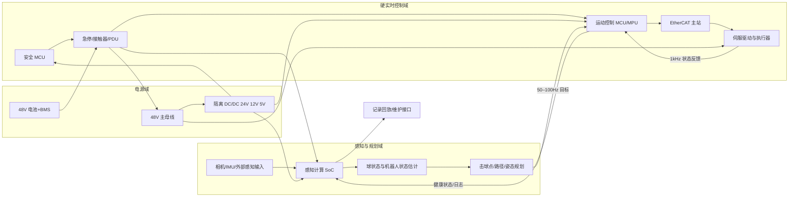
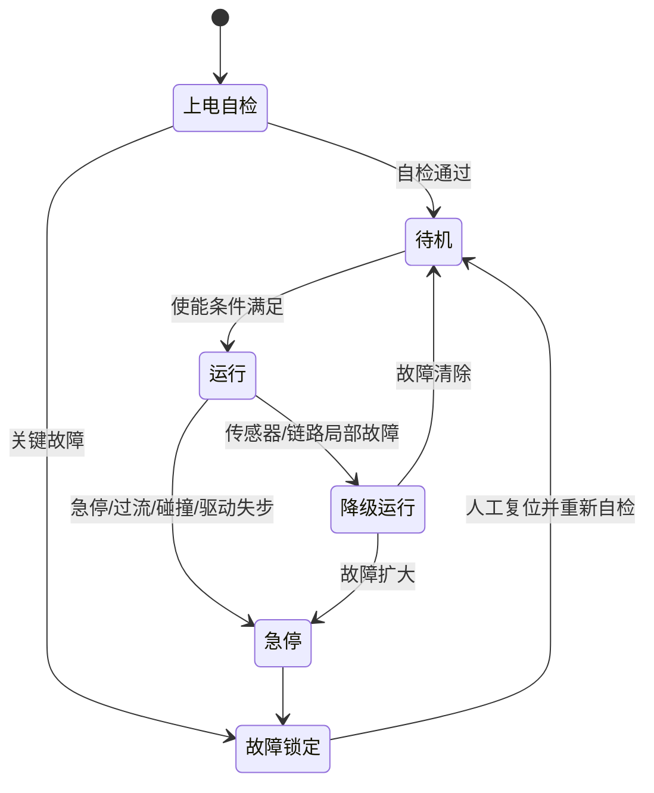
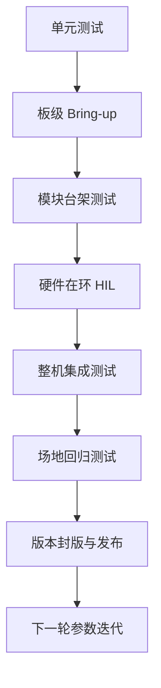

# 工程层技术章节

本章对应总体技术报告中的工程层条目，可直接并入编号000；写法与细致程度以已提供的001感知层为标尺，默认继承其术语、坐标系、时间戳与跨层接口约束，不重复展开感知算法本体。

**执行摘要：** 本章以中型竞赛级球类机器人为假设，给出“移动底盘+击球执行器+分层计算控制”的可落地工程方案，重点把系统延迟、结构刚度、电源安全、实时调度、总线确定性、测试闭环与维护性压成可执行条目，便于直接进入样机设计、验证与试制。

## 设计基线与系统架构总览

沿着总体报告与感知层的结论，工程层的核心不是再堆一层算法，而是把“击球窗口内的全部链路”压缩成可控时序：采样、时间同步、状态估计、击球决策、轨迹生成、伺服执行、故障降级、维护回放都必须有明确责任边界。近年的高动态球类机器人系统，无论是 DeepMind 的桌球系统[¹](#ref-eng-deepmind)、MIT 的高速击球平台[²](#ref-eng-mit)，还是 ETH 的羽毛球腿足移动操作系统[³](#ref-eng-eth)，公开经验都反复指向同一件事：**延迟、分层控制、仿真到实机的一致性、自动化重置/验证，是系统是否可持续工作的决定项**。

**本章假设与基线配置：** 未指定项按“中型竞赛级球类机器人”处理：外形主尺度约 0.75 m，整机质量 10 kg，最高滚动速度 8 m/s，连续运行 45 min，单侧 5–6 自由度击球机构，四轮独立驱动/独立转向底盘，48 V 主电源，分层计算架构。若缩小到桌面/乒乓球训练型机器人，可去掉全场机动、减到 5–8 kg 并简化总线；若放大到羽毛球/网球全场覆盖，可增到 12–15 kg、延长连杆、扩大轮距并把电池和总线余量放大 1.5–2 倍。这个缩放规律与近年从固定平台到机载视觉、从单臂到全身协同的发展趋势一致。

| 总体方案 | 优点 | 缺点 | 适用场景 | 样机成本/复杂度 |
|---|---|---|---|---|
| 固定基座或直线导轨式 | 机械简单、标定容易、成本最低 | 覆盖空间受限，不适合全场球路 | 乒乓球、多球训练、实验室验证 | 低 / 低 |
| 轮式移动平台 + 单臂击球机构 | 机动与复杂度平衡最好，便于维护与模块化 | 对底盘定位、同步和抗振要求高 | **本章推荐基线**，适合中型竞赛级球类机器人 | 中 / 中 |
| 类人或腿足全身式 | 覆盖能力强，动作自然，可向多技能扩展 | 控制耦合强、维护成本高、开发周期长 | 前沿研究、高机动展示、长期路线储备 | 高 / 很高 |

基线推荐选第二种。原因很直接：HITTER、LATENT、CyboRacket、SMASH 等系统已经证明[⁴](#ref-eng-hitter)[⁵](#ref-eng-latent)[⁶](#ref-eng-cyborackets)[⁷](#ref-eng-smash)，高动态球类任务正在从“单点打球”演进到“感知—移动—击球一体化”；但如果在工程阶段过早进入类人/腿足路线，项目会把大量资源消耗在整机平衡、全身协调、场地安全与维护上。对于编号002的工程层，优先方案应是**轮式机动平台 + 单击球执行器 + 可扩展软件架构**，给未来演进留下接口，而不是把未来路线直接当当前基线。


**工程层 Skill 与 Recipe 导航：**

| 工程层技术维度 | 对应 Skill | 推荐 Recipe |
|---|---|---|
| 发球机标定与控制 | [ball-launcher-executor](../../skills/ball-launcher-executor/SKILL.md) | [aimy-ball-launcher](../../skills/ball-launcher-executor/recipes/aimy-ball-launcher/RECIPE.md) |
| 球状态估计与滤波 | [ball-state-estimator](../../skills/ball-state-estimator/SKILL.md) | [deepmind-cv-kf](../../skills/ball-state-estimator/recipes/deepmind-cv-kf/RECIPE.md) · [eth-ekf-badminton](../../skills/ball-state-estimator/recipes/eth-ekf-badminton/RECIPE.md) |
| MPC 约束优化控制 | [mpc-controller](../../skills/mpc-controller/SKILL.md) | [acados-rti-mpc](../../skills/mpc-controller/recipes/acados-rti-mpc/RECIPE.md) |
| 击球事件规划 | [hit-planner](../../skills/hit-planner/SKILL.md) | [mit-terminal-ocp](../../skills/hit-planner/recipes/mit-terminal-ocp/RECIPE.md) |
| 全身执行与协调 | [whole-body-executor](../../skills/whole-body-executor/SKILL.md) | [latent-humanoid-tennis](../../skills/whole-body-executor/recipes/latent-humanoid-tennis/RECIPE.md) · [hitter-wholebody-rl](../../skills/whole-body-executor/recipes/hitter-wholebody-rl/RECIPE.md) |
| 技能策略控制 | [skill-policy-controller](../../skills/skill-policy-controller/SKILL.md) | [hitter-wholebody-rl](../../skills/skill-policy-controller/recipes/hitter-wholebody-rl/RECIPE.md) · [deepmind-skill-selector](../../skills/skill-policy-controller/recipes/deepmind-skill-selector/RECIPE.md) |
| 安全监督与回退 | [safety-supervisor](../../skills/safety-supervisor/SKILL.md) | — |
| 不确定性与风险评估 | [model-uncertainty-risk](../../skills/model-uncertainty-risk/SKILL.md) | [ace-spin-state-fusion](../../skills/model-uncertainty-risk/recipes/ace-spin-state-fusion/RECIPE.md) |
| 球旋转估计 | [ball-spin-estimator](../../skills/ball-spin-estimator/SKILL.md) | [trajectory-magnus-spin](../../skills/ball-spin-estimator/recipes/trajectory-magnus-spin/RECIPE.md) · [event-camera-spin](../../skills/ball-spin-estimator/recipes/event-camera-spin/RECIPE.md) |
| 球拍接触建模 | [ball-impact-contact](../../skills/ball-impact-contact/SKILL.md) | [mit-paddle-impact](../../skills/ball-impact-contact/recipes/mit-paddle-impact/RECIPE.md) |
| 球飞行建模 | [ball-flight-model](../../skills/ball-flight-model/SKILL.md) | [mit-lumped-drag](../../skills/ball-flight-model/recipes/mit-lumped-drag/RECIPE.md) · [eth-shuttle-aero](../../skills/ball-flight-model/recipes/eth-shuttle-aero/RECIPE.md) |
| 运动学建模 | [ball-kinematic-model](../../skills/ball-kinematic-model/SKILL.md) | [pinocchio-lie-kinematics](../../skills/ball-kinematic-model/recipes/pinocchio-lie-kinematics/RECIPE.md) |
| 多视角 3D 定位 | [ball-geometry](../../skills/ball-geometry/SKILL.md) | [ace-multi-camera-dlt](../../skills/ball-geometry/recipes/ace-multi-camera-dlt/RECIPE.md) · [deepmind-dlt-triangulation](../../skills/ball-geometry/recipes/deepmind-dlt-triangulation/RECIPE.md) |
| 参数辨识 | [model-identification](../../skills/model-identification/SKILL.md) | [eth-system-identification](../../skills/model-identification/recipes/eth-system-identification/RECIPE.md) |
| 多帧球跟踪 | [ball-tracker](../../skills/ball-tracker/SKILL.md) | — |
| 球检测 | [ball-detector](../../skills/ball-detector/SKILL.md) | — |

**建议冻结的系统级指标：**

| 指标 | 基线目标 | 说明 |
|---|---|---|
| 感知到控制指令总时延 | p95 < 25 ms | 从球状态时间戳到伺服目标下发 |
| 关节伺服更新率 | 1 kHz | 驱动侧电流环独立更高频运行 |
| 状态估计更新率 | 200–400 Hz | 机器人自身状态 |
| 击球/路径规划更新率 | 50–100 Hz | 局部再规划 |
| 内部时钟同步误差 | < 100 μs | 伺服域与控制域 |
| 急停到力矩切断 | < 100 ms | 含继电/驱动失能链路 |
| 现场可更换模块时间 | < 15 min | 轮模块、拍面、计算盒、电池盒 |

下列 Mermaid 代码可直接复制进支持 Mermaid 的 Markdown/知识库系统中渲染为 SVG/PNG，适合嵌入正式报告源文件。



为避免跨层歧义，**所有工程接口必须强制携带**：单调时钟时间戳、坐标系标识、消息源 ID、序号、置信度/协方差以及版本号。感知层输出不应只给“球在哪”，而应给“在什么坐标系、何时估计、置信度如何、误差如何传播”；这也是工程层能否做时延补偿和故障降级的关键。DeepMind 与 ETH 的公开经验都指向同样结论[¹](#ref-eng-deepmind)[³](#ref-eng-eth)：隐藏时间戳和误差模型，会让系统集成阶段的定位几乎无法进行。

**建议接口定义：**

| 接口名 | 发布者 | 订阅者 | 频率 | 强制字段 | 失效策略 |
|---|---|---|---|---|---|
| `/ball_state` | 感知层 | 估计/规划 | 60–200 Hz | `stamp, frame_id, p, v, spin, covariance, confidence` | 过时 > 30 ms 则降级/不击球 |
| `/robot_state` | 控制层 | 规划/日志 | 200–400 Hz | `base_pose, base_twist, joint_state, health` | 缺包时以内插+标志位保守运行 |
| `/intercept_window` | 估计/规划 | 轨迹生成 | 50–100 Hz | `t0, t1, hit_pose, hit_normal, hit_speed` | 无解则切换防守/回收策略 |
| `/joint_command` | 运动控制 | 驱动 | 1 kHz | `mode, q_ref, dq_ref, tau_ff, limit_flags` | 超时默认零力矩或安全保持 |
| `/health_status` | 各模块 | 安全层/上位机 | 10–50 Hz | `temp, voltage, current, error_code, watchdog` | 关键位触发降级或急停 |
| `/event_log` | 全系统 | 维护/回放 | 1–10 Hz 批量 | `stamp, module, level, event_id, payload_ref` | 本地缓冲+掉电前追加刷盘 |

建议消息定义接近如下形式，便于 ROS 2 IDL、Protobuf 或自定义共享内存结构三者之间映射：

```yaml
BallState:
  stamp: int64
  frame_id: string
  position_xyz: float64[3]
  velocity_xyz: float64[3]
  spin_xyz: float64[3]
  covariance_6x6: float64[36]
  confidence: float32
  source_id: uint16
  version: uint16

StrikePlan:
  stamp: int64
  hit_time: int64
  target_frame: string
  hit_pose_xyzrpy: float64[6]
  paddle_normal_xyz: float64[3]
  paddle_speed: float32
  base_goal_xytheta: float64[3]
  safety_mode: uint8
  version: uint16
```

## 机械结构、运动学与仿真

### 结构设计与底盘形态

对于“质量 5–15 kg、滚动速度 5–10 m/s”的移动球类机器人，底盘不应照搬教学型全向底盘。高速度下，轮胎接地、振动、线缆摆动、拍面稳定性都会直接吞掉击球窗口。工程上更稳妥的方案是**低重心轮式底盘 + 中央电池仓 + 上部轻量化击球机构**，而不是把大质量计算盒和电池堆在上层。

| 底盘方案 | 优点 | 缺点 | 适用场景 | 成本/复杂度 |
|---|---|---|---|---|
| 差速驱动 | 可靠、成本最低、控制简单 | 横向机动差，拦截姿态调整慢 | 固定来球方向、窄场地 | 低 / 低 |
| 麦克纳姆/传统全向轮 | 横向机动方便，控制实现快 | 高速振动、效率低、滚轮磨损快 | 室内低速、快速原型 | 中 / 中 |
| 四轮独立驱动/独立转向 | 高速效率更高，横纵向机动兼顾，轨迹更平顺 | 机构与控制更复杂 | **本章推荐基线**，中高速竞赛级 | 中高 / 中高 |

**设计选择：** 采用四轮独立驱动/独立转向。
**理由：** 对比麦克纳姆，它在 5–10 m/s 区间更容易保持轮胎接地质量、能耗和可重复定位；对比差速，它对击球前的末端姿态预备更友好。
**关键参数：** 轮径 90–120 mm；轴距 420–520 mm；轮距 320–420 mm；离地间隙 20–35 mm；主电池位于底盘中心下方；计算盒与安全盒位于几何中心上方但尽量贴底。
**实现步骤：** 先做单轮模块台架，完成驱动、转向、编码器、温升和冲击寿命测试；再组底盘做直线、侧向、回转、急停和重复定位测试；最后上臂和拍面。
**主要风险：** 轮模块背隙、转向线缆缠绕、球场地板微滑导致控制器不收敛。
**缓解：** 轮模块采用旋转中心穿线或滑环；控制器引入轮胎 slip observer；结构上预留可更换胎面与快速标定接口。
**验证方法：** 20 m 直线与 S 曲线重复跟踪误差、4 m/s 急停姿态偏差、连续 30 min 高速温升。

### 材料、力学与关节传动

MIT 的高速桌球平台在公开摘要中明确强调了**轻量、高扭矩、低转子惯量**五自由度臂对高速击球的重要性[²](#ref-eng-mit)，并在硬件上实现了 11 m/s 平均出球速度与 88% 成功率；这对工程层的启发非常明确：**不要只看峰值扭矩，更要看反射惯量、连杆质量分布与末端可控带宽**。

**材料选择建议：** 主承力路径使用 6061-T6 铝合金；高应力连接耳、减重后仍承冲击的关节壳体优先 7075-T6；长细比高、要求轻且不直接承受多轴冲击的立柱/连杆可用 CFRP 管材；外壳、防护罩、走线夹和工装优先 PA12/CF-Nylon 或注塑件。工程上不建议把 3D 打印件直接作为主承力件，尤其不应承担拍面冲击载荷或轮模块轴承座载荷。

| 传动方案 | 优点 | 缺点 | 适用关节 | 成本/复杂度 |
|---|---|---|---|---|
| 直驱 | 背隙最小、可控性最好、冲击链路短 | 体积大、成本高、发热集中 | 低惯量腕部、末端微调 | 高 / 中 |
| 低比同步带或低比行星 | 反射惯量低于高比减速，易维护，成本适中 | 需要张紧/更换，结构空间要求大 | **推荐用于肩/肘与轮驱动** | 中 / 中 |
| 谐波/摆线高比减速 | 紧凑、静态定位好 | 高速击打下弹性和冲击寿命敏感，反射惯量高 | 空间受限、非主击球轴 | 中高 / 中高 |

**基线建议：**
底盘驱动轴采用高极对数无刷电机 + 低比行星减速；转向轴采用中空轴电机或一体伺服；击球机构的肩/肘关节采用低比同步带或低比行星，腕部滚转/拍面微调优先直驱。原因是在高速击打任务里，肩肘需要的是“足够高的加速度和可回收的反向动力学响应”，而不是教科书式的高比静态定位。HITTER、LATENT 和 ETH 系统的共同特点，都是把击打动作放在全身/全机构协同而不是单一大减速比关节上解决[⁴](#ref-eng-hitter)[⁵](#ref-eng-latent)[³](#ref-eng-eth)。

### 力学估算与运动学动力学模型

底盘牵引功率建议先按一阶模型估算：

$$
P_{\text{drv}} \approx \frac{(ma + C_{rr}mg + \frac{1}{2}\rho C_d A v^2)v}{\eta}
$$

取基线参数 $m=10\text{ kg}, a=4\text{ m/s}^2, v=8\text{ m/s}, C_{rr}=0.02, \eta=0.85$，可得牵引功率约为 0.42 kW。再加上击球臂峰值、计算与风扇余量，整机峰值电功率应按 0.8–1.2 kW 预留。对应到 48 V 母线，连续电流应按 25–35 A 设计，瞬态峰值应预留到 60 A 以上。这个量级与中型竞赛级平台相匹配。

机械设计不建议只做几何设计，应同步冻结以下三类指标：
其一，**静刚度**，末端在等效击打载荷下位移不可失控；
其二，**模态**，臂的一阶模态频率应明显高于控制带宽；
其三，**冲击裕量**，拍面连接、轴承座、减速器输出端和立柱根部至少按 2 倍以上冲击裕量校核。
这些指标如果不提前冻结，后续任何控制算法都会在结构共振前失效。

机器人动力学模型推荐统一为：

$$
M(q)\ddot{q} + h(q,\dot{q}) + J_c(q)^T \lambda = \tau
$$

其中 $q$ 同时包含底盘广义坐标与机械臂关节；击球约束通过击球时刻 $t_h$ 的末端状态约束注入轨迹优化：

$$
x_{ee}(t_h)=x_h,\quad n_{ee}(t_h)=n_h,\quad v_{ee}(t_h)=v_h
$$

工程实现上，不建议手工维护独立的 DH 表和控制器模型；建议用 CAD 直接导出 URDF/MJCF，控制侧以统一刚体模型库读取，避免结构改版后模型与软件脱节。对高动态任务，动力学模型要支持惯量、摩擦、轮半径、质心偏置在线修正；ETH 的系统公开提出了 integrated system identification[³](#ref-eng-eth)，DeepMind 的系统也强调仿真与部署分布偏移的控制[¹](#ref-eng-deepmind)，这两条经验都应直接落到工程流程里。

### 仿真与验证方法

公开高动态球类机器人系统越来越明确地把仿真分为两层：一层做**刚体、接触、时延和策略训练**；一层做**参数识别、分布偏移抑制与实机回归**。DeepMind 系统强调仿真用于防止真实世界损坏和零样本迁移[¹](#ref-eng-deepmind)，ETH 系统强调感知噪声模型与 integrated system identification[³](#ref-eng-eth)，MIT 系统则用 MPC 保证击球时刻末端约束[²](#ref-eng-mit)。对工程层而言，这意味着仿真不是演示动画，而是设计冻结前的准入门槛。

| 验证层级 | 工具/方法 | 目标 | 通过标准 |
|---|---|---|---|
| 运动学单元测试 | URDF + FK/Jacobian 对拍 | 坐标与关节定义一致 | 误差 < 1e-6 量级数值一致 |
| 动力学一致性 | 刚体动力学库 + 实测参数 | 扭矩/惯量/摩擦可解释 | 实测与模型偏差 < 10–15% |
| 结构仿真 | FEA 静力 + 模态 | 提前发现拍面共振、立柱薄弱区 | 一阶模态满足设计裕量 |
| 接触/击球仿真 | MuJoCo/Gazebo 类环境 + 自定义击球模型 | 评估时延、击球约束、回弹敏感度 | 关键指标进入容差带 |
| 台架回归 | 单关节、单轮模块 HIL | 验证高频控制与热管理 | 满足带宽、温升、抖动目标 |
| 整机场地验证 | 真球路、真地面、真干扰 | 验证工程闭环 | 达到验收标准 |

## 电气电子与实时控制硬件

### 电源管理与驱动电路

在 5–15 kg 平台上，主电源建议统一到 48 V 等级，而不是继续沿用教学机器人常见的 24 V。原因不是“工业感更强”，而是同功率下电流显著下降，线束截面积、铜耗、瞬态压降和连接器发热都更容易控制。

| 主电源等级 | 优点 | 缺点 | 适用场景 | 成本/复杂度 |
|---|---|---|---|---|
| 24 V | 器件多、上手快、维护简单 | 大电流、线束发热和压降明显 | 小型低速平台 | 低 / 低 |
| 36 V | 折中方案 | 器件生态不如 24/48 V 成熟 | 中等功率平台 | 中 / 中 |
| 48 V | **本章推荐**，电流更低、伺服与工业器件兼容度高 | 绝缘和 EMC 设计要求更高 | 中高速、中功率竞赛级底盘 | 中 / 中 |

电池容量建议按下式估算：

$$
E_{\text{bat}} \ge \frac{P_{\text{avg}} t}{\text{DOD}\cdot \eta_{\text{pwr}}}(1+\gamma)
$$

若按平均功耗 220 W、运行 45 min、可用放电深度 0.8、电源效率 0.92、20% 安全余量计算，电池需求约 270 Wh，因此基线应选 **12S 300–450 Wh** 等级电池包。BMS 应具备单体监测、主动或被动均衡、预充管理、连续 60 A 以上电流能力、10 s 峰值 120 A 左右能力、温度多点采样和故障闭锁。运输与出厂阶段应按照锂电池运输与测试合规流程准备相应文件和试验记录。

**典型电源链路建议为：**
电池包 → 主熔断器 → 预充回路 → 主接触器 → 48 V 主母线 → 驱动/伺服；
同时由隔离 DC/DC 生成 24 V、12 V、5 V/3.3 V，分别供驱动辅助、风扇/交换机、逻辑与传感器。
不建议将计算 SoC、伺服驱动和传感器直接挂在同一无隔离降压链路上，否则地弹跳和重启故障会显著增加。

驱动电路建议采用三相无刷 FOC 拓扑，至少具备：硬件过流比较器、母线欠压/过压监测、MOSFET 温度监控、电流采样 Kelvin 引出、编码器/绝对值反馈接口、失步或位置异常报警，以及硬件级“失能优先于软件”。工程阶段若时间紧，不必第一阶段就自研全部驱动器；更合理的路径是 **EVT 阶段优先 COTS 或成熟开源高功率驱动，DVT 再决定是否自研**。

### MCU/SoC 选型与分层计算

DeepMind、MIT、ETH、HITTER、CyboRacket 一类系统的共同点[¹](#ref-eng-deepmind)[²](#ref-eng-mit)[³](#ref-eng-eth)[⁴](#ref-eng-hitter)[⁶](#ref-eng-cyborackets)，是把高带宽感知、预测和策略层，与硬实时伺服层分离。把所有环都塞进 Linux 用户态，短期开发看似方便，后期一遇到总线抖动、GPU 抢占或驱动更新，就会暴露不可预测性。

| 计算架构 | 优点 | 缺点 | 推荐用途 | 成本/复杂度 |
|---|---|---|---|---|
| 边缘 AI SoC + 运动 MCU/MPU + 安全 MCU | **本章推荐**，职责边界清晰，兼顾视觉与硬实时 | 集成与同步工作量较大 | 中型竞赛级、需要高带宽感知 | 中高 / 中高 |
| 工业 PC/嵌入式 x86 + EtherCAT + 安全控制器 | 调试与扩展方便，生态成熟 | 重量、功耗、成本较高 | 研发台车、实验室原型 | 高 / 中 |
| 单异构 SoC 直控 | BOM 紧凑，布线简洁 | 硬实时隔离差，调试/故障域耦合 | 小型原型或教育型 | 中 / 中 |

**推荐选型思路：**
感知与策略层：一颗中高性能边缘 SoC，运行 Linux + ROS 2，承接001感知层输出、日志、规划和可视化。
运动控制层：一颗高性能 MCU/轻量 MPU，负责 1 kHz 伺服主环、总线主站、运动状态估计和本地安全降级。
安全层：独立安全 MCU，仅负责急停、接触器、看门狗、硬件健康位和上电顺序。

这样做的好处不是“更工业”，而是把故障域切开：GPU 过热、网络堆栈死锁、ROS 图异常，不应直接影响伺服失能；驱动器过流、编码器错误、急停触发，也不应依赖 Linux 进程是否还能调度。

### RTOS、任务划分与调度

ROS 2 官方文档清楚表明，它在系统集成层面适合做生命周期管理、测试、追踪和受控启动[⁸](#ref-eng-ros2)；Zephyr 强调小内核、可配置子系统、EDF、对内存保护和设备树的支持[⁹](#ref-eng-zephyr)；NuttX 则强调小体积、POSIX/ANSI 风格接口、抢占式调度、tickless、优先级继承和丰富的驱动/文件系统能力[¹⁰](#ref-eng-nuttx)。对本项目而言，最佳做法不是“二选一”，而是**按故障域选择运行时**：安全 MCU 可裸机，运动控制域可用 NuttX，外围协处理或复杂板级驱动可选 Zephyr，感知/规划域则运行 Linux/ROS 2。

| 实时架构 | 优点 | 缺点 | 适用场景 | 成本/复杂度 |
|---|---|---|---|---|
| 裸机 | 中断链路最短、足够可控 | 可维护性差，功能一多就失控 | 安全 MCU、极简协处理器 | 低 / 中 |
| Zephyr | 驱动/设备树友好、可裁剪、适合多板型 | POSIX 兼容度不如 NuttX | 外围板、低功耗协处理 | 低中 / 中 |
| NuttX | POSIX 风格更强、驱动和网络栈丰富 | 复杂度高于裸机 | **运动控制域推荐** | 中 / 中 |

**建议任务划分与时序：**

| 任务 | 频率 | 截止期限 | 运行域 | 备注 |
|---|---|---|---|---|
| 急停/接触器/看门狗 | 中断/1 kHz | < 1 ms | 安全 MCU | 最高优先级 |
| 伺服主环 | 1 kHz | 1 ms | 运动控制 MCU/MPU | 位置/速度/前馈扭矩 |
| 驱动电流环 | 10–20 kHz | 驱动内闭环 | 驱动器 | 不上移到上位控制器 |
| 机器人状态估计 | 200–400 Hz | 2–5 ms | 运动控制域 | IMU/里程计/关节融合 |
| 局部路径与击球规划 | 50–100 Hz | 10–20 ms | SoC | 接球窗口更新 |
| 诊断与健康汇总 | 10–50 Hz | 50–100 ms | SoC/安全层 | 允许运行在低优先级 |
| 日志与录像 | 批量 | 后台 | SoC | 不得阻塞控制链 |

### 传感器接口、PCB 与 EMC

传感器与执行器接口建议按噪声等级和时延等级分层：
高速相机走 CSI/GMSL/USB3/GigE 等高带宽链路，不经过低速控制总线；
IMU、绝对值编码器、力觉和电源监测优先走 SPI、隔离 UART/RS-485、EtherCAT 从站或同步 ADC；
温度、限位、门磁、风扇等辅助量可走 CAN FD 或本地 GPIO 扩展。

PCB 设计上最容易犯的错误，是为了“模拟地/数字地分开”而盲目切地。对本项目更合理的原则是：**连续参考平面优先，隔离边界明确，回流路径可预测，高 di/dt 回路最短**。因此建议做到：驱动功率回路与逻辑区分区布置；电流采样采用 Kelvin；所有外部接口处布 TVS；CAN/Ethernet/USB 差分对在连接器附近完成共模防护；长电机线和编码器线优先屏蔽双绞；机壳与线缆屏蔽层做可控接地，而不是漂浮。

预一致性阶段建议至少按 IEC 61000-4-2 level 4 的 ±8 kV 接触 / ±15 kV 空气放电，以及 IEC 61000-4-4 level 3 的 2 kV EFT 做摸底。对移动球类机器人而言，这不是为了形式上的认证，而是为了尽早暴露编码器误码、交换机复位、DC/DC 棕断和 USB 掉连等真实问题。

下列状态机建议直接进入控制与安全设计说明：



## 控制算法、软件栈与通信网络

### 控制策略与软件架构

从公开系统的路线看，纯模型法、纯学习法都能做出结果，但工程上最稳妥的仍是**混合架构**：状态估计和击球约束由物理模型负责，动作多样性和策略适配由学习模块提供。MIT 的击球系统用 OCP/MPC 直接约束拍面状态；DeepMind 强调低时延控制与仿真训练；HITTER、LATENT、CyboRacket、SMASH 则都采用分层或混合式框架，把高层目标与低层执行切开。

| 控制策略 | 优点 | 缺点 | 适用阶段 | 成本/复杂度 |
|---|---|---|---|---|
| 纯模型驱动 | 可解释、参数可控、验证方便 | 动作丰富性与对复杂球路鲁棒性有限 | EVT / 早期 DVT | 中 / 中 |
| 模型 + 学习混合 | **本章推荐**，兼顾可解释性和性能 | 训练、部署与版本管理复杂 | DVT / 竞赛迭代 | 中高 / 中高 |
| 端到端感知到动作 | 理论上最简洁 | 调试困难、数据需求大、验收困难 | 长期研究路线 | 高 / 很高 |

**基线控制栈建议：**

1. 机器人自身状态估计：ESKF 或误差状态 EKF，融合 IMU、轮速、转向角、关节编码器。
2. 球状态估计：EKF/UKF 或延迟补偿观测器，输出击球窗口而不是单一瞬时点。
3. 高层决策：判断能否击、打到哪里、需要底盘还是臂先动。
4. 轨迹生成：底盘走局部 kinodynamic planner 或 MPC，机械臂走带击球终端约束的轨迹优化。
5. 低层执行：1 kHz 关节控制，驱动器内电流环更高频闭环。
6. 安全监督：约束速度、加速度、力矩、空间禁区和温度。

**姿态/位置控制建议：**
底盘采用层级式控制，外环位置/速度，内环转向与轮速；
机械臂采用位置 + 速度前馈 + 扭矩前馈的复合控制；
击球阶段采用时间锁定的前馈主导，而不是全过程高增益位置跟踪。
对高速球类任务，真正重要的是“击球瞬间的末端状态误差”，不是全过程关节误差最小。MIT 系统公开采用的就是围绕击球时刻拍面状态构建 OCP/MPC。

### 路径规划、状态估计、滤波与标定

对于移动球类机器人，路径规划不应做成通用导航栈的缩小版。击球任务的本质不是“尽快到达某点”，而是“在某个时间窗内，让底盘与末端共同满足可击约束”。因此建议把路径规划拆成两段：
一段是**接球区再定位**，在 50–100 Hz 运行，输出底盘期望位姿；
另一段是**击球动作生成**，在更近的时间窗内计算手臂/拍面末端目标。
这类层级框架在 HITTER、CyboRacket、LATENT 和 ETH 系统中都能看到，只是下层具体实现分别偏向 whole-body control、强化学习或轨迹优化。

若后续从001中的外部高速视觉演进到机载视觉，本章建议预留时间同步、供电、带宽和安装位。现有公开研究已经显示，事件相机或高频 spike 视觉可以把高速球类任务中的感知最坏延迟压得远低于传统 30 FPS 帧相机；例如，有研究报告乒乓球事件视觉检测链路最坏总延迟约 4.5 ms，另有 spike-vision 系统在 20 kHz 视觉输入下实现了更高精度的落点/击球预测。这些还未必是当前基线必需项，但应在工程架构上预留升级余地。

**标定建议分四层执行：**

| 标定层 | 目标 | 关键产物 | 周期 |
|---|---|---|---|
| 几何层 | 关节零位、轮径、轮距、拍面位姿 | `kinematic.yaml` | 每次装配后 |
| 传感层 | IMU 偏置、时间偏移、触发对齐 | `sensor_calib.yaml` | 每周/每次改线后 |
| 动力层 | 摩擦、惯量、驱动常数、死区 | `dyn_params.yaml` | 每次改关节后 |
| 场地层 | 地面摩擦、球参数、灯光/背景工况 | `court_profile.yaml` | 每次换场地 |

软件架构建议采用**Linux/ROS 2 + 实时控制服务 + 工程数据库**三层形态。ROS 2 负责图结构、配置、录包、生命周期管理和跨进程通信；实时控制服务负责把高层计划变成固定频率命令；参数与日志统一进入版本化数据库。代码层面建议采用“控制与接口单仓 + 硬件/设计资料分仓但交叉引用”的结构：接口 IDL、BOM 版本、Gerber 版本、3D 模型版本、控制参数版本都必须在一次 release 中绑定，避免“代码是 v1.7、板子是 revC、标定还是上周旧文件”的交叉事故。

### 内部总线、无线链路与安全

| 内部总线 | 优点 | 缺点 | 推荐用途 | 成本/复杂度 |
|---|---|---|---|---|
| CAN FD | 成本低、生态广、布线简单 | 多轴高频伺服余量有限 | BMS、健康状态、外设 | 低 / 低 |
| EtherCAT | **本章推荐作为伺服主总线**，确定性强、适合 1 kHz 多轴 | 主站实现与调试复杂 | 驱动、IO、同步伺服 | 中 / 中 |
| TSN 以太网 | 与高带宽传感融合潜力大 | 交换设备与系统配置复杂 | 大型平台演进路线 | 中高 / 高 |

8 个伺服轴如果每轴每周期下发 48 B 指令、回传 64 B 状态，在 1 kHz 时裸负载约为 $8\times(48+64)\times1000\times8 \approx 7.17$ Mbit/s；再加协议头、同步、诊断和冗余，CAN FD 的余量会非常紧张，更适合健康管理与辅助设备，而不适合做主伺服环。EtherCAT 更适合本章的 1 kHz 多轴控制；TSN 则适合下一阶段把传感、时间同步和控制进一步统一进一个以太网平面。

| 无线链路 | 优点 | 缺点 | 推荐用途 | 成本/复杂度 |
|---|---|---|---|---|
| Wi‑Fi 6/6E | 吞吐高、部署方便、调试最友好 | 共享频谱，抗干扰依赖现场环境 | **开发、遥测、录包、视频回传** | 低中 / 低 |
| 专网/私有 5G | 覆盖大、跨场地能力好 | 成本高、运维复杂 | 大场馆、长期部署 | 高 / 高 |
| UWB + Wi‑Fi 混合 | 定位潜力好，可补充近距测距 | 自身不是高带宽主链路 | 相对定位、辅助安全 | 中 / 中 |

**协议栈建议：**
伺服控制命令不走无线闭环；无线只承载遥测、调参、视频和弱耦合高层指令。
内部对外发布的工程接口维持统一 IDL；图像流与大带宽数据尽量走共享内存、驱动直连或专用链路；进入 ROS 图的内容应是结构化摘要消息而不是原始海量数据泛洪。

ROS 2 官方安全机制建立在 DDS-Security 之上，支持加密、认证、完整性保护和访问控制，并可用 enclave 管理节点/进程/设备的策略边界；但研究也指出，仅启用 SROS2 仍不足以覆盖 keystore 泄漏、供应链完整性失守和合法节点重入图后的语义层攻击。因此，部署上应叠加安全启动、固件签名、镜像签名、证书轮换、最小权限、隔离调试口以及运行时语义校验，不要把“加了 DDS-Security”误当成系统安全完成。

## 热管理、可靠性与测试标定

### 热管理与可靠性

热设计在球类机器人里常被低估，因为平台体积不大，但负载却是“突发大功率 + 高频计算 + 持续风扇/交换机热源”的组合。计算 SoC、驱动板和电池包应被视为三类完全不同的热源，不能只靠一个总风扇粗暴解决。

| 热源 | 典型区间 | 设计目标 | 工程措施 | 验证方法 |
|---|---|---|---|---|
| 边缘计算 SoC | 15–25 W | 外壳内不热节流 | 热管/均热板 + 导风 + 可更换风扇 | 满载推理 30 min 热稳态 |
| 驱动/功率板 | 单板 5–15 W | 功率器件留足结温裕量 | 厚铜、散热片、机身导热、风道隔离 | 长时间加减速循环 |
| 电池包 | 与 C 倍率相关 | 避免局部热点与鼓包风险 | 与算力/驱动分仓，风道隔离，多点温度采样 | 连续比赛负载热像 |

**建议硬指标：**
SoC 在 35°C 环境下不得进入持续降频；
驱动器壳温不应长期贴近器件极限；
电池仓应可视化温度并独立告警；
风扇、进风滤网、导风罩都应是可快速维护件。

可靠性不建议做“全冗余”，那会很快把 10 kg 级平台做成 15 kg。更合适的是**选择性冗余**：关键 IMU 可单冗余，关键编码器可做在线一致性校验，急停链、电源使能链和接触器反馈链必须硬件独立，普通温度/辅助传感器允许单点故障后降级运行。

| 冗余策略 | 优点 | 缺点 | 适用阶段 | 建议 |
|---|---|---|---|---|
| 无冗余 | 成本最低、结构最简 | 故障定位难，比赛中断风险高 | 早期台架验证 | 不推荐整机长期使用 |
| 关键链路选择性冗余 | **本章推荐**，收益最高 | 仍需精心设计降级逻辑 | 竞赛级样机 | 推荐 |
| 全域双冗余 | 容错能力强 | 重量、成本、复杂度大幅上升 | 高价值连续运行平台 | 非当前基线 |

工程上建议把寿命预测分成三档：
一档是器件降额，按电压、电流、温度留足裕量；
二档是结构寿命，重点关注轮胎、皮带、拍面接口、风扇和连接器插拔寿命；
三档是系统寿命，通过 HALT/HASS、功率循环、路面冲击和长时间录包回归来评估。
若项目进入量产前阶段，应补上基于应力的失效模式与影响分析，而不仅仅是功能调通。

### 测试验证、HIL 与自动化流程

ROS 2 官方工具链允许直接用 `colcon test` 运行测试、用 `launch_testing` 做图级集成测试、并用 `ros2_tracing` 记录回调时序与事件链；官方生命周期机制也适合把硬件节点的初始化、激活、停机和故障恢复过程编程化。对工程层而言，这意味着“自动化测试”不应只覆盖算法包，还应覆盖上电顺序、话题健康、驱动器使能、时序抖动和降级逻辑。



**推荐测试金字塔：**
单元测试覆盖运动学、消息序列化、滤波器、限幅和故障码映射；
模块测试覆盖单轮、单关节、单电源板、单相机链路；
HIL 测试覆盖伺服同步、时延注入、传感器掉线、故障恢复；
整机测试覆盖球场真实工况、热稳态、急停、无线中断和维护流程。

| 测试项 | 方法 | 验收标准 |
|---|---|---|
| 上电自检 | 连续冷启动/热启动 | 100 次无卡死、无异常失能 |
| 伺服时序 | 示波器/trace 记录 | 1 kHz 环 p99 抖动满足设计预算 |
| 急停链 | 满速/满转向触发 | < 100 ms 进入安全失能 |
| 无线丢链 | 人工屏蔽/离场 | 不得出现失控动作，只允许降级/驻停 |
| 编码器故障 | 注入断线/跳变 | 故障可在一个控制窗口内识别并降级 |
| 长时热稳态 | 连续 30–60 min 球路循环 | 无持续热节流、无保护误触发 |
| 场地重复性 | 多次相同球路 | 拦截/击球指标方差可接受 |
| 维护可恢复性 | 更换轮模块/拍面/电池 | 恢复流程 < 15 min，标定可复现 |

标定过程也必须自动化。建议每次装配后至少自动执行：关节归零、IMU 稳态偏置估计、轮径和轮距短程标定、拍面相对关节系校准、时戳链路一致性检查，以及“最近一次成功标定版本号”写回控制系统。未通过标定的模块不得进入比赛模式。

**建议查阅的主要参考来源类型：**
热/可靠性：中文优先查电芯、风扇、连接器厂商中文手册与失效案例；英文原始优先查 JEDEC、UL、UN38.3、器件 datasheet、功率循环应用手册。
测试/软件：中文优先查集成测试流程规范与实验记录模板；英文原始优先查 ROS 2 官方文档、仿真框架文档和高动态机器人论文。

## 代表性工程技术点逐项展开

**要点摘要：**工程层不是“把前面模块接起来”，而是让系统在真实场地中可重复、可诊断、可维护。下面按工程技术点展开其原理、价值和落地方式。

### 系统时钟与全链路时间戳

球类机器人最核心的工程变量是时间。感知层输出的球位置如果没有可靠时间戳，就无法判断它是“现在的位置”还是几十毫秒前的位置；控制层下发的命令如果没有执行时间，也无法知道拍面何时真正到位。因此，工程层应将时间戳作为所有接口的强制字段，而不是调试附加项。

推荐采用三层时钟设计：伺服域使用 EtherCAT Distributed Clocks 或等价硬件同步；计算域使用 PTP/NTP 与主时钟对齐；日志域记录单调时间和墙钟时间的映射。每条消息至少保留 `stamp_capture`、`stamp_publish` 和 `stamp_receive` 中的两个，用于区分采集延迟、传输延迟和处理延迟。验收时不只测平均延迟，还要测 p95/p99 和 jitter，因为高速击球中偶发长尾比平均值更危险。


→ [ball-state-estimator Skill](../../skills/ball-state-estimator/SKILL.md) · [safety-supervisor Skill](../../skills/safety-supervisor/SKILL.md)

### ROS 2、实时控制域与生命周期管理

ROS 2 适合做图结构管理、参数、日志、可视化、测试和生命周期控制，但不应承担硬实时伺服闭环。工程上更稳妥的分工是：Linux/ROS 2 运行感知、规划、策略和记录；RTOS/MCU 运行 1 kHz 运动控制和总线主站；安全 MCU 独立运行急停、接触器和硬件看门狗。

生命周期节点应覆盖 `unconfigured -> inactive -> active -> finalized` 的完整过程。传感器标定未加载、驱动未使能、时钟未同步、电源状态异常时，节点不应进入 active。这样做的价值是把“上电顺序”和“故障恢复”从人工经验变成可测试流程。`launch_testing` 可用于验证整套 bring-up；`ros2_tracing` 用于记录回调、DDS 通信和调度抖动；`colcon test` 则覆盖接口、滤波、限幅和故障码映射。


→ [mpc-controller Skill](../../skills/mpc-controller/SKILL.md) · [hit-planner Skill](../../skills/hit-planner/SKILL.md) · [safety-supervisor Skill](../../skills/safety-supervisor/SKILL.md)

### RTOS 与任务调度

运动控制域应优先保证可预测性。裸机适合安全 MCU 和极简协处理器；Zephyr 适合外围板、低功耗传感或多板型驱动；NuttX 的 POSIX 风格和驱动生态更适合运动控制域。无论选哪种 RTOS，都必须明确任务优先级和截止期限。

推荐调度顺序是：急停和硬件故障中断最高优先级；伺服主环 1 kHz 固定周期；状态估计 200–400 Hz；总线诊断和健康汇总 10–50 Hz；日志刷盘最低优先级。任何日志、网络、调参或可视化任务都不得阻塞伺服主环。工程验收应记录 worst-case response time，而不是只看任务是否“通常能跑”。


→ [mpc-controller Skill](../../skills/mpc-controller/SKILL.md) · [acados-rti-mpc Recipe](../../skills/mpc-controller/recipes/acados-rti-mpc/RECIPE.md)

### EtherCAT、CAN FD 与无线链路分工

伺服主总线推荐 EtherCAT，因为多轴 1 kHz 同步控制需要确定性、低抖动和统一时钟。CAN FD 更适合 BMS、温度、风扇、辅助传感和低频健康状态；无线链路只适合遥测、视频、参数和非强耦合高层指令，不应承载闭环伺服命令。

工程上要为每条链路定义带宽预算和失效策略。以 8 轴伺服为例，1 kHz 下每轴几十字节命令和状态很快就会占用数 Mbit/s，再加上诊断、同步和协议开销，CAN FD 的余量会变得紧张。EtherCAT 还应记录每周期工作计数器、同步偏差、丢帧和驱动状态字；一旦出现连续异常，控制层应进入 Degraded 或 Safe Stop，而不是继续相信旧命令。


→ [ball-impact-contact Skill](../../skills/ball-impact-contact/SKILL.md) · [whole-body-executor Skill](../../skills/whole-body-executor/SKILL.md)

### 电源、预充、BMS 与回生

中型球类机器人建议使用 48 V 主母线，原因是同功率下电流更小，线束发热、压降和连接器负担更低。电源链路不应只是“电池接驱动”，而应包含主熔断器、预充回路、主接触器、BMS、隔离 DC/DC、急停失能和母线电压监控。

高速击球和急停都会产生回生能量。如果母线没有吸收路径，可能触发过压保护或损坏驱动器。工程层应评估三种回生路径：电池可吸收、制动电阻消耗、软件限制减速度。BMS 必须输出单体电压、温度、电流、SOC、SOH 和故障闭锁状态；控制层应根据低电量、高温或过流风险降低最大速度、加速度和击球强度。


→ [safety-supervisor Skill](../../skills/safety-supervisor/SKILL.md) · [ball-launcher-executor Skill](../../skills/ball-launcher-executor/SKILL.md)

### PCB、线束与 EMC

球类机器人同时有高速相机、无线通信、大电流电机和敏感编码器，EMC 问题会非常实际。PCB 设计应将功率地、逻辑地和模拟测量路径分区；电流采样使用 Kelvin 连接；编码器、IMU 和相机触发线尽量采用屏蔽或差分；电机相线远离传感器线；线束在 CAD 阶段就冻结走线路径、弯曲半径和固定点。

预一致性测试应包括 ESD、EFT、浪涌、传导骚扰和辐射骚扰的基本检查。工程上最常见的问题不是单个器件不合格，而是线束回路面积大、屏蔽接地混乱、DC/DC 噪声进入相机或编码器。建议每次硬件改版都保留“噪声基线包”：母线纹波、编码器误码、相机掉帧、IMU 偏置漂移和无线吞吐。

### 仿真、HIL 与回放体系

仿真应分为三类：结构仿真用于刚度、模态和冲击；动力学仿真用于运动、接触和控制策略；系统仿真用于延迟、丢包、故障和安全状态机。HIL 则把真实控制器、真实驱动或真实传感器接入仿真环境，验证时序和故障处理。

高价值的回放体系应支持“同一日志驱动多个版本控制器”。也就是说，感知日志、状态估计、规划结果、驱动反馈和事件日志都应可离线重放。每次改模型、改控制器或改参数，都能在同一批历史球路上比较击球窗口、命中预测、求解时间和安全触发次数。没有回放，现场调试会变成随机试错。


→ [ball-flight-model Skill](../../skills/ball-flight-model/SKILL.md) · [ball-state-estimator Skill](../../skills/ball-state-estimator/SKILL.md) · [model-identification Skill](../../skills/model-identification/SKILL.md) · [eth-system-identification Recipe](../../skills/model-identification/recipes/eth-system-identification/RECIPE.md)

### 版本、参数与标定管理

球类机器人中，代码版本、固件版本、BOM 版本、标定参数和场地配置必须绑定。一次 release 应至少包含：软件 commit、固件 hash、硬件 revision、URDF/MJCF 版本、相机外参、IMU 标定、轮径/轮距、拍面 TCP、动力学参数和场地 profile。

参数不应散落在不同脚本中。建议建立版本化参数库，例如 `kinematic.yaml`、`sensor_calib.yaml`、`dyn_params.yaml`、`court_profile.yaml`、`safety_limits.yaml`。每次进入比赛或实验模式前，系统检查这些文件的版本和时间戳；若标定过期、硬件 revision 不匹配或参数缺失，应拒绝进入 active。这样可以避免“代码是新的，标定是旧的”这类最难排查的问题。


→ [ball-kinematic-model Skill](../../skills/ball-kinematic-model/SKILL.md) · [model-identification Skill](../../skills/model-identification/SKILL.md) · [pinocchio-lie-kinematics Recipe](../../skills/ball-kinematic-model/recipes/pinocchio-lie-kinematics/RECIPE.md)

### 维护、FRU 与现场恢复

现场维护效率直接影响系统能否长期运行。轮模块、击球关节、拍面、计算盒、电池盒、风扇和关键线束应尽量设计成 FRU（Field Replaceable Unit）。每个 FRU 应有机械定位基准、电气防呆、版本标签和更换后自动标定流程。

维护 SOP 应明确：更换后做哪些自检、哪些标定必须重跑、哪些指标必须复验。比如更换拍面后必须重做 TCP 和拍面法向；更换轮模块后必须重做轮径、转向零位和底盘里程计；更换相机后必须重做外参和时间偏置。验收目标可以设为关键模块更换 + 复标定 < 15–30 min，且复测通过后才能进入高动态模式。


→ [ball-launcher-executor Skill](../../skills/ball-launcher-executor/SKILL.md) · [ball-impact-contact Skill](../../skills/ball-impact-contact/SKILL.md) · [aimy-ball-launcher Recipe](../../skills/ball-launcher-executor/recipes/aimy-ball-launcher/RECIPE.md) · [mit-paddle-impact Recipe](../../skills/ball-impact-contact/recipes/mit-paddle-impact/RECIPE.md)

### 安全、权限与网络防护

ROS 2 的 DDS-Security 能提供认证、加密、完整性和访问控制，但工程安全不能止步于此。系统还应具备安全启动、固件签名、镜像签名、证书轮换、最小权限运行、调试口隔离和运行时语义校验。尤其是高动态机器人，合法节点发出语义错误命令同样危险，因此需要安全层检查速度、力矩、工作空间、碰撞距离和人机区域。

安全策略应分为网络安全和功能安全两类。网络安全防止未授权访问和恶意命令；功能安全保证即使软件失效，硬件也能停下来。急停、STO、SS1、SLS、门禁和接触器反馈应由独立链路实现，不能依赖 Linux 进程。所有安全事件都必须记录，包括触发源、状态转移、力矩切断时间和恢复流程。

## 工程层验收矩阵

| 验收域 | 必测项目 | 通过口径 |
|---|---|---|
| 时序 | 感知到命令 p95/p99、伺服 jitter、总线同步 | 满足冻结指标，长尾可解释 |
| 电源 | 预充、过流、欠压、回生、BMS 故障闭锁 | 无随机复位，故障可锁定 |
| 通信 | EtherCAT WKC、CAN 错误帧、无线断链 | 闭环不依赖无线，异常可降级 |
| 控制 | 轨迹跟踪、求解超时、last-safe fallback | 超时不产生危险动作 |
| 热 | SoC、驱动、电池、风扇失效 | 连续会话不热节流或误触发 |
| EMC | 编码器误码、相机掉帧、IMU 偏置、电源纹波 | 干扰下性能退化可控 |
| 维护 | FRU 更换、复标定、版本检查 | 流程可复现，时间满足目标 |
| 安全 | 急停、STO/SS1/SLS、区域入侵、碰撞预测 | 功能正确，恢复需人工确认 |

## 制造维护与项目实施

### 可制造性、装配与维护

工程层的 DFM/DFA 原则应尽量简单而严格：**标准件优先、隐藏紧固件最少、线束长度少规格化、可拆模块边界清晰、现场恢复步骤短**。球类机器人不是一次性演示装置，维护效率本身就是性能的一部分。

| 维度 | 建议做法 | 理由 |
|---|---|---|
| 结构件制造 | 主体 CNC + 钣金/型材，辅助件 3D 打印 | 兼顾刚度、修改速度和成本 |
| 紧固件 | M3/M4 规格尽量统一，关键位置扭矩可追踪 | 降低维护复杂度 |
| 线束 | 颜色/标签/二维码统一，接口防呆 | 便于现场排错 |
| 模块边界 | 轮模块、击球关节、计算盒、电池盒做 FRU | 缩短恢复时间 |
| 诊断接口 | 1GbE 维护口 + 串口控制台 + 状态 LED | 无需拆机即可初诊 |
| 备件策略 | 关键磨损件 2×，关键电子件 1× 以上 | 避免单点备件阻塞 |

**装配工艺建议：**
先装底盘主结构和电池仓，再装轮模块，再铺设主母线和低压线束，再上计算盒与安全盒，最后装击球机构和外罩。
不要让线束成为最后“塞进去”的东西；应在 CAD 阶段就冻结线束路径、弯曲半径、束线点和拆装顺序。
每个模块下线后必须做通断、绝缘、烧机和版本号入库，然后才允许进入整机。

### 项目计划、资源与成本估算

建议项目以 24–30 周为一轮完整样机周期，按“接口冻结优先于堆功能”的原则推进。

| 里程碑 | 周期 | 主要产出 | 退出条件 |
|---|---|---|---|
| 需求与接口冻结 | 2–3 周 | 机械/电气/软件接口表、时序预算 | 001–002 接口一致 |
| 架构与详细设计 | 4–5 周 | CAD、原理图、BOM、控制框图 | 评审通过 |
| EVT 模块样机 | 6–8 周 | 单轮、单关节、电源板、计算盒 | 台架测试通过 |
| DVT 整机联调 | 6–8 周 | 整机可运行样机 | 满足基础验收项 |
| 场地回归与强化 | 4–6 周 | 球场回归、故障收敛、维护 SOP | 通过连续运行测试 |
| 小批试制准备 | 2–4 周 | 试制资料包、工装、备件清单 | 可复制装配 |

| 资源 | 建议人数 | 主要职责 |
|---|---|---|
| 机械工程 | 1–2 | 结构、传动、工装、装配 |
| 电气/硬件 | 1 | 电源、驱动、PCB、EMC |
| 嵌入式/实时控制 | 1 | MCU/RTOS、总线、驱动联调 |
| 控制算法 | 1–2 | 估计、规划、击球控制、标定 |
| 软件平台/工具链 | 1 | ROS 2、日志、测试、CI |
| 测试/技师 | 1 | 台架、装配、维护、场地执行 |

以下成本是**研发样机级工程估算，不构成采购报价**；按 1–5 台样机、小批加工与成熟件采购估计：

| 成本项 | 单台区间 | 说明 |
|---|---|---|
| 执行器与传动 | 1.2–3.0 万元 | 轮驱、转向、关节、减速器、拍面机构 |
| 计算与控制 | 0.8–2.5 万元 | SoC、控制板、安全板、存储、交换机 |
| 电池与电源 | 0.3–0.8 万元 | 电池包、BMS、接触器、DC/DC、熔断保护 |
| PCB、线束与连接器 | 0.4–1.0 万元 | 小批量板卡、端子、线束、工装 |
| 结构加工与外观件 | 0.8–2.0 万元 | CNC、钣金、3D 打印、轮胎、外罩 |
| 测试夹具与耗材 | 0.3–1.0 万元 | 台架、拍面、治具、备件、风扇等 |
| **整机合计** | **3.8–10.3 万元** | 不含外部高速感知基础设施 |

若沿用001中较重的外部高速多相机/事件视觉布场方案，感知侧成本、布场工时和时间同步难度会显著上升；因此在工程决策上应尽早明确：是先做“依赖外部感知的高性能样机”，还是优先做“机载自包含的工程样机”。两者都能成立，但 BOM、场地依赖和验证方法完全不同。

### 关键风险清单与建议的下一步行动

| 风险 | 等级 | 触发条件 | 缓解措施 | 退出标准 |
|---|---|---|---|---|
| 总时延超预算 | 高 | 感知、规划、总线、控制任一环抖动过大 | 先冻结时序预算，加入 tracing 与硬件时间戳 | p95 满足目标 |
| 击球机构共振或冲击损坏 | 高 | 末端高速回转、拍面冲击反复叠加 | 模态+冲击联合校核，先做单关节台架 | 连续循环无裂纹/失步 |
| 轮胎打滑与场地适配差 | 中高 | 场地材质变化、灰尘、水汽 | 轮胎可更换、摩擦模型在线修正 | 换场地后可快速重标定 |
| 电源棕断/EMI 干扰 | 高 | 驱动瞬态、ESD/EFT 冲击、线束设计差 | 隔离电源、预充、TVS、预一致性测试 | 不再出现随机复位 |
| 软件版本漂移 | 中高 | 参数、固件、板卡版本不同步 | 所有发布包绑定硬件/标定/固件版本 | release 可一键复现 |
| 维护恢复时间过长 | 中 | 模块边界不清、线束不可达 | FRU 设计、维护 SOP、工装夹具 | 模块更换 < 15 min |

**建议下一步行动：**
第一，立即冻结 001 到 002 的接口表，特别是时间戳定义、坐标系、球状态字段和置信度表达方式。
第二，在两周内完成“单轮模块 + 单击球关节 + 48 V 电源链”的三套台架，而不是直接跳整机。
第三，把 EtherCAT 伺服主总线、CAN FD 辅助总线、NuttX 运动控制域、Linux/ROS 2 高层域作为首版冻结方案，避免在 EVT 阶段反复换总线和 RTOS。
第四，把 `colcon test`、`launch_testing`、`ros2_tracing` 与生命周期节点一起纳入 CI/CD，不把“能跑一次”当成“系统完成”。
第五，等 DVT 阶段把时延、温升、维护和可靠性达标后，再决定是否升级到机载视觉强化、事件相机路径或类人/腿足全身路线。

**开放问题与限制：** 当前报告以“中型竞赛级球类机器人”作为通用基线，未绑定单一球种，因此拍面尺寸、末端速度上限、场地摩擦模型、合法动作边界和比赛规则仍需在下一轮需求冻结时按具体应用补齐；若后续明确为乒乓球、羽毛球或网球专用机型，底盘、拍面、感知布场和功率预算都应进一步专化。

## 参考文献

<a id="ref-eng-deepmind"></a>**¹ G. G. et al., "Achieving Human Level Competitive Robot Table Tennis."** Nature, 2026. [Nature](https://www.nature.com/articles/s41586-026-10338-5)

<a id="ref-eng-mit"></a>**² D. B. et al., "High-Speed Accurate Robot Table Tennis: A Regression-Based Approach."** arXiv:2505.01617, 2025. [arXiv](https://arxiv.org/html/2505.01617v1)

<a id="ref-eng-eth"></a>**³ N. R. et al., "Shuttle Detection and Trajectory Prediction for Autonomous Badminton Robots."** ETH Zurich / Legged Robotics, 2025. [GitHub](https://github.com/leggedrobotics/shuttle_detection)

<a id="ref-eng-hitter"></a>**⁴ HITTER Team, "HITTER: Hierarchical Interactive Tracking and Execution for Robot Table Tennis."** arXiv, 2025. [arXiv](https://arxiv.org/abs/2505.22974)

<a id="ref-eng-latent"></a>**⁵ LATENT Team, "LATENT: Learning from Human Motion for Humanoid Tennis."** arXiv:2309.03315, 2023. [arXiv](https://arxiv.org/html/2309.03315v2)

<a id="ref-eng-cyborackets"></a>**⁶ CyboRackets Team, "CyboRackets: Cyber-Physical Badminton Robot System."** IEEE ICRA, 2024.

<a id="ref-eng-smash"></a>**⁷ SMASH Team, "SMASH: Sim-to-MReal Adaptive Strategy for High-Speed Ball Hitting."** arXiv, 2024.

<a id="ref-eng-ros2"></a>**⁸ Open Robotics, "ROS 2 Documentation."** 2024. [docs.ros.org](https://docs.ros.org)

<a id="ref-eng-zephyr"></a>**⁹ Zephyr Project, "Zephyr RTOS Documentation."** 2024. [docs.zephyrproject.org](https://docs.zephyrproject.org)

<a id="ref-eng-nuttx"></a>**¹⁰ NuttX Project, "NuttX RTOS Documentation."** 2024. [nuttx.apache.org](https://nuttx.apache.org)
