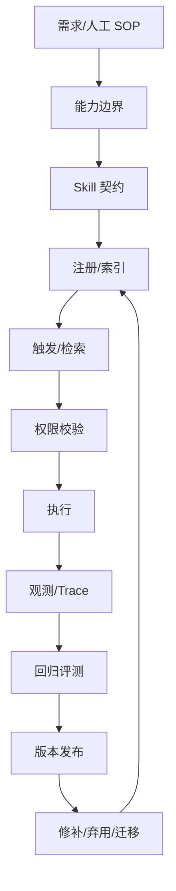

# 第 2 章 Skill 的工程定义与生命周期

## 本章解决什么问题

很多团队只关心如何创建 `SKILL.md`，却忽略 Skill 创建后的注册、触发、执行、观测、发布、回滚和演化。本章把 Skill 当成有生命周期的工程资产。

## 核心概念

Skill 的六个必备面：

- 元信息：名称、描述、版本、触发条件。
- 正文：流程步骤、输出格式、失败处理。
- 支持文件：脚本、参考资料、模板、示例。
- 权限：允许调用哪些工具，哪些需要审批。
- 观测：执行轨迹、成本、成功率、失败标签。
- 版本：兼容、弃用、迁移、回滚。

## 生命周期图



## 工程方法

设计 Skill 时不要从正文开始，而要先写生命周期卡：

| 阶段 | 必须回答 |
| --- | --- |
| 创建 | 从哪个人工流程提炼？ |
| 注册 | 如何命名和分类？ |
| 触发 | 自动触发还是显式调用？ |
| 执行 | 需要哪些工具和状态？ |
| 观测 | 记录哪些 trace 字段？ |
| 评测 | 用哪些 golden cases 回归？ |
| 发布 | 如何灰度和回滚？ |
| 演化 | 何时 patch，何时弃用？ |

## 模板：Skill 生命周期卡

```yaml
name: review-pr-risk
owner: platform-ai
status: draft
trigger_mode: explicit-and-auto
allowed_tools:
  - github.read_pull_request
  - github.read_diff
eval_suite: review-pr-risk-regression
release_policy: canary-then-stable
deprecation_policy: migration-note-required
```

## 反例

只把成功执行过的一段 prompt 保存成 Skill。它可能能复现一次成功，但没有触发边界、权限、评测和版本策略，很快会在其他场景里变成隐性风险。

## 练习

为第 1 章选出的候选任务填写生命周期卡，至少补齐触发、权限、评测和发布策略。

## 检查清单

- [ ] Skill 有 owner 和状态
- [ ] 有触发策略
- [ ] 有权限策略
- [ ] 有评测套件
- [ ] 有发布和弃用策略
