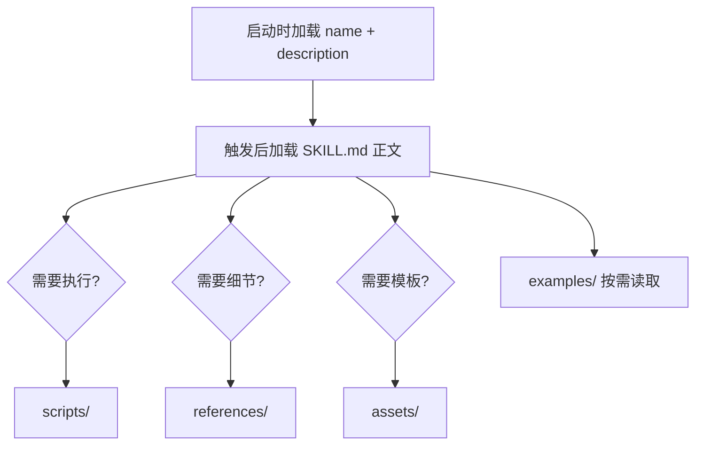

# 第 4 章 Skill 目录工程化

## 本章解决什么问题

把所有内容塞进 `SKILL.md` 会导致上下文过载。本章规定 Skill 目录的职责边界，让内容按需加载。

## 核心概念

推荐目录：

```text
review-pr-risk/
  SKILL.md
  scripts/
    collect_diff.py
  references/
    review_policy.md
  assets/
    report_template.md
  examples/
    high_risk_pr.md
  tests/
    regression.yaml
```

## 目录加载图



## 工程方法

- `SKILL.md` 放稳定步骤和约束。
- `scripts/` 放确定性脚本。
- `references/` 放长规范和 API 文档。
- `assets/` 放输出模板、表格、提示片段。
- `examples/` 放少量高质量输入输出样例。
- `tests/` 放回归样本和触发测试。

## 模板：目录 README

```markdown
# review-pr-risk

- Owner:
- Purpose:
- Trigger:
- Tools:
- Eval suite:
- Release status:
```

## 反例

把 100 页编码规范、20 个示例和工具说明全部放进 `SKILL.md`。结果是每次触发都消耗大量上下文，并让模型关注无关细节。

## 练习

为“安全审计 Skill”设计目录结构，说明每个文件放什么内容。

## 检查清单

- [ ] 正文短小稳定
- [ ] 长资料进入 references
- [ ] 模板进入 assets
- [ ] 脚本进入 scripts
- [ ] 测试进入 tests
