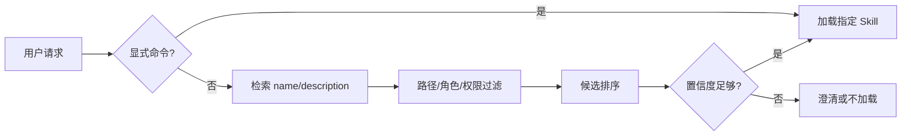

# 第 5 章 触发与检索策略

## 本章解决什么问题

Skill 写得再好，触发不准也没有价值。本章讲如何降低误触发和漏触发。

## 核心概念

触发可以来自：

- 显式命令：如 `/review-pr-risk 123`。
- 关键词：PR、合并请求、代码审查。
- 语义匹配：用户表达不完全命中关键词。
- 路径约束：只在特定仓库、文件类型、目录下触发。
- 角色或上下文：只有某类 Agent 或 profile 可用。

## 触发检索图



## 工程方法

description 公式：

```text
用于 + 任务对象 + 动作 + 交付物 + 触发场景 + 不适用边界
```

示例：

```text
用于审查 Pull Request 的上线风险并输出结构化风险报告。适用于用户提到 PR、合并请求、代码审查、上线前检查；不用于一般代码解释或代码生成。
```

## 模板：触发测试集

```yaml
should_trigger:
  - 请 review 这个 PR 的风险
  - 合并前帮我看一下这次改动有没有回归风险
should_not_trigger:
  - 给我解释这段 Python 代码
  - 帮我写一个排序函数
```

## 反例

`description: 处理代码相关任务。`  
问题：范围过宽，会和代码解释、生成、测试、重构等多个 Skill 冲突。

## 练习

为一个 Skill 写 10 条应触发样本和 10 条不应触发样本，并据此改写 description。

## 检查清单

- [ ] 有正向触发条件
- [ ] 有负向边界
- [ ] 有显式调用方式
- [ ] 有触发测试
- [ ] 与相邻 Skill 不冲突
