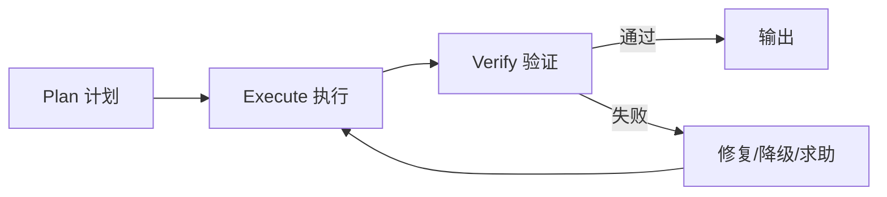

# 第 7 章 写出高可靠指令

## 本章解决什么问题

Skill 的正文不是越详细越好，而是要处在合适高度。本章讲如何写出稳定、可执行、不让模型自由漂移的指令。

## 核心概念

“金发姑娘高度”指指令既不能太抽象，也不能太细碎：

- 太高：模型自由发挥，结果不稳定。
- 太低：像机械脚本，缺少对复杂情况的判断。
- 刚好：明确目标、步骤、验证点和失败分支，保留必要判断空间。

## PEV 循环



## 工程方法

每个步骤尽量写成：

```text
动作 → 输入 → 成功标准 → 失败处理
```

## 模板：步骤写法

```markdown
1. 收集 PR diff。
   - 输入：repo、pr_number。
   - 成功标准：拿到 changed files 和 diff summary。
   - 失败处理：如果 PR 不存在，返回 missing_pr；如果权限不足，返回 permission_denied。
```

## 反例

“分析所有风险，尽量给出建议。”  
问题：没有分析顺序、风险分类、成功标准和输出格式。

## 练习

把“先检查数据，再生成报告”改写为 4 个 PEV 风格步骤。

## 检查清单

- [ ] 每步有明确动作
- [ ] 每步有成功标准
- [ ] 有验证环节
- [ ] 有失败分支
- [ ] 输出格式固定
