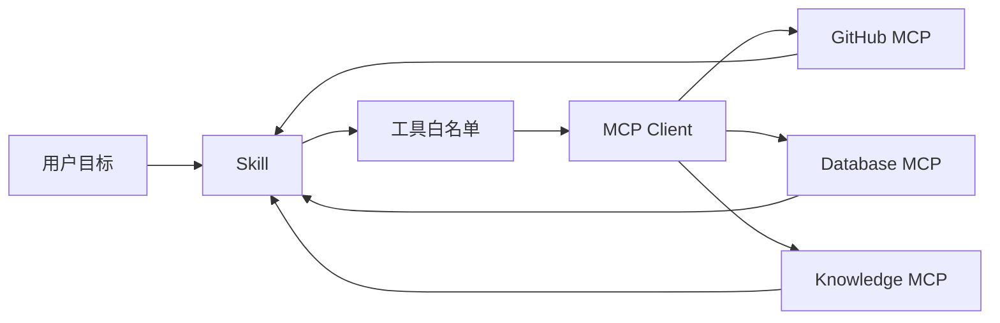

# 第 9 章 Skill + MCP

## 本章解决什么问题

MCP 解决“连接哪里”，Skill 解决“怎么用好连接”。本章讲如何避免把工具接入和业务流程混在一起。

## 核心概念

Skill 与 MCP 的职责：

| 层 | 负责 |
| --- | --- |
| Skill | 任务流程、输入输出、失败处理、领域规则 |
| MCP | 工具、资源、提示、外部系统连接 |
| Hook | 权限、审计、审批、熔断 |

## MCP 协同图



## 工程方法

- 先定义 Skill 需要的最小工具集合。
- 读写工具分开暴露。
- 数据库只暴露只读查询或受限视图。
- 企业知识库返回引用，不只返回答案。
- 工具错误转成 Skill 可理解的失败类型。

## 模板：MCP 白名单

```json
{
  "mcpServers": {
    "github-readonly": {
      "command": "npx",
      "args": ["@modelcontextprotocol/server-github"],
      "allowedTools": ["get_pull_request", "list_files", "get_diff"]
    }
  }
}
```

## 反例

给 PR 审查 Skill 暴露 `merge_pull_request`。  
问题：审查任务不需要合并权限，增加越权风险。

## 练习

为“企业知识问答 Skill”设计 MCP 工具面，要求包含允许工具、禁止工具和引用输出要求。

## 检查清单

- [ ] MCP 工具最小暴露
- [ ] 读写分离
- [ ] 工具错误可分类
- [ ] 输出包含引用或证据
- [ ] 高风险工具不默认开放
