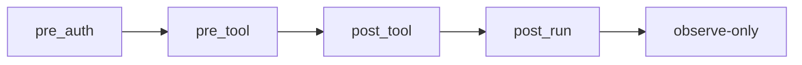

# 第 10 章 Skill + Hooks

## 本章解决什么问题

Skill 正文不应承载所有控制逻辑。权限、审计、熔断、质量门禁应由 Hooks 进入生命周期。

## 核心概念

常见 Hook：

- `pre_auth`：用户或 profile 是否允许使用 Skill。
- `pre_tool`：工具调用前审批、脱敏、限流。
- `post_tool`：记录工具结果和副作用。
- `post_run`：生成 trace、运行质量检查。
- `observe-only`：指标采集，不阻塞主流程。

## 工程方法

Hook 优先级：



## 模板：Hook 配置

```json
{
  "hooks": [
    {
      "event": "pre_tool",
      "mode": "blocking",
      "priority": 10,
      "command": "python hooks/policy_check.py"
    },
    {
      "event": "post_tool",
      "mode": "observe-only",
      "priority": 50,
      "command": "python hooks/audit_log.py"
    }
  ]
}
```

## 反例

把业务主流程写进 hook。  
问题：运行轨迹难解释，Skill 表面上很简单，关键逻辑却藏在生命周期脚本里。

## 练习

为“安全审计 Skill”设计 3 个 hook：敏感文件拦截、危险命令审批、审计日志。

## 检查清单

- [ ] hook 模式明确
- [ ] blocking hook 短小幂等
- [ ] 业务逻辑不藏在 hook
- [ ] 危险工具经过 pre_tool
- [ ] 审计可追踪 task_id
