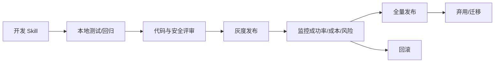

# 第 15 章 企业级 Skill 体系建设

## 本章解决什么问题

企业不是缺一个 Skill，而是缺一套能持续生产、审核、发布、监控和回滚 Skill 的体系。

## 核心概念

企业级 Skill 体系包括：

- 内部 Skill 仓库
- 命名和分类规范
- RBAC 权限
- 审核发布流程
- 私有 marketplace
- 监控和日志审计
- 版本弃用与迁移

## 企业发布治理图



## 工程方法

发布流程：

1. 开发者提交 Skill 和测试样本。
2. CI 验证格式、schema、触发样本和权限声明。
3. 安全审核检查 allowed-tools、敏感数据和写操作。
4. 灰度到小范围用户或低风险项目。
5. 监控成功率、误触发、成本和失败标签。
6. 全量发布或回滚。
7. 旧版本进入弃用和迁移流程。

## 模板：企业 Skill 元数据

```yaml
name: review-pr-risk
owner: code-quality-team
category: engineering/code-review
risk_level: medium
status: stable
version: 1.2.0
reviewers:
  - security-team
  - platform-ai
rollout:
  strategy: canary
  initial_scope: 10_percent
```

## 反例

所有人都能随意新增和启用 Skill。短期看起来灵活，长期会导致重复建设、权限失控、版本漂移和审计困难。

## 练习

设计一个企业内部 Skill 发布流程，明确开发者、审核者、平台管理员和使用者的权限。

## 检查清单

- [ ] 有仓库规范
- [ ] 有 RBAC
- [ ] 有 CI 回归
- [ ] 有灰度发布
- [ ] 有回滚和弃用机制
