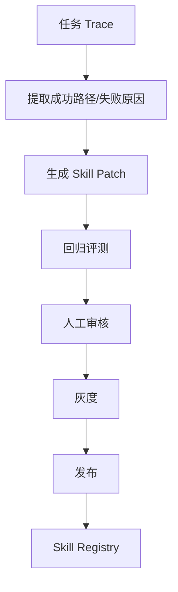

# 第 16 章 自演化 Skill 与高频避坑

## 本章解决什么问题

长期运行的 Agent 会积累成功和失败轨迹。本章讲如何从 trace 中沉淀和修补 Skill，同时避免自动演化失控。

## 核心概念

自演化闭环：



## 工程方法

- patch 优先于整篇重写。
- 自动生成的 Skill 必须经过回归测试。
- 高风险 Skill 必须人工审核。
- 失败修补要带 trace 证据。
- 弃用必须写 migration note。

## 高频坑

| 坑 | 后果 | 修复 |
| --- | --- | --- |
| 大而全 Skill | 触发不准、难测试 | 拆成单一职责 |
| 元数据模糊 | 误触发或漏触发 | description 写触发和边界 |
| 正文过载 | token 爆炸 | 渐进式披露 |
| 无异常处理 | 生产不可用 | 枚举失败分支 |
| 无权限边界 | 越权调用 | allowed-tools + hooks |
| 无回归评测 | 越改越坏 | golden cases |
| 自动演化无审核 | 风险扩散 | 人审 + 灰度 |

## 模板：Skill Patch 记录

```yaml
skill: review-pr-risk
from_version: 1.2.0
to_version: 1.2.1
reason: reduce_false_positive_for_docs_only_pr
trace_evidence:
  - trace_20260504_001
eval_result: passed
reviewer: platform-ai
rollout: canary
```

## 反例

让 Agent 在每次成功后自动改写原 Skill 并立即全量启用。  
问题：没有评测、审核和灰度，成功经验会污染稳定能力。

## 练习

为一个失败 trace 写 Skill patch 计划，包含修改点、回归样本、审核人和回滚方式。

## 检查清单

- [ ] patch 有 trace 证据
- [ ] 先评测再发布
- [ ] 高风险有人审
- [ ] 灰度启用
- [ ] 可回滚
